# UI/UX audit evidence — 2026-07-14

> This is the screenshot index for the executable audit plan. It preserves every exact semantic event tape and embeds every accepted 320 × 240 frame. The companion procedure is [`UI_UX_AUDIT_PLAN.md`](UI_UX_AUDIT_PLAN.md).

## Evidence snapshot

- Desktop manifest generated: <code>2026-07-14T21:56:13.626Z</code>.
- Desktop semantic captures: **306/306 completed**, 0 command/conversion failures, across **26 scenario groups**.
- Additional desktop review captures: **32** (10 inline-math breakpoints, 2 reproduced navigation defects, 6 cross-document/restart state checkpoints, 5 document-open error checkpoints, and 9 font-load error checkpoints).
- PocketJS-NSpire / Firebird captures: **9**: 7 full framebuffer passes, 1 documented math-review golden-pixel verification failure, and 1 serial exit pass whose stable-frame assertion is inconclusive.
- Total embedded screenshots: **347**; every file is 320 × 240.

A desktop entry marked **CAPTURE PASS** means the executable returned zero, PPM-to-PNG conversion succeeded, and the result was exactly 320 × 240. It is **not** a claim that the pictured UX is correct. Defects can—and do—appear in successful captures. A full **FIREBIRD PASS** is stronger: it additionally means the named framebuffer expectations and ordered serial milestones matched. The separately labeled serial-exit case proves application exit through `EXIT_OK` but is not promoted to a full framebuffer pass.

The event list in each desktop entry is copied verbatim from `build/ui-ux-audit/evidence-manifest.json`; repetitions are intentionally not compressed. The capture program appends a final semantic `quit` only to terminate the process after the target state is rendered. That teardown event is not part of the listed tape and is not a production hotkey test.

## Backend boundaries

- **Desktop semantic backend:** executes the real reader/layout code at 320 × 240 through named semantic events. It is deterministic and suitable for state, layout, and screenshot comparisons, but it does not prove TI keyboard chord detection, TI-OS return behavior, touchpad feel, or device performance.
- **PocketJS-NSpire / Firebird backend:** boots a CX II simulator, transfers and runs the Ndless `.tns`, replays a physical-key tape, records final RGB565 frames, and checks ordered application serial milestones. A full framebuffer PASS requires both the named pixel/stability conditions and the required serial sequence. A terminal serial marker such as `EXIT_OK` can independently prove an application transition even when the resumed TI-OS framebuffer is too variable to satisfy a stable host assertion. In every case this is simulator evidence, **not physical-calculator evidence**.
- The dedicated Firebird theme and TOC fixtures map the simulator's <kbd>Doc</kbd> key to the same semantic events as production Settings and Menu. This is fixture-only access; <kbd>Doc</kbd> is not an nMarkdown production shortcut.
- The current PocketJS key tape cannot express Ctrl chords (`Ctrl+Esc/F/T/D/O/N/B`), production Menu, Plus/Minus, Delete, typed letters/digits, Shift modifiers, or a physical touchpad click/drag. Those paths remain desktop-semantic or hardware-required checks.
- No screenshot in this document is claimed to come from physical TI-Nspire hardware. A final device pass is still required for key scanning, touchpad gesture thresholds, LCD appearance, timing, memory pressure, and TI-OS integration.

## Firebird simulator evidence

Seven results report `status: pass`, one successful transfer, 100% transfer progress, 3/3 stable framebuffer matches, and zero mismatched asserted pixels. The complex math-review fixture reached document parse/render/present and produced a valid final frame but timed out while 12 stale or mismatched golden-pixel expectations remained unsatisfied. The document-exit fixture emitted `EXIT_OK` and returned to TI-OS, but its host-side stable-frame assertion did not complete; it is therefore a serial exit pass with inconclusive framebuffer stability. Common ordered serial requirements include `ENTER_MAIN`, `FIXTURE_READY`, `HARFBUZZ_READY`, document read/parse/ready where applicable, `RENDER_DONE`, and `PRESENTED`.

<strong>FIREBIRD-SET-01-dark-reopened</strong> — FIREBIRD PASS

- **Target:** <code>build/ndless-firebird-theme/nmarkdown-firebird-theme.tns</code>
- **Physical tape intent:** after common TI-OS launch: fixture-only Doc → Enter (Dark) → wait → Esc → Down → wait → fixture-only Doc → wait.
- **Verified outcome:** The dark transition emitted `THEME_DARK` followed in order by render-start, render-done, and presented markers; at least six frames were presented. The final frame is the reopened dark Settings panel.
- **Result:** <code>build/firebird-theme/result.json</code>; 67914 ms; 9 pixel expectations; frame hash <code>ee6cfa20a53da3b5</code>; 3/3 stable matches; 0 mismatched asserted pixels.

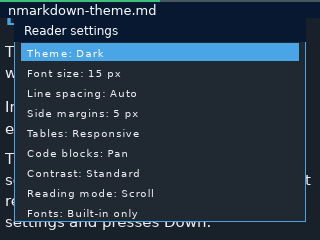

<strong>FIREBIRD-NAV-06-toc-repeated-jumps</strong> — FIREBIRD PASS

- **Target:** <code>build/ndless-firebird-toc/nmarkdown-firebird-toc.tns</code>
- **Physical tape intent:** after common TI-OS launch: fixture-only Doc → Down → Enter → wait → Doc → Down → Enter → wait → Doc → Up → Enter → wait → Doc → Esc → wait.
- **Verified outcome:** The one-process tape jumps forward twice, backward once, then opens/cancels the TOC. At least twelve presented frames were required, guarding against the reported second-jump freeze.
- **Result:** <code>build/firebird-toc/result.json</code>; 75176 ms; 9 pixel expectations; frame hash <code>2f294c0e6651f129</code>; 3/3 stable matches; 0 mismatched asserted pixels.

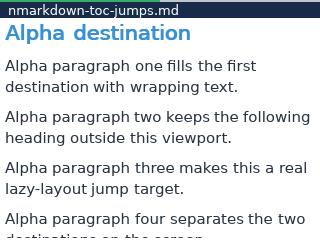

<strong>FIREBIRD-NAV-04-startup-cancel-ti-os</strong> — FIREBIRD PASS

- **Target:** <code>build/ndless-firebird-browser-cancel/nmarkdown-firebird-browser-cancel.tns</code>
- **Physical tape intent:** after common TI-OS launch: Esc → wait.
- **Verified outcome:** Esc cancels the startup browser; the ordered trace must reach `EXIT_OK`. The asserted final pixel and screenshot are deliberately from the resumed TI-OS screen, proving normal return rather than an app frame that merely looks idle.
- **Result:** <code>build/firebird-browser-cancel/result.json</code>; 60683 ms; 1 pixel expectations; frame hash <code>33bba05a01bd5287</code>; 3/3 stable matches; 0 mismatched asserted pixels.

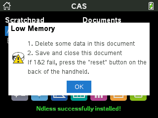

<strong>FIREBIRD-PAGE-01-page-2</strong> — FIREBIRD PASS

- **Target:** <code>build/ndless-firebird-page/nmarkdown-firebird-page.tns</code>
- **Physical tape intent:** after common TI-OS launch: Down → wait.
- **Verified outcome:** In the Page Swipe fixture, one ordinary Down advances exactly one complete page. Pixel assertions pin the 2/3 progress extent, top-right page label, and complete text/heading lines at the start of page 2.
- **Result:** <code>build/firebird-page/result.json</code>; 60684 ms; 15 pixel expectations; frame hash <code>11f07257e9c83254</code>; 3/3 stable matches; 0 mismatched asserted pixels.

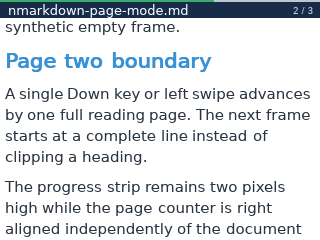

<strong>FIREBIRD-FORMATS-01-cjk-code</strong> — FIREBIRD PASS

- **Target:** <code>build/ndless-firebird-formats/nmarkdown-firebird-formats.tns</code>
- **Physical tape intent:** common TI-OS launch tape to the dedicated format fixture, then wait for a stable final frame.
- **Verified outcome:** The ordered serial trace additionally requires `FONT_READY`; final pixel assertions cover the app/document frame while the screenshot provides visual CJK and monospaced-code evidence.
- **Result:** <code>build/firebird-formats/result.json</code>; 57703 ms; 7 pixel expectations; frame hash <code>16533d6f8b76ae29</code>; 3/3 stable matches; 0 mismatched asserted pixels.

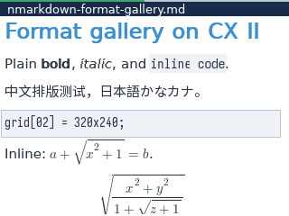

<strong>FIREBIRD-MATH-01-default-inline</strong> — FIREBIRD PASS

- **Target:** <code>build/ndless-firebird-math/nmarkdown-firebird-math.tns</code>
- **Physical tape intent:** common TI-OS launch tape to the dedicated math fixture, then wait for a stable final frame.
- **Verified outcome:** Twenty-eight asserted pixels pin Latin Modern inline/display radicals, fraction rules, matrix/vector delimiters, and anti-aliased brace edges, in addition to the ordered document/render serial milestones.
- **Result:** <code>build/firebird-math/result.json</code>; 57740 ms; 28 pixel expectations; frame hash <code>e61e37e320d20824</code>; 3/3 stable matches; 0 mismatched asserted pixels.

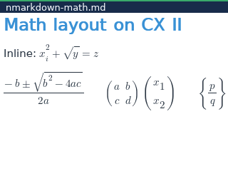

<strong>FIREBIRD-CORE-01-reader</strong> — FIREBIRD PASS

- **Command/target:** `make firebird-test`; `build/ndless-firebird/nmarkdown-firebird-integration.tns`.
- **Physical tape intent:** run the core reader fixture through the standard TI-OS launch tape and wait for the guest's completed, stable document frame.
- **Verified outcome:** the guest reached its PASS state, all 15 framebuffer expectations matched, and the harness retained post-PASS liveness rather than accepting the first transient matching frame. The ordered document parse/render/present serial milestones also completed.
- **Result:** `build/firebird/result.json`; `status: pass`; 57741 ms; frame hash `a98b9aa21b4e1eae`; 3/3 stable matches; 0 mismatched asserted pixels.

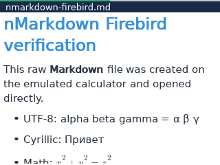

<strong>FIREBIRD-MATH-REVIEW-FAIL-timeout</strong> — GOLDEN-PIXEL VERIFICATION FAILURE, NOT AN APP-FREEZE CLAIM

- **Command/target:** `make firebird-math-review-test`; `build/ndless-firebird-math-review/nmarkdown-firebird-math-review.tns`.
- **Physical tape intent:** launch the dense complex-math review document, wait for its final rendered frame, and compare the pinned radical, sign, fraction, and delimiter pixels with the stored golden expectations.
- **Observed application state:** serial milestones show that the document was read, parsed, rendered, and presented; the final 320 × 240 framebuffer is valid and is embedded below.
- **Verification failure:** `build/firebird-math-review/result.json` reports `status: timeout` after 180012 ms, `stableMatches: 0/3`, frame hash `548dfe81077cbe32`, and 12 mismatched pixels among 22 pinned expectations. The verifier therefore never obtained a fully matching stable frame.
- **Interpretation:** this is a stale or renderer-mismatched golden-pixel failure. The deadline expired while waiting for those exact pixel colors; it does **not** demonstrate that the application froze. The golden coordinates/colors must be reviewed against the intended current math rendering before this fixture can pass.

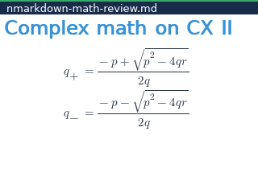

<strong>FIREBIRD-NAV-01-document-exit-serial-pass</strong> — SERIAL EXIT PASS / STABLE-FRAME ASSERTION INCONCLUSIVE

- **Target:** `build/ndless-firebird/nmarkdown-firebird-integration.tns`.
- **Physical tape:** complete the common TI-OS launch sequence &rarr; press <kbd>Esc</kbd> from the document &rarr; wait for TI-OS to resume.
- **Application-level proof:** the guest serial trace emitted `NMARKDOWN_IT/1 EXIT_OK`. The captured final image is TI-OS rather than nMarkdown, so the application exit itself is proven.
- **First host attempt:** the stable framebuffer check timed out because the pinned TI-OS pixel expected RGB565 `0x2985`, while the observed resumed-system pixel was `0x31a6`.
- **Retry:** the run again reached `EXIT_OK` and was then stopped because the resumed TI-OS frame did not settle promptly enough for a useful stable-frame result.
- **Classification:** **serial exit PASS / stable-frame assertion inconclusive**. This is not a full FIREBIRD PASS, because no stable post-exit framebuffer expectation set completed successfully; it is also not an application-freeze failure, because `EXIT_OK` and the TI-OS frame directly establish return from the app.

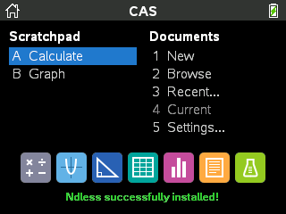

## Additional desktop reproductions

These 32 PNGs are outside the 306-entry manifest. The navigation, error, and inline-math reproductions use isolated disposable roots; the six STATE-01 checkpoints deliberately retain per-document state across runs. They are manual review checkpoints, not manifest CAPTURE PASS claims.

### Reproduced navigation defects

<strong>NAV-01-wide-focus-settings-after-first-esc</strong> — first Esc is consumed below the visible overlay

- **Document/root:** `build/ui-ux-audit/fixtures/interaction-gallery.md`; `build/ui-ux-audit/fixtures`.
- **Exact semantic tape:** <code>search</code> &rarr; <code>text:codeprobe</code> &rarr; <code>enter</code> &rarr; <code>enter</code> &rarr; <code>settings</code> &rarr; <code>back</code>.
- **Operator procedure:** launch the named document and wait for its first frame &rarr; open Search (<kbd>Ctrl</kbd>+<kbd>F</kbd>) &rarr; type <code>codeprobe</code> &rarr; press <kbd>Enter</kbd> &rarr; press <kbd>Enter</kbd> &rarr; open Reader settings (production: <kbd>Ctrl</kbd>+<kbd>T</kbd>) &rarr; press <kbd>Esc</kbd>.
- **Observed result:** the code block remains the hidden wide-focus owner when Settings opens. The first Esc clears that underlying focus while the visible Settings overlay remains open, so a user must press Esc again to dismiss what appears to be the top state.

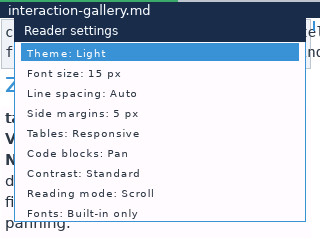

<strong>NAV-07-empty-bookmarks-enter-result</strong> — Enter in an empty retained Bookmarks tab activates a hidden TOC row

- **Document/root:** `build/ui-ux-audit/fixtures/interaction-gallery.md`; `build/ui-ux-audit/fixtures`.
- **Exact semantic tape:** <code>menu</code> &rarr; <code>down</code> &rarr; <code>down</code> &rarr; <code>down</code> &rarr; <code>down</code> &rarr; <code>down</code> &rarr; <code>back</code> &rarr; <code>bookmark</code> &rarr; <code>menu</code> &rarr; <code>right</code> &rarr; <code>back</code> &rarr; <code>bookmark</code> &rarr; <code>menu</code> &rarr; <code>enter</code>.
- **Operator procedure:** launch the named document and wait for its first frame &rarr; open Menu / TOC (production: <kbd>Menu</kbd>) &rarr; press <kbd>Down</kbd> &rarr; press <kbd>Down</kbd> &rarr; press <kbd>Down</kbd> &rarr; press <kbd>Down</kbd> &rarr; press <kbd>Down</kbd> &rarr; press <kbd>Esc</kbd> &rarr; toggle the current-block bookmark (<kbd>Ctrl</kbd>+<kbd>B</kbd>) &rarr; open Menu / TOC (production: <kbd>Menu</kbd>) &rarr; press <kbd>Right</kbd> &rarr; press <kbd>Esc</kbd> &rarr; toggle the current-block bookmark (<kbd>Ctrl</kbd>+<kbd>B</kbd>) &rarr; open Menu / TOC (production: <kbd>Menu</kbd>) &rarr; press <kbd>Enter</kbd>.
- **Observed result:** select the Epsilon TOC row, retain that selection while closing, create then remove the only bookmark through the Bookmarks tab, reopen the now-empty overlay, and press Enter. The invisible retained TOC selection activates and lands on Epsilon instead of doing nothing in the empty Bookmarks tab.

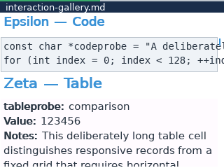

### Document-open error behavior

These five checkpoints use root `build/ui-ux-audit/fixtures/error-open-root`. The in-document cases begin in `00-reader.md`, open the Markdown browser, and activate one deliberately problematic file. They distinguish errors that preserve the existing document from inputs that silently replace it. A successful screenshot capture is not acceptance of any silent or destructive recovery behavior.

<strong>ERR-01-in-document-empty</strong> — opening an empty file replaces the current document with a blank view

- **Starting document/root:** `build/ui-ux-audit/fixtures/error-open-root/00-reader.md`; `build/ui-ux-audit/fixtures/error-open-root`.
- **Selected file:** `01-empty.md`.
- **Exact semantic tape:** <code>open</code> &rarr; <code>down</code> &rarr; <code>enter</code>.
- **Operator procedure:** launch `00-reader.md` &rarr; open the Markdown browser with <kbd>Ctrl</kbd>+<kbd>O</kbd> &rarr; press <kbd>Down</kbd> once to select `01-empty.md` &rarr; press <kbd>Enter</kbd>.
- **Observed result:** the existing document is replaced by an almost entirely blank document view titled `01-empty.md`; no explanatory empty-document state is visible.

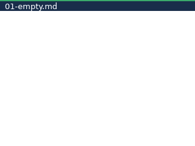

<strong>ERR-01-in-document-oversized</strong> — oversized input shows an error over the preserved document

- **Starting document/root:** `build/ui-ux-audit/fixtures/error-open-root/00-reader.md`; `build/ui-ux-audit/fixtures/error-open-root`.
- **Selected file:** `02-oversized.md`.
- **Exact semantic tape:** <code>open</code> &rarr; <code>down</code> &rarr; <code>down</code> &rarr; <code>enter</code>.
- **Operator procedure:** launch `00-reader.md` &rarr; open the Markdown browser &rarr; press <kbd>Down</kbd> twice to select `02-oversized.md` &rarr; press <kbd>Enter</kbd>.
- **Observed result:** a `Could not open document` dialog reports that the file exceeds the configured size limit while the prior `00-reader.md` document remains visible underneath. Enter or Esc is offered as a recovery action.

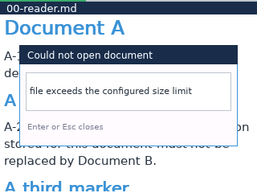

<strong>ERR-01-in-document-malformed</strong> — malformed bytes are accepted as literal Markdown text

- **Starting document/root:** `build/ui-ux-audit/fixtures/error-open-root/00-reader.md`; `build/ui-ux-audit/fixtures/error-open-root`.
- **Selected file:** `03-malformed.md`.
- **Exact semantic tape:** <code>open</code> &rarr; <code>down</code> &rarr; <code>down</code> &rarr; <code>down</code> &rarr; <code>enter</code>.
- **Operator procedure:** launch `00-reader.md` &rarr; open the Markdown browser &rarr; press <kbd>Down</kbd> three times to select `03-malformed.md` &rarr; press <kbd>Enter</kbd>.
- **Observed result:** the prior document is replaced and the OpenType signature bytes `OTTO` are rendered as an ordinary one-line Markdown document. No malformed/binary-file warning appears.

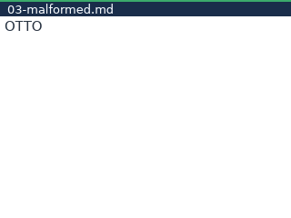

<strong>ERR-01-in-document-unreadable</strong> — permission failure shows an error over the preserved document

- **Starting document/root:** `build/ui-ux-audit/fixtures/error-open-root/00-reader.md`; `build/ui-ux-audit/fixtures/error-open-root`.
- **Selected file:** `04-unreadable.md`.
- **Exact semantic tape:** <code>open</code> &rarr; <code>down</code> &rarr; <code>down</code> &rarr; <code>down</code> &rarr; <code>down</code> &rarr; <code>enter</code>.
- **Operator procedure:** launch `00-reader.md` &rarr; open the Markdown browser &rarr; press <kbd>Down</kbd> four times to select `04-unreadable.md` &rarr; press <kbd>Enter</kbd>.
- **Observed result:** a `Could not open document` dialog appears while `00-reader.md` remains visible underneath. The desktop error text currently reports `No such file or directory` for the unreadable path, which does not accurately explain the fixture's permission failure.

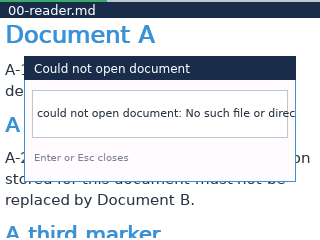

<strong>ERR-01-direct-unreadable</strong> — direct launch silently falls back to the built-in startup document

- **Document/root:** `build/ui-ux-audit/fixtures/error-open-root/04-unreadable.md`; `build/ui-ux-audit/fixtures/error-open-root`.
- **Exact semantic tape:** <em>(none; initial render)</em>.
- **Operator procedure:** launch nMarkdown directly with `04-unreadable.md` as the document argument &rarr; provide no input &rarr; inspect the first frame.
- **Observed result:** the app shows the built-in `nMarkdown` Unicode demonstration page with no visible error, filename, or recovery explanation. This silent startup fallback can mislead the reader into thinking another document opened successfully.

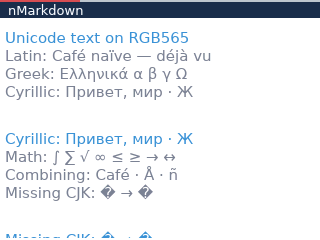

### Font-load error behavior by role

These nine checkpoints launch `build/ui-ux-audit/fixtures/font-error-root/reader.md` without saved state. Each run opens Settings, presses Down eight times to reach Fonts, enters the role list, chooses Body, Monospace, or CJK, enters that role's file list, and selects the invalid, truncated, or oversized fixture. The exact events below keep every repeated keypress visible.

Invalid and truncated payloads produce a useful FreeType-rejection message and preserve the document. Oversized payloads expose a defect: the first size-limit failure is overwritten by the automatic `.tns` retry, so every role misleadingly reports `could not open document: No such file or directory`.

Unsupported-outline coverage and the missing-after-list race still lack executable fixtures. They remain named blockers and are not treated as passed by these nine captures.

<strong>ERR-02-body-invalid</strong> — invalid Body font

- **Exact semantic tape:** <code>settings</code> &rarr; <code>down</code> &rarr; <code>down</code> &rarr; <code>down</code> &rarr; <code>down</code> &rarr; <code>down</code> &rarr; <code>down</code> &rarr; <code>down</code> &rarr; <code>down</code> &rarr; <code>enter</code> &rarr; <code>enter</code> &rarr; <code>down</code> &rarr; <code>enter</code>.
- **Operator procedure:** launch `reader.md` &rarr; open Settings &rarr; press <kbd>Down</kbd> eight times to select Fonts &rarr; press <kbd>Enter</kbd> to open roles &rarr; press <kbd>Enter</kbd> on Body &rarr; press <kbd>Down</kbd> once to select `00-invalid.ttf` &rarr; press <kbd>Enter</kbd>.
- **Observed result:** the message states that FreeType rejected the font payload; the reader document remains intact underneath.

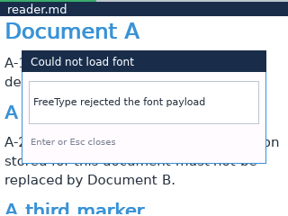

<strong>ERR-02-body-truncated</strong> — truncated Body font

- **Exact semantic tape:** <code>settings</code> &rarr; <code>down</code> &rarr; <code>down</code> &rarr; <code>down</code> &rarr; <code>down</code> &rarr; <code>down</code> &rarr; <code>down</code> &rarr; <code>down</code> &rarr; <code>down</code> &rarr; <code>enter</code> &rarr; <code>enter</code> &rarr; <code>down</code> &rarr; <code>down</code> &rarr; <code>enter</code>.
- **Operator procedure:** launch `reader.md` &rarr; open Settings &rarr; press <kbd>Down</kbd> eight times &rarr; enter Fonts &rarr; enter Body &rarr; press <kbd>Down</kbd> twice to select `01-truncated.otf` &rarr; press <kbd>Enter</kbd>.
- **Observed result:** the message states that FreeType rejected the truncated payload; the previous Body face and reader document remain active.

<strong>ERR-02-body-oversized</strong> — oversized Body font

- **Exact semantic tape:** <code>settings</code> &rarr; <code>down</code> &rarr; <code>down</code> &rarr; <code>down</code> &rarr; <code>down</code> &rarr; <code>down</code> &rarr; <code>down</code> &rarr; <code>down</code> &rarr; <code>down</code> &rarr; <code>enter</code> &rarr; <code>enter</code> &rarr; <code>down</code> &rarr; <code>down</code> &rarr; <code>down</code> &rarr; <code>enter</code>.
- **Operator procedure:** launch `reader.md` &rarr; open Settings &rarr; press <kbd>Down</kbd> eight times &rarr; enter Fonts &rarr; enter Body &rarr; press <kbd>Down</kbd> three times to select `02-oversized.ttf` &rarr; press <kbd>Enter</kbd>.
- **Observed result:** the document is preserved, but the dialog incorrectly reports `No such file or directory`; the `.tns` fallback retry has hidden the useful size-limit error.

<strong>ERR-02-mono-invalid</strong> — invalid Monospace font

- **Exact semantic tape:** <code>settings</code> &rarr; <code>down</code> &rarr; <code>down</code> &rarr; <code>down</code> &rarr; <code>down</code> &rarr; <code>down</code> &rarr; <code>down</code> &rarr; <code>down</code> &rarr; <code>down</code> &rarr; <code>enter</code> &rarr; <code>down</code> &rarr; <code>enter</code> &rarr; <code>down</code> &rarr; <code>enter</code>.
- **Operator procedure:** launch `reader.md` &rarr; open Settings &rarr; press <kbd>Down</kbd> eight times &rarr; enter Fonts &rarr; press <kbd>Down</kbd> once and enter Monospace &rarr; press <kbd>Down</kbd> once to select `00-invalid.ttf` &rarr; press <kbd>Enter</kbd>.
- **Observed result:** FreeType rejection is reported and the built-in monospace face remains active.

<strong>ERR-02-mono-truncated</strong> — truncated Monospace font

- **Exact semantic tape:** <code>settings</code> &rarr; <code>down</code> &rarr; <code>down</code> &rarr; <code>down</code> &rarr; <code>down</code> &rarr; <code>down</code> &rarr; <code>down</code> &rarr; <code>down</code> &rarr; <code>down</code> &rarr; <code>enter</code> &rarr; <code>down</code> &rarr; <code>enter</code> &rarr; <code>down</code> &rarr; <code>down</code> &rarr; <code>enter</code>.
- **Operator procedure:** launch `reader.md` &rarr; open Settings &rarr; press <kbd>Down</kbd> eight times &rarr; enter Fonts &rarr; press <kbd>Down</kbd> once and enter Monospace &rarr; press <kbd>Down</kbd> twice to select `01-truncated.otf` &rarr; press <kbd>Enter</kbd>.
- **Observed result:** FreeType rejection is reported and the previous monospace face/document remain active.

<strong>ERR-02-mono-oversized</strong> — oversized Monospace font

- **Exact semantic tape:** <code>settings</code> &rarr; <code>down</code> &rarr; <code>down</code> &rarr; <code>down</code> &rarr; <code>down</code> &rarr; <code>down</code> &rarr; <code>down</code> &rarr; <code>down</code> &rarr; <code>down</code> &rarr; <code>enter</code> &rarr; <code>down</code> &rarr; <code>enter</code> &rarr; <code>down</code> &rarr; <code>down</code> &rarr; <code>down</code> &rarr; <code>enter</code>.
- **Operator procedure:** launch `reader.md` &rarr; open Settings &rarr; press <kbd>Down</kbd> eight times &rarr; enter Fonts &rarr; press <kbd>Down</kbd> once and enter Monospace &rarr; press <kbd>Down</kbd> three times to select `02-oversized.ttf` &rarr; press <kbd>Enter</kbd>.
- **Observed result:** the document is preserved, but the dialog incorrectly reports `No such file or directory` instead of the size-limit failure.

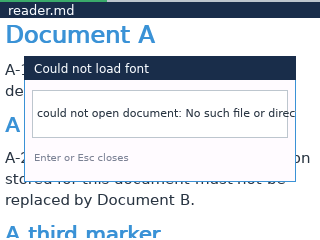

<strong>ERR-02-cjk-invalid</strong> — invalid CJK font

- **Exact semantic tape:** <code>settings</code> &rarr; <code>down</code> &rarr; <code>down</code> &rarr; <code>down</code> &rarr; <code>down</code> &rarr; <code>down</code> &rarr; <code>down</code> &rarr; <code>down</code> &rarr; <code>down</code> &rarr; <code>enter</code> &rarr; <code>down</code> &rarr; <code>down</code> &rarr; <code>enter</code> &rarr; <code>down</code> &rarr; <code>enter</code>.
- **Operator procedure:** launch `reader.md` &rarr; open Settings &rarr; press <kbd>Down</kbd> eight times &rarr; enter Fonts &rarr; press <kbd>Down</kbd> twice and enter CJK &rarr; press <kbd>Down</kbd> once to select `00-invalid.ttf` &rarr; press <kbd>Enter</kbd>.
- **Observed result:** FreeType rejection is reported and the optional CJK slot remains unchanged.

<strong>ERR-02-cjk-truncated</strong> — truncated CJK font

- **Exact semantic tape:** <code>settings</code> &rarr; <code>down</code> &rarr; <code>down</code> &rarr; <code>down</code> &rarr; <code>down</code> &rarr; <code>down</code> &rarr; <code>down</code> &rarr; <code>down</code> &rarr; <code>down</code> &rarr; <code>enter</code> &rarr; <code>down</code> &rarr; <code>down</code> &rarr; <code>enter</code> &rarr; <code>down</code> &rarr; <code>down</code> &rarr; <code>enter</code>.
- **Operator procedure:** launch `reader.md` &rarr; open Settings &rarr; press <kbd>Down</kbd> eight times &rarr; enter Fonts &rarr; press <kbd>Down</kbd> twice and enter CJK &rarr; press <kbd>Down</kbd> twice to select `01-truncated.otf` &rarr; press <kbd>Enter</kbd>.
- **Observed result:** FreeType rejection is reported and the previous CJK selection/document remain active.

<strong>ERR-02-cjk-oversized</strong> — oversized CJK font

- **Exact semantic tape:** <code>settings</code> &rarr; <code>down</code> &rarr; <code>down</code> &rarr; <code>down</code> &rarr; <code>down</code> &rarr; <code>down</code> &rarr; <code>down</code> &rarr; <code>down</code> &rarr; <code>down</code> &rarr; <code>enter</code> &rarr; <code>down</code> &rarr; <code>down</code> &rarr; <code>enter</code> &rarr; <code>down</code> &rarr; <code>down</code> &rarr; <code>down</code> &rarr; <code>enter</code>.
- **Operator procedure:** launch `reader.md` &rarr; open Settings &rarr; press <kbd>Down</kbd> eight times &rarr; enter Fonts &rarr; press <kbd>Down</kbd> twice and enter CJK &rarr; press <kbd>Down</kbd> three times to select `02-oversized.ttf` &rarr; press <kbd>Enter</kbd>.
- **Observed result:** the document is preserved, but the dialog incorrectly reports `No such file or directory` instead of the size-limit failure.

### Cross-document inheritance, restoration, and restart

These six checkpoints use root `build/ui-ux-audit/fixtures/state-combined-root`. Document A is `00-document-a.md`; document B is `01-document-b.md`. Together they configure A, open a previously unconfigured B to inspect live inheritance, give B a deliberately different configuration, reopen each document to inspect its own sidecar, and finally restart A without input. They are an ordered state study, so later frames depend on state created by the earlier runs.

The final A restart visibly opens on an apparently empty `3 / 3` page. That screenshot records a likely position-restoration UX defect; it is **not** a visual UX pass.

<strong>STATE-01-reader-configured</strong> — configure and bookmark document A

- **Document/root:** `build/ui-ux-audit/fixtures/state-combined-root/00-document-a.md`; `build/ui-ux-audit/fixtures/state-combined-root`.
- **Exact semantic tape:** <code>settings</code> &rarr; <code>right</code> &rarr; <code>down</code> &rarr; <code>right</code> &rarr; <code>right</code> &rarr; <code>right</code> &rarr; <code>down</code> &rarr; <code>right</code> &rarr; <code>right</code> &rarr; <code>right</code> &rarr; <code>right</code> &rarr; <code>right</code> &rarr; <code>down</code> &rarr; <code>right</code> &rarr; <code>right</code> &rarr; <code>right</code> &rarr; <code>right</code> &rarr; <code>right</code> &rarr; <code>down</code> &rarr; <code>right</code> &rarr; <code>down</code> &rarr; <code>right</code> &rarr; <code>down</code> &rarr; <code>right</code> &rarr; <code>down</code> &rarr; <code>right</code> &rarr; <code>back</code> &rarr; <code>down</code> &rarr; <code>bookmark</code>.
- **Operator procedure:** launch A &rarr; open Settings with <kbd>Ctrl</kbd>+<kbd>T</kbd> &rarr; set Theme to Dark &rarr; move to Font size and press Right three times (18 px) &rarr; move to Line spacing and press Right five times (+6 px) &rarr; move to Side margins and press Right five times (10 px) &rarr; set Tables to Grid + pan &rarr; set Code blocks to Wrap &rarr; set Contrast to High &rarr; set Reading mode to Page Swipe &rarr; press <kbd>Esc</kbd> &rarr; press <kbd>Down</kbd> once &rarr; toggle a bookmark with <kbd>Ctrl</kbd>+<kbd>B</kbd>.
- **Review purpose:** establish A's non-default settings, nonzero reading position, and bookmark before another document is opened.

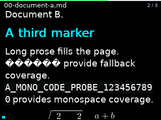

<strong>STATE-01-formats-inherited</strong> — open unconfigured document B from A

- **Starting document/root:** `build/ui-ux-audit/fixtures/state-combined-root/00-document-a.md`; `build/ui-ux-audit/fixtures/state-combined-root`.
- **Destination document:** `build/ui-ux-audit/fixtures/state-combined-root/01-document-b.md`.
- **Exact semantic tape:** <code>open</code> &rarr; <code>down</code> &rarr; <code>enter</code>.
- **Operator procedure:** launch configured A &rarr; open the Markdown browser with <kbd>Ctrl</kbd>+<kbd>O</kbd> &rarr; press <kbd>Down</kbd> to select B &rarr; press <kbd>Enter</kbd>.
- **Review purpose:** record which live settings a document with no existing sidecar inherits when first opened from configured A.

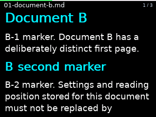

<strong>STATE-01-formats-configured</strong> — give document B an opposing configuration

- **Document/root:** `build/ui-ux-audit/fixtures/state-combined-root/01-document-b.md`; `build/ui-ux-audit/fixtures/state-combined-root`.
- **Exact semantic tape:** <code>settings</code> &rarr; <code>left</code> &rarr; <code>down</code> &rarr; <code>left</code> &rarr; <code>left</code> &rarr; <code>left</code> &rarr; <code>left</code> &rarr; <code>left</code> &rarr; <code>down</code> &rarr; <code>left</code> &rarr; <code>left</code> &rarr; <code>left</code> &rarr; <code>left</code> &rarr; <code>left</code> &rarr; <code>down</code> &rarr; <code>left</code> &rarr; <code>left</code> &rarr; <code>left</code> &rarr; <code>left</code> &rarr; <code>left</code> &rarr; <code>left</code> &rarr; <code>left</code> &rarr; <code>left</code> &rarr; <code>down</code> &rarr; <code>left</code> &rarr; <code>down</code> &rarr; <code>left</code> &rarr; <code>down</code> &rarr; <code>left</code> &rarr; <code>down</code> &rarr; <code>left</code> &rarr; <code>back</code> &rarr; <code>down</code> &rarr; <code>bookmark</code>.
- **Operator procedure:** launch B with the inherited live settings &rarr; open Settings &rarr; change Dark to Light &rarr; move to Font size and press Left five times &rarr; move to Line spacing and press Left five times to Auto &rarr; move to Side margins and press Left eight times to the 2 px minimum &rarr; change Tables to Responsive &rarr; change Code blocks to Pan &rarr; change Contrast to Standard &rarr; change Reading mode to Scroll &rarr; press <kbd>Esc</kbd> &rarr; press <kbd>Down</kbd> once &rarr; toggle a bookmark.
- **Review purpose:** create a clearly distinguishable B sidecar and reading position so later direct launches can detect cross-document leakage.

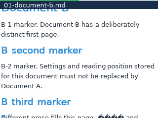

<strong>STATE-01-reader-restored</strong> — reopen A and inspect its settings

- **Document/root:** `build/ui-ux-audit/fixtures/state-combined-root/00-document-a.md`; `build/ui-ux-audit/fixtures/state-combined-root`.
- **Exact semantic tape:** <code>settings</code>.
- **Operator procedure:** launch A in a new run &rarr; open Settings with <kbd>Ctrl</kbd>+<kbd>T</kbd> &rarr; compare the visible values with A's Dark/18 px/+6 px/10 px/Grid/Wrap/High/Page Swipe configuration.
- **Review purpose:** verify that reopening A selects A's state rather than B's opposing state. Inspect the restored position separately; do not infer correctness only from the settings labels.

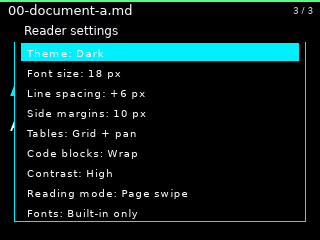

<strong>STATE-01-formats-restored</strong> — reopen B and inspect its settings

- **Document/root:** `build/ui-ux-audit/fixtures/state-combined-root/01-document-b.md`; `build/ui-ux-audit/fixtures/state-combined-root`.
- **Exact semantic tape:** <code>settings</code>.
- **Operator procedure:** launch B in a new run &rarr; open Settings with <kbd>Ctrl</kbd>+<kbd>T</kbd> &rarr; compare the visible values with B's Light/13 px/Auto/2 px/Responsive/Pan/Standard/Scroll configuration.
- **Review purpose:** verify that reopening B selects B's state rather than A's non-default state.

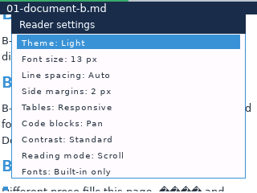

<strong>STATE-01-reader-restarted</strong> — restart A without input

- **Document/root:** `build/ui-ux-audit/fixtures/state-combined-root/00-document-a.md`; `build/ui-ux-audit/fixtures/state-combined-root`.
- **Exact semantic tape:** <em>(none; initial render)</em>.
- **Operator procedure:** launch A in a new process &rarr; provide no input &rarr; inspect the first restored document frame.
- **Observed result:** A reopens at an apparently empty `3 / 3` Page Swipe page. The state file may be restoring a legal numeric endpoint, but the resulting blank reading surface is poor UX and requires investigation; this frame is intentionally not labeled a UX pass.

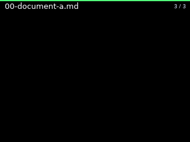

### Inline-math font-size sweep

All ten captures open `samples/math-gallery.md` from root `samples`, start with no state, set the named font size before searching, search for the exact query `Inline baseline`, and press Enter to place that mixed prose/formula line at the top. The yellow text is the retained search highlight. This sweep is intentionally visual: 18 px and 22 px expose obvious baseline/body collisions, so these images must not be interpreted as layout acceptance simply because the process completed.

<strong>INLINE-MATH-01-valid-15-light</strong> — 15 px, Light

- **Exact semantic tape:** <code>search</code> &rarr; <code>text:Inline baseline</code> &rarr; <code>enter</code>.
- **Operator procedure:** launch `samples/math-gallery.md` at the default 15 px Light state &rarr; open Search (<kbd>Ctrl</kbd>+<kbd>F</kbd>) &rarr; type <code>Inline baseline</code> &rarr; press <kbd>Enter</kbd>.
- **Review note:** Breakpoint review checkpoint; compare baseline separation, wrapping, fraction height, and viewport clipping with adjacent sizes.

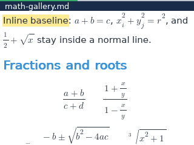

<strong>INLINE-MATH-02-valid-12-light</strong> — 12 px, Light

- **Exact semantic tape:** <code>font-</code> &rarr; <code>font-</code> &rarr; <code>font-</code> &rarr; <code>search</code> &rarr; <code>text:Inline baseline</code> &rarr; <code>enter</code>.
- **Operator procedure:** launch `samples/math-gallery.md` at the default 15 px Light state &rarr; decrease font size once (<kbd>-</kbd>) &rarr; decrease font size once (<kbd>-</kbd>) &rarr; decrease font size once (<kbd>-</kbd>) &rarr; open Search (<kbd>Ctrl</kbd>+<kbd>F</kbd>) &rarr; type <code>Inline baseline</code> &rarr; press <kbd>Enter</kbd>.
- **Review note:** Breakpoint review checkpoint; compare baseline separation, wrapping, fraction height, and viewport clipping with adjacent sizes.

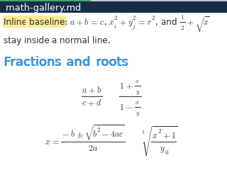

<strong>INLINE-MATH-03-valid-22-light</strong> — 22 px, Light

- **Exact semantic tape:** <code>font+</code> &rarr; <code>font+</code> &rarr; <code>font+</code> &rarr; <code>font+</code> &rarr; <code>font+</code> &rarr; <code>font+</code> &rarr; <code>font+</code> &rarr; <code>search</code> &rarr; <code>text:Inline baseline</code> &rarr; <code>enter</code>.
- **Operator procedure:** launch `samples/math-gallery.md` at the default 15 px Light state &rarr; increase font size once (<kbd>+</kbd>) &rarr; increase font size once (<kbd>+</kbd>) &rarr; increase font size once (<kbd>+</kbd>) &rarr; increase font size once (<kbd>+</kbd>) &rarr; increase font size once (<kbd>+</kbd>) &rarr; increase font size once (<kbd>+</kbd>) &rarr; increase font size once (<kbd>+</kbd>) &rarr; open Search (<kbd>Ctrl</kbd>+<kbd>F</kbd>) &rarr; type <code>Inline baseline</code> &rarr; press <kbd>Enter</kbd>.
- **Review note:** Visible collision checkpoint; this frame records a defect, not acceptance.

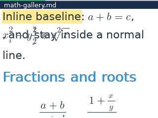

<strong>INLINE-MATH-04-valid-15-dark</strong> — 15 px, Dark

- **Exact semantic tape:** <code>settings</code> &rarr; <code>right</code> &rarr; <code>back</code> &rarr; <code>search</code> &rarr; <code>text:Inline baseline</code> &rarr; <code>enter</code>.
- **Operator procedure:** launch `samples/math-gallery.md` at the default 15 px Light state &rarr; open Reader settings (production: <kbd>Ctrl</kbd>+<kbd>T</kbd>) &rarr; press <kbd>Right</kbd> &rarr; press <kbd>Esc</kbd> &rarr; open Search (<kbd>Ctrl</kbd>+<kbd>F</kbd>) &rarr; type <code>Inline baseline</code> &rarr; press <kbd>Enter</kbd>.
- **Review note:** Breakpoint review checkpoint; compare baseline separation, wrapping, fraction height, and viewport clipping with adjacent sizes.

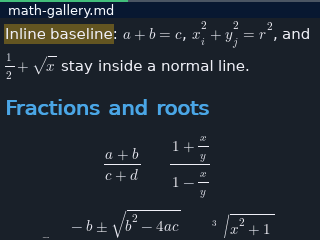

<strong>INLINE-MATH-threshold-16</strong> — 16 px, Light

- **Exact semantic tape:** <code>font+</code> &rarr; <code>search</code> &rarr; <code>text:Inline baseline</code> &rarr; <code>enter</code>.
- **Operator procedure:** launch `samples/math-gallery.md` at the default 15 px Light state &rarr; increase font size once (<kbd>+</kbd>) &rarr; open Search (<kbd>Ctrl</kbd>+<kbd>F</kbd>) &rarr; type <code>Inline baseline</code> &rarr; press <kbd>Enter</kbd>.
- **Review note:** Breakpoint review checkpoint; compare baseline separation, wrapping, fraction height, and viewport clipping with adjacent sizes.

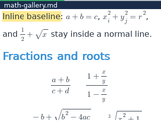

<strong>INLINE-MATH-threshold-17</strong> — 17 px, Light

- **Exact semantic tape:** <code>font+</code> &rarr; <code>font+</code> &rarr; <code>search</code> &rarr; <code>text:Inline baseline</code> &rarr; <code>enter</code>.
- **Operator procedure:** launch `samples/math-gallery.md` at the default 15 px Light state &rarr; increase font size once (<kbd>+</kbd>) &rarr; increase font size once (<kbd>+</kbd>) &rarr; open Search (<kbd>Ctrl</kbd>+<kbd>F</kbd>) &rarr; type <code>Inline baseline</code> &rarr; press <kbd>Enter</kbd>.
- **Review note:** Breakpoint review checkpoint; compare baseline separation, wrapping, fraction height, and viewport clipping with adjacent sizes.

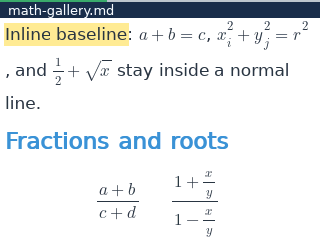

<strong>INLINE-MATH-threshold-18</strong> — 18 px, Light

- **Exact semantic tape:** <code>font+</code> &rarr; <code>font+</code> &rarr; <code>font+</code> &rarr; <code>search</code> &rarr; <code>text:Inline baseline</code> &rarr; <code>enter</code>.
- **Operator procedure:** launch `samples/math-gallery.md` at the default 15 px Light state &rarr; increase font size once (<kbd>+</kbd>) &rarr; increase font size once (<kbd>+</kbd>) &rarr; increase font size once (<kbd>+</kbd>) &rarr; open Search (<kbd>Ctrl</kbd>+<kbd>F</kbd>) &rarr; type <code>Inline baseline</code> &rarr; press <kbd>Enter</kbd>.
- **Review note:** Visible collision checkpoint; this frame records a defect, not acceptance.

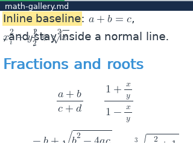

<strong>INLINE-MATH-threshold-19</strong> — 19 px, Light

- **Exact semantic tape:** <code>font+</code> &rarr; <code>font+</code> &rarr; <code>font+</code> &rarr; <code>font+</code> &rarr; <code>search</code> &rarr; <code>text:Inline baseline</code> &rarr; <code>enter</code>.
- **Operator procedure:** launch `samples/math-gallery.md` at the default 15 px Light state &rarr; increase font size once (<kbd>+</kbd>) &rarr; increase font size once (<kbd>+</kbd>) &rarr; increase font size once (<kbd>+</kbd>) &rarr; increase font size once (<kbd>+</kbd>) &rarr; open Search (<kbd>Ctrl</kbd>+<kbd>F</kbd>) &rarr; type <code>Inline baseline</code> &rarr; press <kbd>Enter</kbd>.
- **Review note:** Breakpoint review checkpoint; compare baseline separation, wrapping, fraction height, and viewport clipping with adjacent sizes.

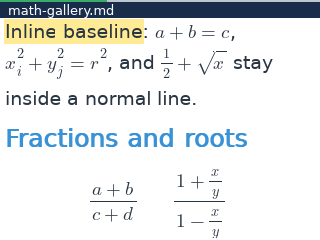

<strong>INLINE-MATH-threshold-20</strong> — 20 px, Light

- **Exact semantic tape:** <code>font+</code> &rarr; <code>font+</code> &rarr; <code>font+</code> &rarr; <code>font+</code> &rarr; <code>font+</code> &rarr; <code>search</code> &rarr; <code>text:Inline baseline</code> &rarr; <code>enter</code>.
- **Operator procedure:** launch `samples/math-gallery.md` at the default 15 px Light state &rarr; increase font size once (<kbd>+</kbd>) &rarr; increase font size once (<kbd>+</kbd>) &rarr; increase font size once (<kbd>+</kbd>) &rarr; increase font size once (<kbd>+</kbd>) &rarr; increase font size once (<kbd>+</kbd>) &rarr; open Search (<kbd>Ctrl</kbd>+<kbd>F</kbd>) &rarr; type <code>Inline baseline</code> &rarr; press <kbd>Enter</kbd>.
- **Review note:** Breakpoint review checkpoint; compare baseline separation, wrapping, fraction height, and viewport clipping with adjacent sizes.

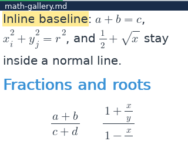

<strong>INLINE-MATH-threshold-21</strong> — 21 px, Light

- **Exact semantic tape:** <code>font+</code> &rarr; <code>font+</code> &rarr; <code>font+</code> &rarr; <code>font+</code> &rarr; <code>font+</code> &rarr; <code>font+</code> &rarr; <code>search</code> &rarr; <code>text:Inline baseline</code> &rarr; <code>enter</code>.
- **Operator procedure:** launch `samples/math-gallery.md` at the default 15 px Light state &rarr; increase font size once (<kbd>+</kbd>) &rarr; increase font size once (<kbd>+</kbd>) &rarr; increase font size once (<kbd>+</kbd>) &rarr; increase font size once (<kbd>+</kbd>) &rarr; increase font size once (<kbd>+</kbd>) &rarr; increase font size once (<kbd>+</kbd>) &rarr; open Search (<kbd>Ctrl</kbd>+<kbd>F</kbd>) &rarr; type <code>Inline baseline</code> &rarr; press <kbd>Enter</kbd>.
- **Review note:** Breakpoint review checkpoint; compare baseline separation, wrapping, fraction height, and viewport clipping with adjacent sizes.

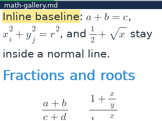

## Desktop semantic manifest — all 306 entries

The following sections are grouped by scenario and collapsed by default. Open a scenario, then open an individual checkpoint. Every checkpoint includes its exact uncompressed event tape, an operator-readable version, process metadata, expected review statement, and inline screenshot.

The `Root` and `Document` values are project-relative. `Frames` is parsed from the executable's `Wrote N frame(s)` message. A missing event tape means the screenshot is the initial rendered state before the harness-only teardown Quit.

<strong>ERR-01 — Direct-open error surfaces</strong> (4/4 captures completed)

Launch missing, oversized, empty, and malformed inputs directly and preserve a visible recovery surface.

<code>ERR-01-direct-empty</code> — <strong>CAPTURE PASS</strong>

- **Backend:** Desktop semantic.
- **Root:** <code>build/ui-ux-audit/fixtures</code>.
- **Document:** <code>build/ui-ux-audit/fixtures/empty.md</code>.
- **Exact semantic tape:** <em>(none; initial render)</em>.
- **Operator procedure:** launch the named document and wait for its first frame.
- **Review target:** Visual checkpoint captured; behavior is assessed in the audit report.
- **Capture result:** exit <code>0</code>; <code>320x240</code>; <code>1</code> rendered frame(s); <code>24</code> ms.

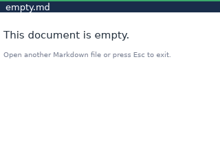

<code>ERR-01-direct-malformed</code> — <strong>CAPTURE PASS</strong>

- **Backend:** Desktop semantic.
- **Root:** <code>build/ui-ux-audit/fixtures</code>.
- **Document:** <code>build/ui-ux-audit/fixtures/truncated-font.otf</code>.
- **Exact semantic tape:** <em>(none; initial render)</em>.
- **Operator procedure:** launch the named document and wait for its first frame.
- **Review target:** Visual checkpoint captured; behavior is assessed in the audit report.
- **Capture result:** exit <code>0</code>; <code>320x240</code>; <code>1</code> rendered frame(s); <code>27</code> ms.

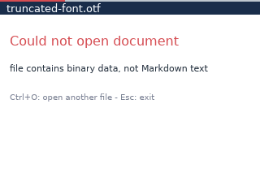

<code>ERR-01-direct-missing</code> — <strong>CAPTURE PASS</strong>

- **Backend:** Desktop semantic.
- **Root:** <code>build/ui-ux-audit/fixtures</code>.
- **Document:** <code>build/ui-ux-audit/fixtures/missing-direct.md</code>.
- **Exact semantic tape:** <em>(none; initial render)</em>.
- **Operator procedure:** launch the named document and wait for its first frame.
- **Review target:** Visual checkpoint captured; behavior is assessed in the audit report.
- **Capture result:** exit <code>0</code>; <code>320x240</code>; <code>1</code> rendered frame(s); <code>29</code> ms.

<code>ERR-01-direct-oversized</code> — <strong>CAPTURE PASS</strong>

- **Backend:** Desktop semantic.
- **Root:** <code>build/ui-ux-audit/fixtures</code>.
- **Document:** <code>build/ui-ux-audit/fixtures/oversized.md</code>.
- **Exact semantic tape:** <em>(none; initial render)</em>.
- **Operator procedure:** launch the named document and wait for its first frame.
- **Review target:** Visual checkpoint captured; behavior is assessed in the audit report.
- **Capture result:** exit <code>0</code>; <code>320x240</code>; <code>1</code> rendered frame(s); <code>28</code> ms.

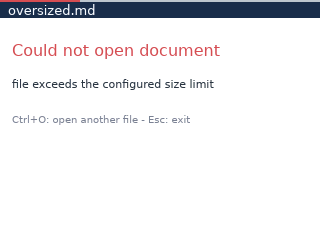

<strong>ERR-03 — Link-action recovery surfaces</strong> (7/7 captures completed)

Exercise external, anchor, relative-document, asset, and multi-link outcomes without losing a recovery path.

<code>ERR-03-asset</code> — <strong>CAPTURE PASS</strong>

- **Backend:** Desktop semantic.
- **Root:** <code>build/ui-ux-audit/fixtures</code>.
- **Document:** <code>build/ui-ux-audit/fixtures/link-errors.md</code>.
- **Exact semantic tape:** <code>search</code> &rarr; <code>text:ASSET-ACTION</code> &rarr; <code>enter</code> &rarr; <code>enter</code>.
- **Operator procedure:** launch the named document and wait for its first frame &rarr; open Search (<kbd>Ctrl</kbd>+<kbd>F</kbd>) &rarr; type <code>ASSET-ACTION</code> &rarr; press <kbd>Enter</kbd> &rarr; press <kbd>Enter</kbd>.
- **Review target:** Visual checkpoint captured; behavior is assessed in the audit report.
- **Capture result:** exit <code>0</code>; <code>320x240</code>; <code>16</code> rendered frame(s); <code>53</code> ms.

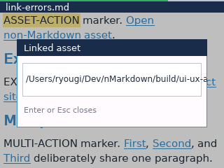

<code>ERR-03-external</code> — <strong>CAPTURE PASS</strong>

- **Backend:** Desktop semantic.
- **Root:** <code>build/ui-ux-audit/fixtures</code>.
- **Document:** <code>build/ui-ux-audit/fixtures/link-errors.md</code>.
- **Exact semantic tape:** <code>search</code> &rarr; <code>text:EXTERNAL-ACTION</code> &rarr; <code>enter</code> &rarr; <code>enter</code>.
- **Operator procedure:** launch the named document and wait for its first frame &rarr; open Search (<kbd>Ctrl</kbd>+<kbd>F</kbd>) &rarr; type <code>EXTERNAL-ACTION</code> &rarr; press <kbd>Enter</kbd> &rarr; press <kbd>Enter</kbd>.
- **Review target:** Visual checkpoint captured; behavior is assessed in the audit report.
- **Capture result:** exit <code>0</code>; <code>320x240</code>; <code>19</code> rendered frame(s); <code>63</code> ms.

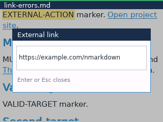

<code>ERR-03-missing-anchor</code> — <strong>CAPTURE PASS</strong>

- **Backend:** Desktop semantic.
- **Root:** <code>build/ui-ux-audit/fixtures</code>.
- **Document:** <code>build/ui-ux-audit/fixtures/link-errors.md</code>.
- **Exact semantic tape:** <code>search</code> &rarr; <code>text:MISSING-ACTION</code> &rarr; <code>enter</code> &rarr; <code>enter</code>.
- **Operator procedure:** launch the named document and wait for its first frame &rarr; open Search (<kbd>Ctrl</kbd>+<kbd>F</kbd>) &rarr; type <code>MISSING-ACTION</code> &rarr; press <kbd>Enter</kbd> &rarr; press <kbd>Enter</kbd>.
- **Review target:** Visual checkpoint captured; behavior is assessed in the audit report.
- **Capture result:** exit <code>0</code>; <code>320x240</code>; <code>18</code> rendered frame(s); <code>57</code> ms.

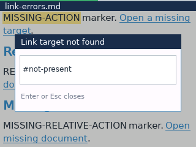

<code>ERR-03-missing-relative</code> — <strong>CAPTURE PASS</strong>

- **Backend:** Desktop semantic.
- **Root:** <code>build/ui-ux-audit/fixtures</code>.
- **Document:** <code>build/ui-ux-audit/fixtures/link-errors.md</code>.
- **Exact semantic tape:** <code>search</code> &rarr; <code>text:MISSING-RELATIVE-ACTION</code> &rarr; <code>enter</code> &rarr; <code>enter</code>.
- **Operator procedure:** launch the named document and wait for its first frame &rarr; open Search (<kbd>Ctrl</kbd>+<kbd>F</kbd>) &rarr; type <code>MISSING-RELATIVE-ACTION</code> &rarr; press <kbd>Enter</kbd> &rarr; press <kbd>Enter</kbd>.
- **Review target:** Visual checkpoint captured; behavior is assessed in the audit report.
- **Capture result:** exit <code>0</code>; <code>320x240</code>; <code>27</code> rendered frame(s); <code>70</code> ms.

<code>ERR-03-multiple-links</code> — <strong>CAPTURE PASS</strong>

- **Backend:** Desktop semantic.
- **Root:** <code>build/ui-ux-audit/fixtures</code>.
- **Document:** <code>build/ui-ux-audit/fixtures/link-errors.md</code>.
- **Exact semantic tape:** <code>search</code> &rarr; <code>text:MULTI-ACTION</code> &rarr; <code>enter</code> &rarr; <code>enter</code>.
- **Operator procedure:** launch the named document and wait for its first frame &rarr; open Search (<kbd>Ctrl</kbd>+<kbd>F</kbd>) &rarr; type <code>MULTI-ACTION</code> &rarr; press <kbd>Enter</kbd> &rarr; press <kbd>Enter</kbd>.
- **Review target:** Visual checkpoint captured; behavior is assessed in the audit report.
- **Capture result:** exit <code>0</code>; <code>320x240</code>; <code>16</code> rendered frame(s); <code>51</code> ms.

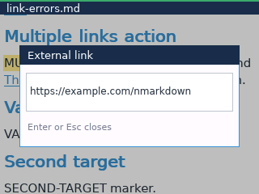

<code>ERR-03-valid-anchor</code> — <strong>CAPTURE PASS</strong>

- **Backend:** Desktop semantic.
- **Root:** <code>build/ui-ux-audit/fixtures</code>.
- **Document:** <code>build/ui-ux-audit/fixtures/link-errors.md</code>.
- **Exact semantic tape:** <code>search</code> &rarr; <code>text:VALID-ACTION</code> &rarr; <code>enter</code> &rarr; <code>enter</code>.
- **Operator procedure:** launch the named document and wait for its first frame &rarr; open Search (<kbd>Ctrl</kbd>+<kbd>F</kbd>) &rarr; type <code>VALID-ACTION</code> &rarr; press <kbd>Enter</kbd> &rarr; press <kbd>Enter</kbd>.
- **Review target:** Visual checkpoint captured; behavior is assessed in the audit report.
- **Capture result:** exit <code>0</code>; <code>320x240</code>; <code>16</code> rendered frame(s); <code>61</code> ms.

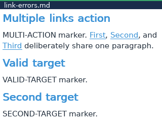

<code>ERR-03-valid-relative</code> — <strong>CAPTURE PASS</strong>

- **Backend:** Desktop semantic.
- **Root:** <code>build/ui-ux-audit/fixtures</code>.
- **Document:** <code>build/ui-ux-audit/fixtures/link-errors.md</code>.
- **Exact semantic tape:** <code>search</code> &rarr; <code>text:RELATIVE-ACTION</code> &rarr; <code>enter</code> &rarr; <code>enter</code>.
- **Operator procedure:** launch the named document and wait for its first frame &rarr; open Search (<kbd>Ctrl</kbd>+<kbd>F</kbd>) &rarr; type <code>RELATIVE-ACTION</code> &rarr; press <kbd>Enter</kbd> &rarr; press <kbd>Enter</kbd>.
- **Review target:** Visual checkpoint captured; behavior is assessed in the audit report.
- **Capture result:** exit <code>0</code>; <code>320x240</code>; <code>19</code> rendered frame(s); <code>67</code> ms.

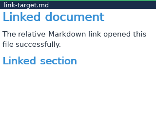

<strong>INPUT-01 — Overlay input isolation</strong> (20/20 captures completed)

Send document-level navigation and mutation inputs while every overlay is visible, in both reading modes.

<code>INPUT-01-bookmarks-page-after</code> — <strong>CAPTURE PASS</strong>

- **Backend:** Desktop semantic.
- **Root:** <code>build/ui-ux-audit/fixtures</code>.
- **Document:** <code>build/ui-ux-audit/fixtures/interaction-gallery.md</code>.
- **Exact semantic tape:** <code>settings</code> &rarr; <code>up</code> &rarr; <code>up</code> &rarr; <code>up</code> &rarr; <code>up</code> &rarr; <code>up</code> &rarr; <code>up</code> &rarr; <code>up</code> &rarr; <code>up</code> &rarr; <code>down</code> &rarr; <code>down</code> &rarr; <code>down</code> &rarr; <code>down</code> &rarr; <code>down</code> &rarr; <code>down</code> &rarr; <code>down</code> &rarr; <code>right</code> &rarr; <code>back</code> &rarr; <code>bookmark</code> &rarr; <code>menu</code> &rarr; <code>right</code> &rarr; <code>page-down</code> &rarr; <code>scroll:32</code> &rarr; <code>font+</code> &rarr; <code>bookmark</code> &rarr; <code>next</code>.
- **Operator procedure:** launch the named document and wait for its first frame &rarr; open Reader settings (production: <kbd>Ctrl</kbd>+<kbd>T</kbd>) &rarr; press <kbd>Up</kbd> &rarr; press <kbd>Up</kbd> &rarr; press <kbd>Up</kbd> &rarr; press <kbd>Up</kbd> &rarr; press <kbd>Up</kbd> &rarr; press <kbd>Up</kbd> &rarr; press <kbd>Up</kbd> &rarr; press <kbd>Up</kbd> &rarr; press <kbd>Down</kbd> &rarr; press <kbd>Down</kbd> &rarr; press <kbd>Down</kbd> &rarr; press <kbd>Down</kbd> &rarr; press <kbd>Down</kbd> &rarr; press <kbd>Down</kbd> &rarr; press <kbd>Down</kbd> &rarr; press <kbd>Right</kbd> &rarr; press <kbd>Esc</kbd> &rarr; toggle the current-block bookmark (<kbd>Ctrl</kbd>+<kbd>B</kbd>) &rarr; open Menu / TOC (production: <kbd>Menu</kbd>) &rarr; press <kbd>Right</kbd> &rarr; press <kbd>Page Down</kbd> (or perform the equivalent next-page gesture) &rarr; send pointer-scroll delta <code>32</code> &rarr; increase font size once (<kbd>+</kbd>) &rarr; toggle the current-block bookmark (<kbd>Ctrl</kbd>+<kbd>B</kbd>) &rarr; go to the next retained search result (<kbd>Ctrl</kbd>+<kbd>N</kbd>).
- **Review target:** Visual checkpoint captured; behavior is assessed in the audit report.
- **Capture result:** exit <code>0</code>; <code>320x240</code>; <code>17</code> rendered frame(s); <code>59</code> ms.

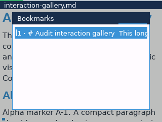

<code>INPUT-01-bookmarks-scroll-after</code> — <strong>CAPTURE PASS</strong>

- **Backend:** Desktop semantic.
- **Root:** <code>build/ui-ux-audit/fixtures</code>.
- **Document:** <code>build/ui-ux-audit/fixtures/interaction-gallery.md</code>.
- **Exact semantic tape:** <code>bookmark</code> &rarr; <code>menu</code> &rarr; <code>right</code> &rarr; <code>page-down</code> &rarr; <code>scroll:32</code> &rarr; <code>font+</code> &rarr; <code>bookmark</code> &rarr; <code>next</code>.
- **Operator procedure:** launch the named document and wait for its first frame &rarr; toggle the current-block bookmark (<kbd>Ctrl</kbd>+<kbd>B</kbd>) &rarr; open Menu / TOC (production: <kbd>Menu</kbd>) &rarr; press <kbd>Right</kbd> &rarr; press <kbd>Page Down</kbd> (or perform the equivalent next-page gesture) &rarr; send pointer-scroll delta <code>32</code> &rarr; increase font size once (<kbd>+</kbd>) &rarr; toggle the current-block bookmark (<kbd>Ctrl</kbd>+<kbd>B</kbd>) &rarr; go to the next retained search result (<kbd>Ctrl</kbd>+<kbd>N</kbd>).
- **Review target:** Visual checkpoint captured; behavior is assessed in the audit report.
- **Capture result:** exit <code>0</code>; <code>320x240</code>; <code>7</code> rendered frame(s); <code>48</code> ms.

<code>INPUT-01-browser-page-after</code> — <strong>CAPTURE PASS</strong>

- **Backend:** Desktop semantic.
- **Root:** <code>build/ui-ux-audit/fixtures</code>.
- **Document:** <code>build/ui-ux-audit/fixtures/interaction-gallery.md</code>.
- **Exact semantic tape:** <code>settings</code> &rarr; <code>up</code> &rarr; <code>up</code> &rarr; <code>up</code> &rarr; <code>up</code> &rarr; <code>up</code> &rarr; <code>up</code> &rarr; <code>up</code> &rarr; <code>up</code> &rarr; <code>down</code> &rarr; <code>down</code> &rarr; <code>down</code> &rarr; <code>down</code> &rarr; <code>down</code> &rarr; <code>down</code> &rarr; <code>down</code> &rarr; <code>right</code> &rarr; <code>back</code> &rarr; <code>open</code> &rarr; <code>page-down</code> &rarr; <code>scroll:32</code> &rarr; <code>font+</code> &rarr; <code>bookmark</code> &rarr; <code>next</code>.
- **Operator procedure:** launch the named document and wait for its first frame &rarr; open Reader settings (production: <kbd>Ctrl</kbd>+<kbd>T</kbd>) &rarr; press <kbd>Up</kbd> &rarr; press <kbd>Up</kbd> &rarr; press <kbd>Up</kbd> &rarr; press <kbd>Up</kbd> &rarr; press <kbd>Up</kbd> &rarr; press <kbd>Up</kbd> &rarr; press <kbd>Up</kbd> &rarr; press <kbd>Up</kbd> &rarr; press <kbd>Down</kbd> &rarr; press <kbd>Down</kbd> &rarr; press <kbd>Down</kbd> &rarr; press <kbd>Down</kbd> &rarr; press <kbd>Down</kbd> &rarr; press <kbd>Down</kbd> &rarr; press <kbd>Down</kbd> &rarr; press <kbd>Right</kbd> &rarr; press <kbd>Esc</kbd> &rarr; open the Markdown browser (<kbd>Ctrl</kbd>+<kbd>O</kbd>) &rarr; press <kbd>Page Down</kbd> (or perform the equivalent next-page gesture) &rarr; send pointer-scroll delta <code>32</code> &rarr; increase font size once (<kbd>+</kbd>) &rarr; toggle the current-block bookmark (<kbd>Ctrl</kbd>+<kbd>B</kbd>) &rarr; go to the next retained search result (<kbd>Ctrl</kbd>+<kbd>N</kbd>).
- **Review target:** Visual checkpoint captured; behavior is assessed in the audit report.
- **Capture result:** exit <code>0</code>; <code>320x240</code>; <code>13</code> rendered frame(s); <code>56</code> ms.

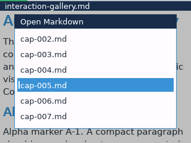

<code>INPUT-01-browser-scroll-after</code> — <strong>CAPTURE PASS</strong>

- **Backend:** Desktop semantic.
- **Root:** <code>build/ui-ux-audit/fixtures</code>.
- **Document:** <code>build/ui-ux-audit/fixtures/interaction-gallery.md</code>.
- **Exact semantic tape:** <code>open</code> &rarr; <code>page-down</code> &rarr; <code>scroll:32</code> &rarr; <code>font+</code> &rarr; <code>bookmark</code> &rarr; <code>next</code>.
- **Operator procedure:** launch the named document and wait for its first frame &rarr; open the Markdown browser (<kbd>Ctrl</kbd>+<kbd>O</kbd>) &rarr; press <kbd>Page Down</kbd> (or perform the equivalent next-page gesture) &rarr; send pointer-scroll delta <code>32</code> &rarr; increase font size once (<kbd>+</kbd>) &rarr; toggle the current-block bookmark (<kbd>Ctrl</kbd>+<kbd>B</kbd>) &rarr; go to the next retained search result (<kbd>Ctrl</kbd>+<kbd>N</kbd>).
- **Review target:** Visual checkpoint captured; behavior is assessed in the audit report.
- **Capture result:** exit <code>0</code>; <code>320x240</code>; <code>3</code> rendered frame(s); <code>38</code> ms.

<code>INPUT-01-diagnostics-page-after</code> — <strong>CAPTURE PASS</strong>

- **Backend:** Desktop semantic.
- **Root:** <code>build/ui-ux-audit/fixtures</code>.
- **Document:** <code>build/ui-ux-audit/fixtures/interaction-gallery.md</code>.
- **Exact semantic tape:** <code>settings</code> &rarr; <code>up</code> &rarr; <code>up</code> &rarr; <code>up</code> &rarr; <code>up</code> &rarr; <code>up</code> &rarr; <code>up</code> &rarr; <code>up</code> &rarr; <code>up</code> &rarr; <code>down</code> &rarr; <code>down</code> &rarr; <code>down</code> &rarr; <code>down</code> &rarr; <code>down</code> &rarr; <code>down</code> &rarr; <code>down</code> &rarr; <code>right</code> &rarr; <code>back</code> &rarr; <code>diagnostics</code> &rarr; <code>page-down</code> &rarr; <code>scroll:32</code> &rarr; <code>font+</code> &rarr; <code>bookmark</code> &rarr; <code>next</code>.
- **Operator procedure:** launch the named document and wait for its first frame &rarr; open Reader settings (production: <kbd>Ctrl</kbd>+<kbd>T</kbd>) &rarr; press <kbd>Up</kbd> &rarr; press <kbd>Up</kbd> &rarr; press <kbd>Up</kbd> &rarr; press <kbd>Up</kbd> &rarr; press <kbd>Up</kbd> &rarr; press <kbd>Up</kbd> &rarr; press <kbd>Up</kbd> &rarr; press <kbd>Up</kbd> &rarr; press <kbd>Down</kbd> &rarr; press <kbd>Down</kbd> &rarr; press <kbd>Down</kbd> &rarr; press <kbd>Down</kbd> &rarr; press <kbd>Down</kbd> &rarr; press <kbd>Down</kbd> &rarr; press <kbd>Down</kbd> &rarr; press <kbd>Right</kbd> &rarr; press <kbd>Esc</kbd> &rarr; open Diagnostics (<kbd>Ctrl</kbd>+<kbd>D</kbd>) &rarr; press <kbd>Page Down</kbd> (or perform the equivalent next-page gesture) &rarr; send pointer-scroll delta <code>32</code> &rarr; increase font size once (<kbd>+</kbd>) &rarr; toggle the current-block bookmark (<kbd>Ctrl</kbd>+<kbd>B</kbd>) &rarr; go to the next retained search result (<kbd>Ctrl</kbd>+<kbd>N</kbd>).
- **Review target:** Visual checkpoint captured; behavior is assessed in the audit report.
- **Capture result:** exit <code>0</code>; <code>320x240</code>; <code>12</code> rendered frame(s); <code>56</code> ms.

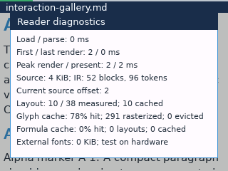

<code>INPUT-01-diagnostics-scroll-after</code> — <strong>CAPTURE PASS</strong>

- **Backend:** Desktop semantic.
- **Root:** <code>build/ui-ux-audit/fixtures</code>.
- **Document:** <code>build/ui-ux-audit/fixtures/interaction-gallery.md</code>.
- **Exact semantic tape:** <code>diagnostics</code> &rarr; <code>page-down</code> &rarr; <code>scroll:32</code> &rarr; <code>font+</code> &rarr; <code>bookmark</code> &rarr; <code>next</code>.
- **Operator procedure:** launch the named document and wait for its first frame &rarr; open Diagnostics (<kbd>Ctrl</kbd>+<kbd>D</kbd>) &rarr; press <kbd>Page Down</kbd> (or perform the equivalent next-page gesture) &rarr; send pointer-scroll delta <code>32</code> &rarr; increase font size once (<kbd>+</kbd>) &rarr; toggle the current-block bookmark (<kbd>Ctrl</kbd>+<kbd>B</kbd>) &rarr; go to the next retained search result (<kbd>Ctrl</kbd>+<kbd>N</kbd>).
- **Review target:** Visual checkpoint captured; behavior is assessed in the audit report.
- **Capture result:** exit <code>0</code>; <code>320x240</code>; <code>2</code> rendered frame(s); <code>36</code> ms.

<code>INPUT-01-font-files-page-after</code> — <strong>CAPTURE PASS</strong>

- **Backend:** Desktop semantic.
- **Root:** <code>build/ui-ux-audit/fixtures</code>.
- **Document:** <code>build/ui-ux-audit/fixtures/interaction-gallery.md</code>.
- **Exact semantic tape:** <code>settings</code> &rarr; <code>up</code> &rarr; <code>up</code> &rarr; <code>up</code> &rarr; <code>up</code> &rarr; <code>up</code> &rarr; <code>up</code> &rarr; <code>up</code> &rarr; <code>up</code> &rarr; <code>down</code> &rarr; <code>down</code> &rarr; <code>down</code> &rarr; <code>down</code> &rarr; <code>down</code> &rarr; <code>down</code> &rarr; <code>down</code> &rarr; <code>right</code> &rarr; <code>back</code> &rarr; <code>settings</code> &rarr; <code>up</code> &rarr; <code>up</code> &rarr; <code>up</code> &rarr; <code>up</code> &rarr; <code>up</code> &rarr; <code>up</code> &rarr; <code>up</code> &rarr; <code>up</code> &rarr; <code>down</code> &rarr; <code>down</code> &rarr; <code>down</code> &rarr; <code>down</code> &rarr; <code>down</code> &rarr; <code>down</code> &rarr; <code>down</code> &rarr; <code>down</code> &rarr; <code>enter</code> &rarr; <code>enter</code> &rarr; <code>page-down</code> &rarr; <code>scroll:32</code> &rarr; <code>font+</code> &rarr; <code>bookmark</code> &rarr; <code>next</code>.
- **Operator procedure:** launch the named document and wait for its first frame &rarr; open Reader settings (production: <kbd>Ctrl</kbd>+<kbd>T</kbd>) &rarr; press <kbd>Up</kbd> &rarr; press <kbd>Up</kbd> &rarr; press <kbd>Up</kbd> &rarr; press <kbd>Up</kbd> &rarr; press <kbd>Up</kbd> &rarr; press <kbd>Up</kbd> &rarr; press <kbd>Up</kbd> &rarr; press <kbd>Up</kbd> &rarr; press <kbd>Down</kbd> &rarr; press <kbd>Down</kbd> &rarr; press <kbd>Down</kbd> &rarr; press <kbd>Down</kbd> &rarr; press <kbd>Down</kbd> &rarr; press <kbd>Down</kbd> &rarr; press <kbd>Down</kbd> &rarr; press <kbd>Right</kbd> &rarr; press <kbd>Esc</kbd> &rarr; open Reader settings (production: <kbd>Ctrl</kbd>+<kbd>T</kbd>) &rarr; press <kbd>Up</kbd> &rarr; press <kbd>Up</kbd> &rarr; press <kbd>Up</kbd> &rarr; press <kbd>Up</kbd> &rarr; press <kbd>Up</kbd> &rarr; press <kbd>Up</kbd> &rarr; press <kbd>Up</kbd> &rarr; press <kbd>Up</kbd> &rarr; press <kbd>Down</kbd> &rarr; press <kbd>Down</kbd> &rarr; press <kbd>Down</kbd> &rarr; press <kbd>Down</kbd> &rarr; press <kbd>Down</kbd> &rarr; press <kbd>Down</kbd> &rarr; press <kbd>Down</kbd> &rarr; press <kbd>Down</kbd> &rarr; press <kbd>Enter</kbd> &rarr; press <kbd>Enter</kbd> &rarr; press <kbd>Page Down</kbd> (or perform the equivalent next-page gesture) &rarr; send pointer-scroll delta <code>32</code> &rarr; increase font size once (<kbd>+</kbd>) &rarr; toggle the current-block bookmark (<kbd>Ctrl</kbd>+<kbd>B</kbd>) &rarr; go to the next retained search result (<kbd>Ctrl</kbd>+<kbd>N</kbd>).
- **Review target:** Visual checkpoint captured; behavior is assessed in the audit report.
- **Capture result:** exit <code>0</code>; <code>320x240</code>; <code>30</code> rendered frame(s); <code>86</code> ms.

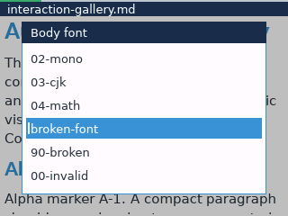

<code>INPUT-01-font-files-scroll-after</code> — <strong>CAPTURE PASS</strong>

- **Backend:** Desktop semantic.
- **Root:** <code>build/ui-ux-audit/fixtures</code>.
- **Document:** <code>build/ui-ux-audit/fixtures/interaction-gallery.md</code>.
- **Exact semantic tape:** <code>settings</code> &rarr; <code>up</code> &rarr; <code>up</code> &rarr; <code>up</code> &rarr; <code>up</code> &rarr; <code>up</code> &rarr; <code>up</code> &rarr; <code>up</code> &rarr; <code>up</code> &rarr; <code>down</code> &rarr; <code>down</code> &rarr; <code>down</code> &rarr; <code>down</code> &rarr; <code>down</code> &rarr; <code>down</code> &rarr; <code>down</code> &rarr; <code>down</code> &rarr; <code>enter</code> &rarr; <code>enter</code> &rarr; <code>page-down</code> &rarr; <code>scroll:32</code> &rarr; <code>font+</code> &rarr; <code>bookmark</code> &rarr; <code>next</code>.
- **Operator procedure:** launch the named document and wait for its first frame &rarr; open Reader settings (production: <kbd>Ctrl</kbd>+<kbd>T</kbd>) &rarr; press <kbd>Up</kbd> &rarr; press <kbd>Up</kbd> &rarr; press <kbd>Up</kbd> &rarr; press <kbd>Up</kbd> &rarr; press <kbd>Up</kbd> &rarr; press <kbd>Up</kbd> &rarr; press <kbd>Up</kbd> &rarr; press <kbd>Up</kbd> &rarr; press <kbd>Down</kbd> &rarr; press <kbd>Down</kbd> &rarr; press <kbd>Down</kbd> &rarr; press <kbd>Down</kbd> &rarr; press <kbd>Down</kbd> &rarr; press <kbd>Down</kbd> &rarr; press <kbd>Down</kbd> &rarr; press <kbd>Down</kbd> &rarr; press <kbd>Enter</kbd> &rarr; press <kbd>Enter</kbd> &rarr; press <kbd>Page Down</kbd> (or perform the equivalent next-page gesture) &rarr; send pointer-scroll delta <code>32</code> &rarr; increase font size once (<kbd>+</kbd>) &rarr; toggle the current-block bookmark (<kbd>Ctrl</kbd>+<kbd>B</kbd>) &rarr; go to the next retained search result (<kbd>Ctrl</kbd>+<kbd>N</kbd>).
- **Review target:** Visual checkpoint captured; behavior is assessed in the audit report.
- **Capture result:** exit <code>0</code>; <code>320x240</code>; <code>13</code> rendered frame(s); <code>53</code> ms.

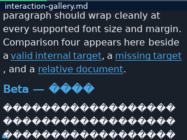

<code>INPUT-01-font-roles-page-after</code> — <strong>CAPTURE PASS</strong>

- **Backend:** Desktop semantic.
- **Root:** <code>build/ui-ux-audit/fixtures</code>.
- **Document:** <code>build/ui-ux-audit/fixtures/interaction-gallery.md</code>.
- **Exact semantic tape:** <code>settings</code> &rarr; <code>up</code> &rarr; <code>up</code> &rarr; <code>up</code> &rarr; <code>up</code> &rarr; <code>up</code> &rarr; <code>up</code> &rarr; <code>up</code> &rarr; <code>up</code> &rarr; <code>down</code> &rarr; <code>down</code> &rarr; <code>down</code> &rarr; <code>down</code> &rarr; <code>down</code> &rarr; <code>down</code> &rarr; <code>down</code> &rarr; <code>right</code> &rarr; <code>back</code> &rarr; <code>settings</code> &rarr; <code>up</code> &rarr; <code>up</code> &rarr; <code>up</code> &rarr; <code>up</code> &rarr; <code>up</code> &rarr; <code>up</code> &rarr; <code>up</code> &rarr; <code>up</code> &rarr; <code>down</code> &rarr; <code>down</code> &rarr; <code>down</code> &rarr; <code>down</code> &rarr; <code>down</code> &rarr; <code>down</code> &rarr; <code>down</code> &rarr; <code>down</code> &rarr; <code>enter</code> &rarr; <code>page-down</code> &rarr; <code>scroll:32</code> &rarr; <code>font+</code> &rarr; <code>bookmark</code> &rarr; <code>next</code>.
- **Operator procedure:** launch the named document and wait for its first frame &rarr; open Reader settings (production: <kbd>Ctrl</kbd>+<kbd>T</kbd>) &rarr; press <kbd>Up</kbd> &rarr; press <kbd>Up</kbd> &rarr; press <kbd>Up</kbd> &rarr; press <kbd>Up</kbd> &rarr; press <kbd>Up</kbd> &rarr; press <kbd>Up</kbd> &rarr; press <kbd>Up</kbd> &rarr; press <kbd>Up</kbd> &rarr; press <kbd>Down</kbd> &rarr; press <kbd>Down</kbd> &rarr; press <kbd>Down</kbd> &rarr; press <kbd>Down</kbd> &rarr; press <kbd>Down</kbd> &rarr; press <kbd>Down</kbd> &rarr; press <kbd>Down</kbd> &rarr; press <kbd>Right</kbd> &rarr; press <kbd>Esc</kbd> &rarr; open Reader settings (production: <kbd>Ctrl</kbd>+<kbd>T</kbd>) &rarr; press <kbd>Up</kbd> &rarr; press <kbd>Up</kbd> &rarr; press <kbd>Up</kbd> &rarr; press <kbd>Up</kbd> &rarr; press <kbd>Up</kbd> &rarr; press <kbd>Up</kbd> &rarr; press <kbd>Up</kbd> &rarr; press <kbd>Up</kbd> &rarr; press <kbd>Down</kbd> &rarr; press <kbd>Down</kbd> &rarr; press <kbd>Down</kbd> &rarr; press <kbd>Down</kbd> &rarr; press <kbd>Down</kbd> &rarr; press <kbd>Down</kbd> &rarr; press <kbd>Down</kbd> &rarr; press <kbd>Down</kbd> &rarr; press <kbd>Enter</kbd> &rarr; press <kbd>Page Down</kbd> (or perform the equivalent next-page gesture) &rarr; send pointer-scroll delta <code>32</code> &rarr; increase font size once (<kbd>+</kbd>) &rarr; toggle the current-block bookmark (<kbd>Ctrl</kbd>+<kbd>B</kbd>) &rarr; go to the next retained search result (<kbd>Ctrl</kbd>+<kbd>N</kbd>).
- **Review target:** Visual checkpoint captured; behavior is assessed in the audit report.
- **Capture result:** exit <code>0</code>; <code>320x240</code>; <code>29</code> rendered frame(s); <code>83</code> ms.

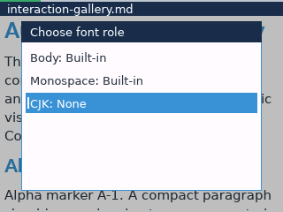

<code>INPUT-01-font-roles-scroll-after</code> — <strong>CAPTURE PASS</strong>

- **Backend:** Desktop semantic.
- **Root:** <code>build/ui-ux-audit/fixtures</code>.
- **Document:** <code>build/ui-ux-audit/fixtures/interaction-gallery.md</code>.
- **Exact semantic tape:** <code>settings</code> &rarr; <code>up</code> &rarr; <code>up</code> &rarr; <code>up</code> &rarr; <code>up</code> &rarr; <code>up</code> &rarr; <code>up</code> &rarr; <code>up</code> &rarr; <code>up</code> &rarr; <code>down</code> &rarr; <code>down</code> &rarr; <code>down</code> &rarr; <code>down</code> &rarr; <code>down</code> &rarr; <code>down</code> &rarr; <code>down</code> &rarr; <code>down</code> &rarr; <code>enter</code> &rarr; <code>page-down</code> &rarr; <code>scroll:32</code> &rarr; <code>font+</code> &rarr; <code>bookmark</code> &rarr; <code>next</code>.
- **Operator procedure:** launch the named document and wait for its first frame &rarr; open Reader settings (production: <kbd>Ctrl</kbd>+<kbd>T</kbd>) &rarr; press <kbd>Up</kbd> &rarr; press <kbd>Up</kbd> &rarr; press <kbd>Up</kbd> &rarr; press <kbd>Up</kbd> &rarr; press <kbd>Up</kbd> &rarr; press <kbd>Up</kbd> &rarr; press <kbd>Up</kbd> &rarr; press <kbd>Up</kbd> &rarr; press <kbd>Down</kbd> &rarr; press <kbd>Down</kbd> &rarr; press <kbd>Down</kbd> &rarr; press <kbd>Down</kbd> &rarr; press <kbd>Down</kbd> &rarr; press <kbd>Down</kbd> &rarr; press <kbd>Down</kbd> &rarr; press <kbd>Down</kbd> &rarr; press <kbd>Enter</kbd> &rarr; press <kbd>Page Down</kbd> (or perform the equivalent next-page gesture) &rarr; send pointer-scroll delta <code>32</code> &rarr; increase font size once (<kbd>+</kbd>) &rarr; toggle the current-block bookmark (<kbd>Ctrl</kbd>+<kbd>B</kbd>) &rarr; go to the next retained search result (<kbd>Ctrl</kbd>+<kbd>N</kbd>).
- **Review target:** Visual checkpoint captured; behavior is assessed in the audit report.
- **Capture result:** exit <code>0</code>; <code>320x240</code>; <code>12</code> rendered frame(s); <code>50</code> ms.

<code>INPUT-01-generic-page-after</code> — <strong>CAPTURE PASS</strong>

- **Backend:** Desktop semantic.
- **Root:** <code>build/ui-ux-audit/fixtures</code>.
- **Document:** <code>build/ui-ux-audit/fixtures/no-headings.md</code>.
- **Exact semantic tape:** <code>settings</code> &rarr; <code>up</code> &rarr; <code>up</code> &rarr; <code>up</code> &rarr; <code>up</code> &rarr; <code>up</code> &rarr; <code>up</code> &rarr; <code>up</code> &rarr; <code>up</code> &rarr; <code>down</code> &rarr; <code>down</code> &rarr; <code>down</code> &rarr; <code>down</code> &rarr; <code>down</code> &rarr; <code>down</code> &rarr; <code>down</code> &rarr; <code>right</code> &rarr; <code>back</code> &rarr; <code>menu</code> &rarr; <code>page-down</code> &rarr; <code>scroll:32</code> &rarr; <code>font+</code> &rarr; <code>bookmark</code> &rarr; <code>next</code>.
- **Operator procedure:** launch the named document and wait for its first frame &rarr; open Reader settings (production: <kbd>Ctrl</kbd>+<kbd>T</kbd>) &rarr; press <kbd>Up</kbd> &rarr; press <kbd>Up</kbd> &rarr; press <kbd>Up</kbd> &rarr; press <kbd>Up</kbd> &rarr; press <kbd>Up</kbd> &rarr; press <kbd>Up</kbd> &rarr; press <kbd>Up</kbd> &rarr; press <kbd>Up</kbd> &rarr; press <kbd>Down</kbd> &rarr; press <kbd>Down</kbd> &rarr; press <kbd>Down</kbd> &rarr; press <kbd>Down</kbd> &rarr; press <kbd>Down</kbd> &rarr; press <kbd>Down</kbd> &rarr; press <kbd>Down</kbd> &rarr; press <kbd>Right</kbd> &rarr; press <kbd>Esc</kbd> &rarr; open Menu / TOC (production: <kbd>Menu</kbd>) &rarr; press <kbd>Page Down</kbd> (or perform the equivalent next-page gesture) &rarr; send pointer-scroll delta <code>32</code> &rarr; increase font size once (<kbd>+</kbd>) &rarr; toggle the current-block bookmark (<kbd>Ctrl</kbd>+<kbd>B</kbd>) &rarr; go to the next retained search result (<kbd>Ctrl</kbd>+<kbd>N</kbd>).
- **Review target:** Visual checkpoint captured; behavior is assessed in the audit report.
- **Capture result:** exit <code>0</code>; <code>320x240</code>; <code>15</code> rendered frame(s); <code>64</code> ms.

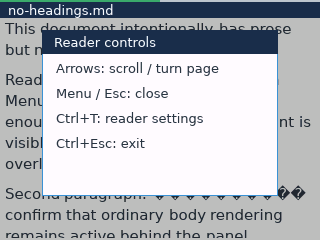

<code>INPUT-01-generic-scroll-after</code> — <strong>CAPTURE PASS</strong>

- **Backend:** Desktop semantic.
- **Root:** <code>build/ui-ux-audit/fixtures</code>.
- **Document:** <code>build/ui-ux-audit/fixtures/no-headings.md</code>.
- **Exact semantic tape:** <code>menu</code> &rarr; <code>page-down</code> &rarr; <code>scroll:32</code> &rarr; <code>font+</code> &rarr; <code>bookmark</code> &rarr; <code>next</code>.
- **Operator procedure:** launch the named document and wait for its first frame &rarr; open Menu / TOC (production: <kbd>Menu</kbd>) &rarr; press <kbd>Page Down</kbd> (or perform the equivalent next-page gesture) &rarr; send pointer-scroll delta <code>32</code> &rarr; increase font size once (<kbd>+</kbd>) &rarr; toggle the current-block bookmark (<kbd>Ctrl</kbd>+<kbd>B</kbd>) &rarr; go to the next retained search result (<kbd>Ctrl</kbd>+<kbd>N</kbd>).
- **Review target:** Visual checkpoint captured; behavior is assessed in the audit report.
- **Capture result:** exit <code>0</code>; <code>320x240</code>; <code>6</code> rendered frame(s); <code>44</code> ms.

<code>INPUT-01-message-page-after</code> — <strong>CAPTURE PASS</strong>

- **Backend:** Desktop semantic.
- **Root:** <code>build/ui-ux-audit/fixtures</code>.
- **Document:** <code>build/ui-ux-audit/fixtures/link-errors.md</code>.
- **Exact semantic tape:** <code>settings</code> &rarr; <code>up</code> &rarr; <code>up</code> &rarr; <code>up</code> &rarr; <code>up</code> &rarr; <code>up</code> &rarr; <code>up</code> &rarr; <code>up</code> &rarr; <code>up</code> &rarr; <code>down</code> &rarr; <code>down</code> &rarr; <code>down</code> &rarr; <code>down</code> &rarr; <code>down</code> &rarr; <code>down</code> &rarr; <code>down</code> &rarr; <code>right</code> &rarr; <code>back</code> &rarr; <code>search</code> &rarr; <code>text:EXTERNAL-ACTION</code> &rarr; <code>enter</code> &rarr; <code>enter</code> &rarr; <code>page-down</code> &rarr; <code>scroll:32</code> &rarr; <code>font+</code> &rarr; <code>bookmark</code> &rarr; <code>next</code>.
- **Operator procedure:** launch the named document and wait for its first frame &rarr; open Reader settings (production: <kbd>Ctrl</kbd>+<kbd>T</kbd>) &rarr; press <kbd>Up</kbd> &rarr; press <kbd>Up</kbd> &rarr; press <kbd>Up</kbd> &rarr; press <kbd>Up</kbd> &rarr; press <kbd>Up</kbd> &rarr; press <kbd>Up</kbd> &rarr; press <kbd>Up</kbd> &rarr; press <kbd>Up</kbd> &rarr; press <kbd>Down</kbd> &rarr; press <kbd>Down</kbd> &rarr; press <kbd>Down</kbd> &rarr; press <kbd>Down</kbd> &rarr; press <kbd>Down</kbd> &rarr; press <kbd>Down</kbd> &rarr; press <kbd>Down</kbd> &rarr; press <kbd>Right</kbd> &rarr; press <kbd>Esc</kbd> &rarr; open Search (<kbd>Ctrl</kbd>+<kbd>F</kbd>) &rarr; type <code>EXTERNAL-ACTION</code> &rarr; press <kbd>Enter</kbd> &rarr; press <kbd>Enter</kbd> &rarr; press <kbd>Page Down</kbd> (or perform the equivalent next-page gesture) &rarr; send pointer-scroll delta <code>32</code> &rarr; increase font size once (<kbd>+</kbd>) &rarr; toggle the current-block bookmark (<kbd>Ctrl</kbd>+<kbd>B</kbd>) &rarr; go to the next retained search result (<kbd>Ctrl</kbd>+<kbd>N</kbd>).
- **Review target:** Visual checkpoint captured; behavior is assessed in the audit report.
- **Capture result:** exit <code>0</code>; <code>320x240</code>; <code>29</code> rendered frame(s); <code>86</code> ms.

<code>INPUT-01-message-scroll-after</code> — <strong>CAPTURE PASS</strong>

- **Backend:** Desktop semantic.
- **Root:** <code>build/ui-ux-audit/fixtures</code>.
- **Document:** <code>build/ui-ux-audit/fixtures/link-errors.md</code>.
- **Exact semantic tape:** <code>search</code> &rarr; <code>text:EXTERNAL-ACTION</code> &rarr; <code>enter</code> &rarr; <code>enter</code> &rarr; <code>page-down</code> &rarr; <code>scroll:32</code> &rarr; <code>font+</code> &rarr; <code>bookmark</code> &rarr; <code>next</code>.
- **Operator procedure:** launch the named document and wait for its first frame &rarr; open Search (<kbd>Ctrl</kbd>+<kbd>F</kbd>) &rarr; type <code>EXTERNAL-ACTION</code> &rarr; press <kbd>Enter</kbd> &rarr; press <kbd>Enter</kbd> &rarr; press <kbd>Page Down</kbd> (or perform the equivalent next-page gesture) &rarr; send pointer-scroll delta <code>32</code> &rarr; increase font size once (<kbd>+</kbd>) &rarr; toggle the current-block bookmark (<kbd>Ctrl</kbd>+<kbd>B</kbd>) &rarr; go to the next retained search result (<kbd>Ctrl</kbd>+<kbd>N</kbd>).
- **Review target:** Visual checkpoint captured; behavior is assessed in the audit report.
- **Capture result:** exit <code>0</code>; <code>320x240</code>; <code>19</code> rendered frame(s); <code>59</code> ms.

<code>INPUT-01-search-page-after</code> — <strong>CAPTURE PASS</strong>

- **Backend:** Desktop semantic.
- **Root:** <code>build/ui-ux-audit/fixtures</code>.
- **Document:** <code>build/ui-ux-audit/fixtures/interaction-gallery.md</code>.
- **Exact semantic tape:** <code>settings</code> &rarr; <code>up</code> &rarr; <code>up</code> &rarr; <code>up</code> &rarr; <code>up</code> &rarr; <code>up</code> &rarr; <code>up</code> &rarr; <code>up</code> &rarr; <code>up</code> &rarr; <code>down</code> &rarr; <code>down</code> &rarr; <code>down</code> &rarr; <code>down</code> &rarr; <code>down</code> &rarr; <code>down</code> &rarr; <code>down</code> &rarr; <code>right</code> &rarr; <code>back</code> &rarr; <code>search</code> &rarr; <code>text:comparison</code> &rarr; <code>page-down</code> &rarr; <code>scroll:32</code> &rarr; <code>font+</code> &rarr; <code>bookmark</code> &rarr; <code>next</code>.
- **Operator procedure:** launch the named document and wait for its first frame &rarr; open Reader settings (production: <kbd>Ctrl</kbd>+<kbd>T</kbd>) &rarr; press <kbd>Up</kbd> &rarr; press <kbd>Up</kbd> &rarr; press <kbd>Up</kbd> &rarr; press <kbd>Up</kbd> &rarr; press <kbd>Up</kbd> &rarr; press <kbd>Up</kbd> &rarr; press <kbd>Up</kbd> &rarr; press <kbd>Up</kbd> &rarr; press <kbd>Down</kbd> &rarr; press <kbd>Down</kbd> &rarr; press <kbd>Down</kbd> &rarr; press <kbd>Down</kbd> &rarr; press <kbd>Down</kbd> &rarr; press <kbd>Down</kbd> &rarr; press <kbd>Down</kbd> &rarr; press <kbd>Right</kbd> &rarr; press <kbd>Esc</kbd> &rarr; open Search (<kbd>Ctrl</kbd>+<kbd>F</kbd>) &rarr; type <code>comparison</code> &rarr; press <kbd>Page Down</kbd> (or perform the equivalent next-page gesture) &rarr; send pointer-scroll delta <code>32</code> &rarr; increase font size once (<kbd>+</kbd>) &rarr; toggle the current-block bookmark (<kbd>Ctrl</kbd>+<kbd>B</kbd>) &rarr; go to the next retained search result (<kbd>Ctrl</kbd>+<kbd>N</kbd>).
- **Review target:** Visual checkpoint captured; behavior is assessed in the audit report.
- **Capture result:** exit <code>0</code>; <code>320x240</code>; <code>24</code> rendered frame(s); <code>71</code> ms.

<code>INPUT-01-search-scroll-after</code> — <strong>CAPTURE PASS</strong>

- **Backend:** Desktop semantic.
- **Root:** <code>build/ui-ux-audit/fixtures</code>.
- **Document:** <code>build/ui-ux-audit/fixtures/interaction-gallery.md</code>.
- **Exact semantic tape:** <code>search</code> &rarr; <code>text:comparison</code> &rarr; <code>page-down</code> &rarr; <code>scroll:32</code> &rarr; <code>font+</code> &rarr; <code>bookmark</code> &rarr; <code>next</code>.
- **Operator procedure:** launch the named document and wait for its first frame &rarr; open Search (<kbd>Ctrl</kbd>+<kbd>F</kbd>) &rarr; type <code>comparison</code> &rarr; press <kbd>Page Down</kbd> (or perform the equivalent next-page gesture) &rarr; send pointer-scroll delta <code>32</code> &rarr; increase font size once (<kbd>+</kbd>) &rarr; toggle the current-block bookmark (<kbd>Ctrl</kbd>+<kbd>B</kbd>) &rarr; go to the next retained search result (<kbd>Ctrl</kbd>+<kbd>N</kbd>).
- **Review target:** Visual checkpoint captured; behavior is assessed in the audit report.
- **Capture result:** exit <code>0</code>; <code>320x240</code>; <code>14</code> rendered frame(s); <code>65</code> ms.

<code>INPUT-01-settings-page-after</code> — <strong>CAPTURE PASS</strong>

- **Backend:** Desktop semantic.
- **Root:** <code>build/ui-ux-audit/fixtures</code>.
- **Document:** <code>build/ui-ux-audit/fixtures/interaction-gallery.md</code>.
- **Exact semantic tape:** <code>settings</code> &rarr; <code>up</code> &rarr; <code>up</code> &rarr; <code>up</code> &rarr; <code>up</code> &rarr; <code>up</code> &rarr; <code>up</code> &rarr; <code>up</code> &rarr; <code>up</code> &rarr; <code>down</code> &rarr; <code>down</code> &rarr; <code>down</code> &rarr; <code>down</code> &rarr; <code>down</code> &rarr; <code>down</code> &rarr; <code>down</code> &rarr; <code>right</code> &rarr; <code>back</code> &rarr; <code>settings</code> &rarr; <code>page-down</code> &rarr; <code>scroll:32</code> &rarr; <code>font+</code> &rarr; <code>bookmark</code> &rarr; <code>next</code>.
- **Operator procedure:** launch the named document and wait for its first frame &rarr; open Reader settings (production: <kbd>Ctrl</kbd>+<kbd>T</kbd>) &rarr; press <kbd>Up</kbd> &rarr; press <kbd>Up</kbd> &rarr; press <kbd>Up</kbd> &rarr; press <kbd>Up</kbd> &rarr; press <kbd>Up</kbd> &rarr; press <kbd>Up</kbd> &rarr; press <kbd>Up</kbd> &rarr; press <kbd>Up</kbd> &rarr; press <kbd>Down</kbd> &rarr; press <kbd>Down</kbd> &rarr; press <kbd>Down</kbd> &rarr; press <kbd>Down</kbd> &rarr; press <kbd>Down</kbd> &rarr; press <kbd>Down</kbd> &rarr; press <kbd>Down</kbd> &rarr; press <kbd>Right</kbd> &rarr; press <kbd>Esc</kbd> &rarr; open Reader settings (production: <kbd>Ctrl</kbd>+<kbd>T</kbd>) &rarr; press <kbd>Page Down</kbd> (or perform the equivalent next-page gesture) &rarr; send pointer-scroll delta <code>32</code> &rarr; increase font size once (<kbd>+</kbd>) &rarr; toggle the current-block bookmark (<kbd>Ctrl</kbd>+<kbd>B</kbd>) &rarr; go to the next retained search result (<kbd>Ctrl</kbd>+<kbd>N</kbd>).
- **Review target:** Visual checkpoint captured; behavior is assessed in the audit report.
- **Capture result:** exit <code>0</code>; <code>320x240</code>; <code>16</code> rendered frame(s); <code>67</code> ms.

<code>INPUT-01-settings-scroll-after</code> — <strong>CAPTURE PASS</strong>

- **Backend:** Desktop semantic.
- **Root:** <code>build/ui-ux-audit/fixtures</code>.
- **Document:** <code>build/ui-ux-audit/fixtures/interaction-gallery.md</code>.
- **Exact semantic tape:** <code>settings</code> &rarr; <code>page-down</code> &rarr; <code>scroll:32</code> &rarr; <code>font+</code> &rarr; <code>bookmark</code> &rarr; <code>next</code>.
- **Operator procedure:** launch the named document and wait for its first frame &rarr; open Reader settings (production: <kbd>Ctrl</kbd>+<kbd>T</kbd>) &rarr; press <kbd>Page Down</kbd> (or perform the equivalent next-page gesture) &rarr; send pointer-scroll delta <code>32</code> &rarr; increase font size once (<kbd>+</kbd>) &rarr; toggle the current-block bookmark (<kbd>Ctrl</kbd>+<kbd>B</kbd>) &rarr; go to the next retained search result (<kbd>Ctrl</kbd>+<kbd>N</kbd>).
- **Review target:** Visual checkpoint captured; behavior is assessed in the audit report.
- **Capture result:** exit <code>0</code>; <code>320x240</code>; <code>6</code> rendered frame(s); <code>50</code> ms.

<code>INPUT-01-toc-page-after</code> — <strong>CAPTURE PASS</strong>

- **Backend:** Desktop semantic.
- **Root:** <code>build/ui-ux-audit/fixtures</code>.
- **Document:** <code>build/ui-ux-audit/fixtures/interaction-gallery.md</code>.
- **Exact semantic tape:** <code>settings</code> &rarr; <code>up</code> &rarr; <code>up</code> &rarr; <code>up</code> &rarr; <code>up</code> &rarr; <code>up</code> &rarr; <code>up</code> &rarr; <code>up</code> &rarr; <code>up</code> &rarr; <code>down</code> &rarr; <code>down</code> &rarr; <code>down</code> &rarr; <code>down</code> &rarr; <code>down</code> &rarr; <code>down</code> &rarr; <code>down</code> &rarr; <code>right</code> &rarr; <code>back</code> &rarr; <code>menu</code> &rarr; <code>page-down</code> &rarr; <code>scroll:32</code> &rarr; <code>font+</code> &rarr; <code>bookmark</code> &rarr; <code>next</code>.
- **Operator procedure:** launch the named document and wait for its first frame &rarr; open Reader settings (production: <kbd>Ctrl</kbd>+<kbd>T</kbd>) &rarr; press <kbd>Up</kbd> &rarr; press <kbd>Up</kbd> &rarr; press <kbd>Up</kbd> &rarr; press <kbd>Up</kbd> &rarr; press <kbd>Up</kbd> &rarr; press <kbd>Up</kbd> &rarr; press <kbd>Up</kbd> &rarr; press <kbd>Up</kbd> &rarr; press <kbd>Down</kbd> &rarr; press <kbd>Down</kbd> &rarr; press <kbd>Down</kbd> &rarr; press <kbd>Down</kbd> &rarr; press <kbd>Down</kbd> &rarr; press <kbd>Down</kbd> &rarr; press <kbd>Down</kbd> &rarr; press <kbd>Right</kbd> &rarr; press <kbd>Esc</kbd> &rarr; open Menu / TOC (production: <kbd>Menu</kbd>) &rarr; press <kbd>Page Down</kbd> (or perform the equivalent next-page gesture) &rarr; send pointer-scroll delta <code>32</code> &rarr; increase font size once (<kbd>+</kbd>) &rarr; toggle the current-block bookmark (<kbd>Ctrl</kbd>+<kbd>B</kbd>) &rarr; go to the next retained search result (<kbd>Ctrl</kbd>+<kbd>N</kbd>).
- **Review target:** Visual checkpoint captured; behavior is assessed in the audit report.
- **Capture result:** exit <code>0</code>; <code>320x240</code>; <code>16</code> rendered frame(s); <code>61</code> ms.

<code>INPUT-01-toc-scroll-after</code> — <strong>CAPTURE PASS</strong>

- **Backend:** Desktop semantic.
- **Root:** <code>build/ui-ux-audit/fixtures</code>.
- **Document:** <code>build/ui-ux-audit/fixtures/interaction-gallery.md</code>.
- **Exact semantic tape:** <code>menu</code> &rarr; <code>page-down</code> &rarr; <code>scroll:32</code> &rarr; <code>font+</code> &rarr; <code>bookmark</code> &rarr; <code>next</code>.
- **Operator procedure:** launch the named document and wait for its first frame &rarr; open Menu / TOC (production: <kbd>Menu</kbd>) &rarr; press <kbd>Page Down</kbd> (or perform the equivalent next-page gesture) &rarr; send pointer-scroll delta <code>32</code> &rarr; increase font size once (<kbd>+</kbd>) &rarr; toggle the current-block bookmark (<kbd>Ctrl</kbd>+<kbd>B</kbd>) &rarr; go to the next retained search result (<kbd>Ctrl</kbd>+<kbd>N</kbd>).
- **Review target:** Visual checkpoint captured; behavior is assessed in the audit report.
- **Capture result:** exit <code>0</code>; <code>320x240</code>; <code>6</code> rendered frame(s); <code>46</code> ms.

<strong>INPUT-02 — Repeat, modifier, and quit-priority routing</strong> (3/3 captures completed)

Record repeatable movement, modifier contexts, and the state immediately before an immediate-exit command.

<code>INPUT-02-modifier-contexts</code> — <strong>CAPTURE PASS</strong>

- **Backend:** Desktop semantic.
- **Root:** <code>build/ui-ux-audit/fixtures</code>.
- **Document:** <code>build/ui-ux-audit/fixtures/interaction-gallery.md</code>.
- **Exact semantic tape:** <code>menu</code> &rarr; <code>page-down</code> &rarr; <code>page-up</code>.
- **Operator procedure:** launch the named document and wait for its first frame &rarr; open Menu / TOC (production: <kbd>Menu</kbd>) &rarr; press <kbd>Page Down</kbd> (or perform the equivalent next-page gesture) &rarr; press <kbd>Page Up</kbd> (or perform the equivalent previous-page gesture).
- **Review target:** Visual checkpoint captured; behavior is assessed in the audit report.
- **Capture result:** exit <code>0</code>; <code>320x240</code>; <code>4</code> rendered frame(s); <code>39</code> ms.

<code>INPUT-02-quit-priority-before</code> — <strong>CAPTURE PASS</strong>

- **Backend:** Desktop semantic.
- **Root:** <code>build/ui-ux-audit/fixtures</code>.
- **Document:** <code>build/ui-ux-audit/fixtures/interaction-gallery.md</code>.
- **Exact semantic tape:** <code>settings</code>.
- **Operator procedure:** launch the named document and wait for its first frame &rarr; open Reader settings (production: <kbd>Ctrl</kbd>+<kbd>T</kbd>).
- **Review target:** Visual checkpoint captured; behavior is assessed in the audit report.
- **Capture result:** exit <code>0</code>; <code>320x240</code>; <code>2</code> rendered frame(s); <code>34</code> ms.

<code>INPUT-02-repeatable-routing</code> — <strong>CAPTURE PASS</strong>

- **Backend:** Desktop semantic.
- **Root:** <code>build/ui-ux-audit/fixtures</code>.
- **Document:** <code>build/ui-ux-audit/fixtures/interaction-gallery.md</code>.
- **Exact semantic tape:** <code>down</code> &rarr; <code>down</code> &rarr; <code>down</code> &rarr; <code>down</code> &rarr; <code>down</code> &rarr; <code>down</code> &rarr; <code>down</code> &rarr; <code>down</code>.
- **Operator procedure:** launch the named document and wait for its first frame &rarr; press <kbd>Down</kbd> &rarr; press <kbd>Down</kbd> &rarr; press <kbd>Down</kbd> &rarr; press <kbd>Down</kbd> &rarr; press <kbd>Down</kbd> &rarr; press <kbd>Down</kbd> &rarr; press <kbd>Down</kbd> &rarr; press <kbd>Down</kbd>.
- **Review target:** Visual checkpoint captured; behavior is assessed in the audit report.
- **Capture result:** exit <code>0</code>; <code>320x240</code>; <code>9</code> rendered frame(s); <code>47</code> ms.

<strong>NAV-01 — Esc back stack</strong> (29/29 captures completed)

Open each document, focus, overlay, nested font, browser, dialog, or failed-startup state; press Esc exactly once; capture the immediate result.

<code>NAV-01-bookmarks-after-first-esc</code> — <strong>CAPTURE PASS</strong>

- **Backend:** Desktop semantic.
- **Root:** <code>build/ui-ux-audit/fixtures</code>.
- **Document:** <code>build/ui-ux-audit/fixtures/interaction-gallery.md</code>.
- **Exact semantic tape:** <code>bookmark</code> &rarr; <code>menu</code> &rarr; <code>right</code> &rarr; <code>back</code>.
- **Operator procedure:** launch the named document and wait for its first frame &rarr; toggle the current-block bookmark (<kbd>Ctrl</kbd>+<kbd>B</kbd>) &rarr; open Menu / TOC (production: <kbd>Menu</kbd>) &rarr; press <kbd>Right</kbd> &rarr; press <kbd>Esc</kbd>.
- **Review target:** Visual checkpoint captured; behavior is assessed in the audit report.
- **Capture result:** exit <code>0</code>; <code>320x240</code>; <code>5</code> rendered frame(s); <code>38</code> ms.

<code>NAV-01-bookmarks-before</code> — <strong>CAPTURE PASS</strong>

- **Backend:** Desktop semantic.
- **Root:** <code>build/ui-ux-audit/fixtures</code>.
- **Document:** <code>build/ui-ux-audit/fixtures/interaction-gallery.md</code>.
- **Exact semantic tape:** <code>bookmark</code> &rarr; <code>menu</code> &rarr; <code>right</code>.
- **Operator procedure:** launch the named document and wait for its first frame &rarr; toggle the current-block bookmark (<kbd>Ctrl</kbd>+<kbd>B</kbd>) &rarr; open Menu / TOC (production: <kbd>Menu</kbd>) &rarr; press <kbd>Right</kbd>.
- **Review target:** Visual checkpoint captured; behavior is assessed in the audit report.
- **Capture result:** exit <code>0</code>; <code>320x240</code>; <code>4</code> rendered frame(s); <code>37</code> ms.

<code>NAV-01-diagnostics-after-first-esc</code> — <strong>CAPTURE PASS</strong>

- **Backend:** Desktop semantic.
- **Root:** <code>build/ui-ux-audit/fixtures</code>.
- **Document:** <code>build/ui-ux-audit/fixtures/interaction-gallery.md</code>.
- **Exact semantic tape:** <code>diagnostics</code> &rarr; <code>back</code>.
- **Operator procedure:** launch the named document and wait for its first frame &rarr; open Diagnostics (<kbd>Ctrl</kbd>+<kbd>D</kbd>) &rarr; press <kbd>Esc</kbd>.
- **Review target:** Visual checkpoint captured; behavior is assessed in the audit report.
- **Capture result:** exit <code>0</code>; <code>320x240</code>; <code>3</code> rendered frame(s); <code>36</code> ms.

<code>NAV-01-diagnostics-before</code> — <strong>CAPTURE PASS</strong>

- **Backend:** Desktop semantic.
- **Root:** <code>build/ui-ux-audit/fixtures</code>.
- **Document:** <code>build/ui-ux-audit/fixtures/interaction-gallery.md</code>.
- **Exact semantic tape:** <code>diagnostics</code>.
- **Operator procedure:** launch the named document and wait for its first frame &rarr; open Diagnostics (<kbd>Ctrl</kbd>+<kbd>D</kbd>).
- **Review target:** Visual checkpoint captured; behavior is assessed in the audit report.
- **Capture result:** exit <code>0</code>; <code>320x240</code>; <code>2</code> rendered frame(s); <code>35</code> ms.

<code>NAV-01-document-after-first-esc</code> — <strong>CAPTURE PASS</strong>

- **Backend:** Desktop semantic.
- **Root:** <code>build/ui-ux-audit/fixtures</code>.
- **Document:** <code>build/ui-ux-audit/fixtures/interaction-gallery.md</code>.
- **Exact semantic tape:** <code>back</code>.
- **Operator procedure:** launch the named document and wait for its first frame &rarr; press <kbd>Esc</kbd>.
- **Review target:** Visual checkpoint captured; behavior is assessed in the audit report.
- **Capture result:** exit <code>0</code>; <code>320x240</code>; <code>1</code> rendered frame(s); <code>35</code> ms.

<code>NAV-01-document-before</code> — <strong>CAPTURE PASS</strong>

- **Backend:** Desktop semantic.
- **Root:** <code>build/ui-ux-audit/fixtures</code>.
- **Document:** <code>build/ui-ux-audit/fixtures/interaction-gallery.md</code>.
- **Exact semantic tape:** <em>(none; initial render)</em>.
- **Operator procedure:** launch the named document and wait for its first frame.
- **Review target:** Visual checkpoint captured; behavior is assessed in the audit report.
- **Capture result:** exit <code>0</code>; <code>320x240</code>; <code>1</code> rendered frame(s); <code>34</code> ms.

<code>NAV-01-document-browser-after-first-esc</code> — <strong>CAPTURE PASS</strong>

- **Backend:** Desktop semantic.
- **Root:** <code>build/ui-ux-audit/fixtures</code>.
- **Document:** <code>build/ui-ux-audit/fixtures/interaction-gallery.md</code>.
- **Exact semantic tape:** <code>open</code> &rarr; <code>back</code>.
- **Operator procedure:** launch the named document and wait for its first frame &rarr; open the Markdown browser (<kbd>Ctrl</kbd>+<kbd>O</kbd>) &rarr; press <kbd>Esc</kbd>.
- **Review target:** Visual checkpoint captured; behavior is assessed in the audit report.
- **Capture result:** exit <code>0</code>; <code>320x240</code>; <code>3</code> rendered frame(s); <code>38</code> ms.

<code>NAV-01-document-browser-before</code> — <strong>CAPTURE PASS</strong>

- **Backend:** Desktop semantic.
- **Root:** <code>build/ui-ux-audit/fixtures</code>.
- **Document:** <code>build/ui-ux-audit/fixtures/interaction-gallery.md</code>.
- **Exact semantic tape:** <code>open</code>.
- **Operator procedure:** launch the named document and wait for its first frame &rarr; open the Markdown browser (<kbd>Ctrl</kbd>+<kbd>O</kbd>).
- **Review target:** Visual checkpoint captured; behavior is assessed in the audit report.
- **Capture result:** exit <code>0</code>; <code>320x240</code>; <code>2</code> rendered frame(s); <code>39</code> ms.

<code>NAV-01-failed-startup-after-first-esc</code> — <strong>CAPTURE PASS</strong>

- **Backend:** Desktop semantic.
- **Root:** <code>build/ui-ux-audit/fixtures</code>.
- **Document:** <code>build/ui-ux-audit/fixtures/missing-direct.md</code>.
- **Exact semantic tape:** <code>back</code>.
- **Operator procedure:** launch the named document and wait for its first frame &rarr; press <kbd>Esc</kbd>.
- **Review target:** Visual checkpoint captured; behavior is assessed in the audit report.
- **Capture result:** exit <code>0</code>; <code>320x240</code>; <code>1</code> rendered frame(s); <code>29</code> ms.

<code>NAV-01-failed-startup-before</code> — <strong>CAPTURE PASS</strong>

- **Backend:** Desktop semantic.
- **Root:** <code>build/ui-ux-audit/fixtures</code>.
- **Document:** <code>build/ui-ux-audit/fixtures/missing-direct.md</code>.
- **Exact semantic tape:** <em>(none; initial render)</em>.
- **Operator procedure:** launch the named document and wait for its first frame.
- **Review target:** Visual checkpoint captured; behavior is assessed in the audit report.
- **Capture result:** exit <code>0</code>; <code>320x240</code>; <code>1</code> rendered frame(s); <code>31</code> ms.

<code>NAV-01-font-files-after-first-esc</code> — <strong>CAPTURE PASS</strong>

- **Backend:** Desktop semantic.
- **Root:** <code>build/ui-ux-audit/fixtures</code>.
- **Document:** <code>build/ui-ux-audit/fixtures/interaction-gallery.md</code>.
- **Exact semantic tape:** <code>settings</code> &rarr; <code>up</code> &rarr; <code>up</code> &rarr; <code>up</code> &rarr; <code>up</code> &rarr; <code>up</code> &rarr; <code>up</code> &rarr; <code>up</code> &rarr; <code>up</code> &rarr; <code>down</code> &rarr; <code>down</code> &rarr; <code>down</code> &rarr; <code>down</code> &rarr; <code>down</code> &rarr; <code>down</code> &rarr; <code>down</code> &rarr; <code>down</code> &rarr; <code>enter</code> &rarr; <code>enter</code> &rarr; <code>back</code>.
- **Operator procedure:** launch the named document and wait for its first frame &rarr; open Reader settings (production: <kbd>Ctrl</kbd>+<kbd>T</kbd>) &rarr; press <kbd>Up</kbd> &rarr; press <kbd>Up</kbd> &rarr; press <kbd>Up</kbd> &rarr; press <kbd>Up</kbd> &rarr; press <kbd>Up</kbd> &rarr; press <kbd>Up</kbd> &rarr; press <kbd>Up</kbd> &rarr; press <kbd>Up</kbd> &rarr; press <kbd>Down</kbd> &rarr; press <kbd>Down</kbd> &rarr; press <kbd>Down</kbd> &rarr; press <kbd>Down</kbd> &rarr; press <kbd>Down</kbd> &rarr; press <kbd>Down</kbd> &rarr; press <kbd>Down</kbd> &rarr; press <kbd>Down</kbd> &rarr; press <kbd>Enter</kbd> &rarr; press <kbd>Enter</kbd> &rarr; press <kbd>Esc</kbd>.
- **Review target:** Visual checkpoint captured; behavior is assessed in the audit report.
- **Capture result:** exit <code>0</code>; <code>320x240</code>; <code>13</code> rendered frame(s); <code>56</code> ms.

<code>NAV-01-font-files-after-second-esc</code> — <strong>CAPTURE PASS</strong>

- **Backend:** Desktop semantic.
- **Root:** <code>build/ui-ux-audit/fixtures</code>.
- **Document:** <code>build/ui-ux-audit/fixtures/interaction-gallery.md</code>.
- **Exact semantic tape:** <code>settings</code> &rarr; <code>up</code> &rarr; <code>up</code> &rarr; <code>up</code> &rarr; <code>up</code> &rarr; <code>up</code> &rarr; <code>up</code> &rarr; <code>up</code> &rarr; <code>up</code> &rarr; <code>down</code> &rarr; <code>down</code> &rarr; <code>down</code> &rarr; <code>down</code> &rarr; <code>down</code> &rarr; <code>down</code> &rarr; <code>down</code> &rarr; <code>down</code> &rarr; <code>enter</code> &rarr; <code>enter</code> &rarr; <code>back</code> &rarr; <code>back</code>.
- **Operator procedure:** launch the named document and wait for its first frame &rarr; open Reader settings (production: <kbd>Ctrl</kbd>+<kbd>T</kbd>) &rarr; press <kbd>Up</kbd> &rarr; press <kbd>Up</kbd> &rarr; press <kbd>Up</kbd> &rarr; press <kbd>Up</kbd> &rarr; press <kbd>Up</kbd> &rarr; press <kbd>Up</kbd> &rarr; press <kbd>Up</kbd> &rarr; press <kbd>Up</kbd> &rarr; press <kbd>Down</kbd> &rarr; press <kbd>Down</kbd> &rarr; press <kbd>Down</kbd> &rarr; press <kbd>Down</kbd> &rarr; press <kbd>Down</kbd> &rarr; press <kbd>Down</kbd> &rarr; press <kbd>Down</kbd> &rarr; press <kbd>Down</kbd> &rarr; press <kbd>Enter</kbd> &rarr; press <kbd>Enter</kbd> &rarr; press <kbd>Esc</kbd> &rarr; press <kbd>Esc</kbd>.
- **Review target:** Visual checkpoint captured; behavior is assessed in the audit report.
- **Capture result:** exit <code>0</code>; <code>320x240</code>; <code>14</code> rendered frame(s); <code>57</code> ms.

<code>NAV-01-font-files-before</code> — <strong>CAPTURE PASS</strong>

- **Backend:** Desktop semantic.
- **Root:** <code>build/ui-ux-audit/fixtures</code>.
- **Document:** <code>build/ui-ux-audit/fixtures/interaction-gallery.md</code>.
- **Exact semantic tape:** <code>settings</code> &rarr; <code>up</code> &rarr; <code>up</code> &rarr; <code>up</code> &rarr; <code>up</code> &rarr; <code>up</code> &rarr; <code>up</code> &rarr; <code>up</code> &rarr; <code>up</code> &rarr; <code>down</code> &rarr; <code>down</code> &rarr; <code>down</code> &rarr; <code>down</code> &rarr; <code>down</code> &rarr; <code>down</code> &rarr; <code>down</code> &rarr; <code>down</code> &rarr; <code>enter</code> &rarr; <code>enter</code>.
- **Operator procedure:** launch the named document and wait for its first frame &rarr; open Reader settings (production: <kbd>Ctrl</kbd>+<kbd>T</kbd>) &rarr; press <kbd>Up</kbd> &rarr; press <kbd>Up</kbd> &rarr; press <kbd>Up</kbd> &rarr; press <kbd>Up</kbd> &rarr; press <kbd>Up</kbd> &rarr; press <kbd>Up</kbd> &rarr; press <kbd>Up</kbd> &rarr; press <kbd>Up</kbd> &rarr; press <kbd>Down</kbd> &rarr; press <kbd>Down</kbd> &rarr; press <kbd>Down</kbd> &rarr; press <kbd>Down</kbd> &rarr; press <kbd>Down</kbd> &rarr; press <kbd>Down</kbd> &rarr; press <kbd>Down</kbd> &rarr; press <kbd>Down</kbd> &rarr; press <kbd>Enter</kbd> &rarr; press <kbd>Enter</kbd>.
- **Review target:** Visual checkpoint captured; behavior is assessed in the audit report.
- **Capture result:** exit <code>0</code>; <code>320x240</code>; <code>12</code> rendered frame(s); <code>56</code> ms.

<code>NAV-01-font-roles-after-first-esc</code> — <strong>CAPTURE PASS</strong>

- **Backend:** Desktop semantic.
- **Root:** <code>build/ui-ux-audit/fixtures</code>.
- **Document:** <code>build/ui-ux-audit/fixtures/interaction-gallery.md</code>.
- **Exact semantic tape:** <code>settings</code> &rarr; <code>up</code> &rarr; <code>up</code> &rarr; <code>up</code> &rarr; <code>up</code> &rarr; <code>up</code> &rarr; <code>up</code> &rarr; <code>up</code> &rarr; <code>up</code> &rarr; <code>down</code> &rarr; <code>down</code> &rarr; <code>down</code> &rarr; <code>down</code> &rarr; <code>down</code> &rarr; <code>down</code> &rarr; <code>down</code> &rarr; <code>down</code> &rarr; <code>enter</code> &rarr; <code>back</code>.
- **Operator procedure:** launch the named document and wait for its first frame &rarr; open Reader settings (production: <kbd>Ctrl</kbd>+<kbd>T</kbd>) &rarr; press <kbd>Up</kbd> &rarr; press <kbd>Up</kbd> &rarr; press <kbd>Up</kbd> &rarr; press <kbd>Up</kbd> &rarr; press <kbd>Up</kbd> &rarr; press <kbd>Up</kbd> &rarr; press <kbd>Up</kbd> &rarr; press <kbd>Up</kbd> &rarr; press <kbd>Down</kbd> &rarr; press <kbd>Down</kbd> &rarr; press <kbd>Down</kbd> &rarr; press <kbd>Down</kbd> &rarr; press <kbd>Down</kbd> &rarr; press <kbd>Down</kbd> &rarr; press <kbd>Down</kbd> &rarr; press <kbd>Down</kbd> &rarr; press <kbd>Enter</kbd> &rarr; press <kbd>Esc</kbd>.
- **Review target:** Visual checkpoint captured; behavior is assessed in the audit report.
- **Capture result:** exit <code>0</code>; <code>320x240</code>; <code>12</code> rendered frame(s); <code>50</code> ms.

<code>NAV-01-font-roles-before</code> — <strong>CAPTURE PASS</strong>

- **Backend:** Desktop semantic.
- **Root:** <code>build/ui-ux-audit/fixtures</code>.
- **Document:** <code>build/ui-ux-audit/fixtures/interaction-gallery.md</code>.
- **Exact semantic tape:** <code>settings</code> &rarr; <code>up</code> &rarr; <code>up</code> &rarr; <code>up</code> &rarr; <code>up</code> &rarr; <code>up</code> &rarr; <code>up</code> &rarr; <code>up</code> &rarr; <code>up</code> &rarr; <code>down</code> &rarr; <code>down</code> &rarr; <code>down</code> &rarr; <code>down</code> &rarr; <code>down</code> &rarr; <code>down</code> &rarr; <code>down</code> &rarr; <code>down</code> &rarr; <code>enter</code>.
- **Operator procedure:** launch the named document and wait for its first frame &rarr; open Reader settings (production: <kbd>Ctrl</kbd>+<kbd>T</kbd>) &rarr; press <kbd>Up</kbd> &rarr; press <kbd>Up</kbd> &rarr; press <kbd>Up</kbd> &rarr; press <kbd>Up</kbd> &rarr; press <kbd>Up</kbd> &rarr; press <kbd>Up</kbd> &rarr; press <kbd>Up</kbd> &rarr; press <kbd>Up</kbd> &rarr; press <kbd>Down</kbd> &rarr; press <kbd>Down</kbd> &rarr; press <kbd>Down</kbd> &rarr; press <kbd>Down</kbd> &rarr; press <kbd>Down</kbd> &rarr; press <kbd>Down</kbd> &rarr; press <kbd>Down</kbd> &rarr; press <kbd>Down</kbd> &rarr; press <kbd>Enter</kbd>.
- **Review target:** Visual checkpoint captured; behavior is assessed in the audit report.
- **Capture result:** exit <code>0</code>; <code>320x240</code>; <code>11</code> rendered frame(s); <code>50</code> ms.

<code>NAV-01-generic-controls-after-first-esc</code> — <strong>CAPTURE PASS</strong>

- **Backend:** Desktop semantic.
- **Root:** <code>build/ui-ux-audit/fixtures</code>.
- **Document:** <code>build/ui-ux-audit/fixtures/no-headings.md</code>.
- **Exact semantic tape:** <code>menu</code> &rarr; <code>back</code>.
- **Operator procedure:** launch the named document and wait for its first frame &rarr; open Menu / TOC (production: <kbd>Menu</kbd>) &rarr; press <kbd>Esc</kbd>.
- **Review target:** Visual checkpoint captured; behavior is assessed in the audit report.
- **Capture result:** exit <code>0</code>; <code>320x240</code>; <code>3</code> rendered frame(s); <code>33</code> ms.

<code>NAV-01-generic-controls-before</code> — <strong>CAPTURE PASS</strong>

- **Backend:** Desktop semantic.
- **Root:** <code>build/ui-ux-audit/fixtures</code>.
- **Document:** <code>build/ui-ux-audit/fixtures/no-headings.md</code>.
- **Exact semantic tape:** <code>menu</code>.
- **Operator procedure:** launch the named document and wait for its first frame &rarr; open Menu / TOC (production: <kbd>Menu</kbd>).
- **Review target:** Visual checkpoint captured; behavior is assessed in the audit report.
- **Capture result:** exit <code>0</code>; <code>320x240</code>; <code>2</code> rendered frame(s); <code>32</code> ms.

<code>NAV-01-message-after-first-esc</code> — <strong>CAPTURE PASS</strong>

- **Backend:** Desktop semantic.
- **Root:** <code>build/ui-ux-audit/fixtures</code>.
- **Document:** <code>build/ui-ux-audit/fixtures/link-errors.md</code>.
- **Exact semantic tape:** <code>search</code> &rarr; <code>text:EXTERNAL-ACTION</code> &rarr; <code>enter</code> &rarr; <code>enter</code> &rarr; <code>back</code>.
- **Operator procedure:** launch the named document and wait for its first frame &rarr; open Search (<kbd>Ctrl</kbd>+<kbd>F</kbd>) &rarr; type <code>EXTERNAL-ACTION</code> &rarr; press <kbd>Enter</kbd> &rarr; press <kbd>Enter</kbd> &rarr; press <kbd>Esc</kbd>.
- **Review target:** Visual checkpoint captured; behavior is assessed in the audit report.
- **Capture result:** exit <code>0</code>; <code>320x240</code>; <code>20</code> rendered frame(s); <code>59</code> ms.

<code>NAV-01-message-before</code> — <strong>CAPTURE PASS</strong>

- **Backend:** Desktop semantic.
- **Root:** <code>build/ui-ux-audit/fixtures</code>.
- **Document:** <code>build/ui-ux-audit/fixtures/link-errors.md</code>.
- **Exact semantic tape:** <code>search</code> &rarr; <code>text:EXTERNAL-ACTION</code> &rarr; <code>enter</code> &rarr; <code>enter</code>.
- **Operator procedure:** launch the named document and wait for its first frame &rarr; open Search (<kbd>Ctrl</kbd>+<kbd>F</kbd>) &rarr; type <code>EXTERNAL-ACTION</code> &rarr; press <kbd>Enter</kbd> &rarr; press <kbd>Enter</kbd>.
- **Review target:** Visual checkpoint captured; behavior is assessed in the audit report.
- **Capture result:** exit <code>0</code>; <code>320x240</code>; <code>19</code> rendered frame(s); <code>58</code> ms.

<code>NAV-01-search-after-first-esc</code> — <strong>CAPTURE PASS</strong>

- **Backend:** Desktop semantic.
- **Root:** <code>build/ui-ux-audit/fixtures</code>.
- **Document:** <code>build/ui-ux-audit/fixtures/interaction-gallery.md</code>.
- **Exact semantic tape:** <code>search</code> &rarr; <code>text:comparison</code> &rarr; <code>back</code>.
- **Operator procedure:** launch the named document and wait for its first frame &rarr; open Search (<kbd>Ctrl</kbd>+<kbd>F</kbd>) &rarr; type <code>comparison</code> &rarr; press <kbd>Esc</kbd>.
- **Review target:** Visual checkpoint captured; behavior is assessed in the audit report.
- **Capture result:** exit <code>0</code>; <code>320x240</code>; <code>13</code> rendered frame(s); <code>57</code> ms.

<code>NAV-01-search-before</code> — <strong>CAPTURE PASS</strong>

- **Backend:** Desktop semantic.
- **Root:** <code>build/ui-ux-audit/fixtures</code>.
- **Document:** <code>build/ui-ux-audit/fixtures/interaction-gallery.md</code>.
- **Exact semantic tape:** <code>search</code> &rarr; <code>text:comparison</code>.
- **Operator procedure:** launch the named document and wait for its first frame &rarr; open Search (<kbd>Ctrl</kbd>+<kbd>F</kbd>) &rarr; type <code>comparison</code>.
- **Review target:** Visual checkpoint captured; behavior is assessed in the audit report.
- **Capture result:** exit <code>0</code>; <code>320x240</code>; <code>12</code> rendered frame(s); <code>56</code> ms.

<code>NAV-01-settings-after-first-esc</code> — <strong>CAPTURE PASS</strong>

- **Backend:** Desktop semantic.
- **Root:** <code>build/ui-ux-audit/fixtures</code>.
- **Document:** <code>build/ui-ux-audit/fixtures/interaction-gallery.md</code>.
- **Exact semantic tape:** <code>settings</code> &rarr; <code>back</code>.
- **Operator procedure:** launch the named document and wait for its first frame &rarr; open Reader settings (production: <kbd>Ctrl</kbd>+<kbd>T</kbd>) &rarr; press <kbd>Esc</kbd>.
- **Review target:** Visual checkpoint captured; behavior is assessed in the audit report.
- **Capture result:** exit <code>0</code>; <code>320x240</code>; <code>3</code> rendered frame(s); <code>36</code> ms.

<code>NAV-01-settings-before</code> — <strong>CAPTURE PASS</strong>

- **Backend:** Desktop semantic.
- **Root:** <code>build/ui-ux-audit/fixtures</code>.
- **Document:** <code>build/ui-ux-audit/fixtures/interaction-gallery.md</code>.
- **Exact semantic tape:** <code>settings</code>.
- **Operator procedure:** launch the named document and wait for its first frame &rarr; open Reader settings (production: <kbd>Ctrl</kbd>+<kbd>T</kbd>).
- **Review target:** Visual checkpoint captured; behavior is assessed in the audit report.
- **Capture result:** exit <code>0</code>; <code>320x240</code>; <code>2</code> rendered frame(s); <code>35</code> ms.

<code>NAV-01-startup-browser-after-esc</code> — <strong>CAPTURE PASS</strong>

- **Backend:** Desktop semantic.
- **Root:** <code>build/ui-ux-audit/fixtures</code>.
- **Document:** <code>(startup browser; no direct document argument)</code>.
- **Exact semantic tape:** <code>back</code>.
- **Operator procedure:** launch nMarkdown without a document and wait for the startup browser &rarr; press <kbd>Esc</kbd>.
- **Review target:** Visual checkpoint captured; behavior is assessed in the audit report.
- **Capture result:** exit <code>0</code>; <code>320x240</code>; <code>1</code> rendered frame(s); <code>30</code> ms.

<code>NAV-01-startup-browser-before</code> — <strong>CAPTURE PASS</strong>

- **Backend:** Desktop semantic.
- **Root:** <code>build/ui-ux-audit/fixtures</code>.
- **Document:** <code>(startup browser; no direct document argument)</code>.
- **Exact semantic tape:** <em>(none; initial render)</em>.
- **Operator procedure:** launch nMarkdown without a document and wait for the startup browser.
- **Review target:** Visual checkpoint captured; behavior is assessed in the audit report.
- **Capture result:** exit <code>0</code>; <code>320x240</code>; <code>1</code> rendered frame(s); <code>32</code> ms.

<code>NAV-01-toc-after-first-esc</code> — <strong>CAPTURE PASS</strong>

- **Backend:** Desktop semantic.
- **Root:** <code>build/ui-ux-audit/fixtures</code>.
- **Document:** <code>build/ui-ux-audit/fixtures/interaction-gallery.md</code>.
- **Exact semantic tape:** <code>menu</code> &rarr; <code>back</code>.
- **Operator procedure:** launch the named document and wait for its first frame &rarr; open Menu / TOC (production: <kbd>Menu</kbd>) &rarr; press <kbd>Esc</kbd>.
- **Review target:** Visual checkpoint captured; behavior is assessed in the audit report.
- **Capture result:** exit <code>0</code>; <code>320x240</code>; <code>3</code> rendered frame(s); <code>33</code> ms.

<code>NAV-01-toc-before</code> — <strong>CAPTURE PASS</strong>

- **Backend:** Desktop semantic.
- **Root:** <code>build/ui-ux-audit/fixtures</code>.
- **Document:** <code>build/ui-ux-audit/fixtures/interaction-gallery.md</code>.
- **Exact semantic tape:** <code>menu</code>.
- **Operator procedure:** launch the named document and wait for its first frame &rarr; open Menu / TOC (production: <kbd>Menu</kbd>).
- **Review target:** Visual checkpoint captured; behavior is assessed in the audit report.
- **Capture result:** exit <code>0</code>; <code>320x240</code>; <code>2</code> rendered frame(s); <code>35</code> ms.

<code>NAV-01-wide-code-after-first-esc</code> — <strong>CAPTURE PASS</strong>

- **Backend:** Desktop semantic.
- **Root:** <code>build/ui-ux-audit/fixtures</code>.
- **Document:** <code>build/ui-ux-audit/fixtures/interaction-gallery.md</code>.
- **Exact semantic tape:** <code>search</code> &rarr; <code>text:codeprobe</code> &rarr; <code>enter</code> &rarr; <code>enter</code> &rarr; <code>back</code>.
- **Operator procedure:** launch the named document and wait for its first frame &rarr; open Search (<kbd>Ctrl</kbd>+<kbd>F</kbd>) &rarr; type <code>codeprobe</code> &rarr; press <kbd>Enter</kbd> &rarr; press <kbd>Enter</kbd> &rarr; press <kbd>Esc</kbd>.
- **Review target:** Visual checkpoint captured; behavior is assessed in the audit report.
- **Capture result:** exit <code>0</code>; <code>320x240</code>; <code>14</code> rendered frame(s); <code>53</code> ms.

<code>NAV-01-wide-code-before</code> — <strong>CAPTURE PASS</strong>

- **Backend:** Desktop semantic.
- **Root:** <code>build/ui-ux-audit/fixtures</code>.
- **Document:** <code>build/ui-ux-audit/fixtures/interaction-gallery.md</code>.
- **Exact semantic tape:** <code>search</code> &rarr; <code>text:codeprobe</code> &rarr; <code>enter</code> &rarr; <code>enter</code>.
- **Operator procedure:** launch the named document and wait for its first frame &rarr; open Search (<kbd>Ctrl</kbd>+<kbd>F</kbd>) &rarr; type <code>codeprobe</code> &rarr; press <kbd>Enter</kbd> &rarr; press <kbd>Enter</kbd>.
- **Review target:** Visual checkpoint captured; behavior is assessed in the audit report.
- **Capture result:** exit <code>0</code>; <code>320x240</code>; <code>13</code> rendered frame(s); <code>50</code> ms.

<strong>NAV-02 — Ctrl+Esc immediate-exit preconditions</strong> (14/14 captures completed)

Capture each state immediately before the harness sends its teardown Quit event; these frames enumerate the states from which Ctrl+Esc must exit in production.

<code>NAV-02-bookmarks-before-ctrl-esc</code> — <strong>CAPTURE PASS</strong>

- **Backend:** Desktop semantic.
- **Root:** <code>build/ui-ux-audit/fixtures</code>.
- **Document:** <code>build/ui-ux-audit/fixtures/interaction-gallery.md</code>.
- **Exact semantic tape:** <code>bookmark</code> &rarr; <code>menu</code> &rarr; <code>right</code>.
- **Operator procedure:** launch the named document and wait for its first frame &rarr; toggle the current-block bookmark (<kbd>Ctrl</kbd>+<kbd>B</kbd>) &rarr; open Menu / TOC (production: <kbd>Menu</kbd>) &rarr; press <kbd>Right</kbd>.
- **Review target:** Visual checkpoint captured; behavior is assessed in the audit report.
- **Capture result:** exit <code>0</code>; <code>320x240</code>; <code>4</code> rendered frame(s); <code>39</code> ms.

<code>NAV-02-diagnostics-before-ctrl-esc</code> — <strong>CAPTURE PASS</strong>

- **Backend:** Desktop semantic.
- **Root:** <code>build/ui-ux-audit/fixtures</code>.
- **Document:** <code>build/ui-ux-audit/fixtures/interaction-gallery.md</code>.
- **Exact semantic tape:** <code>diagnostics</code>.
- **Operator procedure:** launch the named document and wait for its first frame &rarr; open Diagnostics (<kbd>Ctrl</kbd>+<kbd>D</kbd>).
- **Review target:** Visual checkpoint captured; behavior is assessed in the audit report.
- **Capture result:** exit <code>0</code>; <code>320x240</code>; <code>2</code> rendered frame(s); <code>35</code> ms.

<code>NAV-02-document-before-ctrl-esc</code> — <strong>CAPTURE PASS</strong>

- **Backend:** Desktop semantic.
- **Root:** <code>build/ui-ux-audit/fixtures</code>.
- **Document:** <code>build/ui-ux-audit/fixtures/interaction-gallery.md</code>.
- **Exact semantic tape:** <em>(none; initial render)</em>.
- **Operator procedure:** launch the named document and wait for its first frame.
- **Review target:** Visual checkpoint captured; behavior is assessed in the audit report.
- **Capture result:** exit <code>0</code>; <code>320x240</code>; <code>1</code> rendered frame(s); <code>30</code> ms.

<code>NAV-02-document-browser-before-ctrl-esc</code> — <strong>CAPTURE PASS</strong>

- **Backend:** Desktop semantic.
- **Root:** <code>build/ui-ux-audit/fixtures</code>.
- **Document:** <code>build/ui-ux-audit/fixtures/interaction-gallery.md</code>.
- **Exact semantic tape:** <code>open</code>.
- **Operator procedure:** launch the named document and wait for its first frame &rarr; open the Markdown browser (<kbd>Ctrl</kbd>+<kbd>O</kbd>).
- **Review target:** Visual checkpoint captured; behavior is assessed in the audit report.
- **Capture result:** exit <code>0</code>; <code>320x240</code>; <code>2</code> rendered frame(s); <code>35</code> ms.

<code>NAV-02-failed-startup-before-ctrl-esc</code> — <strong>CAPTURE PASS</strong>

- **Backend:** Desktop semantic.
- **Root:** <code>build/ui-ux-audit/fixtures</code>.
- **Document:** <code>build/ui-ux-audit/fixtures/missing-direct.md</code>.
- **Exact semantic tape:** <em>(none; initial render)</em>.
- **Operator procedure:** launch the named document and wait for its first frame.
- **Review target:** Visual checkpoint captured; behavior is assessed in the audit report.
- **Capture result:** exit <code>0</code>; <code>320x240</code>; <code>1</code> rendered frame(s); <code>28</code> ms.

<code>NAV-02-font-files-before-ctrl-esc</code> — <strong>CAPTURE PASS</strong>

- **Backend:** Desktop semantic.
- **Root:** <code>build/ui-ux-audit/fixtures</code>.
- **Document:** <code>build/ui-ux-audit/fixtures/interaction-gallery.md</code>.
- **Exact semantic tape:** <code>settings</code> &rarr; <code>up</code> &rarr; <code>up</code> &rarr; <code>up</code> &rarr; <code>up</code> &rarr; <code>up</code> &rarr; <code>up</code> &rarr; <code>up</code> &rarr; <code>up</code> &rarr; <code>down</code> &rarr; <code>down</code> &rarr; <code>down</code> &rarr; <code>down</code> &rarr; <code>down</code> &rarr; <code>down</code> &rarr; <code>down</code> &rarr; <code>down</code> &rarr; <code>enter</code> &rarr; <code>enter</code>.
- **Operator procedure:** launch the named document and wait for its first frame &rarr; open Reader settings (production: <kbd>Ctrl</kbd>+<kbd>T</kbd>) &rarr; press <kbd>Up</kbd> &rarr; press <kbd>Up</kbd> &rarr; press <kbd>Up</kbd> &rarr; press <kbd>Up</kbd> &rarr; press <kbd>Up</kbd> &rarr; press <kbd>Up</kbd> &rarr; press <kbd>Up</kbd> &rarr; press <kbd>Up</kbd> &rarr; press <kbd>Down</kbd> &rarr; press <kbd>Down</kbd> &rarr; press <kbd>Down</kbd> &rarr; press <kbd>Down</kbd> &rarr; press <kbd>Down</kbd> &rarr; press <kbd>Down</kbd> &rarr; press <kbd>Down</kbd> &rarr; press <kbd>Down</kbd> &rarr; press <kbd>Enter</kbd> &rarr; press <kbd>Enter</kbd>.
- **Review target:** Visual checkpoint captured; behavior is assessed in the audit report.
- **Capture result:** exit <code>0</code>; <code>320x240</code>; <code>12</code> rendered frame(s); <code>51</code> ms.

<code>NAV-02-font-roles-before-ctrl-esc</code> — <strong>CAPTURE PASS</strong>

- **Backend:** Desktop semantic.
- **Root:** <code>build/ui-ux-audit/fixtures</code>.
- **Document:** <code>build/ui-ux-audit/fixtures/interaction-gallery.md</code>.
- **Exact semantic tape:** <code>settings</code> &rarr; <code>up</code> &rarr; <code>up</code> &rarr; <code>up</code> &rarr; <code>up</code> &rarr; <code>up</code> &rarr; <code>up</code> &rarr; <code>up</code> &rarr; <code>up</code> &rarr; <code>down</code> &rarr; <code>down</code> &rarr; <code>down</code> &rarr; <code>down</code> &rarr; <code>down</code> &rarr; <code>down</code> &rarr; <code>down</code> &rarr; <code>down</code> &rarr; <code>enter</code>.
- **Operator procedure:** launch the named document and wait for its first frame &rarr; open Reader settings (production: <kbd>Ctrl</kbd>+<kbd>T</kbd>) &rarr; press <kbd>Up</kbd> &rarr; press <kbd>Up</kbd> &rarr; press <kbd>Up</kbd> &rarr; press <kbd>Up</kbd> &rarr; press <kbd>Up</kbd> &rarr; press <kbd>Up</kbd> &rarr; press <kbd>Up</kbd> &rarr; press <kbd>Up</kbd> &rarr; press <kbd>Down</kbd> &rarr; press <kbd>Down</kbd> &rarr; press <kbd>Down</kbd> &rarr; press <kbd>Down</kbd> &rarr; press <kbd>Down</kbd> &rarr; press <kbd>Down</kbd> &rarr; press <kbd>Down</kbd> &rarr; press <kbd>Down</kbd> &rarr; press <kbd>Enter</kbd>.
- **Review target:** Visual checkpoint captured; behavior is assessed in the audit report.
- **Capture result:** exit <code>0</code>; <code>320x240</code>; <code>11</code> rendered frame(s); <code>50</code> ms.

<code>NAV-02-generic-controls-before-ctrl-esc</code> — <strong>CAPTURE PASS</strong>

- **Backend:** Desktop semantic.
- **Root:** <code>build/ui-ux-audit/fixtures</code>.
- **Document:** <code>build/ui-ux-audit/fixtures/no-headings.md</code>.
- **Exact semantic tape:** <code>menu</code>.
- **Operator procedure:** launch the named document and wait for its first frame &rarr; open Menu / TOC (production: <kbd>Menu</kbd>).
- **Review target:** Visual checkpoint captured; behavior is assessed in the audit report.
- **Capture result:** exit <code>0</code>; <code>320x240</code>; <code>2</code> rendered frame(s); <code>30</code> ms.

<code>NAV-02-message-before-ctrl-esc</code> — <strong>CAPTURE PASS</strong>

- **Backend:** Desktop semantic.
- **Root:** <code>build/ui-ux-audit/fixtures</code>.
- **Document:** <code>build/ui-ux-audit/fixtures/link-errors.md</code>.
- **Exact semantic tape:** <code>search</code> &rarr; <code>text:EXTERNAL-ACTION</code> &rarr; <code>enter</code> &rarr; <code>enter</code>.
- **Operator procedure:** launch the named document and wait for its first frame &rarr; open Search (<kbd>Ctrl</kbd>+<kbd>F</kbd>) &rarr; type <code>EXTERNAL-ACTION</code> &rarr; press <kbd>Enter</kbd> &rarr; press <kbd>Enter</kbd>.
- **Review target:** Visual checkpoint captured; behavior is assessed in the audit report.
- **Capture result:** exit <code>0</code>; <code>320x240</code>; <code>19</code> rendered frame(s); <code>62</code> ms.

<code>NAV-02-search-before-ctrl-esc</code> — <strong>CAPTURE PASS</strong>

- **Backend:** Desktop semantic.
- **Root:** <code>build/ui-ux-audit/fixtures</code>.
- **Document:** <code>build/ui-ux-audit/fixtures/interaction-gallery.md</code>.
- **Exact semantic tape:** <code>search</code> &rarr; <code>text:comparison</code>.
- **Operator procedure:** launch the named document and wait for its first frame &rarr; open Search (<kbd>Ctrl</kbd>+<kbd>F</kbd>) &rarr; type <code>comparison</code>.
- **Review target:** Visual checkpoint captured; behavior is assessed in the audit report.
- **Capture result:** exit <code>0</code>; <code>320x240</code>; <code>12</code> rendered frame(s); <code>55</code> ms.

<code>NAV-02-settings-before-ctrl-esc</code> — <strong>CAPTURE PASS</strong>

- **Backend:** Desktop semantic.
- **Root:** <code>build/ui-ux-audit/fixtures</code>.
- **Document:** <code>build/ui-ux-audit/fixtures/interaction-gallery.md</code>.
- **Exact semantic tape:** <code>settings</code>.
- **Operator procedure:** launch the named document and wait for its first frame &rarr; open Reader settings (production: <kbd>Ctrl</kbd>+<kbd>T</kbd>).
- **Review target:** Visual checkpoint captured; behavior is assessed in the audit report.
- **Capture result:** exit <code>0</code>; <code>320x240</code>; <code>2</code> rendered frame(s); <code>32</code> ms.

<code>NAV-02-startup-browser-before-ctrl-esc</code> — <strong>CAPTURE PASS</strong>

- **Backend:** Desktop semantic.
- **Root:** <code>build/ui-ux-audit/fixtures</code>.
- **Document:** <code>(startup browser; no direct document argument)</code>.
- **Exact semantic tape:** <em>(none; initial render)</em>.
- **Operator procedure:** launch nMarkdown without a document and wait for the startup browser.
- **Review target:** Visual checkpoint captured; behavior is assessed in the audit report.
- **Capture result:** exit <code>0</code>; <code>320x240</code>; <code>1</code> rendered frame(s); <code>33</code> ms.

<code>NAV-02-toc-before-ctrl-esc</code> — <strong>CAPTURE PASS</strong>

- **Backend:** Desktop semantic.
- **Root:** <code>build/ui-ux-audit/fixtures</code>.
- **Document:** <code>build/ui-ux-audit/fixtures/interaction-gallery.md</code>.
- **Exact semantic tape:** <code>menu</code>.
- **Operator procedure:** launch the named document and wait for its first frame &rarr; open Menu / TOC (production: <kbd>Menu</kbd>).
- **Review target:** Visual checkpoint captured; behavior is assessed in the audit report.
- **Capture result:** exit <code>0</code>; <code>320x240</code>; <code>2</code> rendered frame(s); <code>31</code> ms.

<code>NAV-02-wide-code-before-ctrl-esc</code> — <strong>CAPTURE PASS</strong>

- **Backend:** Desktop semantic.
- **Root:** <code>build/ui-ux-audit/fixtures</code>.
- **Document:** <code>build/ui-ux-audit/fixtures/interaction-gallery.md</code>.
- **Exact semantic tape:** <code>search</code> &rarr; <code>text:codeprobe</code> &rarr; <code>enter</code> &rarr; <code>enter</code>.
- **Operator procedure:** launch the named document and wait for its first frame &rarr; open Search (<kbd>Ctrl</kbd>+<kbd>F</kbd>) &rarr; type <code>codeprobe</code> &rarr; press <kbd>Enter</kbd> &rarr; press <kbd>Enter</kbd>.
- **Review target:** Visual checkpoint captured; behavior is assessed in the audit report.
- **Capture result:** exit <code>0</code>; <code>320x240</code>; <code>13</code> rendered frame(s); <code>50</code> ms.

<strong>NAV-03 — Overlay-to-overlay shortcut routing</strong> (18/18 captures completed)

Open one overlay, invoke a second overlay shortcut or the same shortcut again, and record which single state remains visible.

<code>NAV-03-browser-self</code> — <strong>CAPTURE PASS</strong>

- **Backend:** Desktop semantic.
- **Root:** <code>build/ui-ux-audit/fixtures</code>.
- **Document:** <code>build/ui-ux-audit/fixtures/interaction-gallery.md</code>.
- **Exact semantic tape:** <code>open</code> &rarr; <code>down</code> &rarr; <code>open</code>.
- **Operator procedure:** launch the named document and wait for its first frame &rarr; open the Markdown browser (<kbd>Ctrl</kbd>+<kbd>O</kbd>) &rarr; press <kbd>Down</kbd> &rarr; open the Markdown browser (<kbd>Ctrl</kbd>+<kbd>O</kbd>).
- **Review target:** Visual checkpoint captured; behavior is assessed in the audit report.
- **Capture result:** exit <code>0</code>; <code>320x240</code>; <code>4</code> rendered frame(s); <code>39</code> ms.

<code>NAV-03-diagnostics-self</code> — <strong>CAPTURE PASS</strong>

- **Backend:** Desktop semantic.
- **Root:** <code>build/ui-ux-audit/fixtures</code>.
- **Document:** <code>build/ui-ux-audit/fixtures/interaction-gallery.md</code>.
- **Exact semantic tape:** <code>diagnostics</code> &rarr; <code>diagnostics</code>.
- **Operator procedure:** launch the named document and wait for its first frame &rarr; open Diagnostics (<kbd>Ctrl</kbd>+<kbd>D</kbd>) &rarr; open Diagnostics (<kbd>Ctrl</kbd>+<kbd>D</kbd>).
- **Review target:** Visual checkpoint captured; behavior is assessed in the audit report.
- **Capture result:** exit <code>0</code>; <code>320x240</code>; <code>3</code> rendered frame(s); <code>36</code> ms.

<code>NAV-03-diagnostics-to-menu</code> — <strong>CAPTURE PASS</strong>

- **Backend:** Desktop semantic.
- **Root:** <code>build/ui-ux-audit/fixtures</code>.
- **Document:** <code>build/ui-ux-audit/fixtures/interaction-gallery.md</code>.
- **Exact semantic tape:** <code>diagnostics</code> &rarr; <code>menu</code>.
- **Operator procedure:** launch the named document and wait for its first frame &rarr; open Diagnostics (<kbd>Ctrl</kbd>+<kbd>D</kbd>) &rarr; open Menu / TOC (production: <kbd>Menu</kbd>).
- **Review target:** Visual checkpoint captured; behavior is assessed in the audit report.
- **Capture result:** exit <code>0</code>; <code>320x240</code>; <code>3</code> rendered frame(s); <code>40</code> ms.

<code>NAV-03-font-files-to-menu</code> — <strong>CAPTURE PASS</strong>

- **Backend:** Desktop semantic.
- **Root:** <code>build/ui-ux-audit/fixtures</code>.
- **Document:** <code>build/ui-ux-audit/fixtures/interaction-gallery.md</code>.
- **Exact semantic tape:** <code>settings</code> &rarr; <code>up</code> &rarr; <code>up</code> &rarr; <code>up</code> &rarr; <code>up</code> &rarr; <code>up</code> &rarr; <code>up</code> &rarr; <code>up</code> &rarr; <code>up</code> &rarr; <code>down</code> &rarr; <code>down</code> &rarr; <code>down</code> &rarr; <code>down</code> &rarr; <code>down</code> &rarr; <code>down</code> &rarr; <code>down</code> &rarr; <code>down</code> &rarr; <code>enter</code> &rarr; <code>enter</code> &rarr; <code>menu</code>.
- **Operator procedure:** launch the named document and wait for its first frame &rarr; open Reader settings (production: <kbd>Ctrl</kbd>+<kbd>T</kbd>) &rarr; press <kbd>Up</kbd> &rarr; press <kbd>Up</kbd> &rarr; press <kbd>Up</kbd> &rarr; press <kbd>Up</kbd> &rarr; press <kbd>Up</kbd> &rarr; press <kbd>Up</kbd> &rarr; press <kbd>Up</kbd> &rarr; press <kbd>Up</kbd> &rarr; press <kbd>Down</kbd> &rarr; press <kbd>Down</kbd> &rarr; press <kbd>Down</kbd> &rarr; press <kbd>Down</kbd> &rarr; press <kbd>Down</kbd> &rarr; press <kbd>Down</kbd> &rarr; press <kbd>Down</kbd> &rarr; press <kbd>Down</kbd> &rarr; press <kbd>Enter</kbd> &rarr; press <kbd>Enter</kbd> &rarr; open Menu / TOC (production: <kbd>Menu</kbd>).
- **Review target:** Visual checkpoint captured; behavior is assessed in the audit report.
- **Capture result:** exit <code>0</code>; <code>320x240</code>; <code>13</code> rendered frame(s); <code>51</code> ms.

<code>NAV-03-font-roles-to-settings</code> — <strong>CAPTURE PASS</strong>

- **Backend:** Desktop semantic.
- **Root:** <code>build/ui-ux-audit/fixtures</code>.
- **Document:** <code>build/ui-ux-audit/fixtures/interaction-gallery.md</code>.
- **Exact semantic tape:** <code>settings</code> &rarr; <code>up</code> &rarr; <code>up</code> &rarr; <code>up</code> &rarr; <code>up</code> &rarr; <code>up</code> &rarr; <code>up</code> &rarr; <code>up</code> &rarr; <code>up</code> &rarr; <code>down</code> &rarr; <code>down</code> &rarr; <code>down</code> &rarr; <code>down</code> &rarr; <code>down</code> &rarr; <code>down</code> &rarr; <code>down</code> &rarr; <code>down</code> &rarr; <code>enter</code> &rarr; <code>settings</code>.
- **Operator procedure:** launch the named document and wait for its first frame &rarr; open Reader settings (production: <kbd>Ctrl</kbd>+<kbd>T</kbd>) &rarr; press <kbd>Up</kbd> &rarr; press <kbd>Up</kbd> &rarr; press <kbd>Up</kbd> &rarr; press <kbd>Up</kbd> &rarr; press <kbd>Up</kbd> &rarr; press <kbd>Up</kbd> &rarr; press <kbd>Up</kbd> &rarr; press <kbd>Up</kbd> &rarr; press <kbd>Down</kbd> &rarr; press <kbd>Down</kbd> &rarr; press <kbd>Down</kbd> &rarr; press <kbd>Down</kbd> &rarr; press <kbd>Down</kbd> &rarr; press <kbd>Down</kbd> &rarr; press <kbd>Down</kbd> &rarr; press <kbd>Down</kbd> &rarr; press <kbd>Enter</kbd> &rarr; open Reader settings (production: <kbd>Ctrl</kbd>+<kbd>T</kbd>).
- **Review target:** Visual checkpoint captured; behavior is assessed in the audit report.
- **Capture result:** exit <code>0</code>; <code>320x240</code>; <code>12</code> rendered frame(s); <code>54</code> ms.

<code>NAV-03-search-self</code> — <strong>CAPTURE PASS</strong>

- **Backend:** Desktop semantic.
- **Root:** <code>build/ui-ux-audit/fixtures</code>.
- **Document:** <code>build/ui-ux-audit/fixtures/interaction-gallery.md</code>.
- **Exact semantic tape:** <code>search</code> &rarr; <code>search</code>.
- **Operator procedure:** launch the named document and wait for its first frame &rarr; open Search (<kbd>Ctrl</kbd>+<kbd>F</kbd>) &rarr; open Search (<kbd>Ctrl</kbd>+<kbd>F</kbd>).
- **Review target:** Visual checkpoint captured; behavior is assessed in the audit report.
- **Capture result:** exit <code>0</code>; <code>320x240</code>; <code>3</code> rendered frame(s); <code>37</code> ms.

<code>NAV-03-search-to-browser</code> — <strong>CAPTURE PASS</strong>

- **Backend:** Desktop semantic.
- **Root:** <code>build/ui-ux-audit/fixtures</code>.
- **Document:** <code>build/ui-ux-audit/fixtures/interaction-gallery.md</code>.
- **Exact semantic tape:** <code>search</code> &rarr; <code>open</code>.
- **Operator procedure:** launch the named document and wait for its first frame &rarr; open Search (<kbd>Ctrl</kbd>+<kbd>F</kbd>) &rarr; open the Markdown browser (<kbd>Ctrl</kbd>+<kbd>O</kbd>).
- **Review target:** Visual checkpoint captured; behavior is assessed in the audit report.
- **Capture result:** exit <code>0</code>; <code>320x240</code>; <code>3</code> rendered frame(s); <code>40</code> ms.

<code>NAV-03-search-to-menu</code> — <strong>CAPTURE PASS</strong>

- **Backend:** Desktop semantic.
- **Root:** <code>build/ui-ux-audit/fixtures</code>.
- **Document:** <code>build/ui-ux-audit/fixtures/interaction-gallery.md</code>.
- **Exact semantic tape:** <code>search</code> &rarr; <code>menu</code>.
- **Operator procedure:** launch the named document and wait for its first frame &rarr; open Search (<kbd>Ctrl</kbd>+<kbd>F</kbd>) &rarr; open Menu / TOC (production: <kbd>Menu</kbd>).
- **Review target:** Visual checkpoint captured; behavior is assessed in the audit report.
- **Capture result:** exit <code>0</code>; <code>320x240</code>; <code>2</code> rendered frame(s); <code>34</code> ms.

<code>NAV-03-search-to-settings</code> — <strong>CAPTURE PASS</strong>

- **Backend:** Desktop semantic.
- **Root:** <code>build/ui-ux-audit/fixtures</code>.
- **Document:** <code>build/ui-ux-audit/fixtures/interaction-gallery.md</code>.
- **Exact semantic tape:** <code>search</code> &rarr; <code>settings</code>.
- **Operator procedure:** launch the named document and wait for its first frame &rarr; open Search (<kbd>Ctrl</kbd>+<kbd>F</kbd>) &rarr; open Reader settings (production: <kbd>Ctrl</kbd>+<kbd>T</kbd>).
- **Review target:** Visual checkpoint captured; behavior is assessed in the audit report.
- **Capture result:** exit <code>0</code>; <code>320x240</code>; <code>2</code> rendered frame(s); <code>33</code> ms.

<code>NAV-03-settings-self</code> — <strong>CAPTURE PASS</strong>

- **Backend:** Desktop semantic.
- **Root:** <code>build/ui-ux-audit/fixtures</code>.
- **Document:** <code>build/ui-ux-audit/fixtures/interaction-gallery.md</code>.
- **Exact semantic tape:** <code>settings</code> &rarr; <code>settings</code>.
- **Operator procedure:** launch the named document and wait for its first frame &rarr; open Reader settings (production: <kbd>Ctrl</kbd>+<kbd>T</kbd>) &rarr; open Reader settings (production: <kbd>Ctrl</kbd>+<kbd>T</kbd>).
- **Review target:** Visual checkpoint captured; behavior is assessed in the audit report.
- **Capture result:** exit <code>0</code>; <code>320x240</code>; <code>3</code> rendered frame(s); <code>38</code> ms.

<code>NAV-03-settings-to-browser</code> — <strong>CAPTURE PASS</strong>

- **Backend:** Desktop semantic.
- **Root:** <code>build/ui-ux-audit/fixtures</code>.
- **Document:** <code>build/ui-ux-audit/fixtures/interaction-gallery.md</code>.
- **Exact semantic tape:** <code>settings</code> &rarr; <code>open</code>.
- **Operator procedure:** launch the named document and wait for its first frame &rarr; open Reader settings (production: <kbd>Ctrl</kbd>+<kbd>T</kbd>) &rarr; open the Markdown browser (<kbd>Ctrl</kbd>+<kbd>O</kbd>).
- **Review target:** Visual checkpoint captured; behavior is assessed in the audit report.
- **Capture result:** exit <code>0</code>; <code>320x240</code>; <code>3</code> rendered frame(s); <code>40</code> ms.

<code>NAV-03-settings-to-diagnostics</code> — <strong>CAPTURE PASS</strong>

- **Backend:** Desktop semantic.
- **Root:** <code>build/ui-ux-audit/fixtures</code>.
- **Document:** <code>build/ui-ux-audit/fixtures/interaction-gallery.md</code>.
- **Exact semantic tape:** <code>settings</code> &rarr; <code>diagnostics</code>.
- **Operator procedure:** launch the named document and wait for its first frame &rarr; open Reader settings (production: <kbd>Ctrl</kbd>+<kbd>T</kbd>) &rarr; open Diagnostics (<kbd>Ctrl</kbd>+<kbd>D</kbd>).
- **Review target:** Visual checkpoint captured; behavior is assessed in the audit report.
- **Capture result:** exit <code>0</code>; <code>320x240</code>; <code>3</code> rendered frame(s); <code>40</code> ms.

<code>NAV-03-settings-to-menu</code> — <strong>CAPTURE PASS</strong>

- **Backend:** Desktop semantic.
- **Root:** <code>build/ui-ux-audit/fixtures</code>.
- **Document:** <code>build/ui-ux-audit/fixtures/interaction-gallery.md</code>.
- **Exact semantic tape:** <code>settings</code> &rarr; <code>menu</code>.
- **Operator procedure:** launch the named document and wait for its first frame &rarr; open Reader settings (production: <kbd>Ctrl</kbd>+<kbd>T</kbd>) &rarr; open Menu / TOC (production: <kbd>Menu</kbd>).
- **Review target:** Visual checkpoint captured; behavior is assessed in the audit report.
- **Capture result:** exit <code>0</code>; <code>320x240</code>; <code>3</code> rendered frame(s); <code>38</code> ms.

<code>NAV-03-settings-to-search</code> — <strong>CAPTURE PASS</strong>

- **Backend:** Desktop semantic.
- **Root:** <code>build/ui-ux-audit/fixtures</code>.
- **Document:** <code>build/ui-ux-audit/fixtures/interaction-gallery.md</code>.
- **Exact semantic tape:** <code>settings</code> &rarr; <code>search</code>.
- **Operator procedure:** launch the named document and wait for its first frame &rarr; open Reader settings (production: <kbd>Ctrl</kbd>+<kbd>T</kbd>) &rarr; open Search (<kbd>Ctrl</kbd>+<kbd>F</kbd>).
- **Review target:** Visual checkpoint captured; behavior is assessed in the audit report.
- **Capture result:** exit <code>0</code>; <code>320x240</code>; <code>3</code> rendered frame(s); <code>39</code> ms.

<code>NAV-03-toc-self</code> — <strong>CAPTURE PASS</strong>

- **Backend:** Desktop semantic.
- **Root:** <code>build/ui-ux-audit/fixtures</code>.
- **Document:** <code>build/ui-ux-audit/fixtures/interaction-gallery.md</code>.
- **Exact semantic tape:** <code>menu</code> &rarr; <code>menu</code>.
- **Operator procedure:** launch the named document and wait for its first frame &rarr; open Menu / TOC (production: <kbd>Menu</kbd>) &rarr; open Menu / TOC (production: <kbd>Menu</kbd>).
- **Review target:** Visual checkpoint captured; behavior is assessed in the audit report.
- **Capture result:** exit <code>0</code>; <code>320x240</code>; <code>3</code> rendered frame(s); <code>37</code> ms.

<code>NAV-03-toc-to-diagnostics</code> — <strong>CAPTURE PASS</strong>

- **Backend:** Desktop semantic.
- **Root:** <code>build/ui-ux-audit/fixtures</code>.
- **Document:** <code>build/ui-ux-audit/fixtures/interaction-gallery.md</code>.
- **Exact semantic tape:** <code>menu</code> &rarr; <code>diagnostics</code>.
- **Operator procedure:** launch the named document and wait for its first frame &rarr; open Menu / TOC (production: <kbd>Menu</kbd>) &rarr; open Diagnostics (<kbd>Ctrl</kbd>+<kbd>D</kbd>).
- **Review target:** Visual checkpoint captured; behavior is assessed in the audit report.
- **Capture result:** exit <code>0</code>; <code>320x240</code>; <code>3</code> rendered frame(s); <code>38</code> ms.

<code>NAV-03-toc-to-search</code> — <strong>CAPTURE PASS</strong>

- **Backend:** Desktop semantic.
- **Root:** <code>build/ui-ux-audit/fixtures</code>.
- **Document:** <code>build/ui-ux-audit/fixtures/interaction-gallery.md</code>.
- **Exact semantic tape:** <code>menu</code> &rarr; <code>search</code>.
- **Operator procedure:** launch the named document and wait for its first frame &rarr; open Menu / TOC (production: <kbd>Menu</kbd>) &rarr; open Search (<kbd>Ctrl</kbd>+<kbd>F</kbd>).
- **Review target:** Visual checkpoint captured; behavior is assessed in the audit report.
- **Capture result:** exit <code>0</code>; <code>320x240</code>; <code>3</code> rendered frame(s); <code>34</code> ms.

<code>NAV-03-toc-to-settings</code> — <strong>CAPTURE PASS</strong>

- **Backend:** Desktop semantic.
- **Root:** <code>build/ui-ux-audit/fixtures</code>.
- **Document:** <code>build/ui-ux-audit/fixtures/interaction-gallery.md</code>.
- **Exact semantic tape:** <code>menu</code> &rarr; <code>settings</code>.
- **Operator procedure:** launch the named document and wait for its first frame &rarr; open Menu / TOC (production: <kbd>Menu</kbd>) &rarr; open Reader settings (production: <kbd>Ctrl</kbd>+<kbd>T</kbd>).
- **Review target:** Visual checkpoint captured; behavior is assessed in the audit report.
- **Capture result:** exit <code>0</code>; <code>320x240</code>; <code>3</code> rendered frame(s); <code>37</code> ms.

<strong>NAV-04 — Startup Markdown browser</strong> (6/6 captures completed)

Exercise the initial browser, row and page movement, empty roots, duplicate basenames, and capped directory windows.

<code>NAV-04-cap-last-window</code> — <strong>CAPTURE PASS</strong>

- **Backend:** Desktop semantic.
- **Root:** <code>build/ui-ux-audit/fixtures/cap-root</code>.
- **Document:** <code>(startup browser; no direct document argument)</code>.
- **Exact semantic tape:** <code>page-down</code> &rarr; <code>page-down</code> &rarr; <code>page-down</code> &rarr; <code>page-down</code> &rarr; <code>page-down</code> &rarr; <code>page-down</code> &rarr; <code>page-down</code> &rarr; <code>page-down</code> &rarr; <code>page-down</code> &rarr; <code>page-down</code> &rarr; <code>page-down</code> &rarr; <code>page-down</code> &rarr; <code>page-down</code> &rarr; <code>page-down</code> &rarr; <code>page-down</code> &rarr; <code>page-down</code> &rarr; <code>page-down</code> &rarr; <code>page-down</code> &rarr; <code>page-down</code> &rarr; <code>page-down</code> &rarr; <code>page-down</code> &rarr; <code>page-down</code> &rarr; <code>page-down</code> &rarr; <code>page-down</code> &rarr; <code>page-down</code> &rarr; <code>page-down</code> &rarr; <code>page-down</code> &rarr; <code>page-down</code> &rarr; <code>page-down</code> &rarr; <code>page-down</code> &rarr; <code>page-down</code> &rarr; <code>page-down</code> &rarr; <code>page-down</code> &rarr; <code>page-down</code> &rarr; <code>page-down</code> &rarr; <code>page-down</code> &rarr; <code>page-down</code> &rarr; <code>page-down</code> &rarr; <code>page-down</code> &rarr; <code>page-down</code> &rarr; <code>page-down</code> &rarr; <code>page-down</code> &rarr; <code>page-down</code> &rarr; <code>page-down</code> &rarr; <code>page-down</code> &rarr; <code>page-down</code> &rarr; <code>page-down</code> &rarr; <code>page-down</code> &rarr; <code>page-down</code> &rarr; <code>page-down</code> &rarr; <code>page-down</code> &rarr; <code>page-down</code> &rarr; <code>page-down</code> &rarr; <code>page-down</code> &rarr; <code>page-down</code> &rarr; <code>page-down</code> &rarr; <code>page-down</code> &rarr; <code>page-down</code> &rarr; <code>page-down</code> &rarr; <code>page-down</code>.
- **Operator procedure:** launch nMarkdown without a document and wait for the startup browser &rarr; press <kbd>Page Down</kbd> (or perform the equivalent next-page gesture) &rarr; press <kbd>Page Down</kbd> (or perform the equivalent next-page gesture) &rarr; press <kbd>Page Down</kbd> (or perform the equivalent next-page gesture) &rarr; press <kbd>Page Down</kbd> (or perform the equivalent next-page gesture) &rarr; press <kbd>Page Down</kbd> (or perform the equivalent next-page gesture) &rarr; press <kbd>Page Down</kbd> (or perform the equivalent next-page gesture) &rarr; press <kbd>Page Down</kbd> (or perform the equivalent next-page gesture) &rarr; press <kbd>Page Down</kbd> (or perform the equivalent next-page gesture) &rarr; press <kbd>Page Down</kbd> (or perform the equivalent next-page gesture) &rarr; press <kbd>Page Down</kbd> (or perform the equivalent next-page gesture) &rarr; press <kbd>Page Down</kbd> (or perform the equivalent next-page gesture) &rarr; press <kbd>Page Down</kbd> (or perform the equivalent next-page gesture) &rarr; press <kbd>Page Down</kbd> (or perform the equivalent next-page gesture) &rarr; press <kbd>Page Down</kbd> (or perform the equivalent next-page gesture) &rarr; press <kbd>Page Down</kbd> (or perform the equivalent next-page gesture) &rarr; press <kbd>Page Down</kbd> (or perform the equivalent next-page gesture) &rarr; press <kbd>Page Down</kbd> (or perform the equivalent next-page gesture) &rarr; press <kbd>Page Down</kbd> (or perform the equivalent next-page gesture) &rarr; press <kbd>Page Down</kbd> (or perform the equivalent next-page gesture) &rarr; press <kbd>Page Down</kbd> (or perform the equivalent next-page gesture) &rarr; press <kbd>Page Down</kbd> (or perform the equivalent next-page gesture) &rarr; press <kbd>Page Down</kbd> (or perform the equivalent next-page gesture) &rarr; press <kbd>Page Down</kbd> (or perform the equivalent next-page gesture) &rarr; press <kbd>Page Down</kbd> (or perform the equivalent next-page gesture) &rarr; press <kbd>Page Down</kbd> (or perform the equivalent next-page gesture) &rarr; press <kbd>Page Down</kbd> (or perform the equivalent next-page gesture) &rarr; press <kbd>Page Down</kbd> (or perform the equivalent next-page gesture) &rarr; press <kbd>Page Down</kbd> (or perform the equivalent next-page gesture) &rarr; press <kbd>Page Down</kbd> (or perform the equivalent next-page gesture) &rarr; press <kbd>Page Down</kbd> (or perform the equivalent next-page gesture) &rarr; press <kbd>Page Down</kbd> (or perform the equivalent next-page gesture) &rarr; press <kbd>Page Down</kbd> (or perform the equivalent next-page gesture) &rarr; press <kbd>Page Down</kbd> (or perform the equivalent next-page gesture) &rarr; press <kbd>Page Down</kbd> (or perform the equivalent next-page gesture) &rarr; press <kbd>Page Down</kbd> (or perform the equivalent next-page gesture) &rarr; press <kbd>Page Down</kbd> (or perform the equivalent next-page gesture) &rarr; press <kbd>Page Down</kbd> (or perform the equivalent next-page gesture) &rarr; press <kbd>Page Down</kbd> (or perform the equivalent next-page gesture) &rarr; press <kbd>Page Down</kbd> (or perform the equivalent next-page gesture) &rarr; press <kbd>Page Down</kbd> (or perform the equivalent next-page gesture) &rarr; press <kbd>Page Down</kbd> (or perform the equivalent next-page gesture) &rarr; press <kbd>Page Down</kbd> (or perform the equivalent next-page gesture) &rarr; press <kbd>Page Down</kbd> (or perform the equivalent next-page gesture) &rarr; press <kbd>Page Down</kbd> (or perform the equivalent next-page gesture) &rarr; press <kbd>Page Down</kbd> (or perform the equivalent next-page gesture) &rarr; press <kbd>Page Down</kbd> (or perform the equivalent next-page gesture) &rarr; press <kbd>Page Down</kbd> (or perform the equivalent next-page gesture) &rarr; press <kbd>Page Down</kbd> (or perform the equivalent next-page gesture) &rarr; press <kbd>Page Down</kbd> (or perform the equivalent next-page gesture) &rarr; press <kbd>Page Down</kbd> (or perform the equivalent next-page gesture) &rarr; press <kbd>Page Down</kbd> (or perform the equivalent next-page gesture) &rarr; press <kbd>Page Down</kbd> (or perform the equivalent next-page gesture) &rarr; press <kbd>Page Down</kbd> (or perform the equivalent next-page gesture) &rarr; press <kbd>Page Down</kbd> (or perform the equivalent next-page gesture) &rarr; press <kbd>Page Down</kbd> (or perform the equivalent next-page gesture) &rarr; press <kbd>Page Down</kbd> (or perform the equivalent next-page gesture) &rarr; press <kbd>Page Down</kbd> (or perform the equivalent next-page gesture) &rarr; press <kbd>Page Down</kbd> (or perform the equivalent next-page gesture) &rarr; press <kbd>Page Down</kbd> (or perform the equivalent next-page gesture) &rarr; press <kbd>Page Down</kbd> (or perform the equivalent next-page gesture).
- **Review target:** Visual checkpoint captured; behavior is assessed in the audit report.
- **Capture result:** exit <code>0</code>; <code>320x240</code>; <code>52</code> rendered frame(s); <code>109</code> ms.

<code>NAV-04-duplicate-basenames</code> — <strong>CAPTURE PASS</strong>

- **Backend:** Desktop semantic.
- **Root:** <code>build/ui-ux-audit/fixtures</code>.
- **Document:** <code>(startup browser; no direct document argument)</code>.
- **Exact semantic tape:** <code>page-down</code> &rarr; <code>page-down</code> &rarr; <code>page-down</code>.
- **Operator procedure:** launch nMarkdown without a document and wait for the startup browser &rarr; press <kbd>Page Down</kbd> (or perform the equivalent next-page gesture) &rarr; press <kbd>Page Down</kbd> (or perform the equivalent next-page gesture) &rarr; press <kbd>Page Down</kbd> (or perform the equivalent next-page gesture).
- **Review target:** Visual checkpoint captured; behavior is assessed in the audit report.
- **Capture result:** exit <code>0</code>; <code>320x240</code>; <code>4</code> rendered frame(s); <code>35</code> ms.

<code>NAV-04-empty-root</code> — <strong>CAPTURE PASS</strong>

- **Backend:** Desktop semantic.
- **Root:** <code>build/ui-ux-audit/fixtures/empty-root</code>.
- **Document:** <code>(startup browser; no direct document argument)</code>.
- **Exact semantic tape:** <em>(none; initial render)</em>.
- **Operator procedure:** launch nMarkdown without a document and wait for the startup browser.
- **Review target:** Visual checkpoint captured; behavior is assessed in the audit report.
- **Capture result:** exit <code>0</code>; <code>320x240</code>; <code>1</code> rendered frame(s); <code>29</code> ms.

<code>NAV-04-startup-initial</code> — <strong>CAPTURE PASS</strong>

- **Backend:** Desktop semantic.
- **Root:** <code>build/ui-ux-audit/fixtures</code>.
- **Document:** <code>(startup browser; no direct document argument)</code>.
- **Exact semantic tape:** <em>(none; initial render)</em>.
- **Operator procedure:** launch nMarkdown without a document and wait for the startup browser.
- **Review target:** Visual checkpoint captured; behavior is assessed in the audit report.
- **Capture result:** exit <code>0</code>; <code>320x240</code>; <code>1</code> rendered frame(s); <code>29</code> ms.

<code>NAV-04-startup-page-down</code> — <strong>CAPTURE PASS</strong>

- **Backend:** Desktop semantic.
- **Root:** <code>build/ui-ux-audit/fixtures</code>.
- **Document:** <code>(startup browser; no direct document argument)</code>.
- **Exact semantic tape:** <code>page-down</code>.
- **Operator procedure:** launch nMarkdown without a document and wait for the startup browser &rarr; press <kbd>Page Down</kbd> (or perform the equivalent next-page gesture).
- **Review target:** Visual checkpoint captured; behavior is assessed in the audit report.
- **Capture result:** exit <code>0</code>; <code>320x240</code>; <code>2</code> rendered frame(s); <code>34</code> ms.

<code>NAV-04-startup-row-07</code> — <strong>CAPTURE PASS</strong>

- **Backend:** Desktop semantic.
- **Root:** <code>build/ui-ux-audit/fixtures</code>.
- **Document:** <code>(startup browser; no direct document argument)</code>.
- **Exact semantic tape:** <code>down</code> &rarr; <code>down</code> &rarr; <code>down</code> &rarr; <code>down</code> &rarr; <code>down</code> &rarr; <code>down</code> &rarr; <code>down</code>.
- **Operator procedure:** launch nMarkdown without a document and wait for the startup browser &rarr; press <kbd>Down</kbd> &rarr; press <kbd>Down</kbd> &rarr; press <kbd>Down</kbd> &rarr; press <kbd>Down</kbd> &rarr; press <kbd>Down</kbd> &rarr; press <kbd>Down</kbd> &rarr; press <kbd>Down</kbd>.
- **Review target:** Visual checkpoint captured; behavior is assessed in the audit report.
- **Capture result:** exit <code>0</code>; <code>320x240</code>; <code>8</code> rendered frame(s); <code>40</code> ms.

<strong>NAV-05 — In-document Markdown browser</strong> (5/5 captures completed)

Open, cancel, switch documents, restore the prior document, and repeat Ctrl+O while the browser is already visible.

<code>NAV-05-browser-cancelled</code> — <strong>CAPTURE PASS</strong>

- **Backend:** Desktop semantic.
- **Root:** <code>build/ui-ux-audit/fixtures/open-root</code>.
- **Document:** <code>build/ui-ux-audit/fixtures/open-root/00-document-a.md</code>.
- **Exact semantic tape:** <code>down</code> &rarr; <code>open</code> &rarr; <code>down</code> &rarr; <code>back</code>.
- **Operator procedure:** launch the named document and wait for its first frame &rarr; press <kbd>Down</kbd> &rarr; open the Markdown browser (<kbd>Ctrl</kbd>+<kbd>O</kbd>) &rarr; press <kbd>Down</kbd> &rarr; press <kbd>Esc</kbd>.
- **Review target:** Visual checkpoint captured; behavior is assessed in the audit report.
- **Capture result:** exit <code>0</code>; <code>320x240</code>; <code>5</code> rendered frame(s); <code>39</code> ms.

<code>NAV-05-browser-open</code> — <strong>CAPTURE PASS</strong>

- **Backend:** Desktop semantic.
- **Root:** <code>build/ui-ux-audit/fixtures/open-root</code>.
- **Document:** <code>build/ui-ux-audit/fixtures/open-root/00-document-a.md</code>.
- **Exact semantic tape:** <code>open</code>.
- **Operator procedure:** launch the named document and wait for its first frame &rarr; open the Markdown browser (<kbd>Ctrl</kbd>+<kbd>O</kbd>).
- **Review target:** Visual checkpoint captured; behavior is assessed in the audit report.
- **Capture result:** exit <code>0</code>; <code>320x240</code>; <code>2</code> rendered frame(s); <code>34</code> ms.

<code>NAV-05-document-a-restored</code> — <strong>CAPTURE PASS</strong>

- **Backend:** Desktop semantic.
- **Root:** <code>build/ui-ux-audit/fixtures/open-root</code>.
- **Document:** <code>build/ui-ux-audit/fixtures/open-root/01-document-b.md</code>.
- **Exact semantic tape:** <code>open</code> &rarr; <code>enter</code>.
- **Operator procedure:** launch the named document and wait for its first frame &rarr; open the Markdown browser (<kbd>Ctrl</kbd>+<kbd>O</kbd>) &rarr; press <kbd>Enter</kbd>.
- **Review target:** Visual checkpoint captured; behavior is assessed in the audit report.
- **Capture result:** exit <code>0</code>; <code>320x240</code>; <code>3</code> rendered frame(s); <code>32</code> ms.

<code>NAV-05-document-b-opened</code> — <strong>CAPTURE PASS</strong>

- **Backend:** Desktop semantic.
- **Root:** <code>build/ui-ux-audit/fixtures/open-root</code>.
- **Document:** <code>build/ui-ux-audit/fixtures/open-root/00-document-a.md</code>.
- **Exact semantic tape:** <code>open</code> &rarr; <code>down</code> &rarr; <code>enter</code>.
- **Operator procedure:** launch the named document and wait for its first frame &rarr; open the Markdown browser (<kbd>Ctrl</kbd>+<kbd>O</kbd>) &rarr; press <kbd>Down</kbd> &rarr; press <kbd>Enter</kbd>.
- **Review target:** Visual checkpoint captured; behavior is assessed in the audit report.
- **Capture result:** exit <code>0</code>; <code>320x240</code>; <code>4</code> rendered frame(s); <code>34</code> ms.

<code>NAV-05-repeated-open-result</code> — <strong>CAPTURE PASS</strong>

- **Backend:** Desktop semantic.
- **Root:** <code>build/ui-ux-audit/fixtures/open-root</code>.
- **Document:** <code>build/ui-ux-audit/fixtures/open-root/00-document-a.md</code>.
- **Exact semantic tape:** <code>open</code> &rarr; <code>down</code> &rarr; <code>open</code>.
- **Operator procedure:** launch the named document and wait for its first frame &rarr; open the Markdown browser (<kbd>Ctrl</kbd>+<kbd>O</kbd>) &rarr; press <kbd>Down</kbd> &rarr; open the Markdown browser (<kbd>Ctrl</kbd>+<kbd>O</kbd>).
- **Review target:** Visual checkpoint captured; behavior is assessed in the audit report.
- **Capture result:** exit <code>0</code>; <code>320x240</code>; <code>4</code> rendered frame(s); <code>34</code> ms.

<strong>NAV-06 — TOC repeated jumps</strong> (7/7 captures completed)

Open the TOC, jump forward and backward more than once in one process, cancel it, and exercise list paging.

<code>NAV-06-backward-jump</code> — <strong>CAPTURE PASS</strong>

- **Backend:** Desktop semantic.
- **Root:** <code>build/ui-ux-audit/fixtures</code>.
- **Document:** <code>build/ui-ux-audit/fixtures/interaction-gallery.md</code>.
- **Exact semantic tape:** <code>menu</code> &rarr; <code>down</code> &rarr; <code>enter</code> &rarr; <code>menu</code> &rarr; <code>down</code> &rarr; <code>enter</code> &rarr; <code>menu</code> &rarr; <code>up</code> &rarr; <code>enter</code>.
- **Operator procedure:** launch the named document and wait for its first frame &rarr; open Menu / TOC (production: <kbd>Menu</kbd>) &rarr; press <kbd>Down</kbd> &rarr; press <kbd>Enter</kbd> &rarr; open Menu / TOC (production: <kbd>Menu</kbd>) &rarr; press <kbd>Down</kbd> &rarr; press <kbd>Enter</kbd> &rarr; open Menu / TOC (production: <kbd>Menu</kbd>) &rarr; press <kbd>Up</kbd> &rarr; press <kbd>Enter</kbd>.
- **Review target:** Visual checkpoint captured; behavior is assessed in the audit report.
- **Capture result:** exit <code>0</code>; <code>320x240</code>; <code>10</code> rendered frame(s); <code>50</code> ms.

<code>NAV-06-cancelled-and-live</code> — <strong>CAPTURE PASS</strong>

- **Backend:** Desktop semantic.
- **Root:** <code>build/ui-ux-audit/fixtures</code>.
- **Document:** <code>build/ui-ux-audit/fixtures/interaction-gallery.md</code>.
- **Exact semantic tape:** <code>menu</code> &rarr; <code>down</code> &rarr; <code>enter</code> &rarr; <code>menu</code> &rarr; <code>back</code> &rarr; <code>down</code>.
- **Operator procedure:** launch the named document and wait for its first frame &rarr; open Menu / TOC (production: <kbd>Menu</kbd>) &rarr; press <kbd>Down</kbd> &rarr; press <kbd>Enter</kbd> &rarr; open Menu / TOC (production: <kbd>Menu</kbd>) &rarr; press <kbd>Esc</kbd> &rarr; press <kbd>Down</kbd>.
- **Review target:** Visual checkpoint captured; behavior is assessed in the audit report.
- **Capture result:** exit <code>0</code>; <code>320x240</code>; <code>7</code> rendered frame(s); <code>42</code> ms.

<code>NAV-06-forward-jump</code> — <strong>CAPTURE PASS</strong>

- **Backend:** Desktop semantic.
- **Root:** <code>build/ui-ux-audit/fixtures</code>.
- **Document:** <code>build/ui-ux-audit/fixtures/interaction-gallery.md</code>.
- **Exact semantic tape:** <code>menu</code> &rarr; <code>down</code> &rarr; <code>enter</code> &rarr; <code>menu</code> &rarr; <code>down</code> &rarr; <code>enter</code>.
- **Operator procedure:** launch the named document and wait for its first frame &rarr; open Menu / TOC (production: <kbd>Menu</kbd>) &rarr; press <kbd>Down</kbd> &rarr; press <kbd>Enter</kbd> &rarr; open Menu / TOC (production: <kbd>Menu</kbd>) &rarr; press <kbd>Down</kbd> &rarr; press <kbd>Enter</kbd>.
- **Review target:** Visual checkpoint captured; behavior is assessed in the audit report.
- **Capture result:** exit <code>0</code>; <code>320x240</code>; <code>7</code> rendered frame(s); <code>49</code> ms.

<code>NAV-06-page-down-selection</code> — <strong>CAPTURE PASS</strong>

- **Backend:** Desktop semantic.
- **Root:** <code>build/ui-ux-audit/fixtures</code>.
- **Document:** <code>build/ui-ux-audit/fixtures/interaction-gallery.md</code>.
- **Exact semantic tape:** <code>menu</code> &rarr; <code>page-down</code>.
- **Operator procedure:** launch the named document and wait for its first frame &rarr; open Menu / TOC (production: <kbd>Menu</kbd>) &rarr; press <kbd>Page Down</kbd> (or perform the equivalent next-page gesture).
- **Review target:** Visual checkpoint captured; behavior is assessed in the audit report.
- **Capture result:** exit <code>0</code>; <code>320x240</code>; <code>3</code> rendered frame(s); <code>37</code> ms.

<code>NAV-06-page-up-selection</code> — <strong>CAPTURE PASS</strong>

- **Backend:** Desktop semantic.
- **Root:** <code>build/ui-ux-audit/fixtures</code>.
- **Document:** <code>build/ui-ux-audit/fixtures/interaction-gallery.md</code>.
- **Exact semantic tape:** <code>menu</code> &rarr; <code>page-down</code> &rarr; <code>page-up</code>.
- **Operator procedure:** launch the named document and wait for its first frame &rarr; open Menu / TOC (production: <kbd>Menu</kbd>) &rarr; press <kbd>Page Down</kbd> (or perform the equivalent next-page gesture) &rarr; press <kbd>Page Up</kbd> (or perform the equivalent previous-page gesture).
- **Review target:** Visual checkpoint captured; behavior is assessed in the audit report.
- **Capture result:** exit <code>0</code>; <code>320x240</code>; <code>4</code> rendered frame(s); <code>39</code> ms.

<code>NAV-06-second-heading</code> — <strong>CAPTURE PASS</strong>

- **Backend:** Desktop semantic.
- **Root:** <code>build/ui-ux-audit/fixtures</code>.
- **Document:** <code>build/ui-ux-audit/fixtures/interaction-gallery.md</code>.
- **Exact semantic tape:** <code>menu</code> &rarr; <code>down</code> &rarr; <code>enter</code>.
- **Operator procedure:** launch the named document and wait for its first frame &rarr; open Menu / TOC (production: <kbd>Menu</kbd>) &rarr; press <kbd>Down</kbd> &rarr; press <kbd>Enter</kbd>.
- **Review target:** Visual checkpoint captured; behavior is assessed in the audit report.
- **Capture result:** exit <code>0</code>; <code>320x240</code>; <code>4</code> rendered frame(s); <code>43</code> ms.

<code>NAV-06-toc-open</code> — <strong>CAPTURE PASS</strong>

- **Backend:** Desktop semantic.
- **Root:** <code>build/ui-ux-audit/fixtures</code>.
- **Document:** <code>build/ui-ux-audit/fixtures/interaction-gallery.md</code>.
- **Exact semantic tape:** <code>menu</code>.
- **Operator procedure:** launch the named document and wait for its first frame &rarr; open Menu / TOC (production: <kbd>Menu</kbd>).
- **Review target:** Visual checkpoint captured; behavior is assessed in the audit report.
- **Capture result:** exit <code>0</code>; <code>320x240</code>; <code>2</code> rendered frame(s); <code>37</code> ms.

<strong>NAV-07 — Bookmark lifecycle</strong> (6/6 captures completed)

Attempt the empty tab, add one or several bookmarks, navigate, remove one, and remove all.

<code>NAV-07-all-removed</code> — <strong>CAPTURE PASS</strong>

- **Backend:** Desktop semantic.
- **Root:** <code>build/ui-ux-audit/fixtures</code>.
- **Document:** <code>build/ui-ux-audit/fixtures/interaction-gallery.md</code>.
- **Exact semantic tape:** <code>bookmark</code> &rarr; <code>menu</code> &rarr; <code>right</code> &rarr; <code>back</code> &rarr; <code>bookmark</code> &rarr; <code>menu</code>.
- **Operator procedure:** launch the named document and wait for its first frame &rarr; toggle the current-block bookmark (<kbd>Ctrl</kbd>+<kbd>B</kbd>) &rarr; open Menu / TOC (production: <kbd>Menu</kbd>) &rarr; press <kbd>Right</kbd> &rarr; press <kbd>Esc</kbd> &rarr; toggle the current-block bookmark (<kbd>Ctrl</kbd>+<kbd>B</kbd>) &rarr; open Menu / TOC (production: <kbd>Menu</kbd>).
- **Review target:** Visual checkpoint captured; behavior is assessed in the audit report.
- **Capture result:** exit <code>0</code>; <code>320x240</code>; <code>7</code> rendered frame(s); <code>45</code> ms.

<code>NAV-07-empty-tab-attempt</code> — <strong>CAPTURE PASS</strong>

- **Backend:** Desktop semantic.
- **Root:** <code>build/ui-ux-audit/fixtures</code>.
- **Document:** <code>build/ui-ux-audit/fixtures/interaction-gallery.md</code>.
- **Exact semantic tape:** <code>menu</code> &rarr; <code>right</code>.
- **Operator procedure:** launch the named document and wait for its first frame &rarr; open Menu / TOC (production: <kbd>Menu</kbd>) &rarr; press <kbd>Right</kbd>.
- **Review target:** Visual checkpoint captured; behavior is assessed in the audit report.
- **Capture result:** exit <code>0</code>; <code>320x240</code>; <code>2</code> rendered frame(s); <code>38</code> ms.

<code>NAV-07-one-bookmark</code> — <strong>CAPTURE PASS</strong>

- **Backend:** Desktop semantic.
- **Root:** <code>build/ui-ux-audit/fixtures</code>.
- **Document:** <code>build/ui-ux-audit/fixtures/interaction-gallery.md</code>.
- **Exact semantic tape:** <code>down</code> &rarr; <code>bookmark</code> &rarr; <code>menu</code> &rarr; <code>right</code>.
- **Operator procedure:** launch the named document and wait for its first frame &rarr; press <kbd>Down</kbd> &rarr; toggle the current-block bookmark (<kbd>Ctrl</kbd>+<kbd>B</kbd>) &rarr; open Menu / TOC (production: <kbd>Menu</kbd>) &rarr; press <kbd>Right</kbd>.
- **Review target:** Visual checkpoint captured; behavior is assessed in the audit report.
- **Capture result:** exit <code>0</code>; <code>320x240</code>; <code>5</code> rendered frame(s); <code>42</code> ms.

<code>NAV-07-one-removed</code> — <strong>CAPTURE PASS</strong>

- **Backend:** Desktop semantic.
- **Root:** <code>build/ui-ux-audit/fixtures</code>.
- **Document:** <code>build/ui-ux-audit/fixtures/interaction-gallery.md</code>.
- **Exact semantic tape:** <code>bookmark</code> &rarr; <code>page-down</code> &rarr; <code>bookmark</code> &rarr; <code>menu</code> &rarr; <code>right</code> &rarr; <code>back</code> &rarr; <code>bookmark</code> &rarr; <code>menu</code> &rarr; <code>right</code>.
- **Operator procedure:** launch the named document and wait for its first frame &rarr; toggle the current-block bookmark (<kbd>Ctrl</kbd>+<kbd>B</kbd>) &rarr; press <kbd>Page Down</kbd> (or perform the equivalent next-page gesture) &rarr; toggle the current-block bookmark (<kbd>Ctrl</kbd>+<kbd>B</kbd>) &rarr; open Menu / TOC (production: <kbd>Menu</kbd>) &rarr; press <kbd>Right</kbd> &rarr; press <kbd>Esc</kbd> &rarr; toggle the current-block bookmark (<kbd>Ctrl</kbd>+<kbd>B</kbd>) &rarr; open Menu / TOC (production: <kbd>Menu</kbd>) &rarr; press <kbd>Right</kbd>.
- **Review target:** Visual checkpoint captured; behavior is assessed in the audit report.
- **Capture result:** exit <code>0</code>; <code>320x240</code>; <code>9</code> rendered frame(s); <code>46</code> ms.

<code>NAV-07-second-navigated</code> — <strong>CAPTURE PASS</strong>

- **Backend:** Desktop semantic.
- **Root:** <code>build/ui-ux-audit/fixtures</code>.
- **Document:** <code>build/ui-ux-audit/fixtures/interaction-gallery.md</code>.
- **Exact semantic tape:** <code>bookmark</code> &rarr; <code>page-down</code> &rarr; <code>bookmark</code> &rarr; <code>page-down</code> &rarr; <code>bookmark</code> &rarr; <code>menu</code> &rarr; <code>right</code> &rarr; <code>down</code> &rarr; <code>enter</code>.
- **Operator procedure:** launch the named document and wait for its first frame &rarr; toggle the current-block bookmark (<kbd>Ctrl</kbd>+<kbd>B</kbd>) &rarr; press <kbd>Page Down</kbd> (or perform the equivalent next-page gesture) &rarr; toggle the current-block bookmark (<kbd>Ctrl</kbd>+<kbd>B</kbd>) &rarr; press <kbd>Page Down</kbd> (or perform the equivalent next-page gesture) &rarr; toggle the current-block bookmark (<kbd>Ctrl</kbd>+<kbd>B</kbd>) &rarr; open Menu / TOC (production: <kbd>Menu</kbd>) &rarr; press <kbd>Right</kbd> &rarr; press <kbd>Down</kbd> &rarr; press <kbd>Enter</kbd>.
- **Review target:** Visual checkpoint captured; behavior is assessed in the audit report.
- **Capture result:** exit <code>0</code>; <code>320x240</code>; <code>10</code> rendered frame(s); <code>50</code> ms.

<code>NAV-07-three-bookmarks</code> — <strong>CAPTURE PASS</strong>

- **Backend:** Desktop semantic.
- **Root:** <code>build/ui-ux-audit/fixtures</code>.
- **Document:** <code>build/ui-ux-audit/fixtures/interaction-gallery.md</code>.
- **Exact semantic tape:** <code>bookmark</code> &rarr; <code>page-down</code> &rarr; <code>bookmark</code> &rarr; <code>page-down</code> &rarr; <code>bookmark</code> &rarr; <code>menu</code> &rarr; <code>right</code>.
- **Operator procedure:** launch the named document and wait for its first frame &rarr; toggle the current-block bookmark (<kbd>Ctrl</kbd>+<kbd>B</kbd>) &rarr; press <kbd>Page Down</kbd> (or perform the equivalent next-page gesture) &rarr; toggle the current-block bookmark (<kbd>Ctrl</kbd>+<kbd>B</kbd>) &rarr; press <kbd>Page Down</kbd> (or perform the equivalent next-page gesture) &rarr; toggle the current-block bookmark (<kbd>Ctrl</kbd>+<kbd>B</kbd>) &rarr; open Menu / TOC (production: <kbd>Menu</kbd>) &rarr; press <kbd>Right</kbd>.
- **Review target:** Visual checkpoint captured; behavior is assessed in the audit report.
- **Capture result:** exit <code>0</code>; <code>320x240</code>; <code>8</code> rendered frame(s); <code>46</code> ms.

<strong>NAV-08 — Generic controls fallback</strong> (5/5 captures completed)

Open the non-TOC reader-controls panel and probe closing, activation, paging leakage, and repeated Menu.

<code>NAV-08-controls-closed</code> — <strong>CAPTURE PASS</strong>

- **Backend:** Desktop semantic.
- **Root:** <code>build/ui-ux-audit/fixtures</code>.
- **Document:** <code>build/ui-ux-audit/fixtures/no-headings.md</code>.
- **Exact semantic tape:** <code>menu</code> &rarr; <code>back</code>.
- **Operator procedure:** launch the named document and wait for its first frame &rarr; open Menu / TOC (production: <kbd>Menu</kbd>) &rarr; press <kbd>Esc</kbd>.
- **Review target:** Visual checkpoint captured; behavior is assessed in the audit report.
- **Capture result:** exit <code>0</code>; <code>320x240</code>; <code>3</code> rendered frame(s); <code>54</code> ms.

<code>NAV-08-controls-open</code> — <strong>CAPTURE PASS</strong>

- **Backend:** Desktop semantic.
- **Root:** <code>build/ui-ux-audit/fixtures</code>.
- **Document:** <code>build/ui-ux-audit/fixtures/no-headings.md</code>.
- **Exact semantic tape:** <code>menu</code>.
- **Operator procedure:** launch the named document and wait for its first frame &rarr; open Menu / TOC (production: <kbd>Menu</kbd>).
- **Review target:** Visual checkpoint captured; behavior is assessed in the audit report.
- **Capture result:** exit <code>0</code>; <code>320x240</code>; <code>2</code> rendered frame(s); <code>32</code> ms.

<code>NAV-08-enter-result</code> — <strong>CAPTURE PASS</strong>

- **Backend:** Desktop semantic.
- **Root:** <code>build/ui-ux-audit/fixtures</code>.
- **Document:** <code>build/ui-ux-audit/fixtures/no-headings.md</code>.
- **Exact semantic tape:** <code>menu</code> &rarr; <code>enter</code>.
- **Operator procedure:** launch the named document and wait for its first frame &rarr; open Menu / TOC (production: <kbd>Menu</kbd>) &rarr; press <kbd>Enter</kbd>.
- **Review target:** Visual checkpoint captured; behavior is assessed in the audit report.
- **Capture result:** exit <code>0</code>; <code>320x240</code>; <code>3</code> rendered frame(s); <code>35</code> ms.

<code>NAV-08-menu-self-result</code> — <strong>CAPTURE PASS</strong>

- **Backend:** Desktop semantic.
- **Root:** <code>build/ui-ux-audit/fixtures</code>.
- **Document:** <code>build/ui-ux-audit/fixtures/no-headings.md</code>.
- **Exact semantic tape:** <code>menu</code> &rarr; <code>menu</code>.
- **Operator procedure:** launch the named document and wait for its first frame &rarr; open Menu / TOC (production: <kbd>Menu</kbd>) &rarr; open Menu / TOC (production: <kbd>Menu</kbd>).
- **Review target:** Visual checkpoint captured; behavior is assessed in the audit report.
- **Capture result:** exit <code>0</code>; <code>320x240</code>; <code>2</code> rendered frame(s); <code>32</code> ms.

<code>NAV-08-page-down-leak</code> — <strong>CAPTURE PASS</strong>

- **Backend:** Desktop semantic.
- **Root:** <code>build/ui-ux-audit/fixtures</code>.
- **Document:** <code>build/ui-ux-audit/fixtures/no-headings.md</code>.
- **Exact semantic tape:** <code>menu</code> &rarr; <code>page-down</code>.
- **Operator procedure:** launch the named document and wait for its first frame &rarr; open Menu / TOC (production: <kbd>Menu</kbd>) &rarr; press <kbd>Page Down</kbd> (or perform the equivalent next-page gesture).
- **Review target:** Visual checkpoint captured; behavior is assessed in the audit report.
- **Capture result:** exit <code>0</code>; <code>320x240</code>; <code>3</code> rendered frame(s); <code>32</code> ms.

<strong>NAV-09 — Diagnostics and dialogs</strong> (14/14 captures completed)

Open/close diagnostics and exercise every link-result dialog plus Enter, Esc, and Menu dismissal.

<code>NAV-09-diagnostics-closed</code> — <strong>CAPTURE PASS</strong>

- **Backend:** Desktop semantic.
- **Root:** <code>build/ui-ux-audit/fixtures</code>.
- **Document:** <code>build/ui-ux-audit/fixtures/interaction-gallery.md</code>.
- **Exact semantic tape:** <code>diagnostics</code> &rarr; <code>back</code>.
- **Operator procedure:** launch the named document and wait for its first frame &rarr; open Diagnostics (<kbd>Ctrl</kbd>+<kbd>D</kbd>) &rarr; press <kbd>Esc</kbd>.
- **Review target:** Visual checkpoint captured; behavior is assessed in the audit report.
- **Capture result:** exit <code>0</code>; <code>320x240</code>; <code>3</code> rendered frame(s); <code>37</code> ms.

<code>NAV-09-diagnostics-menu-result</code> — <strong>CAPTURE PASS</strong>

- **Backend:** Desktop semantic.
- **Root:** <code>build/ui-ux-audit/fixtures</code>.
- **Document:** <code>build/ui-ux-audit/fixtures/interaction-gallery.md</code>.
- **Exact semantic tape:** <code>diagnostics</code> &rarr; <code>menu</code>.
- **Operator procedure:** launch the named document and wait for its first frame &rarr; open Diagnostics (<kbd>Ctrl</kbd>+<kbd>D</kbd>) &rarr; open Menu / TOC (production: <kbd>Menu</kbd>).
- **Review target:** Visual checkpoint captured; behavior is assessed in the audit report.
- **Capture result:** exit <code>0</code>; <code>320x240</code>; <code>3</code> rendered frame(s); <code>37</code> ms.

<code>NAV-09-diagnostics-open</code> — <strong>CAPTURE PASS</strong>

- **Backend:** Desktop semantic.
- **Root:** <code>build/ui-ux-audit/fixtures</code>.
- **Document:** <code>build/ui-ux-audit/fixtures/interaction-gallery.md</code>.
- **Exact semantic tape:** <code>diagnostics</code>.
- **Operator procedure:** launch the named document and wait for its first frame &rarr; open Diagnostics (<kbd>Ctrl</kbd>+<kbd>D</kbd>).
- **Review target:** Visual checkpoint captured; behavior is assessed in the audit report.
- **Capture result:** exit <code>0</code>; <code>320x240</code>; <code>2</code> rendered frame(s); <code>37</code> ms.

<code>NAV-09-diagnostics-refreshed</code> — <strong>CAPTURE PASS</strong>

- **Backend:** Desktop semantic.
- **Root:** <code>build/ui-ux-audit/fixtures</code>.
- **Document:** <code>build/ui-ux-audit/fixtures/interaction-gallery.md</code>.
- **Exact semantic tape:** <code>down</code> &rarr; <code>down</code> &rarr; <code>diagnostics</code>.
- **Operator procedure:** launch the named document and wait for its first frame &rarr; press <kbd>Down</kbd> &rarr; press <kbd>Down</kbd> &rarr; open Diagnostics (<kbd>Ctrl</kbd>+<kbd>D</kbd>).
- **Review target:** Visual checkpoint captured; behavior is assessed in the audit report.
- **Capture result:** exit <code>0</code>; <code>320x240</code>; <code>4</code> rendered frame(s); <code>39</code> ms.

<code>NAV-09-dialog-asset</code> — <strong>CAPTURE PASS</strong>

- **Backend:** Desktop semantic.
- **Root:** <code>build/ui-ux-audit/fixtures</code>.
- **Document:** <code>build/ui-ux-audit/fixtures/link-errors.md</code>.
- **Exact semantic tape:** <code>search</code> &rarr; <code>text:ASSET-ACTION</code> &rarr; <code>enter</code> &rarr; <code>enter</code>.
- **Operator procedure:** launch the named document and wait for its first frame &rarr; open Search (<kbd>Ctrl</kbd>+<kbd>F</kbd>) &rarr; type <code>ASSET-ACTION</code> &rarr; press <kbd>Enter</kbd> &rarr; press <kbd>Enter</kbd>.
- **Review target:** Visual checkpoint captured; behavior is assessed in the audit report.
- **Capture result:** exit <code>0</code>; <code>320x240</code>; <code>16</code> rendered frame(s); <code>49</code> ms.

<code>NAV-09-dialog-external</code> — <strong>CAPTURE PASS</strong>

- **Backend:** Desktop semantic.
- **Root:** <code>build/ui-ux-audit/fixtures</code>.
- **Document:** <code>build/ui-ux-audit/fixtures/link-errors.md</code>.
- **Exact semantic tape:** <code>search</code> &rarr; <code>text:EXTERNAL-ACTION</code> &rarr; <code>enter</code> &rarr; <code>enter</code>.
- **Operator procedure:** launch the named document and wait for its first frame &rarr; open Search (<kbd>Ctrl</kbd>+<kbd>F</kbd>) &rarr; type <code>EXTERNAL-ACTION</code> &rarr; press <kbd>Enter</kbd> &rarr; press <kbd>Enter</kbd>.
- **Review target:** Visual checkpoint captured; behavior is assessed in the audit report.
- **Capture result:** exit <code>0</code>; <code>320x240</code>; <code>19</code> rendered frame(s); <code>59</code> ms.

<code>NAV-09-dialog-external-enter-close</code> — <strong>CAPTURE PASS</strong>

- **Backend:** Desktop semantic.
- **Root:** <code>build/ui-ux-audit/fixtures</code>.
- **Document:** <code>build/ui-ux-audit/fixtures/link-errors.md</code>.
- **Exact semantic tape:** <code>search</code> &rarr; <code>text:EXTERNAL-ACTION</code> &rarr; <code>enter</code> &rarr; <code>enter</code> &rarr; <code>enter</code>.
- **Operator procedure:** launch the named document and wait for its first frame &rarr; open Search (<kbd>Ctrl</kbd>+<kbd>F</kbd>) &rarr; type <code>EXTERNAL-ACTION</code> &rarr; press <kbd>Enter</kbd> &rarr; press <kbd>Enter</kbd> &rarr; press <kbd>Enter</kbd>.
- **Review target:** Visual checkpoint captured; behavior is assessed in the audit report.
- **Capture result:** exit <code>0</code>; <code>320x240</code>; <code>20</code> rendered frame(s); <code>61</code> ms.

<code>NAV-09-dialog-external-esc-close</code> — <strong>CAPTURE PASS</strong>

- **Backend:** Desktop semantic.
- **Root:** <code>build/ui-ux-audit/fixtures</code>.
- **Document:** <code>build/ui-ux-audit/fixtures/link-errors.md</code>.
- **Exact semantic tape:** <code>search</code> &rarr; <code>text:EXTERNAL-ACTION</code> &rarr; <code>enter</code> &rarr; <code>enter</code> &rarr; <code>back</code>.
- **Operator procedure:** launch the named document and wait for its first frame &rarr; open Search (<kbd>Ctrl</kbd>+<kbd>F</kbd>) &rarr; type <code>EXTERNAL-ACTION</code> &rarr; press <kbd>Enter</kbd> &rarr; press <kbd>Enter</kbd> &rarr; press <kbd>Esc</kbd>.
- **Review target:** Visual checkpoint captured; behavior is assessed in the audit report.
- **Capture result:** exit <code>0</code>; <code>320x240</code>; <code>20</code> rendered frame(s); <code>65</code> ms.

<code>NAV-09-dialog-external-menu-close</code> — <strong>CAPTURE PASS</strong>

- **Backend:** Desktop semantic.
- **Root:** <code>build/ui-ux-audit/fixtures</code>.
- **Document:** <code>build/ui-ux-audit/fixtures/link-errors.md</code>.
- **Exact semantic tape:** <code>search</code> &rarr; <code>text:EXTERNAL-ACTION</code> &rarr; <code>enter</code> &rarr; <code>enter</code> &rarr; <code>menu</code>.
- **Operator procedure:** launch the named document and wait for its first frame &rarr; open Search (<kbd>Ctrl</kbd>+<kbd>F</kbd>) &rarr; type <code>EXTERNAL-ACTION</code> &rarr; press <kbd>Enter</kbd> &rarr; press <kbd>Enter</kbd> &rarr; open Menu / TOC (production: <kbd>Menu</kbd>).
- **Review target:** Visual checkpoint captured; behavior is assessed in the audit report.
- **Capture result:** exit <code>0</code>; <code>320x240</code>; <code>20</code> rendered frame(s); <code>61</code> ms.

<code>NAV-09-dialog-missing-anchor</code> — <strong>CAPTURE PASS</strong>

- **Backend:** Desktop semantic.
- **Root:** <code>build/ui-ux-audit/fixtures</code>.
- **Document:** <code>build/ui-ux-audit/fixtures/link-errors.md</code>.
- **Exact semantic tape:** <code>search</code> &rarr; <code>text:MISSING-ACTION</code> &rarr; <code>enter</code> &rarr; <code>enter</code>.
- **Operator procedure:** launch the named document and wait for its first frame &rarr; open Search (<kbd>Ctrl</kbd>+<kbd>F</kbd>) &rarr; type <code>MISSING-ACTION</code> &rarr; press <kbd>Enter</kbd> &rarr; press <kbd>Enter</kbd>.
- **Review target:** Visual checkpoint captured; behavior is assessed in the audit report.
- **Capture result:** exit <code>0</code>; <code>320x240</code>; <code>18</code> rendered frame(s); <code>54</code> ms.

<code>NAV-09-dialog-missing-relative</code> — <strong>CAPTURE PASS</strong>

- **Backend:** Desktop semantic.
- **Root:** <code>build/ui-ux-audit/fixtures</code>.
- **Document:** <code>build/ui-ux-audit/fixtures/link-errors.md</code>.
- **Exact semantic tape:** <code>search</code> &rarr; <code>text:MISSING-RELATIVE-ACTION</code> &rarr; <code>enter</code> &rarr; <code>enter</code>.
- **Operator procedure:** launch the named document and wait for its first frame &rarr; open Search (<kbd>Ctrl</kbd>+<kbd>F</kbd>) &rarr; type <code>MISSING-RELATIVE-ACTION</code> &rarr; press <kbd>Enter</kbd> &rarr; press <kbd>Enter</kbd>.
- **Review target:** Visual checkpoint captured; behavior is assessed in the audit report.
- **Capture result:** exit <code>0</code>; <code>320x240</code>; <code>27</code> rendered frame(s); <code>69</code> ms.

<code>NAV-09-dialog-multiple-links</code> — <strong>CAPTURE PASS</strong>

- **Backend:** Desktop semantic.
- **Root:** <code>build/ui-ux-audit/fixtures</code>.
- **Document:** <code>build/ui-ux-audit/fixtures/link-errors.md</code>.
- **Exact semantic tape:** <code>search</code> &rarr; <code>text:MULTI-ACTION</code> &rarr; <code>enter</code> &rarr; <code>enter</code>.
- **Operator procedure:** launch the named document and wait for its first frame &rarr; open Search (<kbd>Ctrl</kbd>+<kbd>F</kbd>) &rarr; type <code>MULTI-ACTION</code> &rarr; press <kbd>Enter</kbd> &rarr; press <kbd>Enter</kbd>.
- **Review target:** Visual checkpoint captured; behavior is assessed in the audit report.
- **Capture result:** exit <code>0</code>; <code>320x240</code>; <code>16</code> rendered frame(s); <code>51</code> ms.

<code>NAV-09-dialog-valid-anchor</code> — <strong>CAPTURE PASS</strong>

- **Backend:** Desktop semantic.
- **Root:** <code>build/ui-ux-audit/fixtures</code>.
- **Document:** <code>build/ui-ux-audit/fixtures/link-errors.md</code>.
- **Exact semantic tape:** <code>search</code> &rarr; <code>text:VALID-ACTION</code> &rarr; <code>enter</code> &rarr; <code>enter</code>.
- **Operator procedure:** launch the named document and wait for its first frame &rarr; open Search (<kbd>Ctrl</kbd>+<kbd>F</kbd>) &rarr; type <code>VALID-ACTION</code> &rarr; press <kbd>Enter</kbd> &rarr; press <kbd>Enter</kbd>.
- **Review target:** Visual checkpoint captured; behavior is assessed in the audit report.
- **Capture result:** exit <code>0</code>; <code>320x240</code>; <code>16</code> rendered frame(s); <code>62</code> ms.

<code>NAV-09-dialog-valid-relative</code> — <strong>CAPTURE PASS</strong>

- **Backend:** Desktop semantic.
- **Root:** <code>build/ui-ux-audit/fixtures</code>.
- **Document:** <code>build/ui-ux-audit/fixtures/link-errors.md</code>.
- **Exact semantic tape:** <code>search</code> &rarr; <code>text:RELATIVE-ACTION</code> &rarr; <code>enter</code> &rarr; <code>enter</code>.
- **Operator procedure:** launch the named document and wait for its first frame &rarr; open Search (<kbd>Ctrl</kbd>+<kbd>F</kbd>) &rarr; type <code>RELATIVE-ACTION</code> &rarr; press <kbd>Enter</kbd> &rarr; press <kbd>Enter</kbd>.
- **Review target:** Visual checkpoint captured; behavior is assessed in the audit report.
- **Capture result:** exit <code>0</code>; <code>320x240</code>; <code>19</code> rendered frame(s); <code>62</code> ms.

<strong>NAV-10 — Wide-block focus and pan</strong> (12/12 captures completed)

For code, table, and formula blocks, capture the initial state, focus, horizontal pan, and Esc close.

<code>NAV-10-code-closed</code> — <strong>CAPTURE PASS</strong>

- **Backend:** Desktop semantic.
- **Root:** <code>build/ui-ux-audit/fixtures</code>.
- **Document:** <code>build/ui-ux-audit/fixtures/interaction-gallery.md</code>.
- **Exact semantic tape:** <code>search</code> &rarr; <code>text:codeprobe</code> &rarr; <code>enter</code> &rarr; <code>enter</code> &rarr; <code>right</code> &rarr; <code>back</code>.
- **Operator procedure:** launch the named document and wait for its first frame &rarr; open Search (<kbd>Ctrl</kbd>+<kbd>F</kbd>) &rarr; type <code>codeprobe</code> &rarr; press <kbd>Enter</kbd> &rarr; press <kbd>Enter</kbd> &rarr; press <kbd>Right</kbd> &rarr; press <kbd>Esc</kbd>.
- **Review target:** Visual checkpoint captured; behavior is assessed in the audit report.
- **Capture result:** exit <code>0</code>; <code>320x240</code>; <code>15</code> rendered frame(s); <code>52</code> ms.

<code>NAV-10-code-focused</code> — <strong>CAPTURE PASS</strong>

- **Backend:** Desktop semantic.
- **Root:** <code>build/ui-ux-audit/fixtures</code>.
- **Document:** <code>build/ui-ux-audit/fixtures/interaction-gallery.md</code>.
- **Exact semantic tape:** <code>search</code> &rarr; <code>text:codeprobe</code> &rarr; <code>enter</code> &rarr; <code>enter</code>.
- **Operator procedure:** launch the named document and wait for its first frame &rarr; open Search (<kbd>Ctrl</kbd>+<kbd>F</kbd>) &rarr; type <code>codeprobe</code> &rarr; press <kbd>Enter</kbd> &rarr; press <kbd>Enter</kbd>.
- **Review target:** Visual checkpoint captured; behavior is assessed in the audit report.
- **Capture result:** exit <code>0</code>; <code>320x240</code>; <code>13</code> rendered frame(s); <code>50</code> ms.

<code>NAV-10-code-initial</code> — <strong>CAPTURE PASS</strong>

- **Backend:** Desktop semantic.
- **Root:** <code>build/ui-ux-audit/fixtures</code>.
- **Document:** <code>build/ui-ux-audit/fixtures/interaction-gallery.md</code>.
- **Exact semantic tape:** <code>search</code> &rarr; <code>text:codeprobe</code> &rarr; <code>enter</code>.
- **Operator procedure:** launch the named document and wait for its first frame &rarr; open Search (<kbd>Ctrl</kbd>+<kbd>F</kbd>) &rarr; type <code>codeprobe</code> &rarr; press <kbd>Enter</kbd>.
- **Review target:** Visual checkpoint captured; behavior is assessed in the audit report.
- **Capture result:** exit <code>0</code>; <code>320x240</code>; <code>12</code> rendered frame(s); <code>48</code> ms.

<code>NAV-10-code-panned</code> — <strong>CAPTURE PASS</strong>

- **Backend:** Desktop semantic.
- **Root:** <code>build/ui-ux-audit/fixtures</code>.
- **Document:** <code>build/ui-ux-audit/fixtures/interaction-gallery.md</code>.
- **Exact semantic tape:** <code>search</code> &rarr; <code>text:codeprobe</code> &rarr; <code>enter</code> &rarr; <code>enter</code> &rarr; <code>right</code> &rarr; <code>right</code> &rarr; <code>right</code> &rarr; <code>right</code> &rarr; <code>right</code> &rarr; <code>right</code> &rarr; <code>right</code> &rarr; <code>right</code>.
- **Operator procedure:** launch the named document and wait for its first frame &rarr; open Search (<kbd>Ctrl</kbd>+<kbd>F</kbd>) &rarr; type <code>codeprobe</code> &rarr; press <kbd>Enter</kbd> &rarr; press <kbd>Enter</kbd> &rarr; press <kbd>Right</kbd> &rarr; press <kbd>Right</kbd> &rarr; press <kbd>Right</kbd> &rarr; press <kbd>Right</kbd> &rarr; press <kbd>Right</kbd> &rarr; press <kbd>Right</kbd> &rarr; press <kbd>Right</kbd> &rarr; press <kbd>Right</kbd>.
- **Review target:** Visual checkpoint captured; behavior is assessed in the audit report.
- **Capture result:** exit <code>0</code>; <code>320x240</code>; <code>21</code> rendered frame(s); <code>63</code> ms.

<code>NAV-10-formula-closed</code> — <strong>CAPTURE PASS</strong>

- **Backend:** Desktop semantic.
- **Root:** <code>build/ui-ux-audit/fixtures</code>.
- **Document:** <code>build/ui-ux-audit/fixtures/math.md</code>.
- **Exact semantic tape:** <code>search</code> &rarr; <code>text:Matrix</code> &rarr; <code>enter</code> &rarr; <code>enter</code> &rarr; <code>right</code> &rarr; <code>back</code>.
- **Operator procedure:** launch the named document and wait for its first frame &rarr; open Search (<kbd>Ctrl</kbd>+<kbd>F</kbd>) &rarr; type <code>Matrix</code> &rarr; press <kbd>Enter</kbd> &rarr; press <kbd>Enter</kbd> &rarr; press <kbd>Right</kbd> &rarr; press <kbd>Esc</kbd>.
- **Review target:** Visual checkpoint captured; behavior is assessed in the audit report.
- **Capture result:** exit <code>0</code>; <code>320x240</code>; <code>10</code> rendered frame(s); <code>41</code> ms.

<code>NAV-10-formula-focused</code> — <strong>CAPTURE PASS</strong>

- **Backend:** Desktop semantic.
- **Root:** <code>build/ui-ux-audit/fixtures</code>.
- **Document:** <code>build/ui-ux-audit/fixtures/math.md</code>.
- **Exact semantic tape:** <code>search</code> &rarr; <code>text:Matrix</code> &rarr; <code>enter</code> &rarr; <code>enter</code>.
- **Operator procedure:** launch the named document and wait for its first frame &rarr; open Search (<kbd>Ctrl</kbd>+<kbd>F</kbd>) &rarr; type <code>Matrix</code> &rarr; press <kbd>Enter</kbd> &rarr; press <kbd>Enter</kbd>.
- **Review target:** Visual checkpoint captured; behavior is assessed in the audit report.
- **Capture result:** exit <code>0</code>; <code>320x240</code>; <code>10</code> rendered frame(s); <code>43</code> ms.

<code>NAV-10-formula-initial</code> — <strong>CAPTURE PASS</strong>

- **Backend:** Desktop semantic.
- **Root:** <code>build/ui-ux-audit/fixtures</code>.
- **Document:** <code>build/ui-ux-audit/fixtures/math.md</code>.
- **Exact semantic tape:** <code>search</code> &rarr; <code>text:Matrix</code> &rarr; <code>enter</code>.
- **Operator procedure:** launch the named document and wait for its first frame &rarr; open Search (<kbd>Ctrl</kbd>+<kbd>F</kbd>) &rarr; type <code>Matrix</code> &rarr; press <kbd>Enter</kbd>.
- **Review target:** Visual checkpoint captured; behavior is assessed in the audit report.
- **Capture result:** exit <code>0</code>; <code>320x240</code>; <code>9</code> rendered frame(s); <code>47</code> ms.

<code>NAV-10-formula-panned</code> — <strong>CAPTURE PASS</strong>

- **Backend:** Desktop semantic.
- **Root:** <code>build/ui-ux-audit/fixtures</code>.
- **Document:** <code>build/ui-ux-audit/fixtures/math.md</code>.
- **Exact semantic tape:** <code>search</code> &rarr; <code>text:Matrix</code> &rarr; <code>enter</code> &rarr; <code>enter</code> &rarr; <code>right</code> &rarr; <code>right</code> &rarr; <code>right</code> &rarr; <code>right</code> &rarr; <code>right</code> &rarr; <code>right</code> &rarr; <code>right</code> &rarr; <code>right</code>.
- **Operator procedure:** launch the named document and wait for its first frame &rarr; open Search (<kbd>Ctrl</kbd>+<kbd>F</kbd>) &rarr; type <code>Matrix</code> &rarr; press <kbd>Enter</kbd> &rarr; press <kbd>Enter</kbd> &rarr; press <kbd>Right</kbd> &rarr; press <kbd>Right</kbd> &rarr; press <kbd>Right</kbd> &rarr; press <kbd>Right</kbd> &rarr; press <kbd>Right</kbd> &rarr; press <kbd>Right</kbd> &rarr; press <kbd>Right</kbd> &rarr; press <kbd>Right</kbd>.
- **Review target:** Visual checkpoint captured; behavior is assessed in the audit report.
- **Capture result:** exit <code>0</code>; <code>320x240</code>; <code>10</code> rendered frame(s); <code>43</code> ms.

<code>NAV-10-table-closed</code> — <strong>CAPTURE PASS</strong>

- **Backend:** Desktop semantic.
- **Root:** <code>build/ui-ux-audit/fixtures</code>.
- **Document:** <code>build/ui-ux-audit/fixtures/interaction-gallery.md</code>.
- **Exact semantic tape:** <code>settings</code> &rarr; <code>up</code> &rarr; <code>up</code> &rarr; <code>up</code> &rarr; <code>up</code> &rarr; <code>up</code> &rarr; <code>up</code> &rarr; <code>up</code> &rarr; <code>up</code> &rarr; <code>down</code> &rarr; <code>down</code> &rarr; <code>down</code> &rarr; <code>down</code> &rarr; <code>right</code> &rarr; <code>back</code> &rarr; <code>search</code> &rarr; <code>text:tableprobe</code> &rarr; <code>enter</code> &rarr; <code>enter</code> &rarr; <code>right</code> &rarr; <code>back</code>.
- **Operator procedure:** launch the named document and wait for its first frame &rarr; open Reader settings (production: <kbd>Ctrl</kbd>+<kbd>T</kbd>) &rarr; press <kbd>Up</kbd> &rarr; press <kbd>Up</kbd> &rarr; press <kbd>Up</kbd> &rarr; press <kbd>Up</kbd> &rarr; press <kbd>Up</kbd> &rarr; press <kbd>Up</kbd> &rarr; press <kbd>Up</kbd> &rarr; press <kbd>Up</kbd> &rarr; press <kbd>Down</kbd> &rarr; press <kbd>Down</kbd> &rarr; press <kbd>Down</kbd> &rarr; press <kbd>Down</kbd> &rarr; press <kbd>Right</kbd> &rarr; press <kbd>Esc</kbd> &rarr; open Search (<kbd>Ctrl</kbd>+<kbd>F</kbd>) &rarr; type <code>tableprobe</code> &rarr; press <kbd>Enter</kbd> &rarr; press <kbd>Enter</kbd> &rarr; press <kbd>Right</kbd> &rarr; press <kbd>Esc</kbd>.
- **Review target:** Visual checkpoint captured; behavior is assessed in the audit report.
- **Capture result:** exit <code>0</code>; <code>320x240</code>; <code>23</code> rendered frame(s); <code>68</code> ms.

<code>NAV-10-table-focused</code> — <strong>CAPTURE PASS</strong>

- **Backend:** Desktop semantic.
- **Root:** <code>build/ui-ux-audit/fixtures</code>.
- **Document:** <code>build/ui-ux-audit/fixtures/interaction-gallery.md</code>.
- **Exact semantic tape:** <code>settings</code> &rarr; <code>up</code> &rarr; <code>up</code> &rarr; <code>up</code> &rarr; <code>up</code> &rarr; <code>up</code> &rarr; <code>up</code> &rarr; <code>up</code> &rarr; <code>up</code> &rarr; <code>down</code> &rarr; <code>down</code> &rarr; <code>down</code> &rarr; <code>down</code> &rarr; <code>right</code> &rarr; <code>back</code> &rarr; <code>search</code> &rarr; <code>text:tableprobe</code> &rarr; <code>enter</code> &rarr; <code>enter</code>.
- **Operator procedure:** launch the named document and wait for its first frame &rarr; open Reader settings (production: <kbd>Ctrl</kbd>+<kbd>T</kbd>) &rarr; press <kbd>Up</kbd> &rarr; press <kbd>Up</kbd> &rarr; press <kbd>Up</kbd> &rarr; press <kbd>Up</kbd> &rarr; press <kbd>Up</kbd> &rarr; press <kbd>Up</kbd> &rarr; press <kbd>Up</kbd> &rarr; press <kbd>Up</kbd> &rarr; press <kbd>Down</kbd> &rarr; press <kbd>Down</kbd> &rarr; press <kbd>Down</kbd> &rarr; press <kbd>Down</kbd> &rarr; press <kbd>Right</kbd> &rarr; press <kbd>Esc</kbd> &rarr; open Search (<kbd>Ctrl</kbd>+<kbd>F</kbd>) &rarr; type <code>tableprobe</code> &rarr; press <kbd>Enter</kbd> &rarr; press <kbd>Enter</kbd>.
- **Review target:** Visual checkpoint captured; behavior is assessed in the audit report.
- **Capture result:** exit <code>0</code>; <code>320x240</code>; <code>21</code> rendered frame(s); <code>66</code> ms.

<code>NAV-10-table-initial</code> — <strong>CAPTURE PASS</strong>

- **Backend:** Desktop semantic.
- **Root:** <code>build/ui-ux-audit/fixtures</code>.
- **Document:** <code>build/ui-ux-audit/fixtures/interaction-gallery.md</code>.
- **Exact semantic tape:** <code>settings</code> &rarr; <code>up</code> &rarr; <code>up</code> &rarr; <code>up</code> &rarr; <code>up</code> &rarr; <code>up</code> &rarr; <code>up</code> &rarr; <code>up</code> &rarr; <code>up</code> &rarr; <code>down</code> &rarr; <code>down</code> &rarr; <code>down</code> &rarr; <code>down</code> &rarr; <code>right</code> &rarr; <code>back</code> &rarr; <code>search</code> &rarr; <code>text:tableprobe</code> &rarr; <code>enter</code>.
- **Operator procedure:** launch the named document and wait for its first frame &rarr; open Reader settings (production: <kbd>Ctrl</kbd>+<kbd>T</kbd>) &rarr; press <kbd>Up</kbd> &rarr; press <kbd>Up</kbd> &rarr; press <kbd>Up</kbd> &rarr; press <kbd>Up</kbd> &rarr; press <kbd>Up</kbd> &rarr; press <kbd>Up</kbd> &rarr; press <kbd>Up</kbd> &rarr; press <kbd>Up</kbd> &rarr; press <kbd>Down</kbd> &rarr; press <kbd>Down</kbd> &rarr; press <kbd>Down</kbd> &rarr; press <kbd>Down</kbd> &rarr; press <kbd>Right</kbd> &rarr; press <kbd>Esc</kbd> &rarr; open Search (<kbd>Ctrl</kbd>+<kbd>F</kbd>) &rarr; type <code>tableprobe</code> &rarr; press <kbd>Enter</kbd>.
- **Review target:** Visual checkpoint captured; behavior is assessed in the audit report.
- **Capture result:** exit <code>0</code>; <code>320x240</code>; <code>20</code> rendered frame(s); <code>64</code> ms.

<code>NAV-10-table-panned</code> — <strong>CAPTURE PASS</strong>

- **Backend:** Desktop semantic.
- **Root:** <code>build/ui-ux-audit/fixtures</code>.
- **Document:** <code>build/ui-ux-audit/fixtures/interaction-gallery.md</code>.
- **Exact semantic tape:** <code>settings</code> &rarr; <code>up</code> &rarr; <code>up</code> &rarr; <code>up</code> &rarr; <code>up</code> &rarr; <code>up</code> &rarr; <code>up</code> &rarr; <code>up</code> &rarr; <code>up</code> &rarr; <code>down</code> &rarr; <code>down</code> &rarr; <code>down</code> &rarr; <code>down</code> &rarr; <code>right</code> &rarr; <code>back</code> &rarr; <code>search</code> &rarr; <code>text:tableprobe</code> &rarr; <code>enter</code> &rarr; <code>enter</code> &rarr; <code>right</code> &rarr; <code>right</code> &rarr; <code>right</code> &rarr; <code>right</code> &rarr; <code>right</code> &rarr; <code>right</code> &rarr; <code>right</code> &rarr; <code>right</code>.
- **Operator procedure:** launch the named document and wait for its first frame &rarr; open Reader settings (production: <kbd>Ctrl</kbd>+<kbd>T</kbd>) &rarr; press <kbd>Up</kbd> &rarr; press <kbd>Up</kbd> &rarr; press <kbd>Up</kbd> &rarr; press <kbd>Up</kbd> &rarr; press <kbd>Up</kbd> &rarr; press <kbd>Up</kbd> &rarr; press <kbd>Up</kbd> &rarr; press <kbd>Up</kbd> &rarr; press <kbd>Down</kbd> &rarr; press <kbd>Down</kbd> &rarr; press <kbd>Down</kbd> &rarr; press <kbd>Down</kbd> &rarr; press <kbd>Right</kbd> &rarr; press <kbd>Esc</kbd> &rarr; open Search (<kbd>Ctrl</kbd>+<kbd>F</kbd>) &rarr; type <code>tableprobe</code> &rarr; press <kbd>Enter</kbd> &rarr; press <kbd>Enter</kbd> &rarr; press <kbd>Right</kbd> &rarr; press <kbd>Right</kbd> &rarr; press <kbd>Right</kbd> &rarr; press <kbd>Right</kbd> &rarr; press <kbd>Right</kbd> &rarr; press <kbd>Right</kbd> &rarr; press <kbd>Right</kbd> &rarr; press <kbd>Right</kbd>.
- **Review target:** Visual checkpoint captured; behavior is assessed in the audit report.
- **Capture result:** exit <code>0</code>; <code>320x240</code>; <code>29</code> rendered frame(s); <code>80</code> ms.

<strong>SET-01 — Theme: Light and Dark</strong> (8/8 captures completed)

Run the complete Light to Dark to Light cycle, including close, document use, reopen, alternate Enter activation, and document-level Enter.

<code>SET-01-01-light-document</code> — <strong>CAPTURE PASS</strong>

- **Backend:** Desktop semantic.
- **Root:** <code>build/ui-ux-audit/fixtures</code>.
- **Document:** <code>build/ui-ux-audit/fixtures/interaction-gallery.md</code>.
- **Exact semantic tape:** <em>(none; initial render)</em>.
- **Operator procedure:** launch the named document and wait for its first frame.
- **Review target:** Visual checkpoint captured; behavior is assessed in the audit report.
- **Capture result:** exit <code>0</code>; <code>320x240</code>; <code>1</code> rendered frame(s); <code>34</code> ms.

<code>SET-01-02-dark-settings</code> — <strong>CAPTURE PASS</strong>

- **Backend:** Desktop semantic.
- **Root:** <code>build/ui-ux-audit/fixtures</code>.
- **Document:** <code>build/ui-ux-audit/fixtures/interaction-gallery.md</code>.
- **Exact semantic tape:** <code>settings</code> &rarr; <code>up</code> &rarr; <code>up</code> &rarr; <code>up</code> &rarr; <code>up</code> &rarr; <code>up</code> &rarr; <code>up</code> &rarr; <code>up</code> &rarr; <code>up</code> &rarr; <code>right</code>.
- **Operator procedure:** launch the named document and wait for its first frame &rarr; open Reader settings (production: <kbd>Ctrl</kbd>+<kbd>T</kbd>) &rarr; press <kbd>Up</kbd> &rarr; press <kbd>Up</kbd> &rarr; press <kbd>Up</kbd> &rarr; press <kbd>Up</kbd> &rarr; press <kbd>Up</kbd> &rarr; press <kbd>Up</kbd> &rarr; press <kbd>Up</kbd> &rarr; press <kbd>Up</kbd> &rarr; press <kbd>Right</kbd>.
- **Review target:** Visual checkpoint captured; behavior is assessed in the audit report.
- **Capture result:** exit <code>0</code>; <code>320x240</code>; <code>3</code> rendered frame(s); <code>36</code> ms.

<code>SET-01-03-dark-scrolled</code> — <strong>CAPTURE PASS</strong>

- **Backend:** Desktop semantic.
- **Root:** <code>build/ui-ux-audit/fixtures</code>.
- **Document:** <code>build/ui-ux-audit/fixtures/interaction-gallery.md</code>.
- **Exact semantic tape:** <code>settings</code> &rarr; <code>up</code> &rarr; <code>up</code> &rarr; <code>up</code> &rarr; <code>up</code> &rarr; <code>up</code> &rarr; <code>up</code> &rarr; <code>up</code> &rarr; <code>up</code> &rarr; <code>right</code> &rarr; <code>back</code> &rarr; <code>down</code>.
- **Operator procedure:** launch the named document and wait for its first frame &rarr; open Reader settings (production: <kbd>Ctrl</kbd>+<kbd>T</kbd>) &rarr; press <kbd>Up</kbd> &rarr; press <kbd>Up</kbd> &rarr; press <kbd>Up</kbd> &rarr; press <kbd>Up</kbd> &rarr; press <kbd>Up</kbd> &rarr; press <kbd>Up</kbd> &rarr; press <kbd>Up</kbd> &rarr; press <kbd>Up</kbd> &rarr; press <kbd>Right</kbd> &rarr; press <kbd>Esc</kbd> &rarr; press <kbd>Down</kbd>.
- **Review target:** Visual checkpoint captured; behavior is assessed in the audit report.
- **Capture result:** exit <code>0</code>; <code>320x240</code>; <code>5</code> rendered frame(s); <code>43</code> ms.

<code>SET-01-04-dark-reopened</code> — <strong>CAPTURE PASS</strong>

- **Backend:** Desktop semantic.
- **Root:** <code>build/ui-ux-audit/fixtures</code>.
- **Document:** <code>build/ui-ux-audit/fixtures/interaction-gallery.md</code>.
- **Exact semantic tape:** <code>settings</code> &rarr; <code>up</code> &rarr; <code>up</code> &rarr; <code>up</code> &rarr; <code>up</code> &rarr; <code>up</code> &rarr; <code>up</code> &rarr; <code>up</code> &rarr; <code>up</code> &rarr; <code>right</code> &rarr; <code>back</code> &rarr; <code>down</code> &rarr; <code>settings</code>.
- **Operator procedure:** launch the named document and wait for its first frame &rarr; open Reader settings (production: <kbd>Ctrl</kbd>+<kbd>T</kbd>) &rarr; press <kbd>Up</kbd> &rarr; press <kbd>Up</kbd> &rarr; press <kbd>Up</kbd> &rarr; press <kbd>Up</kbd> &rarr; press <kbd>Up</kbd> &rarr; press <kbd>Up</kbd> &rarr; press <kbd>Up</kbd> &rarr; press <kbd>Up</kbd> &rarr; press <kbd>Right</kbd> &rarr; press <kbd>Esc</kbd> &rarr; press <kbd>Down</kbd> &rarr; open Reader settings (production: <kbd>Ctrl</kbd>+<kbd>T</kbd>).
- **Review target:** Visual checkpoint captured; behavior is assessed in the audit report.
- **Capture result:** exit <code>0</code>; <code>320x240</code>; <code>6</code> rendered frame(s); <code>44</code> ms.

<code>SET-01-05-light-restored</code> — <strong>CAPTURE PASS</strong>

- **Backend:** Desktop semantic.
- **Root:** <code>build/ui-ux-audit/fixtures</code>.
- **Document:** <code>build/ui-ux-audit/fixtures/interaction-gallery.md</code>.
- **Exact semantic tape:** <code>settings</code> &rarr; <code>up</code> &rarr; <code>up</code> &rarr; <code>up</code> &rarr; <code>up</code> &rarr; <code>up</code> &rarr; <code>up</code> &rarr; <code>up</code> &rarr; <code>up</code> &rarr; <code>right</code> &rarr; <code>back</code> &rarr; <code>down</code> &rarr; <code>settings</code> &rarr; <code>left</code> &rarr; <code>back</code> &rarr; <code>down</code>.
- **Operator procedure:** launch the named document and wait for its first frame &rarr; open Reader settings (production: <kbd>Ctrl</kbd>+<kbd>T</kbd>) &rarr; press <kbd>Up</kbd> &rarr; press <kbd>Up</kbd> &rarr; press <kbd>Up</kbd> &rarr; press <kbd>Up</kbd> &rarr; press <kbd>Up</kbd> &rarr; press <kbd>Up</kbd> &rarr; press <kbd>Up</kbd> &rarr; press <kbd>Up</kbd> &rarr; press <kbd>Right</kbd> &rarr; press <kbd>Esc</kbd> &rarr; press <kbd>Down</kbd> &rarr; open Reader settings (production: <kbd>Ctrl</kbd>+<kbd>T</kbd>) &rarr; press <kbd>Left</kbd> &rarr; press <kbd>Esc</kbd> &rarr; press <kbd>Down</kbd>.
- **Review target:** Visual checkpoint captured; behavior is assessed in the audit report.
- **Capture result:** exit <code>0</code>; <code>320x240</code>; <code>9</code> rendered frame(s); <code>47</code> ms.

<code>SET-01-06-light-reopened</code> — <strong>CAPTURE PASS</strong>

- **Backend:** Desktop semantic.
- **Root:** <code>build/ui-ux-audit/fixtures</code>.
- **Document:** <code>build/ui-ux-audit/fixtures/interaction-gallery.md</code>.
- **Exact semantic tape:** <code>settings</code> &rarr; <code>up</code> &rarr; <code>up</code> &rarr; <code>up</code> &rarr; <code>up</code> &rarr; <code>up</code> &rarr; <code>up</code> &rarr; <code>up</code> &rarr; <code>up</code> &rarr; <code>right</code> &rarr; <code>back</code> &rarr; <code>down</code> &rarr; <code>settings</code> &rarr; <code>left</code> &rarr; <code>back</code> &rarr; <code>down</code> &rarr; <code>settings</code>.
- **Operator procedure:** launch the named document and wait for its first frame &rarr; open Reader settings (production: <kbd>Ctrl</kbd>+<kbd>T</kbd>) &rarr; press <kbd>Up</kbd> &rarr; press <kbd>Up</kbd> &rarr; press <kbd>Up</kbd> &rarr; press <kbd>Up</kbd> &rarr; press <kbd>Up</kbd> &rarr; press <kbd>Up</kbd> &rarr; press <kbd>Up</kbd> &rarr; press <kbd>Up</kbd> &rarr; press <kbd>Right</kbd> &rarr; press <kbd>Esc</kbd> &rarr; press <kbd>Down</kbd> &rarr; open Reader settings (production: <kbd>Ctrl</kbd>+<kbd>T</kbd>) &rarr; press <kbd>Left</kbd> &rarr; press <kbd>Esc</kbd> &rarr; press <kbd>Down</kbd> &rarr; open Reader settings (production: <kbd>Ctrl</kbd>+<kbd>T</kbd>).
- **Review target:** Visual checkpoint captured; behavior is assessed in the audit report.
- **Capture result:** exit <code>0</code>; <code>320x240</code>; <code>10</code> rendered frame(s); <code>47</code> ms.

<code>SET-01-07-enter-dark-settings</code> — <strong>CAPTURE PASS</strong>

- **Backend:** Desktop semantic.
- **Root:** <code>build/ui-ux-audit/fixtures</code>.
- **Document:** <code>build/ui-ux-audit/fixtures/interaction-gallery.md</code>.
- **Exact semantic tape:** <code>settings</code> &rarr; <code>up</code> &rarr; <code>up</code> &rarr; <code>up</code> &rarr; <code>up</code> &rarr; <code>up</code> &rarr; <code>up</code> &rarr; <code>up</code> &rarr; <code>up</code> &rarr; <code>enter</code>.
- **Operator procedure:** launch the named document and wait for its first frame &rarr; open Reader settings (production: <kbd>Ctrl</kbd>+<kbd>T</kbd>) &rarr; press <kbd>Up</kbd> &rarr; press <kbd>Up</kbd> &rarr; press <kbd>Up</kbd> &rarr; press <kbd>Up</kbd> &rarr; press <kbd>Up</kbd> &rarr; press <kbd>Up</kbd> &rarr; press <kbd>Up</kbd> &rarr; press <kbd>Up</kbd> &rarr; press <kbd>Enter</kbd>.
- **Review target:** Visual checkpoint captured; behavior is assessed in the audit report.
- **Capture result:** exit <code>0</code>; <code>320x240</code>; <code>3</code> rendered frame(s); <code>37</code> ms.

<code>SET-01-08-document-enter-toggle</code> — <strong>CAPTURE PASS</strong>

- **Backend:** Desktop semantic.
- **Root:** <code>build/ui-ux-audit/fixtures</code>.
- **Document:** <code>build/ui-ux-audit/fixtures/interaction-gallery.md</code>.
- **Exact semantic tape:** <code>enter</code>.
- **Operator procedure:** launch the named document and wait for its first frame &rarr; press <kbd>Enter</kbd>.
- **Review target:** Visual checkpoint captured; behavior is assessed in the audit report.
- **Capture result:** exit <code>0</code>; <code>320x240</code>; <code>2</code> rendered frame(s); <code>33</code> ms.

<strong>SET-02 — Font size: 12–22 px</strong> (20/20 captures completed)

Capture every supported value, representative document reflows, reopen/reverse behavior, both clamps, and Plus/Minus parity.

<code>SET-02-12-document</code> — <strong>CAPTURE PASS</strong>

- **Backend:** Desktop semantic.
- **Root:** <code>build/ui-ux-audit/fixtures</code>.
- **Document:** <code>build/ui-ux-audit/fixtures/interaction-gallery.md</code>.
- **Exact semantic tape:** <code>settings</code> &rarr; <code>up</code> &rarr; <code>up</code> &rarr; <code>up</code> &rarr; <code>up</code> &rarr; <code>up</code> &rarr; <code>up</code> &rarr; <code>up</code> &rarr; <code>up</code> &rarr; <code>down</code> &rarr; <code>left</code> &rarr; <code>left</code> &rarr; <code>left</code> &rarr; <code>back</code> &rarr; <code>down</code>.
- **Operator procedure:** launch the named document and wait for its first frame &rarr; open Reader settings (production: <kbd>Ctrl</kbd>+<kbd>T</kbd>) &rarr; press <kbd>Up</kbd> &rarr; press <kbd>Up</kbd> &rarr; press <kbd>Up</kbd> &rarr; press <kbd>Up</kbd> &rarr; press <kbd>Up</kbd> &rarr; press <kbd>Up</kbd> &rarr; press <kbd>Up</kbd> &rarr; press <kbd>Up</kbd> &rarr; press <kbd>Down</kbd> &rarr; press <kbd>Left</kbd> &rarr; press <kbd>Left</kbd> &rarr; press <kbd>Left</kbd> &rarr; press <kbd>Esc</kbd> &rarr; press <kbd>Down</kbd>.
- **Review target:** Visual checkpoint captured; behavior is assessed in the audit report.
- **Capture result:** exit <code>0</code>; <code>320x240</code>; <code>8</code> rendered frame(s); <code>52</code> ms.

<code>SET-02-12-settings</code> — <strong>CAPTURE PASS</strong>

- **Backend:** Desktop semantic.
- **Root:** <code>build/ui-ux-audit/fixtures</code>.
- **Document:** <code>build/ui-ux-audit/fixtures/interaction-gallery.md</code>.
- **Exact semantic tape:** <code>settings</code> &rarr; <code>up</code> &rarr; <code>up</code> &rarr; <code>up</code> &rarr; <code>up</code> &rarr; <code>up</code> &rarr; <code>up</code> &rarr; <code>up</code> &rarr; <code>up</code> &rarr; <code>down</code> &rarr; <code>left</code> &rarr; <code>left</code> &rarr; <code>left</code>.
- **Operator procedure:** launch the named document and wait for its first frame &rarr; open Reader settings (production: <kbd>Ctrl</kbd>+<kbd>T</kbd>) &rarr; press <kbd>Up</kbd> &rarr; press <kbd>Up</kbd> &rarr; press <kbd>Up</kbd> &rarr; press <kbd>Up</kbd> &rarr; press <kbd>Up</kbd> &rarr; press <kbd>Up</kbd> &rarr; press <kbd>Up</kbd> &rarr; press <kbd>Up</kbd> &rarr; press <kbd>Down</kbd> &rarr; press <kbd>Left</kbd> &rarr; press <kbd>Left</kbd> &rarr; press <kbd>Left</kbd>.
- **Review target:** Visual checkpoint captured; behavior is assessed in the audit report.
- **Capture result:** exit <code>0</code>; <code>320x240</code>; <code>6</code> rendered frame(s); <code>55</code> ms.

<code>SET-02-13-settings</code> — <strong>CAPTURE PASS</strong>

- **Backend:** Desktop semantic.
- **Root:** <code>build/ui-ux-audit/fixtures</code>.
- **Document:** <code>build/ui-ux-audit/fixtures/interaction-gallery.md</code>.
- **Exact semantic tape:** <code>settings</code> &rarr; <code>up</code> &rarr; <code>up</code> &rarr; <code>up</code> &rarr; <code>up</code> &rarr; <code>up</code> &rarr; <code>up</code> &rarr; <code>up</code> &rarr; <code>up</code> &rarr; <code>down</code> &rarr; <code>left</code> &rarr; <code>left</code>.
- **Operator procedure:** launch the named document and wait for its first frame &rarr; open Reader settings (production: <kbd>Ctrl</kbd>+<kbd>T</kbd>) &rarr; press <kbd>Up</kbd> &rarr; press <kbd>Up</kbd> &rarr; press <kbd>Up</kbd> &rarr; press <kbd>Up</kbd> &rarr; press <kbd>Up</kbd> &rarr; press <kbd>Up</kbd> &rarr; press <kbd>Up</kbd> &rarr; press <kbd>Up</kbd> &rarr; press <kbd>Down</kbd> &rarr; press <kbd>Left</kbd> &rarr; press <kbd>Left</kbd>.
- **Review target:** Visual checkpoint captured; behavior is assessed in the audit report.
- **Capture result:** exit <code>0</code>; <code>320x240</code>; <code>5</code> rendered frame(s); <code>50</code> ms.

<code>SET-02-14-settings</code> — <strong>CAPTURE PASS</strong>

- **Backend:** Desktop semantic.
- **Root:** <code>build/ui-ux-audit/fixtures</code>.
- **Document:** <code>build/ui-ux-audit/fixtures/interaction-gallery.md</code>.
- **Exact semantic tape:** <code>settings</code> &rarr; <code>up</code> &rarr; <code>up</code> &rarr; <code>up</code> &rarr; <code>up</code> &rarr; <code>up</code> &rarr; <code>up</code> &rarr; <code>up</code> &rarr; <code>up</code> &rarr; <code>down</code> &rarr; <code>left</code>.
- **Operator procedure:** launch the named document and wait for its first frame &rarr; open Reader settings (production: <kbd>Ctrl</kbd>+<kbd>T</kbd>) &rarr; press <kbd>Up</kbd> &rarr; press <kbd>Up</kbd> &rarr; press <kbd>Up</kbd> &rarr; press <kbd>Up</kbd> &rarr; press <kbd>Up</kbd> &rarr; press <kbd>Up</kbd> &rarr; press <kbd>Up</kbd> &rarr; press <kbd>Up</kbd> &rarr; press <kbd>Down</kbd> &rarr; press <kbd>Left</kbd>.
- **Review target:** Visual checkpoint captured; behavior is assessed in the audit report.
- **Capture result:** exit <code>0</code>; <code>320x240</code>; <code>4</code> rendered frame(s); <code>44</code> ms.

<code>SET-02-15-document</code> — <strong>CAPTURE PASS</strong>

- **Backend:** Desktop semantic.
- **Root:** <code>build/ui-ux-audit/fixtures</code>.
- **Document:** <code>build/ui-ux-audit/fixtures/interaction-gallery.md</code>.
- **Exact semantic tape:** <code>settings</code> &rarr; <code>up</code> &rarr; <code>up</code> &rarr; <code>up</code> &rarr; <code>up</code> &rarr; <code>up</code> &rarr; <code>up</code> &rarr; <code>up</code> &rarr; <code>up</code> &rarr; <code>down</code> &rarr; <code>back</code> &rarr; <code>down</code>.
- **Operator procedure:** launch the named document and wait for its first frame &rarr; open Reader settings (production: <kbd>Ctrl</kbd>+<kbd>T</kbd>) &rarr; press <kbd>Up</kbd> &rarr; press <kbd>Up</kbd> &rarr; press <kbd>Up</kbd> &rarr; press <kbd>Up</kbd> &rarr; press <kbd>Up</kbd> &rarr; press <kbd>Up</kbd> &rarr; press <kbd>Up</kbd> &rarr; press <kbd>Up</kbd> &rarr; press <kbd>Down</kbd> &rarr; press <kbd>Esc</kbd> &rarr; press <kbd>Down</kbd>.
- **Review target:** Visual checkpoint captured; behavior is assessed in the audit report.
- **Capture result:** exit <code>0</code>; <code>320x240</code>; <code>5</code> rendered frame(s); <code>40</code> ms.

<code>SET-02-15-reverse-reopened</code> — <strong>CAPTURE PASS</strong>

- **Backend:** Desktop semantic.
- **Root:** <code>build/ui-ux-audit/fixtures</code>.
- **Document:** <code>build/ui-ux-audit/fixtures/interaction-gallery.md</code>.
- **Exact semantic tape:** <code>settings</code> &rarr; <code>up</code> &rarr; <code>up</code> &rarr; <code>up</code> &rarr; <code>up</code> &rarr; <code>up</code> &rarr; <code>up</code> &rarr; <code>up</code> &rarr; <code>up</code> &rarr; <code>down</code> &rarr; <code>right</code> &rarr; <code>back</code> &rarr; <code>down</code> &rarr; <code>settings</code> &rarr; <code>left</code> &rarr; <code>back</code> &rarr; <code>down</code> &rarr; <code>settings</code>.
- **Operator procedure:** launch the named document and wait for its first frame &rarr; open Reader settings (production: <kbd>Ctrl</kbd>+<kbd>T</kbd>) &rarr; press <kbd>Up</kbd> &rarr; press <kbd>Up</kbd> &rarr; press <kbd>Up</kbd> &rarr; press <kbd>Up</kbd> &rarr; press <kbd>Up</kbd> &rarr; press <kbd>Up</kbd> &rarr; press <kbd>Up</kbd> &rarr; press <kbd>Up</kbd> &rarr; press <kbd>Down</kbd> &rarr; press <kbd>Right</kbd> &rarr; press <kbd>Esc</kbd> &rarr; press <kbd>Down</kbd> &rarr; open Reader settings (production: <kbd>Ctrl</kbd>+<kbd>T</kbd>) &rarr; press <kbd>Left</kbd> &rarr; press <kbd>Esc</kbd> &rarr; press <kbd>Down</kbd> &rarr; open Reader settings (production: <kbd>Ctrl</kbd>+<kbd>T</kbd>).
- **Review target:** Visual checkpoint captured; behavior is assessed in the audit report.
- **Capture result:** exit <code>0</code>; <code>320x240</code>; <code>11</code> rendered frame(s); <code>57</code> ms.

<code>SET-02-15-settings</code> — <strong>CAPTURE PASS</strong>

- **Backend:** Desktop semantic.
- **Root:** <code>build/ui-ux-audit/fixtures</code>.
- **Document:** <code>build/ui-ux-audit/fixtures/interaction-gallery.md</code>.
- **Exact semantic tape:** <code>settings</code> &rarr; <code>up</code> &rarr; <code>up</code> &rarr; <code>up</code> &rarr; <code>up</code> &rarr; <code>up</code> &rarr; <code>up</code> &rarr; <code>up</code> &rarr; <code>up</code> &rarr; <code>down</code>.
- **Operator procedure:** launch the named document and wait for its first frame &rarr; open Reader settings (production: <kbd>Ctrl</kbd>+<kbd>T</kbd>) &rarr; press <kbd>Up</kbd> &rarr; press <kbd>Up</kbd> &rarr; press <kbd>Up</kbd> &rarr; press <kbd>Up</kbd> &rarr; press <kbd>Up</kbd> &rarr; press <kbd>Up</kbd> &rarr; press <kbd>Up</kbd> &rarr; press <kbd>Up</kbd> &rarr; press <kbd>Down</kbd>.
- **Review target:** Visual checkpoint captured; behavior is assessed in the audit report.
- **Capture result:** exit <code>0</code>; <code>320x240</code>; <code>3</code> rendered frame(s); <code>37</code> ms.

<code>SET-02-16-reopened</code> — <strong>CAPTURE PASS</strong>

- **Backend:** Desktop semantic.
- **Root:** <code>build/ui-ux-audit/fixtures</code>.
- **Document:** <code>build/ui-ux-audit/fixtures/interaction-gallery.md</code>.
- **Exact semantic tape:** <code>settings</code> &rarr; <code>up</code> &rarr; <code>up</code> &rarr; <code>up</code> &rarr; <code>up</code> &rarr; <code>up</code> &rarr; <code>up</code> &rarr; <code>up</code> &rarr; <code>up</code> &rarr; <code>down</code> &rarr; <code>right</code> &rarr; <code>back</code> &rarr; <code>down</code> &rarr; <code>settings</code>.
- **Operator procedure:** launch the named document and wait for its first frame &rarr; open Reader settings (production: <kbd>Ctrl</kbd>+<kbd>T</kbd>) &rarr; press <kbd>Up</kbd> &rarr; press <kbd>Up</kbd> &rarr; press <kbd>Up</kbd> &rarr; press <kbd>Up</kbd> &rarr; press <kbd>Up</kbd> &rarr; press <kbd>Up</kbd> &rarr; press <kbd>Up</kbd> &rarr; press <kbd>Up</kbd> &rarr; press <kbd>Down</kbd> &rarr; press <kbd>Right</kbd> &rarr; press <kbd>Esc</kbd> &rarr; press <kbd>Down</kbd> &rarr; open Reader settings (production: <kbd>Ctrl</kbd>+<kbd>T</kbd>).
- **Review target:** Visual checkpoint captured; behavior is assessed in the audit report.
- **Capture result:** exit <code>0</code>; <code>320x240</code>; <code>7</code> rendered frame(s); <code>47</code> ms.

<code>SET-02-16-settings</code> — <strong>CAPTURE PASS</strong>

- **Backend:** Desktop semantic.
- **Root:** <code>build/ui-ux-audit/fixtures</code>.
- **Document:** <code>build/ui-ux-audit/fixtures/interaction-gallery.md</code>.
- **Exact semantic tape:** <code>settings</code> &rarr; <code>up</code> &rarr; <code>up</code> &rarr; <code>up</code> &rarr; <code>up</code> &rarr; <code>up</code> &rarr; <code>up</code> &rarr; <code>up</code> &rarr; <code>up</code> &rarr; <code>down</code> &rarr; <code>right</code>.
- **Operator procedure:** launch the named document and wait for its first frame &rarr; open Reader settings (production: <kbd>Ctrl</kbd>+<kbd>T</kbd>) &rarr; press <kbd>Up</kbd> &rarr; press <kbd>Up</kbd> &rarr; press <kbd>Up</kbd> &rarr; press <kbd>Up</kbd> &rarr; press <kbd>Up</kbd> &rarr; press <kbd>Up</kbd> &rarr; press <kbd>Up</kbd> &rarr; press <kbd>Up</kbd> &rarr; press <kbd>Down</kbd> &rarr; press <kbd>Right</kbd>.
- **Review target:** Visual checkpoint captured; behavior is assessed in the audit report.
- **Capture result:** exit <code>0</code>; <code>320x240</code>; <code>4</code> rendered frame(s); <code>44</code> ms.

<code>SET-02-17-settings</code> — <strong>CAPTURE PASS</strong>

- **Backend:** Desktop semantic.
- **Root:** <code>build/ui-ux-audit/fixtures</code>.
- **Document:** <code>build/ui-ux-audit/fixtures/interaction-gallery.md</code>.
- **Exact semantic tape:** <code>settings</code> &rarr; <code>up</code> &rarr; <code>up</code> &rarr; <code>up</code> &rarr; <code>up</code> &rarr; <code>up</code> &rarr; <code>up</code> &rarr; <code>up</code> &rarr; <code>up</code> &rarr; <code>down</code> &rarr; <code>right</code> &rarr; <code>right</code>.
- **Operator procedure:** launch the named document and wait for its first frame &rarr; open Reader settings (production: <kbd>Ctrl</kbd>+<kbd>T</kbd>) &rarr; press <kbd>Up</kbd> &rarr; press <kbd>Up</kbd> &rarr; press <kbd>Up</kbd> &rarr; press <kbd>Up</kbd> &rarr; press <kbd>Up</kbd> &rarr; press <kbd>Up</kbd> &rarr; press <kbd>Up</kbd> &rarr; press <kbd>Up</kbd> &rarr; press <kbd>Down</kbd> &rarr; press <kbd>Right</kbd> &rarr; press <kbd>Right</kbd>.
- **Review target:** Visual checkpoint captured; behavior is assessed in the audit report.
- **Capture result:** exit <code>0</code>; <code>320x240</code>; <code>5</code> rendered frame(s); <code>49</code> ms.

<code>SET-02-18-settings</code> — <strong>CAPTURE PASS</strong>

- **Backend:** Desktop semantic.
- **Root:** <code>build/ui-ux-audit/fixtures</code>.
- **Document:** <code>build/ui-ux-audit/fixtures/interaction-gallery.md</code>.
- **Exact semantic tape:** <code>settings</code> &rarr; <code>up</code> &rarr; <code>up</code> &rarr; <code>up</code> &rarr; <code>up</code> &rarr; <code>up</code> &rarr; <code>up</code> &rarr; <code>up</code> &rarr; <code>up</code> &rarr; <code>down</code> &rarr; <code>right</code> &rarr; <code>right</code> &rarr; <code>right</code>.
- **Operator procedure:** launch the named document and wait for its first frame &rarr; open Reader settings (production: <kbd>Ctrl</kbd>+<kbd>T</kbd>) &rarr; press <kbd>Up</kbd> &rarr; press <kbd>Up</kbd> &rarr; press <kbd>Up</kbd> &rarr; press <kbd>Up</kbd> &rarr; press <kbd>Up</kbd> &rarr; press <kbd>Up</kbd> &rarr; press <kbd>Up</kbd> &rarr; press <kbd>Up</kbd> &rarr; press <kbd>Down</kbd> &rarr; press <kbd>Right</kbd> &rarr; press <kbd>Right</kbd> &rarr; press <kbd>Right</kbd>.
- **Review target:** Visual checkpoint captured; behavior is assessed in the audit report.
- **Capture result:** exit <code>0</code>; <code>320x240</code>; <code>6</code> rendered frame(s); <code>52</code> ms.

<code>SET-02-19-settings</code> — <strong>CAPTURE PASS</strong>

- **Backend:** Desktop semantic.
- **Root:** <code>build/ui-ux-audit/fixtures</code>.
- **Document:** <code>build/ui-ux-audit/fixtures/interaction-gallery.md</code>.
- **Exact semantic tape:** <code>settings</code> &rarr; <code>up</code> &rarr; <code>up</code> &rarr; <code>up</code> &rarr; <code>up</code> &rarr; <code>up</code> &rarr; <code>up</code> &rarr; <code>up</code> &rarr; <code>up</code> &rarr; <code>down</code> &rarr; <code>right</code> &rarr; <code>right</code> &rarr; <code>right</code> &rarr; <code>right</code>.
- **Operator procedure:** launch the named document and wait for its first frame &rarr; open Reader settings (production: <kbd>Ctrl</kbd>+<kbd>T</kbd>) &rarr; press <kbd>Up</kbd> &rarr; press <kbd>Up</kbd> &rarr; press <kbd>Up</kbd> &rarr; press <kbd>Up</kbd> &rarr; press <kbd>Up</kbd> &rarr; press <kbd>Up</kbd> &rarr; press <kbd>Up</kbd> &rarr; press <kbd>Up</kbd> &rarr; press <kbd>Down</kbd> &rarr; press <kbd>Right</kbd> &rarr; press <kbd>Right</kbd> &rarr; press <kbd>Right</kbd> &rarr; press <kbd>Right</kbd>.
- **Review target:** Visual checkpoint captured; behavior is assessed in the audit report.
- **Capture result:** exit <code>0</code>; <code>320x240</code>; <code>7</code> rendered frame(s); <code>56</code> ms.

<code>SET-02-20-settings</code> — <strong>CAPTURE PASS</strong>

- **Backend:** Desktop semantic.
- **Root:** <code>build/ui-ux-audit/fixtures</code>.
- **Document:** <code>build/ui-ux-audit/fixtures/interaction-gallery.md</code>.
- **Exact semantic tape:** <code>settings</code> &rarr; <code>up</code> &rarr; <code>up</code> &rarr; <code>up</code> &rarr; <code>up</code> &rarr; <code>up</code> &rarr; <code>up</code> &rarr; <code>up</code> &rarr; <code>up</code> &rarr; <code>down</code> &rarr; <code>right</code> &rarr; <code>right</code> &rarr; <code>right</code> &rarr; <code>right</code> &rarr; <code>right</code>.
- **Operator procedure:** launch the named document and wait for its first frame &rarr; open Reader settings (production: <kbd>Ctrl</kbd>+<kbd>T</kbd>) &rarr; press <kbd>Up</kbd> &rarr; press <kbd>Up</kbd> &rarr; press <kbd>Up</kbd> &rarr; press <kbd>Up</kbd> &rarr; press <kbd>Up</kbd> &rarr; press <kbd>Up</kbd> &rarr; press <kbd>Up</kbd> &rarr; press <kbd>Up</kbd> &rarr; press <kbd>Down</kbd> &rarr; press <kbd>Right</kbd> &rarr; press <kbd>Right</kbd> &rarr; press <kbd>Right</kbd> &rarr; press <kbd>Right</kbd> &rarr; press <kbd>Right</kbd>.
- **Review target:** Visual checkpoint captured; behavior is assessed in the audit report.
- **Capture result:** exit <code>0</code>; <code>320x240</code>; <code>8</code> rendered frame(s); <code>63</code> ms.

<code>SET-02-21-settings</code> — <strong>CAPTURE PASS</strong>

- **Backend:** Desktop semantic.
- **Root:** <code>build/ui-ux-audit/fixtures</code>.
- **Document:** <code>build/ui-ux-audit/fixtures/interaction-gallery.md</code>.
- **Exact semantic tape:** <code>settings</code> &rarr; <code>up</code> &rarr; <code>up</code> &rarr; <code>up</code> &rarr; <code>up</code> &rarr; <code>up</code> &rarr; <code>up</code> &rarr; <code>up</code> &rarr; <code>up</code> &rarr; <code>down</code> &rarr; <code>right</code> &rarr; <code>right</code> &rarr; <code>right</code> &rarr; <code>right</code> &rarr; <code>right</code> &rarr; <code>right</code>.
- **Operator procedure:** launch the named document and wait for its first frame &rarr; open Reader settings (production: <kbd>Ctrl</kbd>+<kbd>T</kbd>) &rarr; press <kbd>Up</kbd> &rarr; press <kbd>Up</kbd> &rarr; press <kbd>Up</kbd> &rarr; press <kbd>Up</kbd> &rarr; press <kbd>Up</kbd> &rarr; press <kbd>Up</kbd> &rarr; press <kbd>Up</kbd> &rarr; press <kbd>Up</kbd> &rarr; press <kbd>Down</kbd> &rarr; press <kbd>Right</kbd> &rarr; press <kbd>Right</kbd> &rarr; press <kbd>Right</kbd> &rarr; press <kbd>Right</kbd> &rarr; press <kbd>Right</kbd> &rarr; press <kbd>Right</kbd>.
- **Review target:** Visual checkpoint captured; behavior is assessed in the audit report.
- **Capture result:** exit <code>0</code>; <code>320x240</code>; <code>9</code> rendered frame(s); <code>66</code> ms.

<code>SET-02-22-document</code> — <strong>CAPTURE PASS</strong>

- **Backend:** Desktop semantic.
- **Root:** <code>build/ui-ux-audit/fixtures</code>.
- **Document:** <code>build/ui-ux-audit/fixtures/interaction-gallery.md</code>.
- **Exact semantic tape:** <code>settings</code> &rarr; <code>up</code> &rarr; <code>up</code> &rarr; <code>up</code> &rarr; <code>up</code> &rarr; <code>up</code> &rarr; <code>up</code> &rarr; <code>up</code> &rarr; <code>up</code> &rarr; <code>down</code> &rarr; <code>right</code> &rarr; <code>right</code> &rarr; <code>right</code> &rarr; <code>right</code> &rarr; <code>right</code> &rarr; <code>right</code> &rarr; <code>right</code> &rarr; <code>back</code> &rarr; <code>down</code>.
- **Operator procedure:** launch the named document and wait for its first frame &rarr; open Reader settings (production: <kbd>Ctrl</kbd>+<kbd>T</kbd>) &rarr; press <kbd>Up</kbd> &rarr; press <kbd>Up</kbd> &rarr; press <kbd>Up</kbd> &rarr; press <kbd>Up</kbd> &rarr; press <kbd>Up</kbd> &rarr; press <kbd>Up</kbd> &rarr; press <kbd>Up</kbd> &rarr; press <kbd>Up</kbd> &rarr; press <kbd>Down</kbd> &rarr; press <kbd>Right</kbd> &rarr; press <kbd>Right</kbd> &rarr; press <kbd>Right</kbd> &rarr; press <kbd>Right</kbd> &rarr; press <kbd>Right</kbd> &rarr; press <kbd>Right</kbd> &rarr; press <kbd>Right</kbd> &rarr; press <kbd>Esc</kbd> &rarr; press <kbd>Down</kbd>.
- **Review target:** Visual checkpoint captured; behavior is assessed in the audit report.
- **Capture result:** exit <code>0</code>; <code>320x240</code>; <code>12</code> rendered frame(s); <code>72</code> ms.

<code>SET-02-22-settings</code> — <strong>CAPTURE PASS</strong>

- **Backend:** Desktop semantic.
- **Root:** <code>build/ui-ux-audit/fixtures</code>.
- **Document:** <code>build/ui-ux-audit/fixtures/interaction-gallery.md</code>.
- **Exact semantic tape:** <code>settings</code> &rarr; <code>up</code> &rarr; <code>up</code> &rarr; <code>up</code> &rarr; <code>up</code> &rarr; <code>up</code> &rarr; <code>up</code> &rarr; <code>up</code> &rarr; <code>up</code> &rarr; <code>down</code> &rarr; <code>right</code> &rarr; <code>right</code> &rarr; <code>right</code> &rarr; <code>right</code> &rarr; <code>right</code> &rarr; <code>right</code> &rarr; <code>right</code>.
- **Operator procedure:** launch the named document and wait for its first frame &rarr; open Reader settings (production: <kbd>Ctrl</kbd>+<kbd>T</kbd>) &rarr; press <kbd>Up</kbd> &rarr; press <kbd>Up</kbd> &rarr; press <kbd>Up</kbd> &rarr; press <kbd>Up</kbd> &rarr; press <kbd>Up</kbd> &rarr; press <kbd>Up</kbd> &rarr; press <kbd>Up</kbd> &rarr; press <kbd>Up</kbd> &rarr; press <kbd>Down</kbd> &rarr; press <kbd>Right</kbd> &rarr; press <kbd>Right</kbd> &rarr; press <kbd>Right</kbd> &rarr; press <kbd>Right</kbd> &rarr; press <kbd>Right</kbd> &rarr; press <kbd>Right</kbd> &rarr; press <kbd>Right</kbd>.
- **Review target:** Visual checkpoint captured; behavior is assessed in the audit report.
- **Capture result:** exit <code>0</code>; <code>320x240</code>; <code>10</code> rendered frame(s); <code>70</code> ms.

<code>SET-02-maximum-clamp</code> — <strong>CAPTURE PASS</strong>

- **Backend:** Desktop semantic.
- **Root:** <code>build/ui-ux-audit/fixtures</code>.
- **Document:** <code>build/ui-ux-audit/fixtures/interaction-gallery.md</code>.
- **Exact semantic tape:** <code>settings</code> &rarr; <code>up</code> &rarr; <code>up</code> &rarr; <code>up</code> &rarr; <code>up</code> &rarr; <code>up</code> &rarr; <code>up</code> &rarr; <code>up</code> &rarr; <code>up</code> &rarr; <code>down</code> &rarr; <code>right</code> &rarr; <code>right</code> &rarr; <code>right</code> &rarr; <code>right</code> &rarr; <code>right</code> &rarr; <code>right</code> &rarr; <code>right</code> &rarr; <code>right</code> &rarr; <code>right</code> &rarr; <code>right</code> &rarr; <code>right</code> &rarr; <code>right</code>.
- **Operator procedure:** launch the named document and wait for its first frame &rarr; open Reader settings (production: <kbd>Ctrl</kbd>+<kbd>T</kbd>) &rarr; press <kbd>Up</kbd> &rarr; press <kbd>Up</kbd> &rarr; press <kbd>Up</kbd> &rarr; press <kbd>Up</kbd> &rarr; press <kbd>Up</kbd> &rarr; press <kbd>Up</kbd> &rarr; press <kbd>Up</kbd> &rarr; press <kbd>Up</kbd> &rarr; press <kbd>Down</kbd> &rarr; press <kbd>Right</kbd> &rarr; press <kbd>Right</kbd> &rarr; press <kbd>Right</kbd> &rarr; press <kbd>Right</kbd> &rarr; press <kbd>Right</kbd> &rarr; press <kbd>Right</kbd> &rarr; press <kbd>Right</kbd> &rarr; press <kbd>Right</kbd> &rarr; press <kbd>Right</kbd> &rarr; press <kbd>Right</kbd> &rarr; press <kbd>Right</kbd> &rarr; press <kbd>Right</kbd>.
- **Review target:** Visual checkpoint captured; behavior is assessed in the audit report.
- **Capture result:** exit <code>0</code>; <code>320x240</code>; <code>10</code> rendered frame(s); <code>70</code> ms.

<code>SET-02-minimum-clamp</code> — <strong>CAPTURE PASS</strong>

- **Backend:** Desktop semantic.
- **Root:** <code>build/ui-ux-audit/fixtures</code>.
- **Document:** <code>build/ui-ux-audit/fixtures/interaction-gallery.md</code>.
- **Exact semantic tape:** <code>settings</code> &rarr; <code>up</code> &rarr; <code>up</code> &rarr; <code>up</code> &rarr; <code>up</code> &rarr; <code>up</code> &rarr; <code>up</code> &rarr; <code>up</code> &rarr; <code>up</code> &rarr; <code>down</code> &rarr; <code>left</code> &rarr; <code>left</code> &rarr; <code>left</code> &rarr; <code>left</code> &rarr; <code>left</code> &rarr; <code>left</code> &rarr; <code>left</code> &rarr; <code>left</code> &rarr; <code>left</code> &rarr; <code>left</code> &rarr; <code>left</code> &rarr; <code>left</code>.
- **Operator procedure:** launch the named document and wait for its first frame &rarr; open Reader settings (production: <kbd>Ctrl</kbd>+<kbd>T</kbd>) &rarr; press <kbd>Up</kbd> &rarr; press <kbd>Up</kbd> &rarr; press <kbd>Up</kbd> &rarr; press <kbd>Up</kbd> &rarr; press <kbd>Up</kbd> &rarr; press <kbd>Up</kbd> &rarr; press <kbd>Up</kbd> &rarr; press <kbd>Up</kbd> &rarr; press <kbd>Down</kbd> &rarr; press <kbd>Left</kbd> &rarr; press <kbd>Left</kbd> &rarr; press <kbd>Left</kbd> &rarr; press <kbd>Left</kbd> &rarr; press <kbd>Left</kbd> &rarr; press <kbd>Left</kbd> &rarr; press <kbd>Left</kbd> &rarr; press <kbd>Left</kbd> &rarr; press <kbd>Left</kbd> &rarr; press <kbd>Left</kbd> &rarr; press <kbd>Left</kbd> &rarr; press <kbd>Left</kbd>.
- **Review target:** Visual checkpoint captured; behavior is assessed in the audit report.
- **Capture result:** exit <code>0</code>; <code>320x240</code>; <code>6</code> rendered frame(s); <code>54</code> ms.

<code>SET-02-shortcut-minus</code> — <strong>CAPTURE PASS</strong>

- **Backend:** Desktop semantic.
- **Root:** <code>build/ui-ux-audit/fixtures</code>.
- **Document:** <code>build/ui-ux-audit/fixtures/interaction-gallery.md</code>.
- **Exact semantic tape:** <code>font+</code> &rarr; <code>font-</code> &rarr; <code>settings</code> &rarr; <code>up</code> &rarr; <code>up</code> &rarr; <code>up</code> &rarr; <code>up</code> &rarr; <code>up</code> &rarr; <code>up</code> &rarr; <code>up</code> &rarr; <code>up</code> &rarr; <code>down</code>.
- **Operator procedure:** launch the named document and wait for its first frame &rarr; increase font size once (<kbd>+</kbd>) &rarr; decrease font size once (<kbd>-</kbd>) &rarr; open Reader settings (production: <kbd>Ctrl</kbd>+<kbd>T</kbd>) &rarr; press <kbd>Up</kbd> &rarr; press <kbd>Up</kbd> &rarr; press <kbd>Up</kbd> &rarr; press <kbd>Up</kbd> &rarr; press <kbd>Up</kbd> &rarr; press <kbd>Up</kbd> &rarr; press <kbd>Up</kbd> &rarr; press <kbd>Up</kbd> &rarr; press <kbd>Down</kbd>.
- **Review target:** Visual checkpoint captured; behavior is assessed in the audit report.
- **Capture result:** exit <code>0</code>; <code>320x240</code>; <code>5</code> rendered frame(s); <code>50</code> ms.

<code>SET-02-shortcut-plus</code> — <strong>CAPTURE PASS</strong>

- **Backend:** Desktop semantic.
- **Root:** <code>build/ui-ux-audit/fixtures</code>.
- **Document:** <code>build/ui-ux-audit/fixtures/interaction-gallery.md</code>.
- **Exact semantic tape:** <code>font+</code> &rarr; <code>settings</code> &rarr; <code>up</code> &rarr; <code>up</code> &rarr; <code>up</code> &rarr; <code>up</code> &rarr; <code>up</code> &rarr; <code>up</code> &rarr; <code>up</code> &rarr; <code>up</code> &rarr; <code>down</code>.
- **Operator procedure:** launch the named document and wait for its first frame &rarr; increase font size once (<kbd>+</kbd>) &rarr; open Reader settings (production: <kbd>Ctrl</kbd>+<kbd>T</kbd>) &rarr; press <kbd>Up</kbd> &rarr; press <kbd>Up</kbd> &rarr; press <kbd>Up</kbd> &rarr; press <kbd>Up</kbd> &rarr; press <kbd>Up</kbd> &rarr; press <kbd>Up</kbd> &rarr; press <kbd>Up</kbd> &rarr; press <kbd>Up</kbd> &rarr; press <kbd>Down</kbd>.
- **Review target:** Visual checkpoint captured; behavior is assessed in the audit report.
- **Capture result:** exit <code>0</code>; <code>320x240</code>; <code>4</code> rendered frame(s); <code>40</code> ms.

<strong>SET-03 — Line spacing: Auto and +2–+10 px</strong> (18/18 captures completed)

Capture every label, representative document layouts, reopen/reverse behavior, and both clamps.

<code>SET-03-02-document</code> — <strong>CAPTURE PASS</strong>

- **Backend:** Desktop semantic.
- **Root:** <code>build/ui-ux-audit/fixtures</code>.
- **Document:** <code>build/ui-ux-audit/fixtures/interaction-gallery.md</code>.
- **Exact semantic tape:** <code>settings</code> &rarr; <code>up</code> &rarr; <code>up</code> &rarr; <code>up</code> &rarr; <code>up</code> &rarr; <code>up</code> &rarr; <code>up</code> &rarr; <code>up</code> &rarr; <code>up</code> &rarr; <code>down</code> &rarr; <code>down</code> &rarr; <code>right</code> &rarr; <code>back</code> &rarr; <code>down</code>.
- **Operator procedure:** launch the named document and wait for its first frame &rarr; open Reader settings (production: <kbd>Ctrl</kbd>+<kbd>T</kbd>) &rarr; press <kbd>Up</kbd> &rarr; press <kbd>Up</kbd> &rarr; press <kbd>Up</kbd> &rarr; press <kbd>Up</kbd> &rarr; press <kbd>Up</kbd> &rarr; press <kbd>Up</kbd> &rarr; press <kbd>Up</kbd> &rarr; press <kbd>Up</kbd> &rarr; press <kbd>Down</kbd> &rarr; press <kbd>Down</kbd> &rarr; press <kbd>Right</kbd> &rarr; press <kbd>Esc</kbd> &rarr; press <kbd>Down</kbd>.
- **Review target:** Visual checkpoint captured; behavior is assessed in the audit report.
- **Capture result:** exit <code>0</code>; <code>320x240</code>; <code>7</code> rendered frame(s); <code>45</code> ms.

<code>SET-03-02-reopened</code> — <strong>CAPTURE PASS</strong>

- **Backend:** Desktop semantic.
- **Root:** <code>build/ui-ux-audit/fixtures</code>.
- **Document:** <code>build/ui-ux-audit/fixtures/interaction-gallery.md</code>.
- **Exact semantic tape:** <code>settings</code> &rarr; <code>up</code> &rarr; <code>up</code> &rarr; <code>up</code> &rarr; <code>up</code> &rarr; <code>up</code> &rarr; <code>up</code> &rarr; <code>up</code> &rarr; <code>up</code> &rarr; <code>down</code> &rarr; <code>down</code> &rarr; <code>right</code> &rarr; <code>back</code> &rarr; <code>down</code> &rarr; <code>settings</code>.
- **Operator procedure:** launch the named document and wait for its first frame &rarr; open Reader settings (production: <kbd>Ctrl</kbd>+<kbd>T</kbd>) &rarr; press <kbd>Up</kbd> &rarr; press <kbd>Up</kbd> &rarr; press <kbd>Up</kbd> &rarr; press <kbd>Up</kbd> &rarr; press <kbd>Up</kbd> &rarr; press <kbd>Up</kbd> &rarr; press <kbd>Up</kbd> &rarr; press <kbd>Up</kbd> &rarr; press <kbd>Down</kbd> &rarr; press <kbd>Down</kbd> &rarr; press <kbd>Right</kbd> &rarr; press <kbd>Esc</kbd> &rarr; press <kbd>Down</kbd> &rarr; open Reader settings (production: <kbd>Ctrl</kbd>+<kbd>T</kbd>).
- **Review target:** Visual checkpoint captured; behavior is assessed in the audit report.
- **Capture result:** exit <code>0</code>; <code>320x240</code>; <code>8</code> rendered frame(s); <code>45</code> ms.

<code>SET-03-02-settings</code> — <strong>CAPTURE PASS</strong>

- **Backend:** Desktop semantic.
- **Root:** <code>build/ui-ux-audit/fixtures</code>.
- **Document:** <code>build/ui-ux-audit/fixtures/interaction-gallery.md</code>.
- **Exact semantic tape:** <code>settings</code> &rarr; <code>up</code> &rarr; <code>up</code> &rarr; <code>up</code> &rarr; <code>up</code> &rarr; <code>up</code> &rarr; <code>up</code> &rarr; <code>up</code> &rarr; <code>up</code> &rarr; <code>down</code> &rarr; <code>down</code> &rarr; <code>right</code>.
- **Operator procedure:** launch the named document and wait for its first frame &rarr; open Reader settings (production: <kbd>Ctrl</kbd>+<kbd>T</kbd>) &rarr; press <kbd>Up</kbd> &rarr; press <kbd>Up</kbd> &rarr; press <kbd>Up</kbd> &rarr; press <kbd>Up</kbd> &rarr; press <kbd>Up</kbd> &rarr; press <kbd>Up</kbd> &rarr; press <kbd>Up</kbd> &rarr; press <kbd>Up</kbd> &rarr; press <kbd>Down</kbd> &rarr; press <kbd>Down</kbd> &rarr; press <kbd>Right</kbd>.
- **Review target:** Visual checkpoint captured; behavior is assessed in the audit report.
- **Capture result:** exit <code>0</code>; <code>320x240</code>; <code>5</code> rendered frame(s); <code>42</code> ms.

<code>SET-03-03-settings</code> — <strong>CAPTURE PASS</strong>

- **Backend:** Desktop semantic.
- **Root:** <code>build/ui-ux-audit/fixtures</code>.
- **Document:** <code>build/ui-ux-audit/fixtures/interaction-gallery.md</code>.
- **Exact semantic tape:** <code>settings</code> &rarr; <code>up</code> &rarr; <code>up</code> &rarr; <code>up</code> &rarr; <code>up</code> &rarr; <code>up</code> &rarr; <code>up</code> &rarr; <code>up</code> &rarr; <code>up</code> &rarr; <code>down</code> &rarr; <code>down</code> &rarr; <code>right</code> &rarr; <code>right</code>.
- **Operator procedure:** launch the named document and wait for its first frame &rarr; open Reader settings (production: <kbd>Ctrl</kbd>+<kbd>T</kbd>) &rarr; press <kbd>Up</kbd> &rarr; press <kbd>Up</kbd> &rarr; press <kbd>Up</kbd> &rarr; press <kbd>Up</kbd> &rarr; press <kbd>Up</kbd> &rarr; press <kbd>Up</kbd> &rarr; press <kbd>Up</kbd> &rarr; press <kbd>Up</kbd> &rarr; press <kbd>Down</kbd> &rarr; press <kbd>Down</kbd> &rarr; press <kbd>Right</kbd> &rarr; press <kbd>Right</kbd>.
- **Review target:** Visual checkpoint captured; behavior is assessed in the audit report.
- **Capture result:** exit <code>0</code>; <code>320x240</code>; <code>6</code> rendered frame(s); <code>44</code> ms.

<code>SET-03-04-settings</code> — <strong>CAPTURE PASS</strong>

- **Backend:** Desktop semantic.
- **Root:** <code>build/ui-ux-audit/fixtures</code>.
- **Document:** <code>build/ui-ux-audit/fixtures/interaction-gallery.md</code>.
- **Exact semantic tape:** <code>settings</code> &rarr; <code>up</code> &rarr; <code>up</code> &rarr; <code>up</code> &rarr; <code>up</code> &rarr; <code>up</code> &rarr; <code>up</code> &rarr; <code>up</code> &rarr; <code>up</code> &rarr; <code>down</code> &rarr; <code>down</code> &rarr; <code>right</code> &rarr; <code>right</code> &rarr; <code>right</code>.
- **Operator procedure:** launch the named document and wait for its first frame &rarr; open Reader settings (production: <kbd>Ctrl</kbd>+<kbd>T</kbd>) &rarr; press <kbd>Up</kbd> &rarr; press <kbd>Up</kbd> &rarr; press <kbd>Up</kbd> &rarr; press <kbd>Up</kbd> &rarr; press <kbd>Up</kbd> &rarr; press <kbd>Up</kbd> &rarr; press <kbd>Up</kbd> &rarr; press <kbd>Up</kbd> &rarr; press <kbd>Down</kbd> &rarr; press <kbd>Down</kbd> &rarr; press <kbd>Right</kbd> &rarr; press <kbd>Right</kbd> &rarr; press <kbd>Right</kbd>.
- **Review target:** Visual checkpoint captured; behavior is assessed in the audit report.
- **Capture result:** exit <code>0</code>; <code>320x240</code>; <code>7</code> rendered frame(s); <code>47</code> ms.

<code>SET-03-05-settings</code> — <strong>CAPTURE PASS</strong>

- **Backend:** Desktop semantic.
- **Root:** <code>build/ui-ux-audit/fixtures</code>.
- **Document:** <code>build/ui-ux-audit/fixtures/interaction-gallery.md</code>.
- **Exact semantic tape:** <code>settings</code> &rarr; <code>up</code> &rarr; <code>up</code> &rarr; <code>up</code> &rarr; <code>up</code> &rarr; <code>up</code> &rarr; <code>up</code> &rarr; <code>up</code> &rarr; <code>up</code> &rarr; <code>down</code> &rarr; <code>down</code> &rarr; <code>right</code> &rarr; <code>right</code> &rarr; <code>right</code> &rarr; <code>right</code>.
- **Operator procedure:** launch the named document and wait for its first frame &rarr; open Reader settings (production: <kbd>Ctrl</kbd>+<kbd>T</kbd>) &rarr; press <kbd>Up</kbd> &rarr; press <kbd>Up</kbd> &rarr; press <kbd>Up</kbd> &rarr; press <kbd>Up</kbd> &rarr; press <kbd>Up</kbd> &rarr; press <kbd>Up</kbd> &rarr; press <kbd>Up</kbd> &rarr; press <kbd>Up</kbd> &rarr; press <kbd>Down</kbd> &rarr; press <kbd>Down</kbd> &rarr; press <kbd>Right</kbd> &rarr; press <kbd>Right</kbd> &rarr; press <kbd>Right</kbd> &rarr; press <kbd>Right</kbd>.
- **Review target:** Visual checkpoint captured; behavior is assessed in the audit report.
- **Capture result:** exit <code>0</code>; <code>320x240</code>; <code>8</code> rendered frame(s); <code>47</code> ms.

<code>SET-03-06-document</code> — <strong>CAPTURE PASS</strong>

- **Backend:** Desktop semantic.
- **Root:** <code>build/ui-ux-audit/fixtures</code>.
- **Document:** <code>build/ui-ux-audit/fixtures/interaction-gallery.md</code>.
- **Exact semantic tape:** <code>settings</code> &rarr; <code>up</code> &rarr; <code>up</code> &rarr; <code>up</code> &rarr; <code>up</code> &rarr; <code>up</code> &rarr; <code>up</code> &rarr; <code>up</code> &rarr; <code>up</code> &rarr; <code>down</code> &rarr; <code>down</code> &rarr; <code>right</code> &rarr; <code>right</code> &rarr; <code>right</code> &rarr; <code>right</code> &rarr; <code>right</code> &rarr; <code>back</code> &rarr; <code>down</code>.
- **Operator procedure:** launch the named document and wait for its first frame &rarr; open Reader settings (production: <kbd>Ctrl</kbd>+<kbd>T</kbd>) &rarr; press <kbd>Up</kbd> &rarr; press <kbd>Up</kbd> &rarr; press <kbd>Up</kbd> &rarr; press <kbd>Up</kbd> &rarr; press <kbd>Up</kbd> &rarr; press <kbd>Up</kbd> &rarr; press <kbd>Up</kbd> &rarr; press <kbd>Up</kbd> &rarr; press <kbd>Down</kbd> &rarr; press <kbd>Down</kbd> &rarr; press <kbd>Right</kbd> &rarr; press <kbd>Right</kbd> &rarr; press <kbd>Right</kbd> &rarr; press <kbd>Right</kbd> &rarr; press <kbd>Right</kbd> &rarr; press <kbd>Esc</kbd> &rarr; press <kbd>Down</kbd>.
- **Review target:** Visual checkpoint captured; behavior is assessed in the audit report.
- **Capture result:** exit <code>0</code>; <code>320x240</code>; <code>11</code> rendered frame(s); <code>50</code> ms.

<code>SET-03-06-settings</code> — <strong>CAPTURE PASS</strong>

- **Backend:** Desktop semantic.
- **Root:** <code>build/ui-ux-audit/fixtures</code>.
- **Document:** <code>build/ui-ux-audit/fixtures/interaction-gallery.md</code>.
- **Exact semantic tape:** <code>settings</code> &rarr; <code>up</code> &rarr; <code>up</code> &rarr; <code>up</code> &rarr; <code>up</code> &rarr; <code>up</code> &rarr; <code>up</code> &rarr; <code>up</code> &rarr; <code>up</code> &rarr; <code>down</code> &rarr; <code>down</code> &rarr; <code>right</code> &rarr; <code>right</code> &rarr; <code>right</code> &rarr; <code>right</code> &rarr; <code>right</code>.
- **Operator procedure:** launch the named document and wait for its first frame &rarr; open Reader settings (production: <kbd>Ctrl</kbd>+<kbd>T</kbd>) &rarr; press <kbd>Up</kbd> &rarr; press <kbd>Up</kbd> &rarr; press <kbd>Up</kbd> &rarr; press <kbd>Up</kbd> &rarr; press <kbd>Up</kbd> &rarr; press <kbd>Up</kbd> &rarr; press <kbd>Up</kbd> &rarr; press <kbd>Up</kbd> &rarr; press <kbd>Down</kbd> &rarr; press <kbd>Down</kbd> &rarr; press <kbd>Right</kbd> &rarr; press <kbd>Right</kbd> &rarr; press <kbd>Right</kbd> &rarr; press <kbd>Right</kbd> &rarr; press <kbd>Right</kbd>.
- **Review target:** Visual checkpoint captured; behavior is assessed in the audit report.
- **Capture result:** exit <code>0</code>; <code>320x240</code>; <code>9</code> rendered frame(s); <code>51</code> ms.

<code>SET-03-07-settings</code> — <strong>CAPTURE PASS</strong>

- **Backend:** Desktop semantic.
- **Root:** <code>build/ui-ux-audit/fixtures</code>.
- **Document:** <code>build/ui-ux-audit/fixtures/interaction-gallery.md</code>.
- **Exact semantic tape:** <code>settings</code> &rarr; <code>up</code> &rarr; <code>up</code> &rarr; <code>up</code> &rarr; <code>up</code> &rarr; <code>up</code> &rarr; <code>up</code> &rarr; <code>up</code> &rarr; <code>up</code> &rarr; <code>down</code> &rarr; <code>down</code> &rarr; <code>right</code> &rarr; <code>right</code> &rarr; <code>right</code> &rarr; <code>right</code> &rarr; <code>right</code> &rarr; <code>right</code>.
- **Operator procedure:** launch the named document and wait for its first frame &rarr; open Reader settings (production: <kbd>Ctrl</kbd>+<kbd>T</kbd>) &rarr; press <kbd>Up</kbd> &rarr; press <kbd>Up</kbd> &rarr; press <kbd>Up</kbd> &rarr; press <kbd>Up</kbd> &rarr; press <kbd>Up</kbd> &rarr; press <kbd>Up</kbd> &rarr; press <kbd>Up</kbd> &rarr; press <kbd>Up</kbd> &rarr; press <kbd>Down</kbd> &rarr; press <kbd>Down</kbd> &rarr; press <kbd>Right</kbd> &rarr; press <kbd>Right</kbd> &rarr; press <kbd>Right</kbd> &rarr; press <kbd>Right</kbd> &rarr; press <kbd>Right</kbd> &rarr; press <kbd>Right</kbd>.
- **Review target:** Visual checkpoint captured; behavior is assessed in the audit report.
- **Capture result:** exit <code>0</code>; <code>320x240</code>; <code>10</code> rendered frame(s); <code>51</code> ms.

<code>SET-03-08-settings</code> — <strong>CAPTURE PASS</strong>

- **Backend:** Desktop semantic.
- **Root:** <code>build/ui-ux-audit/fixtures</code>.
- **Document:** <code>build/ui-ux-audit/fixtures/interaction-gallery.md</code>.
- **Exact semantic tape:** <code>settings</code> &rarr; <code>up</code> &rarr; <code>up</code> &rarr; <code>up</code> &rarr; <code>up</code> &rarr; <code>up</code> &rarr; <code>up</code> &rarr; <code>up</code> &rarr; <code>up</code> &rarr; <code>down</code> &rarr; <code>down</code> &rarr; <code>right</code> &rarr; <code>right</code> &rarr; <code>right</code> &rarr; <code>right</code> &rarr; <code>right</code> &rarr; <code>right</code> &rarr; <code>right</code>.
- **Operator procedure:** launch the named document and wait for its first frame &rarr; open Reader settings (production: <kbd>Ctrl</kbd>+<kbd>T</kbd>) &rarr; press <kbd>Up</kbd> &rarr; press <kbd>Up</kbd> &rarr; press <kbd>Up</kbd> &rarr; press <kbd>Up</kbd> &rarr; press <kbd>Up</kbd> &rarr; press <kbd>Up</kbd> &rarr; press <kbd>Up</kbd> &rarr; press <kbd>Up</kbd> &rarr; press <kbd>Down</kbd> &rarr; press <kbd>Down</kbd> &rarr; press <kbd>Right</kbd> &rarr; press <kbd>Right</kbd> &rarr; press <kbd>Right</kbd> &rarr; press <kbd>Right</kbd> &rarr; press <kbd>Right</kbd> &rarr; press <kbd>Right</kbd> &rarr; press <kbd>Right</kbd>.
- **Review target:** Visual checkpoint captured; behavior is assessed in the audit report.
- **Capture result:** exit <code>0</code>; <code>320x240</code>; <code>11</code> rendered frame(s); <code>52</code> ms.

<code>SET-03-09-settings</code> — <strong>CAPTURE PASS</strong>

- **Backend:** Desktop semantic.
- **Root:** <code>build/ui-ux-audit/fixtures</code>.
- **Document:** <code>build/ui-ux-audit/fixtures/interaction-gallery.md</code>.
- **Exact semantic tape:** <code>settings</code> &rarr; <code>up</code> &rarr; <code>up</code> &rarr; <code>up</code> &rarr; <code>up</code> &rarr; <code>up</code> &rarr; <code>up</code> &rarr; <code>up</code> &rarr; <code>up</code> &rarr; <code>down</code> &rarr; <code>down</code> &rarr; <code>right</code> &rarr; <code>right</code> &rarr; <code>right</code> &rarr; <code>right</code> &rarr; <code>right</code> &rarr; <code>right</code> &rarr; <code>right</code> &rarr; <code>right</code>.
- **Operator procedure:** launch the named document and wait for its first frame &rarr; open Reader settings (production: <kbd>Ctrl</kbd>+<kbd>T</kbd>) &rarr; press <kbd>Up</kbd> &rarr; press <kbd>Up</kbd> &rarr; press <kbd>Up</kbd> &rarr; press <kbd>Up</kbd> &rarr; press <kbd>Up</kbd> &rarr; press <kbd>Up</kbd> &rarr; press <kbd>Up</kbd> &rarr; press <kbd>Up</kbd> &rarr; press <kbd>Down</kbd> &rarr; press <kbd>Down</kbd> &rarr; press <kbd>Right</kbd> &rarr; press <kbd>Right</kbd> &rarr; press <kbd>Right</kbd> &rarr; press <kbd>Right</kbd> &rarr; press <kbd>Right</kbd> &rarr; press <kbd>Right</kbd> &rarr; press <kbd>Right</kbd> &rarr; press <kbd>Right</kbd>.
- **Review target:** Visual checkpoint captured; behavior is assessed in the audit report.
- **Capture result:** exit <code>0</code>; <code>320x240</code>; <code>12</code> rendered frame(s); <code>56</code> ms.

<code>SET-03-10-document</code> — <strong>CAPTURE PASS</strong>

- **Backend:** Desktop semantic.
- **Root:** <code>build/ui-ux-audit/fixtures</code>.
- **Document:** <code>build/ui-ux-audit/fixtures/interaction-gallery.md</code>.
- **Exact semantic tape:** <code>settings</code> &rarr; <code>up</code> &rarr; <code>up</code> &rarr; <code>up</code> &rarr; <code>up</code> &rarr; <code>up</code> &rarr; <code>up</code> &rarr; <code>up</code> &rarr; <code>up</code> &rarr; <code>down</code> &rarr; <code>down</code> &rarr; <code>right</code> &rarr; <code>right</code> &rarr; <code>right</code> &rarr; <code>right</code> &rarr; <code>right</code> &rarr; <code>right</code> &rarr; <code>right</code> &rarr; <code>right</code> &rarr; <code>right</code> &rarr; <code>back</code> &rarr; <code>down</code>.
- **Operator procedure:** launch the named document and wait for its first frame &rarr; open Reader settings (production: <kbd>Ctrl</kbd>+<kbd>T</kbd>) &rarr; press <kbd>Up</kbd> &rarr; press <kbd>Up</kbd> &rarr; press <kbd>Up</kbd> &rarr; press <kbd>Up</kbd> &rarr; press <kbd>Up</kbd> &rarr; press <kbd>Up</kbd> &rarr; press <kbd>Up</kbd> &rarr; press <kbd>Up</kbd> &rarr; press <kbd>Down</kbd> &rarr; press <kbd>Down</kbd> &rarr; press <kbd>Right</kbd> &rarr; press <kbd>Right</kbd> &rarr; press <kbd>Right</kbd> &rarr; press <kbd>Right</kbd> &rarr; press <kbd>Right</kbd> &rarr; press <kbd>Right</kbd> &rarr; press <kbd>Right</kbd> &rarr; press <kbd>Right</kbd> &rarr; press <kbd>Right</kbd> &rarr; press <kbd>Esc</kbd> &rarr; press <kbd>Down</kbd>.
- **Review target:** Visual checkpoint captured; behavior is assessed in the audit report.
- **Capture result:** exit <code>0</code>; <code>320x240</code>; <code>15</code> rendered frame(s); <code>61</code> ms.

<code>SET-03-10-settings</code> — <strong>CAPTURE PASS</strong>

- **Backend:** Desktop semantic.
- **Root:** <code>build/ui-ux-audit/fixtures</code>.
- **Document:** <code>build/ui-ux-audit/fixtures/interaction-gallery.md</code>.
- **Exact semantic tape:** <code>settings</code> &rarr; <code>up</code> &rarr; <code>up</code> &rarr; <code>up</code> &rarr; <code>up</code> &rarr; <code>up</code> &rarr; <code>up</code> &rarr; <code>up</code> &rarr; <code>up</code> &rarr; <code>down</code> &rarr; <code>down</code> &rarr; <code>right</code> &rarr; <code>right</code> &rarr; <code>right</code> &rarr; <code>right</code> &rarr; <code>right</code> &rarr; <code>right</code> &rarr; <code>right</code> &rarr; <code>right</code> &rarr; <code>right</code>.
- **Operator procedure:** launch the named document and wait for its first frame &rarr; open Reader settings (production: <kbd>Ctrl</kbd>+<kbd>T</kbd>) &rarr; press <kbd>Up</kbd> &rarr; press <kbd>Up</kbd> &rarr; press <kbd>Up</kbd> &rarr; press <kbd>Up</kbd> &rarr; press <kbd>Up</kbd> &rarr; press <kbd>Up</kbd> &rarr; press <kbd>Up</kbd> &rarr; press <kbd>Up</kbd> &rarr; press <kbd>Down</kbd> &rarr; press <kbd>Down</kbd> &rarr; press <kbd>Right</kbd> &rarr; press <kbd>Right</kbd> &rarr; press <kbd>Right</kbd> &rarr; press <kbd>Right</kbd> &rarr; press <kbd>Right</kbd> &rarr; press <kbd>Right</kbd> &rarr; press <kbd>Right</kbd> &rarr; press <kbd>Right</kbd> &rarr; press <kbd>Right</kbd>.
- **Review target:** Visual checkpoint captured; behavior is assessed in the audit report.
- **Capture result:** exit <code>0</code>; <code>320x240</code>; <code>13</code> rendered frame(s); <code>55</code> ms.

<code>SET-03-auto-document</code> — <strong>CAPTURE PASS</strong>

- **Backend:** Desktop semantic.
- **Root:** <code>build/ui-ux-audit/fixtures</code>.
- **Document:** <code>build/ui-ux-audit/fixtures/interaction-gallery.md</code>.
- **Exact semantic tape:** <code>settings</code> &rarr; <code>up</code> &rarr; <code>up</code> &rarr; <code>up</code> &rarr; <code>up</code> &rarr; <code>up</code> &rarr; <code>up</code> &rarr; <code>up</code> &rarr; <code>up</code> &rarr; <code>down</code> &rarr; <code>down</code> &rarr; <code>back</code> &rarr; <code>down</code>.
- **Operator procedure:** launch the named document and wait for its first frame &rarr; open Reader settings (production: <kbd>Ctrl</kbd>+<kbd>T</kbd>) &rarr; press <kbd>Up</kbd> &rarr; press <kbd>Up</kbd> &rarr; press <kbd>Up</kbd> &rarr; press <kbd>Up</kbd> &rarr; press <kbd>Up</kbd> &rarr; press <kbd>Up</kbd> &rarr; press <kbd>Up</kbd> &rarr; press <kbd>Up</kbd> &rarr; press <kbd>Down</kbd> &rarr; press <kbd>Down</kbd> &rarr; press <kbd>Esc</kbd> &rarr; press <kbd>Down</kbd>.
- **Review target:** Visual checkpoint captured; behavior is assessed in the audit report.
- **Capture result:** exit <code>0</code>; <code>320x240</code>; <code>6</code> rendered frame(s); <code>42</code> ms.

<code>SET-03-auto-reverse-reopened</code> — <strong>CAPTURE PASS</strong>

- **Backend:** Desktop semantic.
- **Root:** <code>build/ui-ux-audit/fixtures</code>.
- **Document:** <code>build/ui-ux-audit/fixtures/interaction-gallery.md</code>.
- **Exact semantic tape:** <code>settings</code> &rarr; <code>up</code> &rarr; <code>up</code> &rarr; <code>up</code> &rarr; <code>up</code> &rarr; <code>up</code> &rarr; <code>up</code> &rarr; <code>up</code> &rarr; <code>up</code> &rarr; <code>down</code> &rarr; <code>down</code> &rarr; <code>right</code> &rarr; <code>back</code> &rarr; <code>down</code> &rarr; <code>settings</code> &rarr; <code>left</code> &rarr; <code>back</code> &rarr; <code>down</code> &rarr; <code>settings</code>.
- **Operator procedure:** launch the named document and wait for its first frame &rarr; open Reader settings (production: <kbd>Ctrl</kbd>+<kbd>T</kbd>) &rarr; press <kbd>Up</kbd> &rarr; press <kbd>Up</kbd> &rarr; press <kbd>Up</kbd> &rarr; press <kbd>Up</kbd> &rarr; press <kbd>Up</kbd> &rarr; press <kbd>Up</kbd> &rarr; press <kbd>Up</kbd> &rarr; press <kbd>Up</kbd> &rarr; press <kbd>Down</kbd> &rarr; press <kbd>Down</kbd> &rarr; press <kbd>Right</kbd> &rarr; press <kbd>Esc</kbd> &rarr; press <kbd>Down</kbd> &rarr; open Reader settings (production: <kbd>Ctrl</kbd>+<kbd>T</kbd>) &rarr; press <kbd>Left</kbd> &rarr; press <kbd>Esc</kbd> &rarr; press <kbd>Down</kbd> &rarr; open Reader settings (production: <kbd>Ctrl</kbd>+<kbd>T</kbd>).
- **Review target:** Visual checkpoint captured; behavior is assessed in the audit report.
- **Capture result:** exit <code>0</code>; <code>320x240</code>; <code>12</code> rendered frame(s); <code>52</code> ms.

<code>SET-03-auto-settings</code> — <strong>CAPTURE PASS</strong>

- **Backend:** Desktop semantic.
- **Root:** <code>build/ui-ux-audit/fixtures</code>.
- **Document:** <code>build/ui-ux-audit/fixtures/interaction-gallery.md</code>.
- **Exact semantic tape:** <code>settings</code> &rarr; <code>up</code> &rarr; <code>up</code> &rarr; <code>up</code> &rarr; <code>up</code> &rarr; <code>up</code> &rarr; <code>up</code> &rarr; <code>up</code> &rarr; <code>up</code> &rarr; <code>down</code> &rarr; <code>down</code>.
- **Operator procedure:** launch the named document and wait for its first frame &rarr; open Reader settings (production: <kbd>Ctrl</kbd>+<kbd>T</kbd>) &rarr; press <kbd>Up</kbd> &rarr; press <kbd>Up</kbd> &rarr; press <kbd>Up</kbd> &rarr; press <kbd>Up</kbd> &rarr; press <kbd>Up</kbd> &rarr; press <kbd>Up</kbd> &rarr; press <kbd>Up</kbd> &rarr; press <kbd>Up</kbd> &rarr; press <kbd>Down</kbd> &rarr; press <kbd>Down</kbd>.
- **Review target:** Visual checkpoint captured; behavior is assessed in the audit report.
- **Capture result:** exit <code>0</code>; <code>320x240</code>; <code>4</code> rendered frame(s); <code>42</code> ms.

<code>SET-03-maximum-clamp</code> — <strong>CAPTURE PASS</strong>

- **Backend:** Desktop semantic.
- **Root:** <code>build/ui-ux-audit/fixtures</code>.
- **Document:** <code>build/ui-ux-audit/fixtures/interaction-gallery.md</code>.
- **Exact semantic tape:** <code>settings</code> &rarr; <code>up</code> &rarr; <code>up</code> &rarr; <code>up</code> &rarr; <code>up</code> &rarr; <code>up</code> &rarr; <code>up</code> &rarr; <code>up</code> &rarr; <code>up</code> &rarr; <code>down</code> &rarr; <code>down</code> &rarr; <code>right</code> &rarr; <code>right</code> &rarr; <code>right</code> &rarr; <code>right</code> &rarr; <code>right</code> &rarr; <code>right</code> &rarr; <code>right</code> &rarr; <code>right</code> &rarr; <code>right</code> &rarr; <code>right</code> &rarr; <code>right</code> &rarr; <code>right</code> &rarr; <code>right</code> &rarr; <code>right</code>.
- **Operator procedure:** launch the named document and wait for its first frame &rarr; open Reader settings (production: <kbd>Ctrl</kbd>+<kbd>T</kbd>) &rarr; press <kbd>Up</kbd> &rarr; press <kbd>Up</kbd> &rarr; press <kbd>Up</kbd> &rarr; press <kbd>Up</kbd> &rarr; press <kbd>Up</kbd> &rarr; press <kbd>Up</kbd> &rarr; press <kbd>Up</kbd> &rarr; press <kbd>Up</kbd> &rarr; press <kbd>Down</kbd> &rarr; press <kbd>Down</kbd> &rarr; press <kbd>Right</kbd> &rarr; press <kbd>Right</kbd> &rarr; press <kbd>Right</kbd> &rarr; press <kbd>Right</kbd> &rarr; press <kbd>Right</kbd> &rarr; press <kbd>Right</kbd> &rarr; press <kbd>Right</kbd> &rarr; press <kbd>Right</kbd> &rarr; press <kbd>Right</kbd> &rarr; press <kbd>Right</kbd> &rarr; press <kbd>Right</kbd> &rarr; press <kbd>Right</kbd> &rarr; press <kbd>Right</kbd> &rarr; press <kbd>Right</kbd>.
- **Review target:** Visual checkpoint captured; behavior is assessed in the audit report.
- **Capture result:** exit <code>0</code>; <code>320x240</code>; <code>13</code> rendered frame(s); <code>55</code> ms.

<code>SET-03-minimum-clamp</code> — <strong>CAPTURE PASS</strong>

- **Backend:** Desktop semantic.
- **Root:** <code>build/ui-ux-audit/fixtures</code>.
- **Document:** <code>build/ui-ux-audit/fixtures/interaction-gallery.md</code>.
- **Exact semantic tape:** <code>settings</code> &rarr; <code>up</code> &rarr; <code>up</code> &rarr; <code>up</code> &rarr; <code>up</code> &rarr; <code>up</code> &rarr; <code>up</code> &rarr; <code>up</code> &rarr; <code>up</code> &rarr; <code>down</code> &rarr; <code>down</code> &rarr; <code>left</code> &rarr; <code>left</code> &rarr; <code>left</code>.
- **Operator procedure:** launch the named document and wait for its first frame &rarr; open Reader settings (production: <kbd>Ctrl</kbd>+<kbd>T</kbd>) &rarr; press <kbd>Up</kbd> &rarr; press <kbd>Up</kbd> &rarr; press <kbd>Up</kbd> &rarr; press <kbd>Up</kbd> &rarr; press <kbd>Up</kbd> &rarr; press <kbd>Up</kbd> &rarr; press <kbd>Up</kbd> &rarr; press <kbd>Up</kbd> &rarr; press <kbd>Down</kbd> &rarr; press <kbd>Down</kbd> &rarr; press <kbd>Left</kbd> &rarr; press <kbd>Left</kbd> &rarr; press <kbd>Left</kbd>.
- **Review target:** Visual checkpoint captured; behavior is assessed in the audit report.
- **Capture result:** exit <code>0</code>; <code>320x240</code>; <code>4</code> rendered frame(s); <code>41</code> ms.

<strong>SET-04 — Side margins: 2–18 px</strong> (25/25 captures completed)

Capture every margin, representative reflows, reopen/reverse behavior, and both clamps.

<code>SET-04-02-document</code> — <strong>CAPTURE PASS</strong>

- **Backend:** Desktop semantic.
- **Root:** <code>build/ui-ux-audit/fixtures</code>.
- **Document:** <code>build/ui-ux-audit/fixtures/interaction-gallery.md</code>.
- **Exact semantic tape:** <code>settings</code> &rarr; <code>up</code> &rarr; <code>up</code> &rarr; <code>up</code> &rarr; <code>up</code> &rarr; <code>up</code> &rarr; <code>up</code> &rarr; <code>up</code> &rarr; <code>up</code> &rarr; <code>down</code> &rarr; <code>down</code> &rarr; <code>down</code> &rarr; <code>left</code> &rarr; <code>left</code> &rarr; <code>left</code> &rarr; <code>back</code> &rarr; <code>down</code>.
- **Operator procedure:** launch the named document and wait for its first frame &rarr; open Reader settings (production: <kbd>Ctrl</kbd>+<kbd>T</kbd>) &rarr; press <kbd>Up</kbd> &rarr; press <kbd>Up</kbd> &rarr; press <kbd>Up</kbd> &rarr; press <kbd>Up</kbd> &rarr; press <kbd>Up</kbd> &rarr; press <kbd>Up</kbd> &rarr; press <kbd>Up</kbd> &rarr; press <kbd>Up</kbd> &rarr; press <kbd>Down</kbd> &rarr; press <kbd>Down</kbd> &rarr; press <kbd>Down</kbd> &rarr; press <kbd>Left</kbd> &rarr; press <kbd>Left</kbd> &rarr; press <kbd>Left</kbd> &rarr; press <kbd>Esc</kbd> &rarr; press <kbd>Down</kbd>.
- **Review target:** Visual checkpoint captured; behavior is assessed in the audit report.
- **Capture result:** exit <code>0</code>; <code>320x240</code>; <code>10</code> rendered frame(s); <code>54</code> ms.

<code>SET-04-02-settings</code> — <strong>CAPTURE PASS</strong>

- **Backend:** Desktop semantic.
- **Root:** <code>build/ui-ux-audit/fixtures</code>.
- **Document:** <code>build/ui-ux-audit/fixtures/interaction-gallery.md</code>.
- **Exact semantic tape:** <code>settings</code> &rarr; <code>up</code> &rarr; <code>up</code> &rarr; <code>up</code> &rarr; <code>up</code> &rarr; <code>up</code> &rarr; <code>up</code> &rarr; <code>up</code> &rarr; <code>up</code> &rarr; <code>down</code> &rarr; <code>down</code> &rarr; <code>down</code> &rarr; <code>left</code> &rarr; <code>left</code> &rarr; <code>left</code>.
- **Operator procedure:** launch the named document and wait for its first frame &rarr; open Reader settings (production: <kbd>Ctrl</kbd>+<kbd>T</kbd>) &rarr; press <kbd>Up</kbd> &rarr; press <kbd>Up</kbd> &rarr; press <kbd>Up</kbd> &rarr; press <kbd>Up</kbd> &rarr; press <kbd>Up</kbd> &rarr; press <kbd>Up</kbd> &rarr; press <kbd>Up</kbd> &rarr; press <kbd>Up</kbd> &rarr; press <kbd>Down</kbd> &rarr; press <kbd>Down</kbd> &rarr; press <kbd>Down</kbd> &rarr; press <kbd>Left</kbd> &rarr; press <kbd>Left</kbd> &rarr; press <kbd>Left</kbd>.
- **Review target:** Visual checkpoint captured; behavior is assessed in the audit report.
- **Capture result:** exit <code>0</code>; <code>320x240</code>; <code>8</code> rendered frame(s); <code>46</code> ms.

<code>SET-04-03-settings</code> — <strong>CAPTURE PASS</strong>

- **Backend:** Desktop semantic.
- **Root:** <code>build/ui-ux-audit/fixtures</code>.
- **Document:** <code>build/ui-ux-audit/fixtures/interaction-gallery.md</code>.
- **Exact semantic tape:** <code>settings</code> &rarr; <code>up</code> &rarr; <code>up</code> &rarr; <code>up</code> &rarr; <code>up</code> &rarr; <code>up</code> &rarr; <code>up</code> &rarr; <code>up</code> &rarr; <code>up</code> &rarr; <code>down</code> &rarr; <code>down</code> &rarr; <code>down</code> &rarr; <code>left</code> &rarr; <code>left</code>.
- **Operator procedure:** launch the named document and wait for its first frame &rarr; open Reader settings (production: <kbd>Ctrl</kbd>+<kbd>T</kbd>) &rarr; press <kbd>Up</kbd> &rarr; press <kbd>Up</kbd> &rarr; press <kbd>Up</kbd> &rarr; press <kbd>Up</kbd> &rarr; press <kbd>Up</kbd> &rarr; press <kbd>Up</kbd> &rarr; press <kbd>Up</kbd> &rarr; press <kbd>Up</kbd> &rarr; press <kbd>Down</kbd> &rarr; press <kbd>Down</kbd> &rarr; press <kbd>Down</kbd> &rarr; press <kbd>Left</kbd> &rarr; press <kbd>Left</kbd>.
- **Review target:** Visual checkpoint captured; behavior is assessed in the audit report.
- **Capture result:** exit <code>0</code>; <code>320x240</code>; <code>7</code> rendered frame(s); <code>44</code> ms.

<code>SET-04-04-settings</code> — <strong>CAPTURE PASS</strong>

- **Backend:** Desktop semantic.
- **Root:** <code>build/ui-ux-audit/fixtures</code>.
- **Document:** <code>build/ui-ux-audit/fixtures/interaction-gallery.md</code>.
- **Exact semantic tape:** <code>settings</code> &rarr; <code>up</code> &rarr; <code>up</code> &rarr; <code>up</code> &rarr; <code>up</code> &rarr; <code>up</code> &rarr; <code>up</code> &rarr; <code>up</code> &rarr; <code>up</code> &rarr; <code>down</code> &rarr; <code>down</code> &rarr; <code>down</code> &rarr; <code>left</code>.
- **Operator procedure:** launch the named document and wait for its first frame &rarr; open Reader settings (production: <kbd>Ctrl</kbd>+<kbd>T</kbd>) &rarr; press <kbd>Up</kbd> &rarr; press <kbd>Up</kbd> &rarr; press <kbd>Up</kbd> &rarr; press <kbd>Up</kbd> &rarr; press <kbd>Up</kbd> &rarr; press <kbd>Up</kbd> &rarr; press <kbd>Up</kbd> &rarr; press <kbd>Up</kbd> &rarr; press <kbd>Down</kbd> &rarr; press <kbd>Down</kbd> &rarr; press <kbd>Down</kbd> &rarr; press <kbd>Left</kbd>.
- **Review target:** Visual checkpoint captured; behavior is assessed in the audit report.
- **Capture result:** exit <code>0</code>; <code>320x240</code>; <code>6</code> rendered frame(s); <code>45</code> ms.

<code>SET-04-05-document</code> — <strong>CAPTURE PASS</strong>

- **Backend:** Desktop semantic.
- **Root:** <code>build/ui-ux-audit/fixtures</code>.
- **Document:** <code>build/ui-ux-audit/fixtures/interaction-gallery.md</code>.
- **Exact semantic tape:** <code>settings</code> &rarr; <code>up</code> &rarr; <code>up</code> &rarr; <code>up</code> &rarr; <code>up</code> &rarr; <code>up</code> &rarr; <code>up</code> &rarr; <code>up</code> &rarr; <code>up</code> &rarr; <code>down</code> &rarr; <code>down</code> &rarr; <code>down</code> &rarr; <code>back</code> &rarr; <code>down</code>.
- **Operator procedure:** launch the named document and wait for its first frame &rarr; open Reader settings (production: <kbd>Ctrl</kbd>+<kbd>T</kbd>) &rarr; press <kbd>Up</kbd> &rarr; press <kbd>Up</kbd> &rarr; press <kbd>Up</kbd> &rarr; press <kbd>Up</kbd> &rarr; press <kbd>Up</kbd> &rarr; press <kbd>Up</kbd> &rarr; press <kbd>Up</kbd> &rarr; press <kbd>Up</kbd> &rarr; press <kbd>Down</kbd> &rarr; press <kbd>Down</kbd> &rarr; press <kbd>Down</kbd> &rarr; press <kbd>Esc</kbd> &rarr; press <kbd>Down</kbd>.
- **Review target:** Visual checkpoint captured; behavior is assessed in the audit report.
- **Capture result:** exit <code>0</code>; <code>320x240</code>; <code>7</code> rendered frame(s); <code>44</code> ms.

<code>SET-04-05-reverse-reopened</code> — <strong>CAPTURE PASS</strong>

- **Backend:** Desktop semantic.
- **Root:** <code>build/ui-ux-audit/fixtures</code>.
- **Document:** <code>build/ui-ux-audit/fixtures/interaction-gallery.md</code>.
- **Exact semantic tape:** <code>settings</code> &rarr; <code>up</code> &rarr; <code>up</code> &rarr; <code>up</code> &rarr; <code>up</code> &rarr; <code>up</code> &rarr; <code>up</code> &rarr; <code>up</code> &rarr; <code>up</code> &rarr; <code>down</code> &rarr; <code>down</code> &rarr; <code>down</code> &rarr; <code>right</code> &rarr; <code>back</code> &rarr; <code>down</code> &rarr; <code>settings</code> &rarr; <code>left</code> &rarr; <code>back</code> &rarr; <code>down</code> &rarr; <code>settings</code>.
- **Operator procedure:** launch the named document and wait for its first frame &rarr; open Reader settings (production: <kbd>Ctrl</kbd>+<kbd>T</kbd>) &rarr; press <kbd>Up</kbd> &rarr; press <kbd>Up</kbd> &rarr; press <kbd>Up</kbd> &rarr; press <kbd>Up</kbd> &rarr; press <kbd>Up</kbd> &rarr; press <kbd>Up</kbd> &rarr; press <kbd>Up</kbd> &rarr; press <kbd>Up</kbd> &rarr; press <kbd>Down</kbd> &rarr; press <kbd>Down</kbd> &rarr; press <kbd>Down</kbd> &rarr; press <kbd>Right</kbd> &rarr; press <kbd>Esc</kbd> &rarr; press <kbd>Down</kbd> &rarr; open Reader settings (production: <kbd>Ctrl</kbd>+<kbd>T</kbd>) &rarr; press <kbd>Left</kbd> &rarr; press <kbd>Esc</kbd> &rarr; press <kbd>Down</kbd> &rarr; open Reader settings (production: <kbd>Ctrl</kbd>+<kbd>T</kbd>).
- **Review target:** Visual checkpoint captured; behavior is assessed in the audit report.
- **Capture result:** exit <code>0</code>; <code>320x240</code>; <code>13</code> rendered frame(s); <code>55</code> ms.

<code>SET-04-05-settings</code> — <strong>CAPTURE PASS</strong>

- **Backend:** Desktop semantic.
- **Root:** <code>build/ui-ux-audit/fixtures</code>.
- **Document:** <code>build/ui-ux-audit/fixtures/interaction-gallery.md</code>.
- **Exact semantic tape:** <code>settings</code> &rarr; <code>up</code> &rarr; <code>up</code> &rarr; <code>up</code> &rarr; <code>up</code> &rarr; <code>up</code> &rarr; <code>up</code> &rarr; <code>up</code> &rarr; <code>up</code> &rarr; <code>down</code> &rarr; <code>down</code> &rarr; <code>down</code>.
- **Operator procedure:** launch the named document and wait for its first frame &rarr; open Reader settings (production: <kbd>Ctrl</kbd>+<kbd>T</kbd>) &rarr; press <kbd>Up</kbd> &rarr; press <kbd>Up</kbd> &rarr; press <kbd>Up</kbd> &rarr; press <kbd>Up</kbd> &rarr; press <kbd>Up</kbd> &rarr; press <kbd>Up</kbd> &rarr; press <kbd>Up</kbd> &rarr; press <kbd>Up</kbd> &rarr; press <kbd>Down</kbd> &rarr; press <kbd>Down</kbd> &rarr; press <kbd>Down</kbd>.
- **Review target:** Visual checkpoint captured; behavior is assessed in the audit report.
- **Capture result:** exit <code>0</code>; <code>320x240</code>; <code>5</code> rendered frame(s); <code>43</code> ms.

<code>SET-04-06-reopened</code> — <strong>CAPTURE PASS</strong>

- **Backend:** Desktop semantic.
- **Root:** <code>build/ui-ux-audit/fixtures</code>.
- **Document:** <code>build/ui-ux-audit/fixtures/interaction-gallery.md</code>.
- **Exact semantic tape:** <code>settings</code> &rarr; <code>up</code> &rarr; <code>up</code> &rarr; <code>up</code> &rarr; <code>up</code> &rarr; <code>up</code> &rarr; <code>up</code> &rarr; <code>up</code> &rarr; <code>up</code> &rarr; <code>down</code> &rarr; <code>down</code> &rarr; <code>down</code> &rarr; <code>right</code> &rarr; <code>back</code> &rarr; <code>down</code> &rarr; <code>settings</code>.
- **Operator procedure:** launch the named document and wait for its first frame &rarr; open Reader settings (production: <kbd>Ctrl</kbd>+<kbd>T</kbd>) &rarr; press <kbd>Up</kbd> &rarr; press <kbd>Up</kbd> &rarr; press <kbd>Up</kbd> &rarr; press <kbd>Up</kbd> &rarr; press <kbd>Up</kbd> &rarr; press <kbd>Up</kbd> &rarr; press <kbd>Up</kbd> &rarr; press <kbd>Up</kbd> &rarr; press <kbd>Down</kbd> &rarr; press <kbd>Down</kbd> &rarr; press <kbd>Down</kbd> &rarr; press <kbd>Right</kbd> &rarr; press <kbd>Esc</kbd> &rarr; press <kbd>Down</kbd> &rarr; open Reader settings (production: <kbd>Ctrl</kbd>+<kbd>T</kbd>).
- **Review target:** Visual checkpoint captured; behavior is assessed in the audit report.
- **Capture result:** exit <code>0</code>; <code>320x240</code>; <code>9</code> rendered frame(s); <code>48</code> ms.

<code>SET-04-06-settings</code> — <strong>CAPTURE PASS</strong>

- **Backend:** Desktop semantic.
- **Root:** <code>build/ui-ux-audit/fixtures</code>.
- **Document:** <code>build/ui-ux-audit/fixtures/interaction-gallery.md</code>.
- **Exact semantic tape:** <code>settings</code> &rarr; <code>up</code> &rarr; <code>up</code> &rarr; <code>up</code> &rarr; <code>up</code> &rarr; <code>up</code> &rarr; <code>up</code> &rarr; <code>up</code> &rarr; <code>up</code> &rarr; <code>down</code> &rarr; <code>down</code> &rarr; <code>down</code> &rarr; <code>right</code>.
- **Operator procedure:** launch the named document and wait for its first frame &rarr; open Reader settings (production: <kbd>Ctrl</kbd>+<kbd>T</kbd>) &rarr; press <kbd>Up</kbd> &rarr; press <kbd>Up</kbd> &rarr; press <kbd>Up</kbd> &rarr; press <kbd>Up</kbd> &rarr; press <kbd>Up</kbd> &rarr; press <kbd>Up</kbd> &rarr; press <kbd>Up</kbd> &rarr; press <kbd>Up</kbd> &rarr; press <kbd>Down</kbd> &rarr; press <kbd>Down</kbd> &rarr; press <kbd>Down</kbd> &rarr; press <kbd>Right</kbd>.
- **Review target:** Visual checkpoint captured; behavior is assessed in the audit report.
- **Capture result:** exit <code>0</code>; <code>320x240</code>; <code>6</code> rendered frame(s); <code>45</code> ms.

<code>SET-04-07-settings</code> — <strong>CAPTURE PASS</strong>

- **Backend:** Desktop semantic.
- **Root:** <code>build/ui-ux-audit/fixtures</code>.
- **Document:** <code>build/ui-ux-audit/fixtures/interaction-gallery.md</code>.
- **Exact semantic tape:** <code>settings</code> &rarr; <code>up</code> &rarr; <code>up</code> &rarr; <code>up</code> &rarr; <code>up</code> &rarr; <code>up</code> &rarr; <code>up</code> &rarr; <code>up</code> &rarr; <code>up</code> &rarr; <code>down</code> &rarr; <code>down</code> &rarr; <code>down</code> &rarr; <code>right</code> &rarr; <code>right</code>.
- **Operator procedure:** launch the named document and wait for its first frame &rarr; open Reader settings (production: <kbd>Ctrl</kbd>+<kbd>T</kbd>) &rarr; press <kbd>Up</kbd> &rarr; press <kbd>Up</kbd> &rarr; press <kbd>Up</kbd> &rarr; press <kbd>Up</kbd> &rarr; press <kbd>Up</kbd> &rarr; press <kbd>Up</kbd> &rarr; press <kbd>Up</kbd> &rarr; press <kbd>Up</kbd> &rarr; press <kbd>Down</kbd> &rarr; press <kbd>Down</kbd> &rarr; press <kbd>Down</kbd> &rarr; press <kbd>Right</kbd> &rarr; press <kbd>Right</kbd>.
- **Review target:** Visual checkpoint captured; behavior is assessed in the audit report.
- **Capture result:** exit <code>0</code>; <code>320x240</code>; <code>7</code> rendered frame(s); <code>45</code> ms.

<code>SET-04-08-settings</code> — <strong>CAPTURE PASS</strong>

- **Backend:** Desktop semantic.
- **Root:** <code>build/ui-ux-audit/fixtures</code>.
- **Document:** <code>build/ui-ux-audit/fixtures/interaction-gallery.md</code>.
- **Exact semantic tape:** <code>settings</code> &rarr; <code>up</code> &rarr; <code>up</code> &rarr; <code>up</code> &rarr; <code>up</code> &rarr; <code>up</code> &rarr; <code>up</code> &rarr; <code>up</code> &rarr; <code>up</code> &rarr; <code>down</code> &rarr; <code>down</code> &rarr; <code>down</code> &rarr; <code>right</code> &rarr; <code>right</code> &rarr; <code>right</code>.
- **Operator procedure:** launch the named document and wait for its first frame &rarr; open Reader settings (production: <kbd>Ctrl</kbd>+<kbd>T</kbd>) &rarr; press <kbd>Up</kbd> &rarr; press <kbd>Up</kbd> &rarr; press <kbd>Up</kbd> &rarr; press <kbd>Up</kbd> &rarr; press <kbd>Up</kbd> &rarr; press <kbd>Up</kbd> &rarr; press <kbd>Up</kbd> &rarr; press <kbd>Up</kbd> &rarr; press <kbd>Down</kbd> &rarr; press <kbd>Down</kbd> &rarr; press <kbd>Down</kbd> &rarr; press <kbd>Right</kbd> &rarr; press <kbd>Right</kbd> &rarr; press <kbd>Right</kbd>.
- **Review target:** Visual checkpoint captured; behavior is assessed in the audit report.
- **Capture result:** exit <code>0</code>; <code>320x240</code>; <code>8</code> rendered frame(s); <code>49</code> ms.

<code>SET-04-09-settings</code> — <strong>CAPTURE PASS</strong>

- **Backend:** Desktop semantic.
- **Root:** <code>build/ui-ux-audit/fixtures</code>.
- **Document:** <code>build/ui-ux-audit/fixtures/interaction-gallery.md</code>.
- **Exact semantic tape:** <code>settings</code> &rarr; <code>up</code> &rarr; <code>up</code> &rarr; <code>up</code> &rarr; <code>up</code> &rarr; <code>up</code> &rarr; <code>up</code> &rarr; <code>up</code> &rarr; <code>up</code> &rarr; <code>down</code> &rarr; <code>down</code> &rarr; <code>down</code> &rarr; <code>right</code> &rarr; <code>right</code> &rarr; <code>right</code> &rarr; <code>right</code>.
- **Operator procedure:** launch the named document and wait for its first frame &rarr; open Reader settings (production: <kbd>Ctrl</kbd>+<kbd>T</kbd>) &rarr; press <kbd>Up</kbd> &rarr; press <kbd>Up</kbd> &rarr; press <kbd>Up</kbd> &rarr; press <kbd>Up</kbd> &rarr; press <kbd>Up</kbd> &rarr; press <kbd>Up</kbd> &rarr; press <kbd>Up</kbd> &rarr; press <kbd>Up</kbd> &rarr; press <kbd>Down</kbd> &rarr; press <kbd>Down</kbd> &rarr; press <kbd>Down</kbd> &rarr; press <kbd>Right</kbd> &rarr; press <kbd>Right</kbd> &rarr; press <kbd>Right</kbd> &rarr; press <kbd>Right</kbd>.
- **Review target:** Visual checkpoint captured; behavior is assessed in the audit report.
- **Capture result:** exit <code>0</code>; <code>320x240</code>; <code>9</code> rendered frame(s); <code>49</code> ms.

<code>SET-04-10-document</code> — <strong>CAPTURE PASS</strong>

- **Backend:** Desktop semantic.
- **Root:** <code>build/ui-ux-audit/fixtures</code>.
- **Document:** <code>build/ui-ux-audit/fixtures/interaction-gallery.md</code>.
- **Exact semantic tape:** <code>settings</code> &rarr; <code>up</code> &rarr; <code>up</code> &rarr; <code>up</code> &rarr; <code>up</code> &rarr; <code>up</code> &rarr; <code>up</code> &rarr; <code>up</code> &rarr; <code>up</code> &rarr; <code>down</code> &rarr; <code>down</code> &rarr; <code>down</code> &rarr; <code>right</code> &rarr; <code>right</code> &rarr; <code>right</code> &rarr; <code>right</code> &rarr; <code>right</code> &rarr; <code>back</code> &rarr; <code>down</code>.
- **Operator procedure:** launch the named document and wait for its first frame &rarr; open Reader settings (production: <kbd>Ctrl</kbd>+<kbd>T</kbd>) &rarr; press <kbd>Up</kbd> &rarr; press <kbd>Up</kbd> &rarr; press <kbd>Up</kbd> &rarr; press <kbd>Up</kbd> &rarr; press <kbd>Up</kbd> &rarr; press <kbd>Up</kbd> &rarr; press <kbd>Up</kbd> &rarr; press <kbd>Up</kbd> &rarr; press <kbd>Down</kbd> &rarr; press <kbd>Down</kbd> &rarr; press <kbd>Down</kbd> &rarr; press <kbd>Right</kbd> &rarr; press <kbd>Right</kbd> &rarr; press <kbd>Right</kbd> &rarr; press <kbd>Right</kbd> &rarr; press <kbd>Right</kbd> &rarr; press <kbd>Esc</kbd> &rarr; press <kbd>Down</kbd>.
- **Review target:** Visual checkpoint captured; behavior is assessed in the audit report.
- **Capture result:** exit <code>0</code>; <code>320x240</code>; <code>12</code> rendered frame(s); <code>52</code> ms.

<code>SET-04-10-settings</code> — <strong>CAPTURE PASS</strong>

- **Backend:** Desktop semantic.
- **Root:** <code>build/ui-ux-audit/fixtures</code>.
- **Document:** <code>build/ui-ux-audit/fixtures/interaction-gallery.md</code>.
- **Exact semantic tape:** <code>settings</code> &rarr; <code>up</code> &rarr; <code>up</code> &rarr; <code>up</code> &rarr; <code>up</code> &rarr; <code>up</code> &rarr; <code>up</code> &rarr; <code>up</code> &rarr; <code>up</code> &rarr; <code>down</code> &rarr; <code>down</code> &rarr; <code>down</code> &rarr; <code>right</code> &rarr; <code>right</code> &rarr; <code>right</code> &rarr; <code>right</code> &rarr; <code>right</code>.
- **Operator procedure:** launch the named document and wait for its first frame &rarr; open Reader settings (production: <kbd>Ctrl</kbd>+<kbd>T</kbd>) &rarr; press <kbd>Up</kbd> &rarr; press <kbd>Up</kbd> &rarr; press <kbd>Up</kbd> &rarr; press <kbd>Up</kbd> &rarr; press <kbd>Up</kbd> &rarr; press <kbd>Up</kbd> &rarr; press <kbd>Up</kbd> &rarr; press <kbd>Up</kbd> &rarr; press <kbd>Down</kbd> &rarr; press <kbd>Down</kbd> &rarr; press <kbd>Down</kbd> &rarr; press <kbd>Right</kbd> &rarr; press <kbd>Right</kbd> &rarr; press <kbd>Right</kbd> &rarr; press <kbd>Right</kbd> &rarr; press <kbd>Right</kbd>.
- **Review target:** Visual checkpoint captured; behavior is assessed in the audit report.
- **Capture result:** exit <code>0</code>; <code>320x240</code>; <code>10</code> rendered frame(s); <code>54</code> ms.

<code>SET-04-11-settings</code> — <strong>CAPTURE PASS</strong>

- **Backend:** Desktop semantic.
- **Root:** <code>build/ui-ux-audit/fixtures</code>.
- **Document:** <code>build/ui-ux-audit/fixtures/interaction-gallery.md</code>.
- **Exact semantic tape:** <code>settings</code> &rarr; <code>up</code> &rarr; <code>up</code> &rarr; <code>up</code> &rarr; <code>up</code> &rarr; <code>up</code> &rarr; <code>up</code> &rarr; <code>up</code> &rarr; <code>up</code> &rarr; <code>down</code> &rarr; <code>down</code> &rarr; <code>down</code> &rarr; <code>right</code> &rarr; <code>right</code> &rarr; <code>right</code> &rarr; <code>right</code> &rarr; <code>right</code> &rarr; <code>right</code>.
- **Operator procedure:** launch the named document and wait for its first frame &rarr; open Reader settings (production: <kbd>Ctrl</kbd>+<kbd>T</kbd>) &rarr; press <kbd>Up</kbd> &rarr; press <kbd>Up</kbd> &rarr; press <kbd>Up</kbd> &rarr; press <kbd>Up</kbd> &rarr; press <kbd>Up</kbd> &rarr; press <kbd>Up</kbd> &rarr; press <kbd>Up</kbd> &rarr; press <kbd>Up</kbd> &rarr; press <kbd>Down</kbd> &rarr; press <kbd>Down</kbd> &rarr; press <kbd>Down</kbd> &rarr; press <kbd>Right</kbd> &rarr; press <kbd>Right</kbd> &rarr; press <kbd>Right</kbd> &rarr; press <kbd>Right</kbd> &rarr; press <kbd>Right</kbd> &rarr; press <kbd>Right</kbd>.
- **Review target:** Visual checkpoint captured; behavior is assessed in the audit report.
- **Capture result:** exit <code>0</code>; <code>320x240</code>; <code>11</code> rendered frame(s); <code>52</code> ms.

<code>SET-04-12-settings</code> — <strong>CAPTURE PASS</strong>

- **Backend:** Desktop semantic.
- **Root:** <code>build/ui-ux-audit/fixtures</code>.
- **Document:** <code>build/ui-ux-audit/fixtures/interaction-gallery.md</code>.
- **Exact semantic tape:** <code>settings</code> &rarr; <code>up</code> &rarr; <code>up</code> &rarr; <code>up</code> &rarr; <code>up</code> &rarr; <code>up</code> &rarr; <code>up</code> &rarr; <code>up</code> &rarr; <code>up</code> &rarr; <code>down</code> &rarr; <code>down</code> &rarr; <code>down</code> &rarr; <code>right</code> &rarr; <code>right</code> &rarr; <code>right</code> &rarr; <code>right</code> &rarr; <code>right</code> &rarr; <code>right</code> &rarr; <code>right</code>.
- **Operator procedure:** launch the named document and wait for its first frame &rarr; open Reader settings (production: <kbd>Ctrl</kbd>+<kbd>T</kbd>) &rarr; press <kbd>Up</kbd> &rarr; press <kbd>Up</kbd> &rarr; press <kbd>Up</kbd> &rarr; press <kbd>Up</kbd> &rarr; press <kbd>Up</kbd> &rarr; press <kbd>Up</kbd> &rarr; press <kbd>Up</kbd> &rarr; press <kbd>Up</kbd> &rarr; press <kbd>Down</kbd> &rarr; press <kbd>Down</kbd> &rarr; press <kbd>Down</kbd> &rarr; press <kbd>Right</kbd> &rarr; press <kbd>Right</kbd> &rarr; press <kbd>Right</kbd> &rarr; press <kbd>Right</kbd> &rarr; press <kbd>Right</kbd> &rarr; press <kbd>Right</kbd> &rarr; press <kbd>Right</kbd>.
- **Review target:** Visual checkpoint captured; behavior is assessed in the audit report.
- **Capture result:** exit <code>0</code>; <code>320x240</code>; <code>12</code> rendered frame(s); <code>52</code> ms.

<code>SET-04-13-settings</code> — <strong>CAPTURE PASS</strong>

- **Backend:** Desktop semantic.
- **Root:** <code>build/ui-ux-audit/fixtures</code>.
- **Document:** <code>build/ui-ux-audit/fixtures/interaction-gallery.md</code>.
- **Exact semantic tape:** <code>settings</code> &rarr; <code>up</code> &rarr; <code>up</code> &rarr; <code>up</code> &rarr; <code>up</code> &rarr; <code>up</code> &rarr; <code>up</code> &rarr; <code>up</code> &rarr; <code>up</code> &rarr; <code>down</code> &rarr; <code>down</code> &rarr; <code>down</code> &rarr; <code>right</code> &rarr; <code>right</code> &rarr; <code>right</code> &rarr; <code>right</code> &rarr; <code>right</code> &rarr; <code>right</code> &rarr; <code>right</code> &rarr; <code>right</code>.
- **Operator procedure:** launch the named document and wait for its first frame &rarr; open Reader settings (production: <kbd>Ctrl</kbd>+<kbd>T</kbd>) &rarr; press <kbd>Up</kbd> &rarr; press <kbd>Up</kbd> &rarr; press <kbd>Up</kbd> &rarr; press <kbd>Up</kbd> &rarr; press <kbd>Up</kbd> &rarr; press <kbd>Up</kbd> &rarr; press <kbd>Up</kbd> &rarr; press <kbd>Up</kbd> &rarr; press <kbd>Down</kbd> &rarr; press <kbd>Down</kbd> &rarr; press <kbd>Down</kbd> &rarr; press <kbd>Right</kbd> &rarr; press <kbd>Right</kbd> &rarr; press <kbd>Right</kbd> &rarr; press <kbd>Right</kbd> &rarr; press <kbd>Right</kbd> &rarr; press <kbd>Right</kbd> &rarr; press <kbd>Right</kbd> &rarr; press <kbd>Right</kbd>.
- **Review target:** Visual checkpoint captured; behavior is assessed in the audit report.
- **Capture result:** exit <code>0</code>; <code>320x240</code>; <code>13</code> rendered frame(s); <code>54</code> ms.

<code>SET-04-14-settings</code> — <strong>CAPTURE PASS</strong>

- **Backend:** Desktop semantic.
- **Root:** <code>build/ui-ux-audit/fixtures</code>.
- **Document:** <code>build/ui-ux-audit/fixtures/interaction-gallery.md</code>.
- **Exact semantic tape:** <code>settings</code> &rarr; <code>up</code> &rarr; <code>up</code> &rarr; <code>up</code> &rarr; <code>up</code> &rarr; <code>up</code> &rarr; <code>up</code> &rarr; <code>up</code> &rarr; <code>up</code> &rarr; <code>down</code> &rarr; <code>down</code> &rarr; <code>down</code> &rarr; <code>right</code> &rarr; <code>right</code> &rarr; <code>right</code> &rarr; <code>right</code> &rarr; <code>right</code> &rarr; <code>right</code> &rarr; <code>right</code> &rarr; <code>right</code> &rarr; <code>right</code>.
- **Operator procedure:** launch the named document and wait for its first frame &rarr; open Reader settings (production: <kbd>Ctrl</kbd>+<kbd>T</kbd>) &rarr; press <kbd>Up</kbd> &rarr; press <kbd>Up</kbd> &rarr; press <kbd>Up</kbd> &rarr; press <kbd>Up</kbd> &rarr; press <kbd>Up</kbd> &rarr; press <kbd>Up</kbd> &rarr; press <kbd>Up</kbd> &rarr; press <kbd>Up</kbd> &rarr; press <kbd>Down</kbd> &rarr; press <kbd>Down</kbd> &rarr; press <kbd>Down</kbd> &rarr; press <kbd>Right</kbd> &rarr; press <kbd>Right</kbd> &rarr; press <kbd>Right</kbd> &rarr; press <kbd>Right</kbd> &rarr; press <kbd>Right</kbd> &rarr; press <kbd>Right</kbd> &rarr; press <kbd>Right</kbd> &rarr; press <kbd>Right</kbd> &rarr; press <kbd>Right</kbd>.
- **Review target:** Visual checkpoint captured; behavior is assessed in the audit report.
- **Capture result:** exit <code>0</code>; <code>320x240</code>; <code>14</code> rendered frame(s); <code>54</code> ms.

<code>SET-04-15-settings</code> — <strong>CAPTURE PASS</strong>

- **Backend:** Desktop semantic.
- **Root:** <code>build/ui-ux-audit/fixtures</code>.
- **Document:** <code>build/ui-ux-audit/fixtures/interaction-gallery.md</code>.
- **Exact semantic tape:** <code>settings</code> &rarr; <code>up</code> &rarr; <code>up</code> &rarr; <code>up</code> &rarr; <code>up</code> &rarr; <code>up</code> &rarr; <code>up</code> &rarr; <code>up</code> &rarr; <code>up</code> &rarr; <code>down</code> &rarr; <code>down</code> &rarr; <code>down</code> &rarr; <code>right</code> &rarr; <code>right</code> &rarr; <code>right</code> &rarr; <code>right</code> &rarr; <code>right</code> &rarr; <code>right</code> &rarr; <code>right</code> &rarr; <code>right</code> &rarr; <code>right</code> &rarr; <code>right</code>.
- **Operator procedure:** launch the named document and wait for its first frame &rarr; open Reader settings (production: <kbd>Ctrl</kbd>+<kbd>T</kbd>) &rarr; press <kbd>Up</kbd> &rarr; press <kbd>Up</kbd> &rarr; press <kbd>Up</kbd> &rarr; press <kbd>Up</kbd> &rarr; press <kbd>Up</kbd> &rarr; press <kbd>Up</kbd> &rarr; press <kbd>Up</kbd> &rarr; press <kbd>Up</kbd> &rarr; press <kbd>Down</kbd> &rarr; press <kbd>Down</kbd> &rarr; press <kbd>Down</kbd> &rarr; press <kbd>Right</kbd> &rarr; press <kbd>Right</kbd> &rarr; press <kbd>Right</kbd> &rarr; press <kbd>Right</kbd> &rarr; press <kbd>Right</kbd> &rarr; press <kbd>Right</kbd> &rarr; press <kbd>Right</kbd> &rarr; press <kbd>Right</kbd> &rarr; press <kbd>Right</kbd> &rarr; press <kbd>Right</kbd>.
- **Review target:** Visual checkpoint captured; behavior is assessed in the audit report.
- **Capture result:** exit <code>0</code>; <code>320x240</code>; <code>15</code> rendered frame(s); <code>57</code> ms.

<code>SET-04-16-settings</code> — <strong>CAPTURE PASS</strong>

- **Backend:** Desktop semantic.
- **Root:** <code>build/ui-ux-audit/fixtures</code>.
- **Document:** <code>build/ui-ux-audit/fixtures/interaction-gallery.md</code>.
- **Exact semantic tape:** <code>settings</code> &rarr; <code>up</code> &rarr; <code>up</code> &rarr; <code>up</code> &rarr; <code>up</code> &rarr; <code>up</code> &rarr; <code>up</code> &rarr; <code>up</code> &rarr; <code>up</code> &rarr; <code>down</code> &rarr; <code>down</code> &rarr; <code>down</code> &rarr; <code>right</code> &rarr; <code>right</code> &rarr; <code>right</code> &rarr; <code>right</code> &rarr; <code>right</code> &rarr; <code>right</code> &rarr; <code>right</code> &rarr; <code>right</code> &rarr; <code>right</code> &rarr; <code>right</code> &rarr; <code>right</code>.
- **Operator procedure:** launch the named document and wait for its first frame &rarr; open Reader settings (production: <kbd>Ctrl</kbd>+<kbd>T</kbd>) &rarr; press <kbd>Up</kbd> &rarr; press <kbd>Up</kbd> &rarr; press <kbd>Up</kbd> &rarr; press <kbd>Up</kbd> &rarr; press <kbd>Up</kbd> &rarr; press <kbd>Up</kbd> &rarr; press <kbd>Up</kbd> &rarr; press <kbd>Up</kbd> &rarr; press <kbd>Down</kbd> &rarr; press <kbd>Down</kbd> &rarr; press <kbd>Down</kbd> &rarr; press <kbd>Right</kbd> &rarr; press <kbd>Right</kbd> &rarr; press <kbd>Right</kbd> &rarr; press <kbd>Right</kbd> &rarr; press <kbd>Right</kbd> &rarr; press <kbd>Right</kbd> &rarr; press <kbd>Right</kbd> &rarr; press <kbd>Right</kbd> &rarr; press <kbd>Right</kbd> &rarr; press <kbd>Right</kbd> &rarr; press <kbd>Right</kbd>.
- **Review target:** Visual checkpoint captured; behavior is assessed in the audit report.
- **Capture result:** exit <code>0</code>; <code>320x240</code>; <code>16</code> rendered frame(s); <code>56</code> ms.

<code>SET-04-17-settings</code> — <strong>CAPTURE PASS</strong>

- **Backend:** Desktop semantic.
- **Root:** <code>build/ui-ux-audit/fixtures</code>.
- **Document:** <code>build/ui-ux-audit/fixtures/interaction-gallery.md</code>.
- **Exact semantic tape:** <code>settings</code> &rarr; <code>up</code> &rarr; <code>up</code> &rarr; <code>up</code> &rarr; <code>up</code> &rarr; <code>up</code> &rarr; <code>up</code> &rarr; <code>up</code> &rarr; <code>up</code> &rarr; <code>down</code> &rarr; <code>down</code> &rarr; <code>down</code> &rarr; <code>right</code> &rarr; <code>right</code> &rarr; <code>right</code> &rarr; <code>right</code> &rarr; <code>right</code> &rarr; <code>right</code> &rarr; <code>right</code> &rarr; <code>right</code> &rarr; <code>right</code> &rarr; <code>right</code> &rarr; <code>right</code> &rarr; <code>right</code>.
- **Operator procedure:** launch the named document and wait for its first frame &rarr; open Reader settings (production: <kbd>Ctrl</kbd>+<kbd>T</kbd>) &rarr; press <kbd>Up</kbd> &rarr; press <kbd>Up</kbd> &rarr; press <kbd>Up</kbd> &rarr; press <kbd>Up</kbd> &rarr; press <kbd>Up</kbd> &rarr; press <kbd>Up</kbd> &rarr; press <kbd>Up</kbd> &rarr; press <kbd>Up</kbd> &rarr; press <kbd>Down</kbd> &rarr; press <kbd>Down</kbd> &rarr; press <kbd>Down</kbd> &rarr; press <kbd>Right</kbd> &rarr; press <kbd>Right</kbd> &rarr; press <kbd>Right</kbd> &rarr; press <kbd>Right</kbd> &rarr; press <kbd>Right</kbd> &rarr; press <kbd>Right</kbd> &rarr; press <kbd>Right</kbd> &rarr; press <kbd>Right</kbd> &rarr; press <kbd>Right</kbd> &rarr; press <kbd>Right</kbd> &rarr; press <kbd>Right</kbd> &rarr; press <kbd>Right</kbd>.
- **Review target:** Visual checkpoint captured; behavior is assessed in the audit report.
- **Capture result:** exit <code>0</code>; <code>320x240</code>; <code>17</code> rendered frame(s); <code>63</code> ms.

<code>SET-04-18-document</code> — <strong>CAPTURE PASS</strong>

- **Backend:** Desktop semantic.
- **Root:** <code>build/ui-ux-audit/fixtures</code>.
- **Document:** <code>build/ui-ux-audit/fixtures/interaction-gallery.md</code>.
- **Exact semantic tape:** <code>settings</code> &rarr; <code>up</code> &rarr; <code>up</code> &rarr; <code>up</code> &rarr; <code>up</code> &rarr; <code>up</code> &rarr; <code>up</code> &rarr; <code>up</code> &rarr; <code>up</code> &rarr; <code>down</code> &rarr; <code>down</code> &rarr; <code>down</code> &rarr; <code>right</code> &rarr; <code>right</code> &rarr; <code>right</code> &rarr; <code>right</code> &rarr; <code>right</code> &rarr; <code>right</code> &rarr; <code>right</code> &rarr; <code>right</code> &rarr; <code>right</code> &rarr; <code>right</code> &rarr; <code>right</code> &rarr; <code>right</code> &rarr; <code>right</code> &rarr; <code>back</code> &rarr; <code>down</code>.
- **Operator procedure:** launch the named document and wait for its first frame &rarr; open Reader settings (production: <kbd>Ctrl</kbd>+<kbd>T</kbd>) &rarr; press <kbd>Up</kbd> &rarr; press <kbd>Up</kbd> &rarr; press <kbd>Up</kbd> &rarr; press <kbd>Up</kbd> &rarr; press <kbd>Up</kbd> &rarr; press <kbd>Up</kbd> &rarr; press <kbd>Up</kbd> &rarr; press <kbd>Up</kbd> &rarr; press <kbd>Down</kbd> &rarr; press <kbd>Down</kbd> &rarr; press <kbd>Down</kbd> &rarr; press <kbd>Right</kbd> &rarr; press <kbd>Right</kbd> &rarr; press <kbd>Right</kbd> &rarr; press <kbd>Right</kbd> &rarr; press <kbd>Right</kbd> &rarr; press <kbd>Right</kbd> &rarr; press <kbd>Right</kbd> &rarr; press <kbd>Right</kbd> &rarr; press <kbd>Right</kbd> &rarr; press <kbd>Right</kbd> &rarr; press <kbd>Right</kbd> &rarr; press <kbd>Right</kbd> &rarr; press <kbd>Right</kbd> &rarr; press <kbd>Esc</kbd> &rarr; press <kbd>Down</kbd>.
- **Review target:** Visual checkpoint captured; behavior is assessed in the audit report.
- **Capture result:** exit <code>0</code>; <code>320x240</code>; <code>20</code> rendered frame(s); <code>74</code> ms.

<code>SET-04-18-settings</code> — <strong>CAPTURE PASS</strong>

- **Backend:** Desktop semantic.
- **Root:** <code>build/ui-ux-audit/fixtures</code>.
- **Document:** <code>build/ui-ux-audit/fixtures/interaction-gallery.md</code>.
- **Exact semantic tape:** <code>settings</code> &rarr; <code>up</code> &rarr; <code>up</code> &rarr; <code>up</code> &rarr; <code>up</code> &rarr; <code>up</code> &rarr; <code>up</code> &rarr; <code>up</code> &rarr; <code>up</code> &rarr; <code>down</code> &rarr; <code>down</code> &rarr; <code>down</code> &rarr; <code>right</code> &rarr; <code>right</code> &rarr; <code>right</code> &rarr; <code>right</code> &rarr; <code>right</code> &rarr; <code>right</code> &rarr; <code>right</code> &rarr; <code>right</code> &rarr; <code>right</code> &rarr; <code>right</code> &rarr; <code>right</code> &rarr; <code>right</code> &rarr; <code>right</code>.
- **Operator procedure:** launch the named document and wait for its first frame &rarr; open Reader settings (production: <kbd>Ctrl</kbd>+<kbd>T</kbd>) &rarr; press <kbd>Up</kbd> &rarr; press <kbd>Up</kbd> &rarr; press <kbd>Up</kbd> &rarr; press <kbd>Up</kbd> &rarr; press <kbd>Up</kbd> &rarr; press <kbd>Up</kbd> &rarr; press <kbd>Up</kbd> &rarr; press <kbd>Up</kbd> &rarr; press <kbd>Down</kbd> &rarr; press <kbd>Down</kbd> &rarr; press <kbd>Down</kbd> &rarr; press <kbd>Right</kbd> &rarr; press <kbd>Right</kbd> &rarr; press <kbd>Right</kbd> &rarr; press <kbd>Right</kbd> &rarr; press <kbd>Right</kbd> &rarr; press <kbd>Right</kbd> &rarr; press <kbd>Right</kbd> &rarr; press <kbd>Right</kbd> &rarr; press <kbd>Right</kbd> &rarr; press <kbd>Right</kbd> &rarr; press <kbd>Right</kbd> &rarr; press <kbd>Right</kbd> &rarr; press <kbd>Right</kbd>.
- **Review target:** Visual checkpoint captured; behavior is assessed in the audit report.
- **Capture result:** exit <code>0</code>; <code>320x240</code>; <code>18</code> rendered frame(s); <code>62</code> ms.

<code>SET-04-maximum-clamp</code> — <strong>CAPTURE PASS</strong>

- **Backend:** Desktop semantic.
- **Root:** <code>build/ui-ux-audit/fixtures</code>.
- **Document:** <code>build/ui-ux-audit/fixtures/interaction-gallery.md</code>.
- **Exact semantic tape:** <code>settings</code> &rarr; <code>up</code> &rarr; <code>up</code> &rarr; <code>up</code> &rarr; <code>up</code> &rarr; <code>up</code> &rarr; <code>up</code> &rarr; <code>up</code> &rarr; <code>up</code> &rarr; <code>down</code> &rarr; <code>down</code> &rarr; <code>down</code> &rarr; <code>right</code> &rarr; <code>right</code> &rarr; <code>right</code> &rarr; <code>right</code> &rarr; <code>right</code> &rarr; <code>right</code> &rarr; <code>right</code> &rarr; <code>right</code> &rarr; <code>right</code> &rarr; <code>right</code> &rarr; <code>right</code> &rarr; <code>right</code> &rarr; <code>right</code> &rarr; <code>right</code> &rarr; <code>right</code> &rarr; <code>right</code> &rarr; <code>right</code> &rarr; <code>right</code> &rarr; <code>right</code> &rarr; <code>right</code>.
- **Operator procedure:** launch the named document and wait for its first frame &rarr; open Reader settings (production: <kbd>Ctrl</kbd>+<kbd>T</kbd>) &rarr; press <kbd>Up</kbd> &rarr; press <kbd>Up</kbd> &rarr; press <kbd>Up</kbd> &rarr; press <kbd>Up</kbd> &rarr; press <kbd>Up</kbd> &rarr; press <kbd>Up</kbd> &rarr; press <kbd>Up</kbd> &rarr; press <kbd>Up</kbd> &rarr; press <kbd>Down</kbd> &rarr; press <kbd>Down</kbd> &rarr; press <kbd>Down</kbd> &rarr; press <kbd>Right</kbd> &rarr; press <kbd>Right</kbd> &rarr; press <kbd>Right</kbd> &rarr; press <kbd>Right</kbd> &rarr; press <kbd>Right</kbd> &rarr; press <kbd>Right</kbd> &rarr; press <kbd>Right</kbd> &rarr; press <kbd>Right</kbd> &rarr; press <kbd>Right</kbd> &rarr; press <kbd>Right</kbd> &rarr; press <kbd>Right</kbd> &rarr; press <kbd>Right</kbd> &rarr; press <kbd>Right</kbd> &rarr; press <kbd>Right</kbd> &rarr; press <kbd>Right</kbd> &rarr; press <kbd>Right</kbd> &rarr; press <kbd>Right</kbd> &rarr; press <kbd>Right</kbd> &rarr; press <kbd>Right</kbd> &rarr; press <kbd>Right</kbd>.
- **Review target:** Visual checkpoint captured; behavior is assessed in the audit report.
- **Capture result:** exit <code>0</code>; <code>320x240</code>; <code>18</code> rendered frame(s); <code>66</code> ms.

<code>SET-04-minimum-clamp</code> — <strong>CAPTURE PASS</strong>

- **Backend:** Desktop semantic.
- **Root:** <code>build/ui-ux-audit/fixtures</code>.
- **Document:** <code>build/ui-ux-audit/fixtures/interaction-gallery.md</code>.
- **Exact semantic tape:** <code>settings</code> &rarr; <code>up</code> &rarr; <code>up</code> &rarr; <code>up</code> &rarr; <code>up</code> &rarr; <code>up</code> &rarr; <code>up</code> &rarr; <code>up</code> &rarr; <code>up</code> &rarr; <code>down</code> &rarr; <code>down</code> &rarr; <code>down</code> &rarr; <code>left</code> &rarr; <code>left</code> &rarr; <code>left</code> &rarr; <code>left</code> &rarr; <code>left</code> &rarr; <code>left</code> &rarr; <code>left</code> &rarr; <code>left</code> &rarr; <code>left</code> &rarr; <code>left</code> &rarr; <code>left</code> &rarr; <code>left</code> &rarr; <code>left</code> &rarr; <code>left</code> &rarr; <code>left</code> &rarr; <code>left</code> &rarr; <code>left</code> &rarr; <code>left</code> &rarr; <code>left</code> &rarr; <code>left</code>.
- **Operator procedure:** launch the named document and wait for its first frame &rarr; open Reader settings (production: <kbd>Ctrl</kbd>+<kbd>T</kbd>) &rarr; press <kbd>Up</kbd> &rarr; press <kbd>Up</kbd> &rarr; press <kbd>Up</kbd> &rarr; press <kbd>Up</kbd> &rarr; press <kbd>Up</kbd> &rarr; press <kbd>Up</kbd> &rarr; press <kbd>Up</kbd> &rarr; press <kbd>Up</kbd> &rarr; press <kbd>Down</kbd> &rarr; press <kbd>Down</kbd> &rarr; press <kbd>Down</kbd> &rarr; press <kbd>Left</kbd> &rarr; press <kbd>Left</kbd> &rarr; press <kbd>Left</kbd> &rarr; press <kbd>Left</kbd> &rarr; press <kbd>Left</kbd> &rarr; press <kbd>Left</kbd> &rarr; press <kbd>Left</kbd> &rarr; press <kbd>Left</kbd> &rarr; press <kbd>Left</kbd> &rarr; press <kbd>Left</kbd> &rarr; press <kbd>Left</kbd> &rarr; press <kbd>Left</kbd> &rarr; press <kbd>Left</kbd> &rarr; press <kbd>Left</kbd> &rarr; press <kbd>Left</kbd> &rarr; press <kbd>Left</kbd> &rarr; press <kbd>Left</kbd> &rarr; press <kbd>Left</kbd> &rarr; press <kbd>Left</kbd> &rarr; press <kbd>Left</kbd>.
- **Review target:** Visual checkpoint captured; behavior is assessed in the audit report.
- **Capture result:** exit <code>0</code>; <code>320x240</code>; <code>8</code> rendered frame(s); <code>48</code> ms.

<strong>SET-05 — Tables: Responsive and Grid + pan</strong> (8/8 captures completed)

Switch modes, close into the table, enter focus, pan, and restore Responsive.

<code>SET-05-grid-document</code> — <strong>CAPTURE PASS</strong>

- **Backend:** Desktop semantic.
- **Root:** <code>build/ui-ux-audit/fixtures</code>.
- **Document:** <code>build/ui-ux-audit/fixtures/interaction-gallery.md</code>.
- **Exact semantic tape:** <code>settings</code> &rarr; <code>up</code> &rarr; <code>up</code> &rarr; <code>up</code> &rarr; <code>up</code> &rarr; <code>up</code> &rarr; <code>up</code> &rarr; <code>up</code> &rarr; <code>up</code> &rarr; <code>down</code> &rarr; <code>down</code> &rarr; <code>down</code> &rarr; <code>down</code> &rarr; <code>right</code> &rarr; <code>back</code> &rarr; <code>search</code> &rarr; <code>text:tableprobe</code> &rarr; <code>enter</code>.
- **Operator procedure:** launch the named document and wait for its first frame &rarr; open Reader settings (production: <kbd>Ctrl</kbd>+<kbd>T</kbd>) &rarr; press <kbd>Up</kbd> &rarr; press <kbd>Up</kbd> &rarr; press <kbd>Up</kbd> &rarr; press <kbd>Up</kbd> &rarr; press <kbd>Up</kbd> &rarr; press <kbd>Up</kbd> &rarr; press <kbd>Up</kbd> &rarr; press <kbd>Up</kbd> &rarr; press <kbd>Down</kbd> &rarr; press <kbd>Down</kbd> &rarr; press <kbd>Down</kbd> &rarr; press <kbd>Down</kbd> &rarr; press <kbd>Right</kbd> &rarr; press <kbd>Esc</kbd> &rarr; open Search (<kbd>Ctrl</kbd>+<kbd>F</kbd>) &rarr; type <code>tableprobe</code> &rarr; press <kbd>Enter</kbd>.
- **Review target:** Visual checkpoint captured; behavior is assessed in the audit report.
- **Capture result:** exit <code>0</code>; <code>320x240</code>; <code>20</code> rendered frame(s); <code>61</code> ms.

<code>SET-05-grid-focused</code> — <strong>CAPTURE PASS</strong>

- **Backend:** Desktop semantic.
- **Root:** <code>build/ui-ux-audit/fixtures</code>.
- **Document:** <code>build/ui-ux-audit/fixtures/interaction-gallery.md</code>.
- **Exact semantic tape:** <code>settings</code> &rarr; <code>up</code> &rarr; <code>up</code> &rarr; <code>up</code> &rarr; <code>up</code> &rarr; <code>up</code> &rarr; <code>up</code> &rarr; <code>up</code> &rarr; <code>up</code> &rarr; <code>down</code> &rarr; <code>down</code> &rarr; <code>down</code> &rarr; <code>down</code> &rarr; <code>right</code> &rarr; <code>back</code> &rarr; <code>search</code> &rarr; <code>text:tableprobe</code> &rarr; <code>enter</code> &rarr; <code>enter</code>.
- **Operator procedure:** launch the named document and wait for its first frame &rarr; open Reader settings (production: <kbd>Ctrl</kbd>+<kbd>T</kbd>) &rarr; press <kbd>Up</kbd> &rarr; press <kbd>Up</kbd> &rarr; press <kbd>Up</kbd> &rarr; press <kbd>Up</kbd> &rarr; press <kbd>Up</kbd> &rarr; press <kbd>Up</kbd> &rarr; press <kbd>Up</kbd> &rarr; press <kbd>Up</kbd> &rarr; press <kbd>Down</kbd> &rarr; press <kbd>Down</kbd> &rarr; press <kbd>Down</kbd> &rarr; press <kbd>Down</kbd> &rarr; press <kbd>Right</kbd> &rarr; press <kbd>Esc</kbd> &rarr; open Search (<kbd>Ctrl</kbd>+<kbd>F</kbd>) &rarr; type <code>tableprobe</code> &rarr; press <kbd>Enter</kbd> &rarr; press <kbd>Enter</kbd>.
- **Review target:** Visual checkpoint captured; behavior is assessed in the audit report.
- **Capture result:** exit <code>0</code>; <code>320x240</code>; <code>21</code> rendered frame(s); <code>63</code> ms.

<code>SET-05-grid-panned</code> — <strong>CAPTURE PASS</strong>

- **Backend:** Desktop semantic.
- **Root:** <code>build/ui-ux-audit/fixtures</code>.
- **Document:** <code>build/ui-ux-audit/fixtures/interaction-gallery.md</code>.
- **Exact semantic tape:** <code>settings</code> &rarr; <code>up</code> &rarr; <code>up</code> &rarr; <code>up</code> &rarr; <code>up</code> &rarr; <code>up</code> &rarr; <code>up</code> &rarr; <code>up</code> &rarr; <code>up</code> &rarr; <code>down</code> &rarr; <code>down</code> &rarr; <code>down</code> &rarr; <code>down</code> &rarr; <code>right</code> &rarr; <code>back</code> &rarr; <code>search</code> &rarr; <code>text:tableprobe</code> &rarr; <code>enter</code> &rarr; <code>enter</code> &rarr; <code>right</code> &rarr; <code>right</code> &rarr; <code>right</code>.
- **Operator procedure:** launch the named document and wait for its first frame &rarr; open Reader settings (production: <kbd>Ctrl</kbd>+<kbd>T</kbd>) &rarr; press <kbd>Up</kbd> &rarr; press <kbd>Up</kbd> &rarr; press <kbd>Up</kbd> &rarr; press <kbd>Up</kbd> &rarr; press <kbd>Up</kbd> &rarr; press <kbd>Up</kbd> &rarr; press <kbd>Up</kbd> &rarr; press <kbd>Up</kbd> &rarr; press <kbd>Down</kbd> &rarr; press <kbd>Down</kbd> &rarr; press <kbd>Down</kbd> &rarr; press <kbd>Down</kbd> &rarr; press <kbd>Right</kbd> &rarr; press <kbd>Esc</kbd> &rarr; open Search (<kbd>Ctrl</kbd>+<kbd>F</kbd>) &rarr; type <code>tableprobe</code> &rarr; press <kbd>Enter</kbd> &rarr; press <kbd>Enter</kbd> &rarr; press <kbd>Right</kbd> &rarr; press <kbd>Right</kbd> &rarr; press <kbd>Right</kbd>.
- **Review target:** Visual checkpoint captured; behavior is assessed in the audit report.
- **Capture result:** exit <code>0</code>; <code>320x240</code>; <code>24</code> rendered frame(s); <code>68</code> ms.

<code>SET-05-grid-settings</code> — <strong>CAPTURE PASS</strong>

- **Backend:** Desktop semantic.
- **Root:** <code>build/ui-ux-audit/fixtures</code>.
- **Document:** <code>build/ui-ux-audit/fixtures/interaction-gallery.md</code>.
- **Exact semantic tape:** <code>settings</code> &rarr; <code>up</code> &rarr; <code>up</code> &rarr; <code>up</code> &rarr; <code>up</code> &rarr; <code>up</code> &rarr; <code>up</code> &rarr; <code>up</code> &rarr; <code>up</code> &rarr; <code>down</code> &rarr; <code>down</code> &rarr; <code>down</code> &rarr; <code>down</code> &rarr; <code>right</code>.
- **Operator procedure:** launch the named document and wait for its first frame &rarr; open Reader settings (production: <kbd>Ctrl</kbd>+<kbd>T</kbd>) &rarr; press <kbd>Up</kbd> &rarr; press <kbd>Up</kbd> &rarr; press <kbd>Up</kbd> &rarr; press <kbd>Up</kbd> &rarr; press <kbd>Up</kbd> &rarr; press <kbd>Up</kbd> &rarr; press <kbd>Up</kbd> &rarr; press <kbd>Up</kbd> &rarr; press <kbd>Down</kbd> &rarr; press <kbd>Down</kbd> &rarr; press <kbd>Down</kbd> &rarr; press <kbd>Down</kbd> &rarr; press <kbd>Right</kbd>.
- **Review target:** Visual checkpoint captured; behavior is assessed in the audit report.
- **Capture result:** exit <code>0</code>; <code>320x240</code>; <code>7</code> rendered frame(s); <code>43</code> ms.

<code>SET-05-responsive-document</code> — <strong>CAPTURE PASS</strong>

- **Backend:** Desktop semantic.
- **Root:** <code>build/ui-ux-audit/fixtures</code>.
- **Document:** <code>build/ui-ux-audit/fixtures/interaction-gallery.md</code>.
- **Exact semantic tape:** <code>search</code> &rarr; <code>text:tableprobe</code> &rarr; <code>enter</code>.
- **Operator procedure:** launch the named document and wait for its first frame &rarr; open Search (<kbd>Ctrl</kbd>+<kbd>F</kbd>) &rarr; type <code>tableprobe</code> &rarr; press <kbd>Enter</kbd>.
- **Review target:** Visual checkpoint captured; behavior is assessed in the audit report.
- **Capture result:** exit <code>0</code>; <code>320x240</code>; <code>13</code> rendered frame(s); <code>63</code> ms.

<code>SET-05-responsive-enter-result</code> — <strong>CAPTURE PASS</strong>

- **Backend:** Desktop semantic.
- **Root:** <code>build/ui-ux-audit/fixtures</code>.
- **Document:** <code>build/ui-ux-audit/fixtures/interaction-gallery.md</code>.
- **Exact semantic tape:** <code>search</code> &rarr; <code>text:tableprobe</code> &rarr; <code>enter</code> &rarr; <code>enter</code> &rarr; <code>right</code>.
- **Operator procedure:** launch the named document and wait for its first frame &rarr; open Search (<kbd>Ctrl</kbd>+<kbd>F</kbd>) &rarr; type <code>tableprobe</code> &rarr; press <kbd>Enter</kbd> &rarr; press <kbd>Enter</kbd> &rarr; press <kbd>Right</kbd>.
- **Review target:** Visual checkpoint captured; behavior is assessed in the audit report.
- **Capture result:** exit <code>0</code>; <code>320x240</code>; <code>14</code> rendered frame(s); <code>70</code> ms.

<code>SET-05-responsive-restored</code> — <strong>CAPTURE PASS</strong>

- **Backend:** Desktop semantic.
- **Root:** <code>build/ui-ux-audit/fixtures</code>.
- **Document:** <code>build/ui-ux-audit/fixtures/interaction-gallery.md</code>.
- **Exact semantic tape:** <code>settings</code> &rarr; <code>up</code> &rarr; <code>up</code> &rarr; <code>up</code> &rarr; <code>up</code> &rarr; <code>up</code> &rarr; <code>up</code> &rarr; <code>up</code> &rarr; <code>up</code> &rarr; <code>down</code> &rarr; <code>down</code> &rarr; <code>down</code> &rarr; <code>down</code> &rarr; <code>right</code> &rarr; <code>back</code> &rarr; <code>down</code> &rarr; <code>settings</code> &rarr; <code>left</code>.
- **Operator procedure:** launch the named document and wait for its first frame &rarr; open Reader settings (production: <kbd>Ctrl</kbd>+<kbd>T</kbd>) &rarr; press <kbd>Up</kbd> &rarr; press <kbd>Up</kbd> &rarr; press <kbd>Up</kbd> &rarr; press <kbd>Up</kbd> &rarr; press <kbd>Up</kbd> &rarr; press <kbd>Up</kbd> &rarr; press <kbd>Up</kbd> &rarr; press <kbd>Up</kbd> &rarr; press <kbd>Down</kbd> &rarr; press <kbd>Down</kbd> &rarr; press <kbd>Down</kbd> &rarr; press <kbd>Down</kbd> &rarr; press <kbd>Right</kbd> &rarr; press <kbd>Esc</kbd> &rarr; press <kbd>Down</kbd> &rarr; open Reader settings (production: <kbd>Ctrl</kbd>+<kbd>T</kbd>) &rarr; press <kbd>Left</kbd>.
- **Review target:** Visual checkpoint captured; behavior is assessed in the audit report.
- **Capture result:** exit <code>0</code>; <code>320x240</code>; <code>11</code> rendered frame(s); <code>51</code> ms.

<code>SET-05-responsive-settings</code> — <strong>CAPTURE PASS</strong>

- **Backend:** Desktop semantic.
- **Root:** <code>build/ui-ux-audit/fixtures</code>.
- **Document:** <code>build/ui-ux-audit/fixtures/interaction-gallery.md</code>.
- **Exact semantic tape:** <code>settings</code> &rarr; <code>up</code> &rarr; <code>up</code> &rarr; <code>up</code> &rarr; <code>up</code> &rarr; <code>up</code> &rarr; <code>up</code> &rarr; <code>up</code> &rarr; <code>up</code> &rarr; <code>down</code> &rarr; <code>down</code> &rarr; <code>down</code> &rarr; <code>down</code>.
- **Operator procedure:** launch the named document and wait for its first frame &rarr; open Reader settings (production: <kbd>Ctrl</kbd>+<kbd>T</kbd>) &rarr; press <kbd>Up</kbd> &rarr; press <kbd>Up</kbd> &rarr; press <kbd>Up</kbd> &rarr; press <kbd>Up</kbd> &rarr; press <kbd>Up</kbd> &rarr; press <kbd>Up</kbd> &rarr; press <kbd>Up</kbd> &rarr; press <kbd>Up</kbd> &rarr; press <kbd>Down</kbd> &rarr; press <kbd>Down</kbd> &rarr; press <kbd>Down</kbd> &rarr; press <kbd>Down</kbd>.
- **Review target:** Visual checkpoint captured; behavior is assessed in the audit report.
- **Capture result:** exit <code>0</code>; <code>320x240</code>; <code>6</code> rendered frame(s); <code>44</code> ms.

<strong>SET-06 — Code blocks: Pan and Wrap</strong> (7/7 captures completed)

Switch modes, close into long code, enter focus, pan, test focus while wrapped, and restore Pan.

<code>SET-06-pan-document</code> — <strong>CAPTURE PASS</strong>

- **Backend:** Desktop semantic.
- **Root:** <code>build/ui-ux-audit/fixtures</code>.
- **Document:** <code>build/ui-ux-audit/fixtures/interaction-gallery.md</code>.
- **Exact semantic tape:** <code>search</code> &rarr; <code>text:codeprobe</code> &rarr; <code>enter</code>.
- **Operator procedure:** launch the named document and wait for its first frame &rarr; open Search (<kbd>Ctrl</kbd>+<kbd>F</kbd>) &rarr; type <code>codeprobe</code> &rarr; press <kbd>Enter</kbd>.
- **Review target:** Visual checkpoint captured; behavior is assessed in the audit report.
- **Capture result:** exit <code>0</code>; <code>320x240</code>; <code>12</code> rendered frame(s); <code>48</code> ms.

<code>SET-06-pan-focused</code> — <strong>CAPTURE PASS</strong>

- **Backend:** Desktop semantic.
- **Root:** <code>build/ui-ux-audit/fixtures</code>.
- **Document:** <code>build/ui-ux-audit/fixtures/interaction-gallery.md</code>.
- **Exact semantic tape:** <code>search</code> &rarr; <code>text:codeprobe</code> &rarr; <code>enter</code> &rarr; <code>enter</code> &rarr; <code>right</code> &rarr; <code>right</code>.
- **Operator procedure:** launch the named document and wait for its first frame &rarr; open Search (<kbd>Ctrl</kbd>+<kbd>F</kbd>) &rarr; type <code>codeprobe</code> &rarr; press <kbd>Enter</kbd> &rarr; press <kbd>Enter</kbd> &rarr; press <kbd>Right</kbd> &rarr; press <kbd>Right</kbd>.
- **Review target:** Visual checkpoint captured; behavior is assessed in the audit report.
- **Capture result:** exit <code>0</code>; <code>320x240</code>; <code>15</code> rendered frame(s); <code>54</code> ms.

<code>SET-06-pan-restored</code> — <strong>CAPTURE PASS</strong>

- **Backend:** Desktop semantic.
- **Root:** <code>build/ui-ux-audit/fixtures</code>.
- **Document:** <code>build/ui-ux-audit/fixtures/interaction-gallery.md</code>.
- **Exact semantic tape:** <code>settings</code> &rarr; <code>up</code> &rarr; <code>up</code> &rarr; <code>up</code> &rarr; <code>up</code> &rarr; <code>up</code> &rarr; <code>up</code> &rarr; <code>up</code> &rarr; <code>up</code> &rarr; <code>down</code> &rarr; <code>down</code> &rarr; <code>down</code> &rarr; <code>down</code> &rarr; <code>down</code> &rarr; <code>right</code> &rarr; <code>back</code> &rarr; <code>down</code> &rarr; <code>settings</code> &rarr; <code>left</code>.
- **Operator procedure:** launch the named document and wait for its first frame &rarr; open Reader settings (production: <kbd>Ctrl</kbd>+<kbd>T</kbd>) &rarr; press <kbd>Up</kbd> &rarr; press <kbd>Up</kbd> &rarr; press <kbd>Up</kbd> &rarr; press <kbd>Up</kbd> &rarr; press <kbd>Up</kbd> &rarr; press <kbd>Up</kbd> &rarr; press <kbd>Up</kbd> &rarr; press <kbd>Up</kbd> &rarr; press <kbd>Down</kbd> &rarr; press <kbd>Down</kbd> &rarr; press <kbd>Down</kbd> &rarr; press <kbd>Down</kbd> &rarr; press <kbd>Down</kbd> &rarr; press <kbd>Right</kbd> &rarr; press <kbd>Esc</kbd> &rarr; press <kbd>Down</kbd> &rarr; open Reader settings (production: <kbd>Ctrl</kbd>+<kbd>T</kbd>) &rarr; press <kbd>Left</kbd>.
- **Review target:** Visual checkpoint captured; behavior is assessed in the audit report.
- **Capture result:** exit <code>0</code>; <code>320x240</code>; <code>12</code> rendered frame(s); <code>56</code> ms.

<code>SET-06-pan-settings</code> — <strong>CAPTURE PASS</strong>

- **Backend:** Desktop semantic.
- **Root:** <code>build/ui-ux-audit/fixtures</code>.
- **Document:** <code>build/ui-ux-audit/fixtures/interaction-gallery.md</code>.
- **Exact semantic tape:** <code>settings</code> &rarr; <code>up</code> &rarr; <code>up</code> &rarr; <code>up</code> &rarr; <code>up</code> &rarr; <code>up</code> &rarr; <code>up</code> &rarr; <code>up</code> &rarr; <code>up</code> &rarr; <code>down</code> &rarr; <code>down</code> &rarr; <code>down</code> &rarr; <code>down</code> &rarr; <code>down</code>.
- **Operator procedure:** launch the named document and wait for its first frame &rarr; open Reader settings (production: <kbd>Ctrl</kbd>+<kbd>T</kbd>) &rarr; press <kbd>Up</kbd> &rarr; press <kbd>Up</kbd> &rarr; press <kbd>Up</kbd> &rarr; press <kbd>Up</kbd> &rarr; press <kbd>Up</kbd> &rarr; press <kbd>Up</kbd> &rarr; press <kbd>Up</kbd> &rarr; press <kbd>Up</kbd> &rarr; press <kbd>Down</kbd> &rarr; press <kbd>Down</kbd> &rarr; press <kbd>Down</kbd> &rarr; press <kbd>Down</kbd> &rarr; press <kbd>Down</kbd>.
- **Review target:** Visual checkpoint captured; behavior is assessed in the audit report.
- **Capture result:** exit <code>0</code>; <code>320x240</code>; <code>7</code> rendered frame(s); <code>42</code> ms.

<code>SET-06-wrap-document</code> — <strong>CAPTURE PASS</strong>

- **Backend:** Desktop semantic.
- **Root:** <code>build/ui-ux-audit/fixtures</code>.
- **Document:** <code>build/ui-ux-audit/fixtures/interaction-gallery.md</code>.
- **Exact semantic tape:** <code>settings</code> &rarr; <code>up</code> &rarr; <code>up</code> &rarr; <code>up</code> &rarr; <code>up</code> &rarr; <code>up</code> &rarr; <code>up</code> &rarr; <code>up</code> &rarr; <code>up</code> &rarr; <code>down</code> &rarr; <code>down</code> &rarr; <code>down</code> &rarr; <code>down</code> &rarr; <code>down</code> &rarr; <code>right</code> &rarr; <code>back</code> &rarr; <code>search</code> &rarr; <code>text:codeprobe</code> &rarr; <code>enter</code>.
- **Operator procedure:** launch the named document and wait for its first frame &rarr; open Reader settings (production: <kbd>Ctrl</kbd>+<kbd>T</kbd>) &rarr; press <kbd>Up</kbd> &rarr; press <kbd>Up</kbd> &rarr; press <kbd>Up</kbd> &rarr; press <kbd>Up</kbd> &rarr; press <kbd>Up</kbd> &rarr; press <kbd>Up</kbd> &rarr; press <kbd>Up</kbd> &rarr; press <kbd>Up</kbd> &rarr; press <kbd>Down</kbd> &rarr; press <kbd>Down</kbd> &rarr; press <kbd>Down</kbd> &rarr; press <kbd>Down</kbd> &rarr; press <kbd>Down</kbd> &rarr; press <kbd>Right</kbd> &rarr; press <kbd>Esc</kbd> &rarr; open Search (<kbd>Ctrl</kbd>+<kbd>F</kbd>) &rarr; type <code>codeprobe</code> &rarr; press <kbd>Enter</kbd>.
- **Review target:** Visual checkpoint captured; behavior is assessed in the audit report.
- **Capture result:** exit <code>0</code>; <code>320x240</code>; <code>20</code> rendered frame(s); <code>67</code> ms.

<code>SET-06-wrap-focus-result</code> — <strong>CAPTURE PASS</strong>

- **Backend:** Desktop semantic.
- **Root:** <code>build/ui-ux-audit/fixtures</code>.
- **Document:** <code>build/ui-ux-audit/fixtures/interaction-gallery.md</code>.
- **Exact semantic tape:** <code>settings</code> &rarr; <code>up</code> &rarr; <code>up</code> &rarr; <code>up</code> &rarr; <code>up</code> &rarr; <code>up</code> &rarr; <code>up</code> &rarr; <code>up</code> &rarr; <code>up</code> &rarr; <code>down</code> &rarr; <code>down</code> &rarr; <code>down</code> &rarr; <code>down</code> &rarr; <code>down</code> &rarr; <code>right</code> &rarr; <code>back</code> &rarr; <code>search</code> &rarr; <code>text:codeprobe</code> &rarr; <code>enter</code> &rarr; <code>enter</code> &rarr; <code>right</code>.
- **Operator procedure:** launch the named document and wait for its first frame &rarr; open Reader settings (production: <kbd>Ctrl</kbd>+<kbd>T</kbd>) &rarr; press <kbd>Up</kbd> &rarr; press <kbd>Up</kbd> &rarr; press <kbd>Up</kbd> &rarr; press <kbd>Up</kbd> &rarr; press <kbd>Up</kbd> &rarr; press <kbd>Up</kbd> &rarr; press <kbd>Up</kbd> &rarr; press <kbd>Up</kbd> &rarr; press <kbd>Down</kbd> &rarr; press <kbd>Down</kbd> &rarr; press <kbd>Down</kbd> &rarr; press <kbd>Down</kbd> &rarr; press <kbd>Down</kbd> &rarr; press <kbd>Right</kbd> &rarr; press <kbd>Esc</kbd> &rarr; open Search (<kbd>Ctrl</kbd>+<kbd>F</kbd>) &rarr; type <code>codeprobe</code> &rarr; press <kbd>Enter</kbd> &rarr; press <kbd>Enter</kbd> &rarr; press <kbd>Right</kbd>.
- **Review target:** Visual checkpoint captured; behavior is assessed in the audit report.
- **Capture result:** exit <code>0</code>; <code>320x240</code>; <code>22</code> rendered frame(s); <code>65</code> ms.

<code>SET-06-wrap-settings</code> — <strong>CAPTURE PASS</strong>

- **Backend:** Desktop semantic.
- **Root:** <code>build/ui-ux-audit/fixtures</code>.
- **Document:** <code>build/ui-ux-audit/fixtures/interaction-gallery.md</code>.
- **Exact semantic tape:** <code>settings</code> &rarr; <code>up</code> &rarr; <code>up</code> &rarr; <code>up</code> &rarr; <code>up</code> &rarr; <code>up</code> &rarr; <code>up</code> &rarr; <code>up</code> &rarr; <code>up</code> &rarr; <code>down</code> &rarr; <code>down</code> &rarr; <code>down</code> &rarr; <code>down</code> &rarr; <code>down</code> &rarr; <code>right</code>.
- **Operator procedure:** launch the named document and wait for its first frame &rarr; open Reader settings (production: <kbd>Ctrl</kbd>+<kbd>T</kbd>) &rarr; press <kbd>Up</kbd> &rarr; press <kbd>Up</kbd> &rarr; press <kbd>Up</kbd> &rarr; press <kbd>Up</kbd> &rarr; press <kbd>Up</kbd> &rarr; press <kbd>Up</kbd> &rarr; press <kbd>Up</kbd> &rarr; press <kbd>Up</kbd> &rarr; press <kbd>Down</kbd> &rarr; press <kbd>Down</kbd> &rarr; press <kbd>Down</kbd> &rarr; press <kbd>Down</kbd> &rarr; press <kbd>Down</kbd> &rarr; press <kbd>Right</kbd>.
- **Review target:** Visual checkpoint captured; behavior is assessed in the audit report.
- **Capture result:** exit <code>0</code>; <code>320x240</code>; <code>8</code> rendered frame(s); <code>45</code> ms.

<strong>SET-07 — Contrast × theme</strong> (9/9 captures completed)

Capture Standard and High contrast in both Light and Dark, then reopen and restore Standard.

<code>SET-07-dark-high-document</code> — <strong>CAPTURE PASS</strong>

- **Backend:** Desktop semantic.
- **Root:** <code>build/ui-ux-audit/fixtures</code>.
- **Document:** <code>build/ui-ux-audit/fixtures/interaction-gallery.md</code>.
- **Exact semantic tape:** <code>settings</code> &rarr; <code>up</code> &rarr; <code>up</code> &rarr; <code>up</code> &rarr; <code>up</code> &rarr; <code>up</code> &rarr; <code>up</code> &rarr; <code>up</code> &rarr; <code>up</code> &rarr; <code>right</code> &rarr; <code>down</code> &rarr; <code>down</code> &rarr; <code>down</code> &rarr; <code>down</code> &rarr; <code>down</code> &rarr; <code>down</code> &rarr; <code>right</code> &rarr; <code>back</code> &rarr; <code>down</code>.
- **Operator procedure:** launch the named document and wait for its first frame &rarr; open Reader settings (production: <kbd>Ctrl</kbd>+<kbd>T</kbd>) &rarr; press <kbd>Up</kbd> &rarr; press <kbd>Up</kbd> &rarr; press <kbd>Up</kbd> &rarr; press <kbd>Up</kbd> &rarr; press <kbd>Up</kbd> &rarr; press <kbd>Up</kbd> &rarr; press <kbd>Up</kbd> &rarr; press <kbd>Up</kbd> &rarr; press <kbd>Right</kbd> &rarr; press <kbd>Down</kbd> &rarr; press <kbd>Down</kbd> &rarr; press <kbd>Down</kbd> &rarr; press <kbd>Down</kbd> &rarr; press <kbd>Down</kbd> &rarr; press <kbd>Down</kbd> &rarr; press <kbd>Right</kbd> &rarr; press <kbd>Esc</kbd> &rarr; press <kbd>Down</kbd>.
- **Review target:** Visual checkpoint captured; behavior is assessed in the audit report.
- **Capture result:** exit <code>0</code>; <code>320x240</code>; <code>12</code> rendered frame(s); <code>46</code> ms.

<code>SET-07-dark-high-settings</code> — <strong>CAPTURE PASS</strong>

- **Backend:** Desktop semantic.
- **Root:** <code>build/ui-ux-audit/fixtures</code>.
- **Document:** <code>build/ui-ux-audit/fixtures/interaction-gallery.md</code>.
- **Exact semantic tape:** <code>settings</code> &rarr; <code>up</code> &rarr; <code>up</code> &rarr; <code>up</code> &rarr; <code>up</code> &rarr; <code>up</code> &rarr; <code>up</code> &rarr; <code>up</code> &rarr; <code>up</code> &rarr; <code>right</code> &rarr; <code>down</code> &rarr; <code>down</code> &rarr; <code>down</code> &rarr; <code>down</code> &rarr; <code>down</code> &rarr; <code>down</code> &rarr; <code>right</code>.
- **Operator procedure:** launch the named document and wait for its first frame &rarr; open Reader settings (production: <kbd>Ctrl</kbd>+<kbd>T</kbd>) &rarr; press <kbd>Up</kbd> &rarr; press <kbd>Up</kbd> &rarr; press <kbd>Up</kbd> &rarr; press <kbd>Up</kbd> &rarr; press <kbd>Up</kbd> &rarr; press <kbd>Up</kbd> &rarr; press <kbd>Up</kbd> &rarr; press <kbd>Up</kbd> &rarr; press <kbd>Right</kbd> &rarr; press <kbd>Down</kbd> &rarr; press <kbd>Down</kbd> &rarr; press <kbd>Down</kbd> &rarr; press <kbd>Down</kbd> &rarr; press <kbd>Down</kbd> &rarr; press <kbd>Down</kbd> &rarr; press <kbd>Right</kbd>.
- **Review target:** Visual checkpoint captured; behavior is assessed in the audit report.
- **Capture result:** exit <code>0</code>; <code>320x240</code>; <code>10</code> rendered frame(s); <code>38</code> ms.

<code>SET-07-dark-standard-document</code> — <strong>CAPTURE PASS</strong>

- **Backend:** Desktop semantic.
- **Root:** <code>build/ui-ux-audit/fixtures</code>.
- **Document:** <code>build/ui-ux-audit/fixtures/interaction-gallery.md</code>.
- **Exact semantic tape:** <code>settings</code> &rarr; <code>up</code> &rarr; <code>up</code> &rarr; <code>up</code> &rarr; <code>up</code> &rarr; <code>up</code> &rarr; <code>up</code> &rarr; <code>up</code> &rarr; <code>up</code> &rarr; <code>right</code> &rarr; <code>back</code> &rarr; <code>down</code>.
- **Operator procedure:** launch the named document and wait for its first frame &rarr; open Reader settings (production: <kbd>Ctrl</kbd>+<kbd>T</kbd>) &rarr; press <kbd>Up</kbd> &rarr; press <kbd>Up</kbd> &rarr; press <kbd>Up</kbd> &rarr; press <kbd>Up</kbd> &rarr; press <kbd>Up</kbd> &rarr; press <kbd>Up</kbd> &rarr; press <kbd>Up</kbd> &rarr; press <kbd>Up</kbd> &rarr; press <kbd>Right</kbd> &rarr; press <kbd>Esc</kbd> &rarr; press <kbd>Down</kbd>.
- **Review target:** Visual checkpoint captured; behavior is assessed in the audit report.
- **Capture result:** exit <code>0</code>; <code>320x240</code>; <code>5</code> rendered frame(s); <code>40</code> ms.

<code>SET-07-dark-standard-settings</code> — <strong>CAPTURE PASS</strong>

- **Backend:** Desktop semantic.
- **Root:** <code>build/ui-ux-audit/fixtures</code>.
- **Document:** <code>build/ui-ux-audit/fixtures/interaction-gallery.md</code>.
- **Exact semantic tape:** <code>settings</code> &rarr; <code>up</code> &rarr; <code>up</code> &rarr; <code>up</code> &rarr; <code>up</code> &rarr; <code>up</code> &rarr; <code>up</code> &rarr; <code>up</code> &rarr; <code>up</code> &rarr; <code>right</code> &rarr; <code>down</code> &rarr; <code>down</code> &rarr; <code>down</code> &rarr; <code>down</code> &rarr; <code>down</code> &rarr; <code>down</code>.
- **Operator procedure:** launch the named document and wait for its first frame &rarr; open Reader settings (production: <kbd>Ctrl</kbd>+<kbd>T</kbd>) &rarr; press <kbd>Up</kbd> &rarr; press <kbd>Up</kbd> &rarr; press <kbd>Up</kbd> &rarr; press <kbd>Up</kbd> &rarr; press <kbd>Up</kbd> &rarr; press <kbd>Up</kbd> &rarr; press <kbd>Up</kbd> &rarr; press <kbd>Up</kbd> &rarr; press <kbd>Right</kbd> &rarr; press <kbd>Down</kbd> &rarr; press <kbd>Down</kbd> &rarr; press <kbd>Down</kbd> &rarr; press <kbd>Down</kbd> &rarr; press <kbd>Down</kbd> &rarr; press <kbd>Down</kbd>.
- **Review target:** Visual checkpoint captured; behavior is assessed in the audit report.
- **Capture result:** exit <code>0</code>; <code>320x240</code>; <code>9</code> rendered frame(s); <code>48</code> ms.

<code>SET-07-light-high-document</code> — <strong>CAPTURE PASS</strong>

- **Backend:** Desktop semantic.
- **Root:** <code>build/ui-ux-audit/fixtures</code>.
- **Document:** <code>build/ui-ux-audit/fixtures/interaction-gallery.md</code>.
- **Exact semantic tape:** <code>settings</code> &rarr; <code>up</code> &rarr; <code>up</code> &rarr; <code>up</code> &rarr; <code>up</code> &rarr; <code>up</code> &rarr; <code>up</code> &rarr; <code>up</code> &rarr; <code>up</code> &rarr; <code>down</code> &rarr; <code>down</code> &rarr; <code>down</code> &rarr; <code>down</code> &rarr; <code>down</code> &rarr; <code>down</code> &rarr; <code>right</code> &rarr; <code>back</code> &rarr; <code>down</code>.
- **Operator procedure:** launch the named document and wait for its first frame &rarr; open Reader settings (production: <kbd>Ctrl</kbd>+<kbd>T</kbd>) &rarr; press <kbd>Up</kbd> &rarr; press <kbd>Up</kbd> &rarr; press <kbd>Up</kbd> &rarr; press <kbd>Up</kbd> &rarr; press <kbd>Up</kbd> &rarr; press <kbd>Up</kbd> &rarr; press <kbd>Up</kbd> &rarr; press <kbd>Up</kbd> &rarr; press <kbd>Down</kbd> &rarr; press <kbd>Down</kbd> &rarr; press <kbd>Down</kbd> &rarr; press <kbd>Down</kbd> &rarr; press <kbd>Down</kbd> &rarr; press <kbd>Down</kbd> &rarr; press <kbd>Right</kbd> &rarr; press <kbd>Esc</kbd> &rarr; press <kbd>Down</kbd>.
- **Review target:** Visual checkpoint captured; behavior is assessed in the audit report.
- **Capture result:** exit <code>0</code>; <code>320x240</code>; <code>11</code> rendered frame(s); <code>49</code> ms.

<code>SET-07-light-high-settings</code> — <strong>CAPTURE PASS</strong>

- **Backend:** Desktop semantic.
- **Root:** <code>build/ui-ux-audit/fixtures</code>.
- **Document:** <code>build/ui-ux-audit/fixtures/interaction-gallery.md</code>.
- **Exact semantic tape:** <code>settings</code> &rarr; <code>up</code> &rarr; <code>up</code> &rarr; <code>up</code> &rarr; <code>up</code> &rarr; <code>up</code> &rarr; <code>up</code> &rarr; <code>up</code> &rarr; <code>up</code> &rarr; <code>down</code> &rarr; <code>down</code> &rarr; <code>down</code> &rarr; <code>down</code> &rarr; <code>down</code> &rarr; <code>down</code> &rarr; <code>right</code>.
- **Operator procedure:** launch the named document and wait for its first frame &rarr; open Reader settings (production: <kbd>Ctrl</kbd>+<kbd>T</kbd>) &rarr; press <kbd>Up</kbd> &rarr; press <kbd>Up</kbd> &rarr; press <kbd>Up</kbd> &rarr; press <kbd>Up</kbd> &rarr; press <kbd>Up</kbd> &rarr; press <kbd>Up</kbd> &rarr; press <kbd>Up</kbd> &rarr; press <kbd>Up</kbd> &rarr; press <kbd>Down</kbd> &rarr; press <kbd>Down</kbd> &rarr; press <kbd>Down</kbd> &rarr; press <kbd>Down</kbd> &rarr; press <kbd>Down</kbd> &rarr; press <kbd>Down</kbd> &rarr; press <kbd>Right</kbd>.
- **Review target:** Visual checkpoint captured; behavior is assessed in the audit report.
- **Capture result:** exit <code>0</code>; <code>320x240</code>; <code>9</code> rendered frame(s); <code>45</code> ms.

<code>SET-07-light-standard-document</code> — <strong>CAPTURE PASS</strong>

- **Backend:** Desktop semantic.
- **Root:** <code>build/ui-ux-audit/fixtures</code>.
- **Document:** <code>build/ui-ux-audit/fixtures/interaction-gallery.md</code>.
- **Exact semantic tape:** <em>(none; initial render)</em>.
- **Operator procedure:** launch the named document and wait for its first frame.
- **Review target:** Visual checkpoint captured; behavior is assessed in the audit report.
- **Capture result:** exit <code>0</code>; <code>320x240</code>; <code>1</code> rendered frame(s); <code>34</code> ms.

<code>SET-07-light-standard-settings</code> — <strong>CAPTURE PASS</strong>

- **Backend:** Desktop semantic.
- **Root:** <code>build/ui-ux-audit/fixtures</code>.
- **Document:** <code>build/ui-ux-audit/fixtures/interaction-gallery.md</code>.
- **Exact semantic tape:** <code>settings</code> &rarr; <code>up</code> &rarr; <code>up</code> &rarr; <code>up</code> &rarr; <code>up</code> &rarr; <code>up</code> &rarr; <code>up</code> &rarr; <code>up</code> &rarr; <code>up</code> &rarr; <code>down</code> &rarr; <code>down</code> &rarr; <code>down</code> &rarr; <code>down</code> &rarr; <code>down</code> &rarr; <code>down</code>.
- **Operator procedure:** launch the named document and wait for its first frame &rarr; open Reader settings (production: <kbd>Ctrl</kbd>+<kbd>T</kbd>) &rarr; press <kbd>Up</kbd> &rarr; press <kbd>Up</kbd> &rarr; press <kbd>Up</kbd> &rarr; press <kbd>Up</kbd> &rarr; press <kbd>Up</kbd> &rarr; press <kbd>Up</kbd> &rarr; press <kbd>Up</kbd> &rarr; press <kbd>Up</kbd> &rarr; press <kbd>Down</kbd> &rarr; press <kbd>Down</kbd> &rarr; press <kbd>Down</kbd> &rarr; press <kbd>Down</kbd> &rarr; press <kbd>Down</kbd> &rarr; press <kbd>Down</kbd>.
- **Review target:** Visual checkpoint captured; behavior is assessed in the audit report.
- **Capture result:** exit <code>0</code>; <code>320x240</code>; <code>8</code> rendered frame(s); <code>45</code> ms.

<code>SET-07-standard-reopened</code> — <strong>CAPTURE PASS</strong>

- **Backend:** Desktop semantic.
- **Root:** <code>build/ui-ux-audit/fixtures</code>.
- **Document:** <code>build/ui-ux-audit/fixtures/interaction-gallery.md</code>.
- **Exact semantic tape:** <code>settings</code> &rarr; <code>up</code> &rarr; <code>up</code> &rarr; <code>up</code> &rarr; <code>up</code> &rarr; <code>up</code> &rarr; <code>up</code> &rarr; <code>up</code> &rarr; <code>up</code> &rarr; <code>down</code> &rarr; <code>down</code> &rarr; <code>down</code> &rarr; <code>down</code> &rarr; <code>down</code> &rarr; <code>down</code> &rarr; <code>right</code> &rarr; <code>back</code> &rarr; <code>down</code> &rarr; <code>settings</code> &rarr; <code>left</code> &rarr; <code>back</code> &rarr; <code>down</code> &rarr; <code>settings</code>.
- **Operator procedure:** launch the named document and wait for its first frame &rarr; open Reader settings (production: <kbd>Ctrl</kbd>+<kbd>T</kbd>) &rarr; press <kbd>Up</kbd> &rarr; press <kbd>Up</kbd> &rarr; press <kbd>Up</kbd> &rarr; press <kbd>Up</kbd> &rarr; press <kbd>Up</kbd> &rarr; press <kbd>Up</kbd> &rarr; press <kbd>Up</kbd> &rarr; press <kbd>Up</kbd> &rarr; press <kbd>Down</kbd> &rarr; press <kbd>Down</kbd> &rarr; press <kbd>Down</kbd> &rarr; press <kbd>Down</kbd> &rarr; press <kbd>Down</kbd> &rarr; press <kbd>Down</kbd> &rarr; press <kbd>Right</kbd> &rarr; press <kbd>Esc</kbd> &rarr; press <kbd>Down</kbd> &rarr; open Reader settings (production: <kbd>Ctrl</kbd>+<kbd>T</kbd>) &rarr; press <kbd>Left</kbd> &rarr; press <kbd>Esc</kbd> &rarr; press <kbd>Down</kbd> &rarr; open Reader settings (production: <kbd>Ctrl</kbd>+<kbd>T</kbd>).
- **Review target:** Visual checkpoint captured; behavior is assessed in the audit report.
- **Capture result:** exit <code>0</code>; <code>320x240</code>; <code>16</code> rendered frame(s); <code>54</code> ms.

<strong>SET-08 — Reading mode: Scroll and Page Swipe</strong> (11/11 captures completed)

Switch modes, exercise line, page, pointer, and horizontal navigation, reopen/reverse, and check a long filename beside the page counter.

<code>SET-08-long-filename-page</code> — <strong>CAPTURE PASS</strong>

- **Backend:** Desktop semantic.
- **Root:** <code>build/ui-ux-audit/fixtures</code>.
- **Document:** <code>build/ui-ux-audit/fixtures/this-is-an-intentionally-very-long-markdown-document-filename-that-competes-with-the-page-counter.md</code>.
- **Exact semantic tape:** <code>settings</code> &rarr; <code>up</code> &rarr; <code>up</code> &rarr; <code>up</code> &rarr; <code>up</code> &rarr; <code>up</code> &rarr; <code>up</code> &rarr; <code>up</code> &rarr; <code>up</code> &rarr; <code>down</code> &rarr; <code>down</code> &rarr; <code>down</code> &rarr; <code>down</code> &rarr; <code>down</code> &rarr; <code>down</code> &rarr; <code>down</code> &rarr; <code>right</code> &rarr; <code>back</code> &rarr; <code>down</code>.
- **Operator procedure:** launch the named document and wait for its first frame &rarr; open Reader settings (production: <kbd>Ctrl</kbd>+<kbd>T</kbd>) &rarr; press <kbd>Up</kbd> &rarr; press <kbd>Up</kbd> &rarr; press <kbd>Up</kbd> &rarr; press <kbd>Up</kbd> &rarr; press <kbd>Up</kbd> &rarr; press <kbd>Up</kbd> &rarr; press <kbd>Up</kbd> &rarr; press <kbd>Up</kbd> &rarr; press <kbd>Down</kbd> &rarr; press <kbd>Down</kbd> &rarr; press <kbd>Down</kbd> &rarr; press <kbd>Down</kbd> &rarr; press <kbd>Down</kbd> &rarr; press <kbd>Down</kbd> &rarr; press <kbd>Down</kbd> &rarr; press <kbd>Right</kbd> &rarr; press <kbd>Esc</kbd> &rarr; press <kbd>Down</kbd>.
- **Review target:** Visual checkpoint captured; behavior is assessed in the audit report.
- **Capture result:** exit <code>0</code>; <code>320x240</code>; <code>12</code> rendered frame(s); <code>50</code> ms.

<code>SET-08-page-document</code> — <strong>CAPTURE PASS</strong>

- **Backend:** Desktop semantic.
- **Root:** <code>build/ui-ux-audit/fixtures</code>.
- **Document:** <code>build/ui-ux-audit/fixtures/interaction-gallery.md</code>.
- **Exact semantic tape:** <code>settings</code> &rarr; <code>up</code> &rarr; <code>up</code> &rarr; <code>up</code> &rarr; <code>up</code> &rarr; <code>up</code> &rarr; <code>up</code> &rarr; <code>up</code> &rarr; <code>up</code> &rarr; <code>down</code> &rarr; <code>down</code> &rarr; <code>down</code> &rarr; <code>down</code> &rarr; <code>down</code> &rarr; <code>down</code> &rarr; <code>down</code> &rarr; <code>right</code> &rarr; <code>back</code>.
- **Operator procedure:** launch the named document and wait for its first frame &rarr; open Reader settings (production: <kbd>Ctrl</kbd>+<kbd>T</kbd>) &rarr; press <kbd>Up</kbd> &rarr; press <kbd>Up</kbd> &rarr; press <kbd>Up</kbd> &rarr; press <kbd>Up</kbd> &rarr; press <kbd>Up</kbd> &rarr; press <kbd>Up</kbd> &rarr; press <kbd>Up</kbd> &rarr; press <kbd>Up</kbd> &rarr; press <kbd>Down</kbd> &rarr; press <kbd>Down</kbd> &rarr; press <kbd>Down</kbd> &rarr; press <kbd>Down</kbd> &rarr; press <kbd>Down</kbd> &rarr; press <kbd>Down</kbd> &rarr; press <kbd>Down</kbd> &rarr; press <kbd>Right</kbd> &rarr; press <kbd>Esc</kbd>.
- **Review target:** Visual checkpoint captured; behavior is assessed in the audit report.
- **Capture result:** exit <code>0</code>; <code>320x240</code>; <code>11</code> rendered frame(s); <code>51</code> ms.

<code>SET-08-page-next</code> — <strong>CAPTURE PASS</strong>

- **Backend:** Desktop semantic.
- **Root:** <code>build/ui-ux-audit/fixtures</code>.
- **Document:** <code>build/ui-ux-audit/fixtures/interaction-gallery.md</code>.
- **Exact semantic tape:** <code>settings</code> &rarr; <code>up</code> &rarr; <code>up</code> &rarr; <code>up</code> &rarr; <code>up</code> &rarr; <code>up</code> &rarr; <code>up</code> &rarr; <code>up</code> &rarr; <code>up</code> &rarr; <code>down</code> &rarr; <code>down</code> &rarr; <code>down</code> &rarr; <code>down</code> &rarr; <code>down</code> &rarr; <code>down</code> &rarr; <code>down</code> &rarr; <code>right</code> &rarr; <code>back</code> &rarr; <code>down</code>.
- **Operator procedure:** launch the named document and wait for its first frame &rarr; open Reader settings (production: <kbd>Ctrl</kbd>+<kbd>T</kbd>) &rarr; press <kbd>Up</kbd> &rarr; press <kbd>Up</kbd> &rarr; press <kbd>Up</kbd> &rarr; press <kbd>Up</kbd> &rarr; press <kbd>Up</kbd> &rarr; press <kbd>Up</kbd> &rarr; press <kbd>Up</kbd> &rarr; press <kbd>Up</kbd> &rarr; press <kbd>Down</kbd> &rarr; press <kbd>Down</kbd> &rarr; press <kbd>Down</kbd> &rarr; press <kbd>Down</kbd> &rarr; press <kbd>Down</kbd> &rarr; press <kbd>Down</kbd> &rarr; press <kbd>Down</kbd> &rarr; press <kbd>Right</kbd> &rarr; press <kbd>Esc</kbd> &rarr; press <kbd>Down</kbd>.
- **Review target:** Visual checkpoint captured; behavior is assessed in the audit report.
- **Capture result:** exit <code>0</code>; <code>320x240</code>; <code>12</code> rendered frame(s); <code>55</code> ms.

<code>SET-08-page-reopened</code> — <strong>CAPTURE PASS</strong>

- **Backend:** Desktop semantic.
- **Root:** <code>build/ui-ux-audit/fixtures</code>.
- **Document:** <code>build/ui-ux-audit/fixtures/interaction-gallery.md</code>.
- **Exact semantic tape:** <code>settings</code> &rarr; <code>up</code> &rarr; <code>up</code> &rarr; <code>up</code> &rarr; <code>up</code> &rarr; <code>up</code> &rarr; <code>up</code> &rarr; <code>up</code> &rarr; <code>up</code> &rarr; <code>down</code> &rarr; <code>down</code> &rarr; <code>down</code> &rarr; <code>down</code> &rarr; <code>down</code> &rarr; <code>down</code> &rarr; <code>down</code> &rarr; <code>right</code> &rarr; <code>back</code> &rarr; <code>down</code> &rarr; <code>settings</code>.
- **Operator procedure:** launch the named document and wait for its first frame &rarr; open Reader settings (production: <kbd>Ctrl</kbd>+<kbd>T</kbd>) &rarr; press <kbd>Up</kbd> &rarr; press <kbd>Up</kbd> &rarr; press <kbd>Up</kbd> &rarr; press <kbd>Up</kbd> &rarr; press <kbd>Up</kbd> &rarr; press <kbd>Up</kbd> &rarr; press <kbd>Up</kbd> &rarr; press <kbd>Up</kbd> &rarr; press <kbd>Down</kbd> &rarr; press <kbd>Down</kbd> &rarr; press <kbd>Down</kbd> &rarr; press <kbd>Down</kbd> &rarr; press <kbd>Down</kbd> &rarr; press <kbd>Down</kbd> &rarr; press <kbd>Down</kbd> &rarr; press <kbd>Right</kbd> &rarr; press <kbd>Esc</kbd> &rarr; press <kbd>Down</kbd> &rarr; open Reader settings (production: <kbd>Ctrl</kbd>+<kbd>T</kbd>).
- **Review target:** Visual checkpoint captured; behavior is assessed in the audit report.
- **Capture result:** exit <code>0</code>; <code>320x240</code>; <code>13</code> rendered frame(s); <code>51</code> ms.

<code>SET-08-page-right</code> — <strong>CAPTURE PASS</strong>

- **Backend:** Desktop semantic.
- **Root:** <code>build/ui-ux-audit/fixtures</code>.
- **Document:** <code>build/ui-ux-audit/fixtures/interaction-gallery.md</code>.
- **Exact semantic tape:** <code>settings</code> &rarr; <code>up</code> &rarr; <code>up</code> &rarr; <code>up</code> &rarr; <code>up</code> &rarr; <code>up</code> &rarr; <code>up</code> &rarr; <code>up</code> &rarr; <code>up</code> &rarr; <code>down</code> &rarr; <code>down</code> &rarr; <code>down</code> &rarr; <code>down</code> &rarr; <code>down</code> &rarr; <code>down</code> &rarr; <code>down</code> &rarr; <code>right</code> &rarr; <code>back</code> &rarr; <code>right</code>.
- **Operator procedure:** launch the named document and wait for its first frame &rarr; open Reader settings (production: <kbd>Ctrl</kbd>+<kbd>T</kbd>) &rarr; press <kbd>Up</kbd> &rarr; press <kbd>Up</kbd> &rarr; press <kbd>Up</kbd> &rarr; press <kbd>Up</kbd> &rarr; press <kbd>Up</kbd> &rarr; press <kbd>Up</kbd> &rarr; press <kbd>Up</kbd> &rarr; press <kbd>Up</kbd> &rarr; press <kbd>Down</kbd> &rarr; press <kbd>Down</kbd> &rarr; press <kbd>Down</kbd> &rarr; press <kbd>Down</kbd> &rarr; press <kbd>Down</kbd> &rarr; press <kbd>Down</kbd> &rarr; press <kbd>Down</kbd> &rarr; press <kbd>Right</kbd> &rarr; press <kbd>Esc</kbd> &rarr; press <kbd>Right</kbd>.
- **Review target:** Visual checkpoint captured; behavior is assessed in the audit report.
- **Capture result:** exit <code>0</code>; <code>320x240</code>; <code>12</code> rendered frame(s); <code>53</code> ms.

<code>SET-08-page-settings</code> — <strong>CAPTURE PASS</strong>

- **Backend:** Desktop semantic.
- **Root:** <code>build/ui-ux-audit/fixtures</code>.
- **Document:** <code>build/ui-ux-audit/fixtures/interaction-gallery.md</code>.
- **Exact semantic tape:** <code>settings</code> &rarr; <code>up</code> &rarr; <code>up</code> &rarr; <code>up</code> &rarr; <code>up</code> &rarr; <code>up</code> &rarr; <code>up</code> &rarr; <code>up</code> &rarr; <code>up</code> &rarr; <code>down</code> &rarr; <code>down</code> &rarr; <code>down</code> &rarr; <code>down</code> &rarr; <code>down</code> &rarr; <code>down</code> &rarr; <code>down</code> &rarr; <code>right</code>.
- **Operator procedure:** launch the named document and wait for its first frame &rarr; open Reader settings (production: <kbd>Ctrl</kbd>+<kbd>T</kbd>) &rarr; press <kbd>Up</kbd> &rarr; press <kbd>Up</kbd> &rarr; press <kbd>Up</kbd> &rarr; press <kbd>Up</kbd> &rarr; press <kbd>Up</kbd> &rarr; press <kbd>Up</kbd> &rarr; press <kbd>Up</kbd> &rarr; press <kbd>Up</kbd> &rarr; press <kbd>Down</kbd> &rarr; press <kbd>Down</kbd> &rarr; press <kbd>Down</kbd> &rarr; press <kbd>Down</kbd> &rarr; press <kbd>Down</kbd> &rarr; press <kbd>Down</kbd> &rarr; press <kbd>Down</kbd> &rarr; press <kbd>Right</kbd>.
- **Review target:** Visual checkpoint captured; behavior is assessed in the audit report.
- **Capture result:** exit <code>0</code>; <code>320x240</code>; <code>10</code> rendered frame(s); <code>50</code> ms.

<code>SET-08-scroll-document</code> — <strong>CAPTURE PASS</strong>

- **Backend:** Desktop semantic.
- **Root:** <code>build/ui-ux-audit/fixtures</code>.
- **Document:** <code>build/ui-ux-audit/fixtures/interaction-gallery.md</code>.
- **Exact semantic tape:** <code>down</code>.
- **Operator procedure:** launch the named document and wait for its first frame &rarr; press <kbd>Down</kbd>.
- **Review target:** Visual checkpoint captured; behavior is assessed in the audit report.
- **Capture result:** exit <code>0</code>; <code>320x240</code>; <code>2</code> rendered frame(s); <code>33</code> ms.

<code>SET-08-scroll-page-down</code> — <strong>CAPTURE PASS</strong>

- **Backend:** Desktop semantic.
- **Root:** <code>build/ui-ux-audit/fixtures</code>.
- **Document:** <code>build/ui-ux-audit/fixtures/interaction-gallery.md</code>.
- **Exact semantic tape:** <code>page-down</code>.
- **Operator procedure:** launch the named document and wait for its first frame &rarr; press <kbd>Page Down</kbd> (or perform the equivalent next-page gesture).
- **Review target:** Visual checkpoint captured; behavior is assessed in the audit report.
- **Capture result:** exit <code>0</code>; <code>320x240</code>; <code>2</code> rendered frame(s); <code>32</code> ms.

<code>SET-08-scroll-pointer</code> — <strong>CAPTURE PASS</strong>

- **Backend:** Desktop semantic.
- **Root:** <code>build/ui-ux-audit/fixtures</code>.
- **Document:** <code>build/ui-ux-audit/fixtures/interaction-gallery.md</code>.
- **Exact semantic tape:** <code>scroll:42</code>.
- **Operator procedure:** launch the named document and wait for its first frame &rarr; send pointer-scroll delta <code>42</code>.
- **Review target:** Visual checkpoint captured; behavior is assessed in the audit report.
- **Capture result:** exit <code>0</code>; <code>320x240</code>; <code>2</code> rendered frame(s); <code>31</code> ms.

<code>SET-08-scroll-restored</code> — <strong>CAPTURE PASS</strong>

- **Backend:** Desktop semantic.
- **Root:** <code>build/ui-ux-audit/fixtures</code>.
- **Document:** <code>build/ui-ux-audit/fixtures/interaction-gallery.md</code>.
- **Exact semantic tape:** <code>settings</code> &rarr; <code>up</code> &rarr; <code>up</code> &rarr; <code>up</code> &rarr; <code>up</code> &rarr; <code>up</code> &rarr; <code>up</code> &rarr; <code>up</code> &rarr; <code>up</code> &rarr; <code>down</code> &rarr; <code>down</code> &rarr; <code>down</code> &rarr; <code>down</code> &rarr; <code>down</code> &rarr; <code>down</code> &rarr; <code>down</code> &rarr; <code>right</code> &rarr; <code>back</code> &rarr; <code>down</code> &rarr; <code>settings</code> &rarr; <code>left</code> &rarr; <code>back</code> &rarr; <code>down</code>.
- **Operator procedure:** launch the named document and wait for its first frame &rarr; open Reader settings (production: <kbd>Ctrl</kbd>+<kbd>T</kbd>) &rarr; press <kbd>Up</kbd> &rarr; press <kbd>Up</kbd> &rarr; press <kbd>Up</kbd> &rarr; press <kbd>Up</kbd> &rarr; press <kbd>Up</kbd> &rarr; press <kbd>Up</kbd> &rarr; press <kbd>Up</kbd> &rarr; press <kbd>Up</kbd> &rarr; press <kbd>Down</kbd> &rarr; press <kbd>Down</kbd> &rarr; press <kbd>Down</kbd> &rarr; press <kbd>Down</kbd> &rarr; press <kbd>Down</kbd> &rarr; press <kbd>Down</kbd> &rarr; press <kbd>Down</kbd> &rarr; press <kbd>Right</kbd> &rarr; press <kbd>Esc</kbd> &rarr; press <kbd>Down</kbd> &rarr; open Reader settings (production: <kbd>Ctrl</kbd>+<kbd>T</kbd>) &rarr; press <kbd>Left</kbd> &rarr; press <kbd>Esc</kbd> &rarr; press <kbd>Down</kbd>.
- **Review target:** Visual checkpoint captured; behavior is assessed in the audit report.
- **Capture result:** exit <code>0</code>; <code>320x240</code>; <code>16</code> rendered frame(s); <code>64</code> ms.

<code>SET-08-scroll-settings</code> — <strong>CAPTURE PASS</strong>

- **Backend:** Desktop semantic.
- **Root:** <code>build/ui-ux-audit/fixtures</code>.
- **Document:** <code>build/ui-ux-audit/fixtures/interaction-gallery.md</code>.
- **Exact semantic tape:** <code>settings</code> &rarr; <code>up</code> &rarr; <code>up</code> &rarr; <code>up</code> &rarr; <code>up</code> &rarr; <code>up</code> &rarr; <code>up</code> &rarr; <code>up</code> &rarr; <code>up</code> &rarr; <code>down</code> &rarr; <code>down</code> &rarr; <code>down</code> &rarr; <code>down</code> &rarr; <code>down</code> &rarr; <code>down</code> &rarr; <code>down</code>.
- **Operator procedure:** launch the named document and wait for its first frame &rarr; open Reader settings (production: <kbd>Ctrl</kbd>+<kbd>T</kbd>) &rarr; press <kbd>Up</kbd> &rarr; press <kbd>Up</kbd> &rarr; press <kbd>Up</kbd> &rarr; press <kbd>Up</kbd> &rarr; press <kbd>Up</kbd> &rarr; press <kbd>Up</kbd> &rarr; press <kbd>Up</kbd> &rarr; press <kbd>Up</kbd> &rarr; press <kbd>Down</kbd> &rarr; press <kbd>Down</kbd> &rarr; press <kbd>Down</kbd> &rarr; press <kbd>Down</kbd> &rarr; press <kbd>Down</kbd> &rarr; press <kbd>Down</kbd> &rarr; press <kbd>Down</kbd>.
- **Review target:** Visual checkpoint captured; behavior is assessed in the audit report.
- **Capture result:** exit <code>0</code>; <code>320x240</code>; <code>9</code> rendered frame(s); <code>43</code> ms.

<strong>SET-09 — Fonts: Body, Monospace, and CJK</strong> (16/16 captures completed)

Traverse role and file menus; select built-in/custom/invalid faces; inspect prose, code, CJK, errors, scrolling, and an empty font root.

<code>SET-09-back-to-document</code> — <strong>CAPTURE PASS</strong>

- **Backend:** Desktop semantic.
- **Root:** <code>build/ui-ux-audit/fixtures</code>.
- **Document:** <code>build/ui-ux-audit/fixtures/interaction-gallery.md</code>.
- **Exact semantic tape:** <code>settings</code> &rarr; <code>up</code> &rarr; <code>up</code> &rarr; <code>up</code> &rarr; <code>up</code> &rarr; <code>up</code> &rarr; <code>up</code> &rarr; <code>up</code> &rarr; <code>up</code> &rarr; <code>down</code> &rarr; <code>down</code> &rarr; <code>down</code> &rarr; <code>down</code> &rarr; <code>down</code> &rarr; <code>down</code> &rarr; <code>down</code> &rarr; <code>down</code> &rarr; <code>enter</code> &rarr; <code>enter</code> &rarr; <code>back</code> &rarr; <code>back</code>.
- **Operator procedure:** launch the named document and wait for its first frame &rarr; open Reader settings (production: <kbd>Ctrl</kbd>+<kbd>T</kbd>) &rarr; press <kbd>Up</kbd> &rarr; press <kbd>Up</kbd> &rarr; press <kbd>Up</kbd> &rarr; press <kbd>Up</kbd> &rarr; press <kbd>Up</kbd> &rarr; press <kbd>Up</kbd> &rarr; press <kbd>Up</kbd> &rarr; press <kbd>Up</kbd> &rarr; press <kbd>Down</kbd> &rarr; press <kbd>Down</kbd> &rarr; press <kbd>Down</kbd> &rarr; press <kbd>Down</kbd> &rarr; press <kbd>Down</kbd> &rarr; press <kbd>Down</kbd> &rarr; press <kbd>Down</kbd> &rarr; press <kbd>Down</kbd> &rarr; press <kbd>Enter</kbd> &rarr; press <kbd>Enter</kbd> &rarr; press <kbd>Esc</kbd> &rarr; press <kbd>Esc</kbd>.
- **Review target:** Visual checkpoint captured; behavior is assessed in the audit report.
- **Capture result:** exit <code>0</code>; <code>320x240</code>; <code>14</code> rendered frame(s); <code>59</code> ms.

<code>SET-09-back-to-roles</code> — <strong>CAPTURE PASS</strong>

- **Backend:** Desktop semantic.
- **Root:** <code>build/ui-ux-audit/fixtures</code>.
- **Document:** <code>build/ui-ux-audit/fixtures/interaction-gallery.md</code>.
- **Exact semantic tape:** <code>settings</code> &rarr; <code>up</code> &rarr; <code>up</code> &rarr; <code>up</code> &rarr; <code>up</code> &rarr; <code>up</code> &rarr; <code>up</code> &rarr; <code>up</code> &rarr; <code>up</code> &rarr; <code>down</code> &rarr; <code>down</code> &rarr; <code>down</code> &rarr; <code>down</code> &rarr; <code>down</code> &rarr; <code>down</code> &rarr; <code>down</code> &rarr; <code>down</code> &rarr; <code>enter</code> &rarr; <code>enter</code> &rarr; <code>back</code>.
- **Operator procedure:** launch the named document and wait for its first frame &rarr; open Reader settings (production: <kbd>Ctrl</kbd>+<kbd>T</kbd>) &rarr; press <kbd>Up</kbd> &rarr; press <kbd>Up</kbd> &rarr; press <kbd>Up</kbd> &rarr; press <kbd>Up</kbd> &rarr; press <kbd>Up</kbd> &rarr; press <kbd>Up</kbd> &rarr; press <kbd>Up</kbd> &rarr; press <kbd>Up</kbd> &rarr; press <kbd>Down</kbd> &rarr; press <kbd>Down</kbd> &rarr; press <kbd>Down</kbd> &rarr; press <kbd>Down</kbd> &rarr; press <kbd>Down</kbd> &rarr; press <kbd>Down</kbd> &rarr; press <kbd>Down</kbd> &rarr; press <kbd>Down</kbd> &rarr; press <kbd>Enter</kbd> &rarr; press <kbd>Enter</kbd> &rarr; press <kbd>Esc</kbd>.
- **Review target:** Visual checkpoint captured; behavior is assessed in the audit report.
- **Capture result:** exit <code>0</code>; <code>320x240</code>; <code>13</code> rendered frame(s); <code>58</code> ms.

<code>SET-09-body-document</code> — <strong>CAPTURE PASS</strong>

- **Backend:** Desktop semantic.
- **Root:** <code>build/ui-ux-audit/fixtures</code>.
- **Document:** <code>build/ui-ux-audit/fixtures/interaction-gallery.md</code>.
- **Exact semantic tape:** <code>settings</code> &rarr; <code>up</code> &rarr; <code>up</code> &rarr; <code>up</code> &rarr; <code>up</code> &rarr; <code>up</code> &rarr; <code>up</code> &rarr; <code>up</code> &rarr; <code>up</code> &rarr; <code>down</code> &rarr; <code>down</code> &rarr; <code>down</code> &rarr; <code>down</code> &rarr; <code>down</code> &rarr; <code>down</code> &rarr; <code>down</code> &rarr; <code>down</code> &rarr; <code>enter</code> &rarr; <code>enter</code> &rarr; <code>down</code> &rarr; <code>enter</code> &rarr; <code>search</code> &rarr; <code>text:Mixed</code> &rarr; <code>enter</code>.
- **Operator procedure:** launch the named document and wait for its first frame &rarr; open Reader settings (production: <kbd>Ctrl</kbd>+<kbd>T</kbd>) &rarr; press <kbd>Up</kbd> &rarr; press <kbd>Up</kbd> &rarr; press <kbd>Up</kbd> &rarr; press <kbd>Up</kbd> &rarr; press <kbd>Up</kbd> &rarr; press <kbd>Up</kbd> &rarr; press <kbd>Up</kbd> &rarr; press <kbd>Up</kbd> &rarr; press <kbd>Down</kbd> &rarr; press <kbd>Down</kbd> &rarr; press <kbd>Down</kbd> &rarr; press <kbd>Down</kbd> &rarr; press <kbd>Down</kbd> &rarr; press <kbd>Down</kbd> &rarr; press <kbd>Down</kbd> &rarr; press <kbd>Down</kbd> &rarr; press <kbd>Enter</kbd> &rarr; press <kbd>Enter</kbd> &rarr; press <kbd>Down</kbd> &rarr; press <kbd>Enter</kbd> &rarr; open Search (<kbd>Ctrl</kbd>+<kbd>F</kbd>) &rarr; type <code>Mixed</code> &rarr; press <kbd>Enter</kbd>.
- **Review target:** Visual checkpoint captured; behavior is assessed in the audit report.
- **Capture result:** exit <code>0</code>; <code>320x240</code>; <code>21</code> rendered frame(s); <code>64</code> ms.

<code>SET-09-body-file-list</code> — <strong>CAPTURE PASS</strong>

- **Backend:** Desktop semantic.
- **Root:** <code>build/ui-ux-audit/fixtures</code>.
- **Document:** <code>build/ui-ux-audit/fixtures/interaction-gallery.md</code>.
- **Exact semantic tape:** <code>settings</code> &rarr; <code>up</code> &rarr; <code>up</code> &rarr; <code>up</code> &rarr; <code>up</code> &rarr; <code>up</code> &rarr; <code>up</code> &rarr; <code>up</code> &rarr; <code>up</code> &rarr; <code>down</code> &rarr; <code>down</code> &rarr; <code>down</code> &rarr; <code>down</code> &rarr; <code>down</code> &rarr; <code>down</code> &rarr; <code>down</code> &rarr; <code>down</code> &rarr; <code>enter</code> &rarr; <code>enter</code>.
- **Operator procedure:** launch the named document and wait for its first frame &rarr; open Reader settings (production: <kbd>Ctrl</kbd>+<kbd>T</kbd>) &rarr; press <kbd>Up</kbd> &rarr; press <kbd>Up</kbd> &rarr; press <kbd>Up</kbd> &rarr; press <kbd>Up</kbd> &rarr; press <kbd>Up</kbd> &rarr; press <kbd>Up</kbd> &rarr; press <kbd>Up</kbd> &rarr; press <kbd>Up</kbd> &rarr; press <kbd>Down</kbd> &rarr; press <kbd>Down</kbd> &rarr; press <kbd>Down</kbd> &rarr; press <kbd>Down</kbd> &rarr; press <kbd>Down</kbd> &rarr; press <kbd>Down</kbd> &rarr; press <kbd>Down</kbd> &rarr; press <kbd>Down</kbd> &rarr; press <kbd>Enter</kbd> &rarr; press <kbd>Enter</kbd>.
- **Review target:** Visual checkpoint captured; behavior is assessed in the audit report.
- **Capture result:** exit <code>0</code>; <code>320x240</code>; <code>12</code> rendered frame(s); <code>54</code> ms.

<code>SET-09-body-selected</code> — <strong>CAPTURE PASS</strong>

- **Backend:** Desktop semantic.
- **Root:** <code>build/ui-ux-audit/fixtures</code>.
- **Document:** <code>build/ui-ux-audit/fixtures/interaction-gallery.md</code>.
- **Exact semantic tape:** <code>settings</code> &rarr; <code>up</code> &rarr; <code>up</code> &rarr; <code>up</code> &rarr; <code>up</code> &rarr; <code>up</code> &rarr; <code>up</code> &rarr; <code>up</code> &rarr; <code>up</code> &rarr; <code>down</code> &rarr; <code>down</code> &rarr; <code>down</code> &rarr; <code>down</code> &rarr; <code>down</code> &rarr; <code>down</code> &rarr; <code>down</code> &rarr; <code>down</code> &rarr; <code>enter</code> &rarr; <code>enter</code> &rarr; <code>down</code> &rarr; <code>enter</code> &rarr; <code>settings</code> &rarr; <code>up</code> &rarr; <code>up</code> &rarr; <code>up</code> &rarr; <code>up</code> &rarr; <code>up</code> &rarr; <code>up</code> &rarr; <code>up</code> &rarr; <code>up</code> &rarr; <code>down</code> &rarr; <code>down</code> &rarr; <code>down</code> &rarr; <code>down</code> &rarr; <code>down</code> &rarr; <code>down</code> &rarr; <code>down</code> &rarr; <code>down</code> &rarr; <code>enter</code>.
- **Operator procedure:** launch the named document and wait for its first frame &rarr; open Reader settings (production: <kbd>Ctrl</kbd>+<kbd>T</kbd>) &rarr; press <kbd>Up</kbd> &rarr; press <kbd>Up</kbd> &rarr; press <kbd>Up</kbd> &rarr; press <kbd>Up</kbd> &rarr; press <kbd>Up</kbd> &rarr; press <kbd>Up</kbd> &rarr; press <kbd>Up</kbd> &rarr; press <kbd>Up</kbd> &rarr; press <kbd>Down</kbd> &rarr; press <kbd>Down</kbd> &rarr; press <kbd>Down</kbd> &rarr; press <kbd>Down</kbd> &rarr; press <kbd>Down</kbd> &rarr; press <kbd>Down</kbd> &rarr; press <kbd>Down</kbd> &rarr; press <kbd>Down</kbd> &rarr; press <kbd>Enter</kbd> &rarr; press <kbd>Enter</kbd> &rarr; press <kbd>Down</kbd> &rarr; press <kbd>Enter</kbd> &rarr; open Reader settings (production: <kbd>Ctrl</kbd>+<kbd>T</kbd>) &rarr; press <kbd>Up</kbd> &rarr; press <kbd>Up</kbd> &rarr; press <kbd>Up</kbd> &rarr; press <kbd>Up</kbd> &rarr; press <kbd>Up</kbd> &rarr; press <kbd>Up</kbd> &rarr; press <kbd>Up</kbd> &rarr; press <kbd>Up</kbd> &rarr; press <kbd>Down</kbd> &rarr; press <kbd>Down</kbd> &rarr; press <kbd>Down</kbd> &rarr; press <kbd>Down</kbd> &rarr; press <kbd>Down</kbd> &rarr; press <kbd>Down</kbd> &rarr; press <kbd>Down</kbd> &rarr; press <kbd>Down</kbd> &rarr; press <kbd>Enter</kbd>.
- **Review target:** Visual checkpoint captured; behavior is assessed in the audit report.
- **Capture result:** exit <code>0</code>; <code>320x240</code>; <code>32</code> rendered frame(s); <code>105</code> ms.

<code>SET-09-cjk-document</code> — <strong>CAPTURE PASS</strong>

- **Backend:** Desktop semantic.
- **Root:** <code>build/ui-ux-audit/fixtures</code>.
- **Document:** <code>build/ui-ux-audit/fixtures/interaction-gallery.md</code>.
- **Exact semantic tape:** <code>settings</code> &rarr; <code>up</code> &rarr; <code>up</code> &rarr; <code>up</code> &rarr; <code>up</code> &rarr; <code>up</code> &rarr; <code>up</code> &rarr; <code>up</code> &rarr; <code>up</code> &rarr; <code>down</code> &rarr; <code>down</code> &rarr; <code>down</code> &rarr; <code>down</code> &rarr; <code>down</code> &rarr; <code>down</code> &rarr; <code>down</code> &rarr; <code>down</code> &rarr; <code>enter</code> &rarr; <code>down</code> &rarr; <code>down</code> &rarr; <code>enter</code> &rarr; <code>down</code> &rarr; <code>down</code> &rarr; <code>down</code> &rarr; <code>enter</code> &rarr; <code>search</code> &rarr; <code>text:中文</code> &rarr; <code>enter</code>.
- **Operator procedure:** launch the named document and wait for its first frame &rarr; open Reader settings (production: <kbd>Ctrl</kbd>+<kbd>T</kbd>) &rarr; press <kbd>Up</kbd> &rarr; press <kbd>Up</kbd> &rarr; press <kbd>Up</kbd> &rarr; press <kbd>Up</kbd> &rarr; press <kbd>Up</kbd> &rarr; press <kbd>Up</kbd> &rarr; press <kbd>Up</kbd> &rarr; press <kbd>Up</kbd> &rarr; press <kbd>Down</kbd> &rarr; press <kbd>Down</kbd> &rarr; press <kbd>Down</kbd> &rarr; press <kbd>Down</kbd> &rarr; press <kbd>Down</kbd> &rarr; press <kbd>Down</kbd> &rarr; press <kbd>Down</kbd> &rarr; press <kbd>Down</kbd> &rarr; press <kbd>Enter</kbd> &rarr; press <kbd>Down</kbd> &rarr; press <kbd>Down</kbd> &rarr; press <kbd>Enter</kbd> &rarr; press <kbd>Down</kbd> &rarr; press <kbd>Down</kbd> &rarr; press <kbd>Down</kbd> &rarr; press <kbd>Enter</kbd> &rarr; open Search (<kbd>Ctrl</kbd>+<kbd>F</kbd>) &rarr; type <code>中文</code> &rarr; press <kbd>Enter</kbd>.
- **Review target:** Visual checkpoint captured; behavior is assessed in the audit report.
- **Capture result:** exit <code>0</code>; <code>320x240</code>; <code>22</code> rendered frame(s); <code>76</code> ms.

<code>SET-09-cjk-selected</code> — <strong>CAPTURE PASS</strong>

- **Backend:** Desktop semantic.
- **Root:** <code>build/ui-ux-audit/fixtures</code>.
- **Document:** <code>build/ui-ux-audit/fixtures/interaction-gallery.md</code>.
- **Exact semantic tape:** <code>settings</code> &rarr; <code>up</code> &rarr; <code>up</code> &rarr; <code>up</code> &rarr; <code>up</code> &rarr; <code>up</code> &rarr; <code>up</code> &rarr; <code>up</code> &rarr; <code>up</code> &rarr; <code>down</code> &rarr; <code>down</code> &rarr; <code>down</code> &rarr; <code>down</code> &rarr; <code>down</code> &rarr; <code>down</code> &rarr; <code>down</code> &rarr; <code>down</code> &rarr; <code>enter</code> &rarr; <code>down</code> &rarr; <code>down</code> &rarr; <code>enter</code> &rarr; <code>down</code> &rarr; <code>down</code> &rarr; <code>down</code> &rarr; <code>enter</code> &rarr; <code>settings</code> &rarr; <code>up</code> &rarr; <code>up</code> &rarr; <code>up</code> &rarr; <code>up</code> &rarr; <code>up</code> &rarr; <code>up</code> &rarr; <code>up</code> &rarr; <code>up</code> &rarr; <code>down</code> &rarr; <code>down</code> &rarr; <code>down</code> &rarr; <code>down</code> &rarr; <code>down</code> &rarr; <code>down</code> &rarr; <code>down</code> &rarr; <code>down</code> &rarr; <code>enter</code>.
- **Operator procedure:** launch the named document and wait for its first frame &rarr; open Reader settings (production: <kbd>Ctrl</kbd>+<kbd>T</kbd>) &rarr; press <kbd>Up</kbd> &rarr; press <kbd>Up</kbd> &rarr; press <kbd>Up</kbd> &rarr; press <kbd>Up</kbd> &rarr; press <kbd>Up</kbd> &rarr; press <kbd>Up</kbd> &rarr; press <kbd>Up</kbd> &rarr; press <kbd>Up</kbd> &rarr; press <kbd>Down</kbd> &rarr; press <kbd>Down</kbd> &rarr; press <kbd>Down</kbd> &rarr; press <kbd>Down</kbd> &rarr; press <kbd>Down</kbd> &rarr; press <kbd>Down</kbd> &rarr; press <kbd>Down</kbd> &rarr; press <kbd>Down</kbd> &rarr; press <kbd>Enter</kbd> &rarr; press <kbd>Down</kbd> &rarr; press <kbd>Down</kbd> &rarr; press <kbd>Enter</kbd> &rarr; press <kbd>Down</kbd> &rarr; press <kbd>Down</kbd> &rarr; press <kbd>Down</kbd> &rarr; press <kbd>Enter</kbd> &rarr; open Reader settings (production: <kbd>Ctrl</kbd>+<kbd>T</kbd>) &rarr; press <kbd>Up</kbd> &rarr; press <kbd>Up</kbd> &rarr; press <kbd>Up</kbd> &rarr; press <kbd>Up</kbd> &rarr; press <kbd>Up</kbd> &rarr; press <kbd>Up</kbd> &rarr; press <kbd>Up</kbd> &rarr; press <kbd>Up</kbd> &rarr; press <kbd>Down</kbd> &rarr; press <kbd>Down</kbd> &rarr; press <kbd>Down</kbd> &rarr; press <kbd>Down</kbd> &rarr; press <kbd>Down</kbd> &rarr; press <kbd>Down</kbd> &rarr; press <kbd>Down</kbd> &rarr; press <kbd>Down</kbd> &rarr; press <kbd>Enter</kbd>.
- **Review target:** Visual checkpoint captured; behavior is assessed in the audit report.
- **Capture result:** exit <code>0</code>; <code>320x240</code>; <code>36</code> rendered frame(s); <code>96</code> ms.

<code>SET-09-empty-font-list</code> — <strong>CAPTURE PASS</strong>

- **Backend:** Desktop semantic.
- **Root:** <code>build/ui-ux-audit/fixtures/empty-font-root</code>.
- **Document:** <code>build/ui-ux-audit/fixtures/empty-font-root/reader.md</code>.
- **Exact semantic tape:** <code>settings</code> &rarr; <code>up</code> &rarr; <code>up</code> &rarr; <code>up</code> &rarr; <code>up</code> &rarr; <code>up</code> &rarr; <code>up</code> &rarr; <code>up</code> &rarr; <code>up</code> &rarr; <code>down</code> &rarr; <code>down</code> &rarr; <code>down</code> &rarr; <code>down</code> &rarr; <code>down</code> &rarr; <code>down</code> &rarr; <code>down</code> &rarr; <code>down</code> &rarr; <code>enter</code> &rarr; <code>enter</code>.
- **Operator procedure:** launch the named document and wait for its first frame &rarr; open Reader settings (production: <kbd>Ctrl</kbd>+<kbd>T</kbd>) &rarr; press <kbd>Up</kbd> &rarr; press <kbd>Up</kbd> &rarr; press <kbd>Up</kbd> &rarr; press <kbd>Up</kbd> &rarr; press <kbd>Up</kbd> &rarr; press <kbd>Up</kbd> &rarr; press <kbd>Up</kbd> &rarr; press <kbd>Up</kbd> &rarr; press <kbd>Down</kbd> &rarr; press <kbd>Down</kbd> &rarr; press <kbd>Down</kbd> &rarr; press <kbd>Down</kbd> &rarr; press <kbd>Down</kbd> &rarr; press <kbd>Down</kbd> &rarr; press <kbd>Down</kbd> &rarr; press <kbd>Down</kbd> &rarr; press <kbd>Enter</kbd> &rarr; press <kbd>Enter</kbd>.
- **Review target:** Visual checkpoint captured; behavior is assessed in the audit report.
- **Capture result:** exit <code>0</code>; <code>320x240</code>; <code>12</code> rendered frame(s); <code>54</code> ms.

<code>SET-09-font-list-scrolled</code> — <strong>CAPTURE PASS</strong>

- **Backend:** Desktop semantic.
- **Root:** <code>build/ui-ux-audit/fixtures</code>.
- **Document:** <code>build/ui-ux-audit/fixtures/interaction-gallery.md</code>.
- **Exact semantic tape:** <code>settings</code> &rarr; <code>up</code> &rarr; <code>up</code> &rarr; <code>up</code> &rarr; <code>up</code> &rarr; <code>up</code> &rarr; <code>up</code> &rarr; <code>up</code> &rarr; <code>up</code> &rarr; <code>down</code> &rarr; <code>down</code> &rarr; <code>down</code> &rarr; <code>down</code> &rarr; <code>down</code> &rarr; <code>down</code> &rarr; <code>down</code> &rarr; <code>down</code> &rarr; <code>enter</code> &rarr; <code>enter</code> &rarr; <code>page-down</code>.
- **Operator procedure:** launch the named document and wait for its first frame &rarr; open Reader settings (production: <kbd>Ctrl</kbd>+<kbd>T</kbd>) &rarr; press <kbd>Up</kbd> &rarr; press <kbd>Up</kbd> &rarr; press <kbd>Up</kbd> &rarr; press <kbd>Up</kbd> &rarr; press <kbd>Up</kbd> &rarr; press <kbd>Up</kbd> &rarr; press <kbd>Up</kbd> &rarr; press <kbd>Up</kbd> &rarr; press <kbd>Down</kbd> &rarr; press <kbd>Down</kbd> &rarr; press <kbd>Down</kbd> &rarr; press <kbd>Down</kbd> &rarr; press <kbd>Down</kbd> &rarr; press <kbd>Down</kbd> &rarr; press <kbd>Down</kbd> &rarr; press <kbd>Down</kbd> &rarr; press <kbd>Enter</kbd> &rarr; press <kbd>Enter</kbd> &rarr; press <kbd>Page Down</kbd> (or perform the equivalent next-page gesture).
- **Review target:** Visual checkpoint captured; behavior is assessed in the audit report.
- **Capture result:** exit <code>0</code>; <code>320x240</code>; <code>13</code> rendered frame(s); <code>54</code> ms.

<code>SET-09-invalid-body</code> — <strong>CAPTURE PASS</strong>

- **Backend:** Desktop semantic.
- **Root:** <code>build/ui-ux-audit/fixtures</code>.
- **Document:** <code>build/ui-ux-audit/fixtures/interaction-gallery.md</code>.
- **Exact semantic tape:** <code>settings</code> &rarr; <code>up</code> &rarr; <code>up</code> &rarr; <code>up</code> &rarr; <code>up</code> &rarr; <code>up</code> &rarr; <code>up</code> &rarr; <code>up</code> &rarr; <code>up</code> &rarr; <code>down</code> &rarr; <code>down</code> &rarr; <code>down</code> &rarr; <code>down</code> &rarr; <code>down</code> &rarr; <code>down</code> &rarr; <code>down</code> &rarr; <code>down</code> &rarr; <code>enter</code> &rarr; <code>enter</code> &rarr; <code>down</code> &rarr; <code>down</code> &rarr; <code>down</code> &rarr; <code>down</code> &rarr; <code>down</code> &rarr; <code>enter</code>.
- **Operator procedure:** launch the named document and wait for its first frame &rarr; open Reader settings (production: <kbd>Ctrl</kbd>+<kbd>T</kbd>) &rarr; press <kbd>Up</kbd> &rarr; press <kbd>Up</kbd> &rarr; press <kbd>Up</kbd> &rarr; press <kbd>Up</kbd> &rarr; press <kbd>Up</kbd> &rarr; press <kbd>Up</kbd> &rarr; press <kbd>Up</kbd> &rarr; press <kbd>Up</kbd> &rarr; press <kbd>Down</kbd> &rarr; press <kbd>Down</kbd> &rarr; press <kbd>Down</kbd> &rarr; press <kbd>Down</kbd> &rarr; press <kbd>Down</kbd> &rarr; press <kbd>Down</kbd> &rarr; press <kbd>Down</kbd> &rarr; press <kbd>Down</kbd> &rarr; press <kbd>Enter</kbd> &rarr; press <kbd>Enter</kbd> &rarr; press <kbd>Down</kbd> &rarr; press <kbd>Down</kbd> &rarr; press <kbd>Down</kbd> &rarr; press <kbd>Down</kbd> &rarr; press <kbd>Down</kbd> &rarr; press <kbd>Enter</kbd>.
- **Review target:** Visual checkpoint captured; behavior is assessed in the audit report.
- **Capture result:** exit <code>0</code>; <code>320x240</code>; <code>18</code> rendered frame(s); <code>64</code> ms.

<code>SET-09-invalid-cjk</code> — <strong>CAPTURE PASS</strong>

- **Backend:** Desktop semantic.
- **Root:** <code>build/ui-ux-audit/fixtures</code>.
- **Document:** <code>build/ui-ux-audit/fixtures/interaction-gallery.md</code>.
- **Exact semantic tape:** <code>settings</code> &rarr; <code>up</code> &rarr; <code>up</code> &rarr; <code>up</code> &rarr; <code>up</code> &rarr; <code>up</code> &rarr; <code>up</code> &rarr; <code>up</code> &rarr; <code>up</code> &rarr; <code>down</code> &rarr; <code>down</code> &rarr; <code>down</code> &rarr; <code>down</code> &rarr; <code>down</code> &rarr; <code>down</code> &rarr; <code>down</code> &rarr; <code>down</code> &rarr; <code>enter</code> &rarr; <code>down</code> &rarr; <code>down</code> &rarr; <code>enter</code> &rarr; <code>down</code> &rarr; <code>down</code> &rarr; <code>down</code> &rarr; <code>down</code> &rarr; <code>down</code> &rarr; <code>enter</code>.
- **Operator procedure:** launch the named document and wait for its first frame &rarr; open Reader settings (production: <kbd>Ctrl</kbd>+<kbd>T</kbd>) &rarr; press <kbd>Up</kbd> &rarr; press <kbd>Up</kbd> &rarr; press <kbd>Up</kbd> &rarr; press <kbd>Up</kbd> &rarr; press <kbd>Up</kbd> &rarr; press <kbd>Up</kbd> &rarr; press <kbd>Up</kbd> &rarr; press <kbd>Up</kbd> &rarr; press <kbd>Down</kbd> &rarr; press <kbd>Down</kbd> &rarr; press <kbd>Down</kbd> &rarr; press <kbd>Down</kbd> &rarr; press <kbd>Down</kbd> &rarr; press <kbd>Down</kbd> &rarr; press <kbd>Down</kbd> &rarr; press <kbd>Down</kbd> &rarr; press <kbd>Enter</kbd> &rarr; press <kbd>Down</kbd> &rarr; press <kbd>Down</kbd> &rarr; press <kbd>Enter</kbd> &rarr; press <kbd>Down</kbd> &rarr; press <kbd>Down</kbd> &rarr; press <kbd>Down</kbd> &rarr; press <kbd>Down</kbd> &rarr; press <kbd>Down</kbd> &rarr; press <kbd>Enter</kbd>.
- **Review target:** Visual checkpoint captured; behavior is assessed in the audit report.
- **Capture result:** exit <code>0</code>; <code>320x240</code>; <code>20</code> rendered frame(s); <code>69</code> ms.

<code>SET-09-invalid-mono</code> — <strong>CAPTURE PASS</strong>

- **Backend:** Desktop semantic.
- **Root:** <code>build/ui-ux-audit/fixtures</code>.
- **Document:** <code>build/ui-ux-audit/fixtures/interaction-gallery.md</code>.
- **Exact semantic tape:** <code>settings</code> &rarr; <code>up</code> &rarr; <code>up</code> &rarr; <code>up</code> &rarr; <code>up</code> &rarr; <code>up</code> &rarr; <code>up</code> &rarr; <code>up</code> &rarr; <code>up</code> &rarr; <code>down</code> &rarr; <code>down</code> &rarr; <code>down</code> &rarr; <code>down</code> &rarr; <code>down</code> &rarr; <code>down</code> &rarr; <code>down</code> &rarr; <code>down</code> &rarr; <code>enter</code> &rarr; <code>down</code> &rarr; <code>enter</code> &rarr; <code>down</code> &rarr; <code>down</code> &rarr; <code>down</code> &rarr; <code>down</code> &rarr; <code>down</code> &rarr; <code>enter</code>.
- **Operator procedure:** launch the named document and wait for its first frame &rarr; open Reader settings (production: <kbd>Ctrl</kbd>+<kbd>T</kbd>) &rarr; press <kbd>Up</kbd> &rarr; press <kbd>Up</kbd> &rarr; press <kbd>Up</kbd> &rarr; press <kbd>Up</kbd> &rarr; press <kbd>Up</kbd> &rarr; press <kbd>Up</kbd> &rarr; press <kbd>Up</kbd> &rarr; press <kbd>Up</kbd> &rarr; press <kbd>Down</kbd> &rarr; press <kbd>Down</kbd> &rarr; press <kbd>Down</kbd> &rarr; press <kbd>Down</kbd> &rarr; press <kbd>Down</kbd> &rarr; press <kbd>Down</kbd> &rarr; press <kbd>Down</kbd> &rarr; press <kbd>Down</kbd> &rarr; press <kbd>Enter</kbd> &rarr; press <kbd>Down</kbd> &rarr; press <kbd>Enter</kbd> &rarr; press <kbd>Down</kbd> &rarr; press <kbd>Down</kbd> &rarr; press <kbd>Down</kbd> &rarr; press <kbd>Down</kbd> &rarr; press <kbd>Down</kbd> &rarr; press <kbd>Enter</kbd>.
- **Review target:** Visual checkpoint captured; behavior is assessed in the audit report.
- **Capture result:** exit <code>0</code>; <code>320x240</code>; <code>19</code> rendered frame(s); <code>64</code> ms.

<code>SET-09-mono-document</code> — <strong>CAPTURE PASS</strong>

- **Backend:** Desktop semantic.
- **Root:** <code>build/ui-ux-audit/fixtures</code>.
- **Document:** <code>build/ui-ux-audit/fixtures/interaction-gallery.md</code>.
- **Exact semantic tape:** <code>settings</code> &rarr; <code>up</code> &rarr; <code>up</code> &rarr; <code>up</code> &rarr; <code>up</code> &rarr; <code>up</code> &rarr; <code>up</code> &rarr; <code>up</code> &rarr; <code>up</code> &rarr; <code>down</code> &rarr; <code>down</code> &rarr; <code>down</code> &rarr; <code>down</code> &rarr; <code>down</code> &rarr; <code>down</code> &rarr; <code>down</code> &rarr; <code>down</code> &rarr; <code>enter</code> &rarr; <code>down</code> &rarr; <code>enter</code> &rarr; <code>down</code> &rarr; <code>down</code> &rarr; <code>enter</code> &rarr; <code>search</code> &rarr; <code>text:codeprobe</code> &rarr; <code>enter</code>.
- **Operator procedure:** launch the named document and wait for its first frame &rarr; open Reader settings (production: <kbd>Ctrl</kbd>+<kbd>T</kbd>) &rarr; press <kbd>Up</kbd> &rarr; press <kbd>Up</kbd> &rarr; press <kbd>Up</kbd> &rarr; press <kbd>Up</kbd> &rarr; press <kbd>Up</kbd> &rarr; press <kbd>Up</kbd> &rarr; press <kbd>Up</kbd> &rarr; press <kbd>Up</kbd> &rarr; press <kbd>Down</kbd> &rarr; press <kbd>Down</kbd> &rarr; press <kbd>Down</kbd> &rarr; press <kbd>Down</kbd> &rarr; press <kbd>Down</kbd> &rarr; press <kbd>Down</kbd> &rarr; press <kbd>Down</kbd> &rarr; press <kbd>Down</kbd> &rarr; press <kbd>Enter</kbd> &rarr; press <kbd>Down</kbd> &rarr; press <kbd>Enter</kbd> &rarr; press <kbd>Down</kbd> &rarr; press <kbd>Down</kbd> &rarr; press <kbd>Enter</kbd> &rarr; open Search (<kbd>Ctrl</kbd>+<kbd>F</kbd>) &rarr; type <code>codeprobe</code> &rarr; press <kbd>Enter</kbd>.
- **Review target:** Visual checkpoint captured; behavior is assessed in the audit report.
- **Capture result:** exit <code>0</code>; <code>320x240</code>; <code>27</code> rendered frame(s); <code>79</code> ms.

<code>SET-09-mono-selected</code> — <strong>CAPTURE PASS</strong>

- **Backend:** Desktop semantic.
- **Root:** <code>build/ui-ux-audit/fixtures</code>.
- **Document:** <code>build/ui-ux-audit/fixtures/interaction-gallery.md</code>.
- **Exact semantic tape:** <code>settings</code> &rarr; <code>up</code> &rarr; <code>up</code> &rarr; <code>up</code> &rarr; <code>up</code> &rarr; <code>up</code> &rarr; <code>up</code> &rarr; <code>up</code> &rarr; <code>up</code> &rarr; <code>down</code> &rarr; <code>down</code> &rarr; <code>down</code> &rarr; <code>down</code> &rarr; <code>down</code> &rarr; <code>down</code> &rarr; <code>down</code> &rarr; <code>down</code> &rarr; <code>enter</code> &rarr; <code>down</code> &rarr; <code>enter</code> &rarr; <code>down</code> &rarr; <code>down</code> &rarr; <code>enter</code> &rarr; <code>settings</code> &rarr; <code>up</code> &rarr; <code>up</code> &rarr; <code>up</code> &rarr; <code>up</code> &rarr; <code>up</code> &rarr; <code>up</code> &rarr; <code>up</code> &rarr; <code>up</code> &rarr; <code>down</code> &rarr; <code>down</code> &rarr; <code>down</code> &rarr; <code>down</code> &rarr; <code>down</code> &rarr; <code>down</code> &rarr; <code>down</code> &rarr; <code>down</code> &rarr; <code>enter</code>.
- **Operator procedure:** launch the named document and wait for its first frame &rarr; open Reader settings (production: <kbd>Ctrl</kbd>+<kbd>T</kbd>) &rarr; press <kbd>Up</kbd> &rarr; press <kbd>Up</kbd> &rarr; press <kbd>Up</kbd> &rarr; press <kbd>Up</kbd> &rarr; press <kbd>Up</kbd> &rarr; press <kbd>Up</kbd> &rarr; press <kbd>Up</kbd> &rarr; press <kbd>Up</kbd> &rarr; press <kbd>Down</kbd> &rarr; press <kbd>Down</kbd> &rarr; press <kbd>Down</kbd> &rarr; press <kbd>Down</kbd> &rarr; press <kbd>Down</kbd> &rarr; press <kbd>Down</kbd> &rarr; press <kbd>Down</kbd> &rarr; press <kbd>Down</kbd> &rarr; press <kbd>Enter</kbd> &rarr; press <kbd>Down</kbd> &rarr; press <kbd>Enter</kbd> &rarr; press <kbd>Down</kbd> &rarr; press <kbd>Down</kbd> &rarr; press <kbd>Enter</kbd> &rarr; open Reader settings (production: <kbd>Ctrl</kbd>+<kbd>T</kbd>) &rarr; press <kbd>Up</kbd> &rarr; press <kbd>Up</kbd> &rarr; press <kbd>Up</kbd> &rarr; press <kbd>Up</kbd> &rarr; press <kbd>Up</kbd> &rarr; press <kbd>Up</kbd> &rarr; press <kbd>Up</kbd> &rarr; press <kbd>Up</kbd> &rarr; press <kbd>Down</kbd> &rarr; press <kbd>Down</kbd> &rarr; press <kbd>Down</kbd> &rarr; press <kbd>Down</kbd> &rarr; press <kbd>Down</kbd> &rarr; press <kbd>Down</kbd> &rarr; press <kbd>Down</kbd> &rarr; press <kbd>Down</kbd> &rarr; press <kbd>Enter</kbd>.
- **Review target:** Visual checkpoint captured; behavior is assessed in the audit report.
- **Capture result:** exit <code>0</code>; <code>320x240</code>; <code>34</code> rendered frame(s); <code>100</code> ms.

<code>SET-09-role-list</code> — <strong>CAPTURE PASS</strong>

- **Backend:** Desktop semantic.
- **Root:** <code>build/ui-ux-audit/fixtures</code>.
- **Document:** <code>build/ui-ux-audit/fixtures/interaction-gallery.md</code>.
- **Exact semantic tape:** <code>settings</code> &rarr; <code>up</code> &rarr; <code>up</code> &rarr; <code>up</code> &rarr; <code>up</code> &rarr; <code>up</code> &rarr; <code>up</code> &rarr; <code>up</code> &rarr; <code>up</code> &rarr; <code>down</code> &rarr; <code>down</code> &rarr; <code>down</code> &rarr; <code>down</code> &rarr; <code>down</code> &rarr; <code>down</code> &rarr; <code>down</code> &rarr; <code>down</code> &rarr; <code>enter</code>.
- **Operator procedure:** launch the named document and wait for its first frame &rarr; open Reader settings (production: <kbd>Ctrl</kbd>+<kbd>T</kbd>) &rarr; press <kbd>Up</kbd> &rarr; press <kbd>Up</kbd> &rarr; press <kbd>Up</kbd> &rarr; press <kbd>Up</kbd> &rarr; press <kbd>Up</kbd> &rarr; press <kbd>Up</kbd> &rarr; press <kbd>Up</kbd> &rarr; press <kbd>Up</kbd> &rarr; press <kbd>Down</kbd> &rarr; press <kbd>Down</kbd> &rarr; press <kbd>Down</kbd> &rarr; press <kbd>Down</kbd> &rarr; press <kbd>Down</kbd> &rarr; press <kbd>Down</kbd> &rarr; press <kbd>Down</kbd> &rarr; press <kbd>Down</kbd> &rarr; press <kbd>Enter</kbd>.
- **Review target:** Visual checkpoint captured; behavior is assessed in the audit report.
- **Capture result:** exit <code>0</code>; <code>320x240</code>; <code>11</code> rendered frame(s); <code>54</code> ms.

<code>SET-09-settings-row</code> — <strong>CAPTURE PASS</strong>

- **Backend:** Desktop semantic.
- **Root:** <code>build/ui-ux-audit/fixtures</code>.
- **Document:** <code>build/ui-ux-audit/fixtures/interaction-gallery.md</code>.
- **Exact semantic tape:** <code>settings</code> &rarr; <code>up</code> &rarr; <code>up</code> &rarr; <code>up</code> &rarr; <code>up</code> &rarr; <code>up</code> &rarr; <code>up</code> &rarr; <code>up</code> &rarr; <code>up</code> &rarr; <code>down</code> &rarr; <code>down</code> &rarr; <code>down</code> &rarr; <code>down</code> &rarr; <code>down</code> &rarr; <code>down</code> &rarr; <code>down</code> &rarr; <code>down</code>.
- **Operator procedure:** launch the named document and wait for its first frame &rarr; open Reader settings (production: <kbd>Ctrl</kbd>+<kbd>T</kbd>) &rarr; press <kbd>Up</kbd> &rarr; press <kbd>Up</kbd> &rarr; press <kbd>Up</kbd> &rarr; press <kbd>Up</kbd> &rarr; press <kbd>Up</kbd> &rarr; press <kbd>Up</kbd> &rarr; press <kbd>Up</kbd> &rarr; press <kbd>Up</kbd> &rarr; press <kbd>Down</kbd> &rarr; press <kbd>Down</kbd> &rarr; press <kbd>Down</kbd> &rarr; press <kbd>Down</kbd> &rarr; press <kbd>Down</kbd> &rarr; press <kbd>Down</kbd> &rarr; press <kbd>Down</kbd> &rarr; press <kbd>Down</kbd>.
- **Review target:** Visual checkpoint captured; behavior is assessed in the audit report.
- **Capture result:** exit <code>0</code>; <code>320x240</code>; <code>10</code> rendered frame(s); <code>50</code> ms.

<strong>SRCH-01 — Search</strong> (12/12 captures completed)

Exercise query entry, results, bounds, activation, reopen, wrap, no-result, normalization modes, input limit, and document switch.

<code>SRCH-01-activated</code> — <strong>CAPTURE PASS</strong>

- **Backend:** Desktop semantic.
- **Root:** <code>build/ui-ux-audit/fixtures</code>.
- **Document:** <code>build/ui-ux-audit/fixtures/interaction-gallery.md</code>.
- **Exact semantic tape:** <code>search</code> &rarr; <code>text:comparison</code> &rarr; <code>down</code> &rarr; <code>enter</code>.
- **Operator procedure:** launch the named document and wait for its first frame &rarr; open Search (<kbd>Ctrl</kbd>+<kbd>F</kbd>) &rarr; type <code>comparison</code> &rarr; press <kbd>Down</kbd> &rarr; press <kbd>Enter</kbd>.
- **Review target:** Visual checkpoint captured; behavior is assessed in the audit report.
- **Capture result:** exit <code>0</code>; <code>320x240</code>; <code>14</code> rendered frame(s); <code>52</code> ms.

<code>SRCH-01-after-document-switch</code> — <strong>CAPTURE PASS</strong>

- **Backend:** Desktop semantic.
- **Root:** <code>build/ui-ux-audit/fixtures/open-root</code>.
- **Document:** <code>build/ui-ux-audit/fixtures/open-root/00-document-a.md</code>.
- **Exact semantic tape:** <code>search</code> &rarr; <code>text:marker</code> &rarr; <code>back</code> &rarr; <code>open</code> &rarr; <code>down</code> &rarr; <code>enter</code> &rarr; <code>search</code>.
- **Operator procedure:** launch the named document and wait for its first frame &rarr; open Search (<kbd>Ctrl</kbd>+<kbd>F</kbd>) &rarr; type <code>marker</code> &rarr; press <kbd>Esc</kbd> &rarr; open the Markdown browser (<kbd>Ctrl</kbd>+<kbd>O</kbd>) &rarr; press <kbd>Down</kbd> &rarr; press <kbd>Enter</kbd> &rarr; open Search (<kbd>Ctrl</kbd>+<kbd>F</kbd>).
- **Review target:** Visual checkpoint captured; behavior is assessed in the audit report.
- **Capture result:** exit <code>0</code>; <code>320x240</code>; <code>13</code> rendered frame(s); <code>50</code> ms.

<code>SRCH-01-boundary</code> — <strong>CAPTURE PASS</strong>

- **Backend:** Desktop semantic.
- **Root:** <code>build/ui-ux-audit/fixtures</code>.
- **Document:** <code>build/ui-ux-audit/fixtures/interaction-gallery.md</code>.
- **Exact semantic tape:** <code>search</code> &rarr; <code>text:comparison</code> &rarr; <code>down</code> &rarr; <code>down</code> &rarr; <code>down</code> &rarr; <code>down</code> &rarr; <code>down</code> &rarr; <code>down</code> &rarr; <code>down</code> &rarr; <code>down</code> &rarr; <code>down</code> &rarr; <code>down</code> &rarr; <code>down</code> &rarr; <code>down</code> &rarr; <code>down</code> &rarr; <code>down</code> &rarr; <code>down</code> &rarr; <code>down</code> &rarr; <code>down</code> &rarr; <code>down</code> &rarr; <code>down</code> &rarr; <code>down</code>.
- **Operator procedure:** launch the named document and wait for its first frame &rarr; open Search (<kbd>Ctrl</kbd>+<kbd>F</kbd>) &rarr; type <code>comparison</code> &rarr; press <kbd>Down</kbd> &rarr; press <kbd>Down</kbd> &rarr; press <kbd>Down</kbd> &rarr; press <kbd>Down</kbd> &rarr; press <kbd>Down</kbd> &rarr; press <kbd>Down</kbd> &rarr; press <kbd>Down</kbd> &rarr; press <kbd>Down</kbd> &rarr; press <kbd>Down</kbd> &rarr; press <kbd>Down</kbd> &rarr; press <kbd>Down</kbd> &rarr; press <kbd>Down</kbd> &rarr; press <kbd>Down</kbd> &rarr; press <kbd>Down</kbd> &rarr; press <kbd>Down</kbd> &rarr; press <kbd>Down</kbd> &rarr; press <kbd>Down</kbd> &rarr; press <kbd>Down</kbd> &rarr; press <kbd>Down</kbd> &rarr; press <kbd>Down</kbd>.
- **Review target:** Visual checkpoint captured; behavior is assessed in the audit report.
- **Capture result:** exit <code>0</code>; <code>320x240</code>; <code>28</code> rendered frame(s); <code>83</code> ms.

<code>SRCH-01-canonical-mode</code> — <strong>CAPTURE PASS</strong>

- **Backend:** Desktop semantic.
- **Root:** <code>build/ui-ux-audit/fixtures</code>.
- **Document:** <code>build/ui-ux-audit/fixtures/interaction-gallery.md</code>.
- **Exact semantic tape:** <code>search</code> &rarr; <code>text:Café</code> &rarr; <code>right</code>.
- **Operator procedure:** launch the named document and wait for its first frame &rarr; open Search (<kbd>Ctrl</kbd>+<kbd>F</kbd>) &rarr; type <code>Café</code> &rarr; press <kbd>Right</kbd>.
- **Review target:** Visual checkpoint captured; behavior is assessed in the audit report.
- **Capture result:** exit <code>0</code>; <code>320x240</code>; <code>7</code> rendered frame(s); <code>47</code> ms.

<code>SRCH-01-empty</code> — <strong>CAPTURE PASS</strong>

- **Backend:** Desktop semantic.
- **Root:** <code>build/ui-ux-audit/fixtures</code>.
- **Document:** <code>build/ui-ux-audit/fixtures/interaction-gallery.md</code>.
- **Exact semantic tape:** <code>search</code>.
- **Operator procedure:** launch the named document and wait for its first frame &rarr; open Search (<kbd>Ctrl</kbd>+<kbd>F</kbd>).
- **Review target:** Visual checkpoint captured; behavior is assessed in the audit report.
- **Capture result:** exit <code>0</code>; <code>320x240</code>; <code>2</code> rendered frame(s); <code>36</code> ms.

<code>SRCH-01-exact-mode</code> — <strong>CAPTURE PASS</strong>

- **Backend:** Desktop semantic.
- **Root:** <code>build/ui-ux-audit/fixtures</code>.
- **Document:** <code>build/ui-ux-audit/fixtures/interaction-gallery.md</code>.
- **Exact semantic tape:** <code>search</code> &rarr; <code>text:Café</code> &rarr; <code>right</code> &rarr; <code>right</code> &rarr; <code>right</code>.
- **Operator procedure:** launch the named document and wait for its first frame &rarr; open Search (<kbd>Ctrl</kbd>+<kbd>F</kbd>) &rarr; type <code>Café</code> &rarr; press <kbd>Right</kbd> &rarr; press <kbd>Right</kbd> &rarr; press <kbd>Right</kbd>.
- **Review target:** Visual checkpoint captured; behavior is assessed in the audit report.
- **Capture result:** exit <code>0</code>; <code>320x240</code>; <code>9</code> rendered frame(s); <code>50</code> ms.

<code>SRCH-01-input-limit</code> — <strong>CAPTURE PASS</strong>

- **Backend:** Desktop semantic.
- **Root:** <code>build/ui-ux-audit/fixtures</code>.
- **Document:** <code>build/ui-ux-audit/fixtures/interaction-gallery.md</code>.
- **Exact semantic tape:** <code>search</code> &rarr; <code>text:aaaaaaaaaaaaaaaaaaaaaaaaaaaaaaaaaaaaaaaaaaaaaaaaaaaaaaaaaaaaaaaaaaaaaaaaaaaaaaaa</code>.
- **Operator procedure:** launch the named document and wait for its first frame &rarr; open Search (<kbd>Ctrl</kbd>+<kbd>F</kbd>) &rarr; type <code>aaaaaaaaaaaaaaaaaaaaaaaaaaaaaaaaaaaaaaaaaaaaaaaaaaaaaaaaaaaaaaaaaaaaaaaaaaaaaaaa</code>.
- **Review target:** Visual checkpoint captured; behavior is assessed in the audit report.
- **Capture result:** exit <code>0</code>; <code>320x240</code>; <code>66</code> rendered frame(s); <code>138</code> ms.

<code>SRCH-01-next-wrap</code> — <strong>CAPTURE PASS</strong>

- **Backend:** Desktop semantic.
- **Root:** <code>build/ui-ux-audit/fixtures</code>.
- **Document:** <code>build/ui-ux-audit/fixtures/interaction-gallery.md</code>.
- **Exact semantic tape:** <code>search</code> &rarr; <code>text:comparison</code> &rarr; <code>down</code> &rarr; <code>down</code> &rarr; <code>down</code> &rarr; <code>down</code> &rarr; <code>down</code> &rarr; <code>down</code> &rarr; <code>down</code> &rarr; <code>down</code> &rarr; <code>down</code> &rarr; <code>down</code> &rarr; <code>down</code> &rarr; <code>down</code> &rarr; <code>down</code> &rarr; <code>down</code> &rarr; <code>down</code> &rarr; <code>down</code> &rarr; <code>down</code> &rarr; <code>down</code> &rarr; <code>down</code> &rarr; <code>down</code> &rarr; <code>enter</code> &rarr; <code>next</code>.
- **Operator procedure:** launch the named document and wait for its first frame &rarr; open Search (<kbd>Ctrl</kbd>+<kbd>F</kbd>) &rarr; type <code>comparison</code> &rarr; press <kbd>Down</kbd> &rarr; press <kbd>Down</kbd> &rarr; press <kbd>Down</kbd> &rarr; press <kbd>Down</kbd> &rarr; press <kbd>Down</kbd> &rarr; press <kbd>Down</kbd> &rarr; press <kbd>Down</kbd> &rarr; press <kbd>Down</kbd> &rarr; press <kbd>Down</kbd> &rarr; press <kbd>Down</kbd> &rarr; press <kbd>Down</kbd> &rarr; press <kbd>Down</kbd> &rarr; press <kbd>Down</kbd> &rarr; press <kbd>Down</kbd> &rarr; press <kbd>Down</kbd> &rarr; press <kbd>Down</kbd> &rarr; press <kbd>Down</kbd> &rarr; press <kbd>Down</kbd> &rarr; press <kbd>Down</kbd> &rarr; press <kbd>Down</kbd> &rarr; press <kbd>Enter</kbd> &rarr; go to the next retained search result (<kbd>Ctrl</kbd>+<kbd>N</kbd>).
- **Review target:** Visual checkpoint captured; behavior is assessed in the audit report.
- **Capture result:** exit <code>0</code>; <code>320x240</code>; <code>30</code> rendered frame(s); <code>84</code> ms.

<code>SRCH-01-no-results</code> — <strong>CAPTURE PASS</strong>

- **Backend:** Desktop semantic.
- **Root:** <code>build/ui-ux-audit/fixtures</code>.
- **Document:** <code>build/ui-ux-audit/fixtures/interaction-gallery.md</code>.
- **Exact semantic tape:** <code>search</code> &rarr; <code>text:zzzz-no-result</code>.
- **Operator procedure:** launch the named document and wait for its first frame &rarr; open Search (<kbd>Ctrl</kbd>+<kbd>F</kbd>) &rarr; type <code>zzzz-no-result</code>.
- **Review target:** Visual checkpoint captured; behavior is assessed in the audit report.
- **Capture result:** exit <code>0</code>; <code>320x240</code>; <code>16</code> rendered frame(s); <code>59</code> ms.

<code>SRCH-01-reopened</code> — <strong>CAPTURE PASS</strong>

- **Backend:** Desktop semantic.
- **Root:** <code>build/ui-ux-audit/fixtures</code>.
- **Document:** <code>build/ui-ux-audit/fixtures/interaction-gallery.md</code>.
- **Exact semantic tape:** <code>search</code> &rarr; <code>text:comparison</code> &rarr; <code>down</code> &rarr; <code>enter</code> &rarr; <code>down</code> &rarr; <code>search</code>.
- **Operator procedure:** launch the named document and wait for its first frame &rarr; open Search (<kbd>Ctrl</kbd>+<kbd>F</kbd>) &rarr; type <code>comparison</code> &rarr; press <kbd>Down</kbd> &rarr; press <kbd>Enter</kbd> &rarr; press <kbd>Down</kbd> &rarr; open Search (<kbd>Ctrl</kbd>+<kbd>F</kbd>).
- **Review target:** Visual checkpoint captured; behavior is assessed in the audit report.
- **Capture result:** exit <code>0</code>; <code>320x240</code>; <code>16</code> rendered frame(s); <code>65</code> ms.

<code>SRCH-01-results</code> — <strong>CAPTURE PASS</strong>

- **Backend:** Desktop semantic.
- **Root:** <code>build/ui-ux-audit/fixtures</code>.
- **Document:** <code>build/ui-ux-audit/fixtures/interaction-gallery.md</code>.
- **Exact semantic tape:** <code>search</code> &rarr; <code>text:comparison</code>.
- **Operator procedure:** launch the named document and wait for its first frame &rarr; open Search (<kbd>Ctrl</kbd>+<kbd>F</kbd>) &rarr; type <code>comparison</code>.
- **Review target:** Visual checkpoint captured; behavior is assessed in the audit report.
- **Capture result:** exit <code>0</code>; <code>320x240</code>; <code>12</code> rendered frame(s); <code>59</code> ms.

<code>SRCH-01-unicode-fold-mode</code> — <strong>CAPTURE PASS</strong>

- **Backend:** Desktop semantic.
- **Root:** <code>build/ui-ux-audit/fixtures</code>.
- **Document:** <code>build/ui-ux-audit/fixtures/interaction-gallery.md</code>.
- **Exact semantic tape:** <code>search</code> &rarr; <code>text:Café</code> &rarr; <code>right</code> &rarr; <code>right</code>.
- **Operator procedure:** launch the named document and wait for its first frame &rarr; open Search (<kbd>Ctrl</kbd>+<kbd>F</kbd>) &rarr; type <code>Café</code> &rarr; press <kbd>Right</kbd> &rarr; press <kbd>Right</kbd>.
- **Review target:** Visual checkpoint captured; behavior is assessed in the audit report.
- **Capture result:** exit <code>0</code>; <code>320x240</code>; <code>8</code> rendered frame(s); <code>50</code> ms.

<strong>STATE-02 — Persisted settings across restart</strong> (16/16 captures completed)

For each persisted setting, save a non-default value, close and move, then launch a second process and reopen its row.

<code>STATE-02-code-restarted</code> — <strong>CAPTURE PASS</strong>

- **Backend:** Desktop semantic.
- **Root:** <code>build/ui-ux-audit/fixtures/persistence-root</code>.
- **Document:** <code>build/ui-ux-audit/fixtures/persistence-root/code.md</code>.
- **Exact semantic tape:** <code>settings</code> &rarr; <code>up</code> &rarr; <code>up</code> &rarr; <code>up</code> &rarr; <code>up</code> &rarr; <code>up</code> &rarr; <code>up</code> &rarr; <code>up</code> &rarr; <code>up</code> &rarr; <code>down</code> &rarr; <code>down</code> &rarr; <code>down</code> &rarr; <code>down</code> &rarr; <code>down</code>.
- **Operator procedure:** launch the named document and wait for its first frame &rarr; open Reader settings (production: <kbd>Ctrl</kbd>+<kbd>T</kbd>) &rarr; press <kbd>Up</kbd> &rarr; press <kbd>Up</kbd> &rarr; press <kbd>Up</kbd> &rarr; press <kbd>Up</kbd> &rarr; press <kbd>Up</kbd> &rarr; press <kbd>Up</kbd> &rarr; press <kbd>Up</kbd> &rarr; press <kbd>Up</kbd> &rarr; press <kbd>Down</kbd> &rarr; press <kbd>Down</kbd> &rarr; press <kbd>Down</kbd> &rarr; press <kbd>Down</kbd> &rarr; press <kbd>Down</kbd>.
- **Review target:** Visual checkpoint captured; behavior is assessed in the audit report.
- **Capture result:** exit <code>0</code>; <code>320x240</code>; <code>7</code> rendered frame(s); <code>41</code> ms.

<code>STATE-02-code-saved</code> — <strong>CAPTURE PASS</strong>

- **Backend:** Desktop semantic.
- **Root:** <code>build/ui-ux-audit/fixtures/persistence-root</code>.
- **Document:** <code>build/ui-ux-audit/fixtures/persistence-root/code.md</code>.
- **Exact semantic tape:** <code>settings</code> &rarr; <code>up</code> &rarr; <code>up</code> &rarr; <code>up</code> &rarr; <code>up</code> &rarr; <code>up</code> &rarr; <code>up</code> &rarr; <code>up</code> &rarr; <code>up</code> &rarr; <code>down</code> &rarr; <code>down</code> &rarr; <code>down</code> &rarr; <code>down</code> &rarr; <code>down</code> &rarr; <code>right</code> &rarr; <code>back</code> &rarr; <code>down</code>.
- **Operator procedure:** launch the named document and wait for its first frame &rarr; open Reader settings (production: <kbd>Ctrl</kbd>+<kbd>T</kbd>) &rarr; press <kbd>Up</kbd> &rarr; press <kbd>Up</kbd> &rarr; press <kbd>Up</kbd> &rarr; press <kbd>Up</kbd> &rarr; press <kbd>Up</kbd> &rarr; press <kbd>Up</kbd> &rarr; press <kbd>Up</kbd> &rarr; press <kbd>Up</kbd> &rarr; press <kbd>Down</kbd> &rarr; press <kbd>Down</kbd> &rarr; press <kbd>Down</kbd> &rarr; press <kbd>Down</kbd> &rarr; press <kbd>Down</kbd> &rarr; press <kbd>Right</kbd> &rarr; press <kbd>Esc</kbd> &rarr; press <kbd>Down</kbd>.
- **Review target:** Visual checkpoint captured; behavior is assessed in the audit report.
- **Capture result:** exit <code>0</code>; <code>320x240</code>; <code>10</code> rendered frame(s); <code>47</code> ms.

<code>STATE-02-contrast-restarted</code> — <strong>CAPTURE PASS</strong>

- **Backend:** Desktop semantic.
- **Root:** <code>build/ui-ux-audit/fixtures/persistence-root</code>.
- **Document:** <code>build/ui-ux-audit/fixtures/persistence-root/contrast.md</code>.
- **Exact semantic tape:** <code>settings</code> &rarr; <code>up</code> &rarr; <code>up</code> &rarr; <code>up</code> &rarr; <code>up</code> &rarr; <code>up</code> &rarr; <code>up</code> &rarr; <code>up</code> &rarr; <code>up</code> &rarr; <code>down</code> &rarr; <code>down</code> &rarr; <code>down</code> &rarr; <code>down</code> &rarr; <code>down</code> &rarr; <code>down</code>.
- **Operator procedure:** launch the named document and wait for its first frame &rarr; open Reader settings (production: <kbd>Ctrl</kbd>+<kbd>T</kbd>) &rarr; press <kbd>Up</kbd> &rarr; press <kbd>Up</kbd> &rarr; press <kbd>Up</kbd> &rarr; press <kbd>Up</kbd> &rarr; press <kbd>Up</kbd> &rarr; press <kbd>Up</kbd> &rarr; press <kbd>Up</kbd> &rarr; press <kbd>Up</kbd> &rarr; press <kbd>Down</kbd> &rarr; press <kbd>Down</kbd> &rarr; press <kbd>Down</kbd> &rarr; press <kbd>Down</kbd> &rarr; press <kbd>Down</kbd> &rarr; press <kbd>Down</kbd>.
- **Review target:** Visual checkpoint captured; behavior is assessed in the audit report.
- **Capture result:** exit <code>0</code>; <code>320x240</code>; <code>8</code> rendered frame(s); <code>44</code> ms.

<code>STATE-02-contrast-saved</code> — <strong>CAPTURE PASS</strong>

- **Backend:** Desktop semantic.
- **Root:** <code>build/ui-ux-audit/fixtures/persistence-root</code>.
- **Document:** <code>build/ui-ux-audit/fixtures/persistence-root/contrast.md</code>.
- **Exact semantic tape:** <code>settings</code> &rarr; <code>up</code> &rarr; <code>up</code> &rarr; <code>up</code> &rarr; <code>up</code> &rarr; <code>up</code> &rarr; <code>up</code> &rarr; <code>up</code> &rarr; <code>up</code> &rarr; <code>down</code> &rarr; <code>down</code> &rarr; <code>down</code> &rarr; <code>down</code> &rarr; <code>down</code> &rarr; <code>down</code> &rarr; <code>right</code> &rarr; <code>back</code> &rarr; <code>down</code>.
- **Operator procedure:** launch the named document and wait for its first frame &rarr; open Reader settings (production: <kbd>Ctrl</kbd>+<kbd>T</kbd>) &rarr; press <kbd>Up</kbd> &rarr; press <kbd>Up</kbd> &rarr; press <kbd>Up</kbd> &rarr; press <kbd>Up</kbd> &rarr; press <kbd>Up</kbd> &rarr; press <kbd>Up</kbd> &rarr; press <kbd>Up</kbd> &rarr; press <kbd>Up</kbd> &rarr; press <kbd>Down</kbd> &rarr; press <kbd>Down</kbd> &rarr; press <kbd>Down</kbd> &rarr; press <kbd>Down</kbd> &rarr; press <kbd>Down</kbd> &rarr; press <kbd>Down</kbd> &rarr; press <kbd>Right</kbd> &rarr; press <kbd>Esc</kbd> &rarr; press <kbd>Down</kbd>.
- **Review target:** Visual checkpoint captured; behavior is assessed in the audit report.
- **Capture result:** exit <code>0</code>; <code>320x240</code>; <code>11</code> rendered frame(s); <code>50</code> ms.

<code>STATE-02-font-size-restarted</code> — <strong>CAPTURE PASS</strong>

- **Backend:** Desktop semantic.
- **Root:** <code>build/ui-ux-audit/fixtures/persistence-root</code>.
- **Document:** <code>build/ui-ux-audit/fixtures/persistence-root/font-size.md</code>.
- **Exact semantic tape:** <code>settings</code> &rarr; <code>up</code> &rarr; <code>up</code> &rarr; <code>up</code> &rarr; <code>up</code> &rarr; <code>up</code> &rarr; <code>up</code> &rarr; <code>up</code> &rarr; <code>up</code> &rarr; <code>down</code>.
- **Operator procedure:** launch the named document and wait for its first frame &rarr; open Reader settings (production: <kbd>Ctrl</kbd>+<kbd>T</kbd>) &rarr; press <kbd>Up</kbd> &rarr; press <kbd>Up</kbd> &rarr; press <kbd>Up</kbd> &rarr; press <kbd>Up</kbd> &rarr; press <kbd>Up</kbd> &rarr; press <kbd>Up</kbd> &rarr; press <kbd>Up</kbd> &rarr; press <kbd>Up</kbd> &rarr; press <kbd>Down</kbd>.
- **Review target:** Visual checkpoint captured; behavior is assessed in the audit report.
- **Capture result:** exit <code>0</code>; <code>320x240</code>; <code>3</code> rendered frame(s); <code>35</code> ms.

<code>STATE-02-font-size-saved</code> — <strong>CAPTURE PASS</strong>

- **Backend:** Desktop semantic.
- **Root:** <code>build/ui-ux-audit/fixtures/persistence-root</code>.
- **Document:** <code>build/ui-ux-audit/fixtures/persistence-root/font-size.md</code>.
- **Exact semantic tape:** <code>settings</code> &rarr; <code>up</code> &rarr; <code>up</code> &rarr; <code>up</code> &rarr; <code>up</code> &rarr; <code>up</code> &rarr; <code>up</code> &rarr; <code>up</code> &rarr; <code>up</code> &rarr; <code>down</code> &rarr; <code>right</code> &rarr; <code>right</code> &rarr; <code>right</code> &rarr; <code>back</code> &rarr; <code>down</code>.
- **Operator procedure:** launch the named document and wait for its first frame &rarr; open Reader settings (production: <kbd>Ctrl</kbd>+<kbd>T</kbd>) &rarr; press <kbd>Up</kbd> &rarr; press <kbd>Up</kbd> &rarr; press <kbd>Up</kbd> &rarr; press <kbd>Up</kbd> &rarr; press <kbd>Up</kbd> &rarr; press <kbd>Up</kbd> &rarr; press <kbd>Up</kbd> &rarr; press <kbd>Up</kbd> &rarr; press <kbd>Down</kbd> &rarr; press <kbd>Right</kbd> &rarr; press <kbd>Right</kbd> &rarr; press <kbd>Right</kbd> &rarr; press <kbd>Esc</kbd> &rarr; press <kbd>Down</kbd>.
- **Review target:** Visual checkpoint captured; behavior is assessed in the audit report.
- **Capture result:** exit <code>0</code>; <code>320x240</code>; <code>8</code> rendered frame(s); <code>55</code> ms.

<code>STATE-02-line-spacing-restarted</code> — <strong>CAPTURE PASS</strong>

- **Backend:** Desktop semantic.
- **Root:** <code>build/ui-ux-audit/fixtures/persistence-root</code>.
- **Document:** <code>build/ui-ux-audit/fixtures/persistence-root/line-spacing.md</code>.
- **Exact semantic tape:** <code>settings</code> &rarr; <code>up</code> &rarr; <code>up</code> &rarr; <code>up</code> &rarr; <code>up</code> &rarr; <code>up</code> &rarr; <code>up</code> &rarr; <code>up</code> &rarr; <code>up</code> &rarr; <code>down</code> &rarr; <code>down</code>.
- **Operator procedure:** launch the named document and wait for its first frame &rarr; open Reader settings (production: <kbd>Ctrl</kbd>+<kbd>T</kbd>) &rarr; press <kbd>Up</kbd> &rarr; press <kbd>Up</kbd> &rarr; press <kbd>Up</kbd> &rarr; press <kbd>Up</kbd> &rarr; press <kbd>Up</kbd> &rarr; press <kbd>Up</kbd> &rarr; press <kbd>Up</kbd> &rarr; press <kbd>Up</kbd> &rarr; press <kbd>Down</kbd> &rarr; press <kbd>Down</kbd>.
- **Review target:** Visual checkpoint captured; behavior is assessed in the audit report.
- **Capture result:** exit <code>0</code>; <code>320x240</code>; <code>4</code> rendered frame(s); <code>38</code> ms.

<code>STATE-02-line-spacing-saved</code> — <strong>CAPTURE PASS</strong>

- **Backend:** Desktop semantic.
- **Root:** <code>build/ui-ux-audit/fixtures/persistence-root</code>.
- **Document:** <code>build/ui-ux-audit/fixtures/persistence-root/line-spacing.md</code>.
- **Exact semantic tape:** <code>settings</code> &rarr; <code>up</code> &rarr; <code>up</code> &rarr; <code>up</code> &rarr; <code>up</code> &rarr; <code>up</code> &rarr; <code>up</code> &rarr; <code>up</code> &rarr; <code>up</code> &rarr; <code>down</code> &rarr; <code>down</code> &rarr; <code>right</code> &rarr; <code>right</code> &rarr; <code>right</code> &rarr; <code>right</code> &rarr; <code>right</code> &rarr; <code>back</code> &rarr; <code>down</code>.
- **Operator procedure:** launch the named document and wait for its first frame &rarr; open Reader settings (production: <kbd>Ctrl</kbd>+<kbd>T</kbd>) &rarr; press <kbd>Up</kbd> &rarr; press <kbd>Up</kbd> &rarr; press <kbd>Up</kbd> &rarr; press <kbd>Up</kbd> &rarr; press <kbd>Up</kbd> &rarr; press <kbd>Up</kbd> &rarr; press <kbd>Up</kbd> &rarr; press <kbd>Up</kbd> &rarr; press <kbd>Down</kbd> &rarr; press <kbd>Down</kbd> &rarr; press <kbd>Right</kbd> &rarr; press <kbd>Right</kbd> &rarr; press <kbd>Right</kbd> &rarr; press <kbd>Right</kbd> &rarr; press <kbd>Right</kbd> &rarr; press <kbd>Esc</kbd> &rarr; press <kbd>Down</kbd>.
- **Review target:** Visual checkpoint captured; behavior is assessed in the audit report.
- **Capture result:** exit <code>0</code>; <code>320x240</code>; <code>11</code> rendered frame(s); <code>48</code> ms.

<code>STATE-02-margins-restarted</code> — <strong>CAPTURE PASS</strong>

- **Backend:** Desktop semantic.
- **Root:** <code>build/ui-ux-audit/fixtures/persistence-root</code>.
- **Document:** <code>build/ui-ux-audit/fixtures/persistence-root/margins.md</code>.
- **Exact semantic tape:** <code>settings</code> &rarr; <code>up</code> &rarr; <code>up</code> &rarr; <code>up</code> &rarr; <code>up</code> &rarr; <code>up</code> &rarr; <code>up</code> &rarr; <code>up</code> &rarr; <code>up</code> &rarr; <code>down</code> &rarr; <code>down</code> &rarr; <code>down</code>.
- **Operator procedure:** launch the named document and wait for its first frame &rarr; open Reader settings (production: <kbd>Ctrl</kbd>+<kbd>T</kbd>) &rarr; press <kbd>Up</kbd> &rarr; press <kbd>Up</kbd> &rarr; press <kbd>Up</kbd> &rarr; press <kbd>Up</kbd> &rarr; press <kbd>Up</kbd> &rarr; press <kbd>Up</kbd> &rarr; press <kbd>Up</kbd> &rarr; press <kbd>Up</kbd> &rarr; press <kbd>Down</kbd> &rarr; press <kbd>Down</kbd> &rarr; press <kbd>Down</kbd>.
- **Review target:** Visual checkpoint captured; behavior is assessed in the audit report.
- **Capture result:** exit <code>0</code>; <code>320x240</code>; <code>5</code> rendered frame(s); <code>41</code> ms.

<code>STATE-02-margins-saved</code> — <strong>CAPTURE PASS</strong>

- **Backend:** Desktop semantic.
- **Root:** <code>build/ui-ux-audit/fixtures/persistence-root</code>.
- **Document:** <code>build/ui-ux-audit/fixtures/persistence-root/margins.md</code>.
- **Exact semantic tape:** <code>settings</code> &rarr; <code>up</code> &rarr; <code>up</code> &rarr; <code>up</code> &rarr; <code>up</code> &rarr; <code>up</code> &rarr; <code>up</code> &rarr; <code>up</code> &rarr; <code>up</code> &rarr; <code>down</code> &rarr; <code>down</code> &rarr; <code>down</code> &rarr; <code>right</code> &rarr; <code>right</code> &rarr; <code>right</code> &rarr; <code>right</code> &rarr; <code>right</code> &rarr; <code>back</code> &rarr; <code>down</code>.
- **Operator procedure:** launch the named document and wait for its first frame &rarr; open Reader settings (production: <kbd>Ctrl</kbd>+<kbd>T</kbd>) &rarr; press <kbd>Up</kbd> &rarr; press <kbd>Up</kbd> &rarr; press <kbd>Up</kbd> &rarr; press <kbd>Up</kbd> &rarr; press <kbd>Up</kbd> &rarr; press <kbd>Up</kbd> &rarr; press <kbd>Up</kbd> &rarr; press <kbd>Up</kbd> &rarr; press <kbd>Down</kbd> &rarr; press <kbd>Down</kbd> &rarr; press <kbd>Down</kbd> &rarr; press <kbd>Right</kbd> &rarr; press <kbd>Right</kbd> &rarr; press <kbd>Right</kbd> &rarr; press <kbd>Right</kbd> &rarr; press <kbd>Right</kbd> &rarr; press <kbd>Esc</kbd> &rarr; press <kbd>Down</kbd>.
- **Review target:** Visual checkpoint captured; behavior is assessed in the audit report.
- **Capture result:** exit <code>0</code>; <code>320x240</code>; <code>12</code> rendered frame(s); <code>53</code> ms.

<code>STATE-02-reading-restarted</code> — <strong>CAPTURE PASS</strong>

- **Backend:** Desktop semantic.
- **Root:** <code>build/ui-ux-audit/fixtures/persistence-root</code>.
- **Document:** <code>build/ui-ux-audit/fixtures/persistence-root/reading.md</code>.
- **Exact semantic tape:** <code>settings</code> &rarr; <code>up</code> &rarr; <code>up</code> &rarr; <code>up</code> &rarr; <code>up</code> &rarr; <code>up</code> &rarr; <code>up</code> &rarr; <code>up</code> &rarr; <code>up</code> &rarr; <code>down</code> &rarr; <code>down</code> &rarr; <code>down</code> &rarr; <code>down</code> &rarr; <code>down</code> &rarr; <code>down</code> &rarr; <code>down</code>.
- **Operator procedure:** launch the named document and wait for its first frame &rarr; open Reader settings (production: <kbd>Ctrl</kbd>+<kbd>T</kbd>) &rarr; press <kbd>Up</kbd> &rarr; press <kbd>Up</kbd> &rarr; press <kbd>Up</kbd> &rarr; press <kbd>Up</kbd> &rarr; press <kbd>Up</kbd> &rarr; press <kbd>Up</kbd> &rarr; press <kbd>Up</kbd> &rarr; press <kbd>Up</kbd> &rarr; press <kbd>Down</kbd> &rarr; press <kbd>Down</kbd> &rarr; press <kbd>Down</kbd> &rarr; press <kbd>Down</kbd> &rarr; press <kbd>Down</kbd> &rarr; press <kbd>Down</kbd> &rarr; press <kbd>Down</kbd>.
- **Review target:** Visual checkpoint captured; behavior is assessed in the audit report.
- **Capture result:** exit <code>0</code>; <code>320x240</code>; <code>9</code> rendered frame(s); <code>44</code> ms.

<code>STATE-02-reading-saved</code> — <strong>CAPTURE PASS</strong>

- **Backend:** Desktop semantic.
- **Root:** <code>build/ui-ux-audit/fixtures/persistence-root</code>.
- **Document:** <code>build/ui-ux-audit/fixtures/persistence-root/reading.md</code>.
- **Exact semantic tape:** <code>settings</code> &rarr; <code>up</code> &rarr; <code>up</code> &rarr; <code>up</code> &rarr; <code>up</code> &rarr; <code>up</code> &rarr; <code>up</code> &rarr; <code>up</code> &rarr; <code>up</code> &rarr; <code>down</code> &rarr; <code>down</code> &rarr; <code>down</code> &rarr; <code>down</code> &rarr; <code>down</code> &rarr; <code>down</code> &rarr; <code>down</code> &rarr; <code>right</code> &rarr; <code>back</code> &rarr; <code>down</code>.
- **Operator procedure:** launch the named document and wait for its first frame &rarr; open Reader settings (production: <kbd>Ctrl</kbd>+<kbd>T</kbd>) &rarr; press <kbd>Up</kbd> &rarr; press <kbd>Up</kbd> &rarr; press <kbd>Up</kbd> &rarr; press <kbd>Up</kbd> &rarr; press <kbd>Up</kbd> &rarr; press <kbd>Up</kbd> &rarr; press <kbd>Up</kbd> &rarr; press <kbd>Up</kbd> &rarr; press <kbd>Down</kbd> &rarr; press <kbd>Down</kbd> &rarr; press <kbd>Down</kbd> &rarr; press <kbd>Down</kbd> &rarr; press <kbd>Down</kbd> &rarr; press <kbd>Down</kbd> &rarr; press <kbd>Down</kbd> &rarr; press <kbd>Right</kbd> &rarr; press <kbd>Esc</kbd> &rarr; press <kbd>Down</kbd>.
- **Review target:** Visual checkpoint captured; behavior is assessed in the audit report.
- **Capture result:** exit <code>0</code>; <code>320x240</code>; <code>12</code> rendered frame(s); <code>53</code> ms.

<code>STATE-02-tables-restarted</code> — <strong>CAPTURE PASS</strong>

- **Backend:** Desktop semantic.
- **Root:** <code>build/ui-ux-audit/fixtures/persistence-root</code>.
- **Document:** <code>build/ui-ux-audit/fixtures/persistence-root/tables.md</code>.
- **Exact semantic tape:** <code>settings</code> &rarr; <code>up</code> &rarr; <code>up</code> &rarr; <code>up</code> &rarr; <code>up</code> &rarr; <code>up</code> &rarr; <code>up</code> &rarr; <code>up</code> &rarr; <code>up</code> &rarr; <code>down</code> &rarr; <code>down</code> &rarr; <code>down</code> &rarr; <code>down</code>.
- **Operator procedure:** launch the named document and wait for its first frame &rarr; open Reader settings (production: <kbd>Ctrl</kbd>+<kbd>T</kbd>) &rarr; press <kbd>Up</kbd> &rarr; press <kbd>Up</kbd> &rarr; press <kbd>Up</kbd> &rarr; press <kbd>Up</kbd> &rarr; press <kbd>Up</kbd> &rarr; press <kbd>Up</kbd> &rarr; press <kbd>Up</kbd> &rarr; press <kbd>Up</kbd> &rarr; press <kbd>Down</kbd> &rarr; press <kbd>Down</kbd> &rarr; press <kbd>Down</kbd> &rarr; press <kbd>Down</kbd>.
- **Review target:** Visual checkpoint captured; behavior is assessed in the audit report.
- **Capture result:** exit <code>0</code>; <code>320x240</code>; <code>6</code> rendered frame(s); <code>41</code> ms.

<code>STATE-02-tables-saved</code> — <strong>CAPTURE PASS</strong>

- **Backend:** Desktop semantic.
- **Root:** <code>build/ui-ux-audit/fixtures/persistence-root</code>.
- **Document:** <code>build/ui-ux-audit/fixtures/persistence-root/tables.md</code>.
- **Exact semantic tape:** <code>settings</code> &rarr; <code>up</code> &rarr; <code>up</code> &rarr; <code>up</code> &rarr; <code>up</code> &rarr; <code>up</code> &rarr; <code>up</code> &rarr; <code>up</code> &rarr; <code>up</code> &rarr; <code>down</code> &rarr; <code>down</code> &rarr; <code>down</code> &rarr; <code>down</code> &rarr; <code>right</code> &rarr; <code>back</code> &rarr; <code>down</code>.
- **Operator procedure:** launch the named document and wait for its first frame &rarr; open Reader settings (production: <kbd>Ctrl</kbd>+<kbd>T</kbd>) &rarr; press <kbd>Up</kbd> &rarr; press <kbd>Up</kbd> &rarr; press <kbd>Up</kbd> &rarr; press <kbd>Up</kbd> &rarr; press <kbd>Up</kbd> &rarr; press <kbd>Up</kbd> &rarr; press <kbd>Up</kbd> &rarr; press <kbd>Up</kbd> &rarr; press <kbd>Down</kbd> &rarr; press <kbd>Down</kbd> &rarr; press <kbd>Down</kbd> &rarr; press <kbd>Down</kbd> &rarr; press <kbd>Right</kbd> &rarr; press <kbd>Esc</kbd> &rarr; press <kbd>Down</kbd>.
- **Review target:** Visual checkpoint captured; behavior is assessed in the audit report.
- **Capture result:** exit <code>0</code>; <code>320x240</code>; <code>9</code> rendered frame(s); <code>47</code> ms.

<code>STATE-02-theme-restarted</code> — <strong>CAPTURE PASS</strong>

- **Backend:** Desktop semantic.
- **Root:** <code>build/ui-ux-audit/fixtures/persistence-root</code>.
- **Document:** <code>build/ui-ux-audit/fixtures/persistence-root/theme.md</code>.
- **Exact semantic tape:** <code>settings</code> &rarr; <code>up</code> &rarr; <code>up</code> &rarr; <code>up</code> &rarr; <code>up</code> &rarr; <code>up</code> &rarr; <code>up</code> &rarr; <code>up</code> &rarr; <code>up</code>.
- **Operator procedure:** launch the named document and wait for its first frame &rarr; open Reader settings (production: <kbd>Ctrl</kbd>+<kbd>T</kbd>) &rarr; press <kbd>Up</kbd> &rarr; press <kbd>Up</kbd> &rarr; press <kbd>Up</kbd> &rarr; press <kbd>Up</kbd> &rarr; press <kbd>Up</kbd> &rarr; press <kbd>Up</kbd> &rarr; press <kbd>Up</kbd> &rarr; press <kbd>Up</kbd>.
- **Review target:** Visual checkpoint captured; behavior is assessed in the audit report.
- **Capture result:** exit <code>0</code>; <code>320x240</code>; <code>2</code> rendered frame(s); <code>36</code> ms.

<code>STATE-02-theme-saved</code> — <strong>CAPTURE PASS</strong>

- **Backend:** Desktop semantic.
- **Root:** <code>build/ui-ux-audit/fixtures/persistence-root</code>.
- **Document:** <code>build/ui-ux-audit/fixtures/persistence-root/theme.md</code>.
- **Exact semantic tape:** <code>settings</code> &rarr; <code>up</code> &rarr; <code>up</code> &rarr; <code>up</code> &rarr; <code>up</code> &rarr; <code>up</code> &rarr; <code>up</code> &rarr; <code>up</code> &rarr; <code>up</code> &rarr; <code>right</code> &rarr; <code>back</code> &rarr; <code>down</code>.
- **Operator procedure:** launch the named document and wait for its first frame &rarr; open Reader settings (production: <kbd>Ctrl</kbd>+<kbd>T</kbd>) &rarr; press <kbd>Up</kbd> &rarr; press <kbd>Up</kbd> &rarr; press <kbd>Up</kbd> &rarr; press <kbd>Up</kbd> &rarr; press <kbd>Up</kbd> &rarr; press <kbd>Up</kbd> &rarr; press <kbd>Up</kbd> &rarr; press <kbd>Up</kbd> &rarr; press <kbd>Right</kbd> &rarr; press <kbd>Esc</kbd> &rarr; press <kbd>Down</kbd>.
- **Review target:** Visual checkpoint captured; behavior is assessed in the audit report.
- **Capture result:** exit <code>0</code>; <code>320x240</code>; <code>5</code> rendered frame(s); <code>40</code> ms.

<strong>STATE-03 — State-sidecar recovery</strong> (6/6 captures completed)

Load valid state, then test truncated, bad-signature, bad-checksum, bad-version, and stale-identity fallbacks.

<code>STATE-03-checksum-fallback</code> — <strong>CAPTURE PASS</strong>

- **Backend:** Desktop semantic.
- **Root:** <code>build/ui-ux-audit/fixtures/state-fault-root</code>.
- **Document:** <code>build/ui-ux-audit/fixtures/state-fault-root/state-fault.md</code>.
- **Exact semantic tape:** <code>settings</code> &rarr; <code>up</code> &rarr; <code>up</code> &rarr; <code>up</code> &rarr; <code>up</code> &rarr; <code>up</code> &rarr; <code>up</code> &rarr; <code>up</code> &rarr; <code>up</code>.
- **Operator procedure:** launch the named document and wait for its first frame &rarr; open Reader settings (production: <kbd>Ctrl</kbd>+<kbd>T</kbd>) &rarr; press <kbd>Up</kbd> &rarr; press <kbd>Up</kbd> &rarr; press <kbd>Up</kbd> &rarr; press <kbd>Up</kbd> &rarr; press <kbd>Up</kbd> &rarr; press <kbd>Up</kbd> &rarr; press <kbd>Up</kbd> &rarr; press <kbd>Up</kbd>.
- **Review target:** Visual checkpoint captured; behavior is assessed in the audit report.
- **Capture result:** exit <code>0</code>; <code>320x240</code>; <code>2</code> rendered frame(s); <code>37</code> ms.

<code>STATE-03-signature-fallback</code> — <strong>CAPTURE PASS</strong>

- **Backend:** Desktop semantic.
- **Root:** <code>build/ui-ux-audit/fixtures/state-fault-root</code>.
- **Document:** <code>build/ui-ux-audit/fixtures/state-fault-root/state-fault.md</code>.
- **Exact semantic tape:** <code>settings</code> &rarr; <code>up</code> &rarr; <code>up</code> &rarr; <code>up</code> &rarr; <code>up</code> &rarr; <code>up</code> &rarr; <code>up</code> &rarr; <code>up</code> &rarr; <code>up</code>.
- **Operator procedure:** launch the named document and wait for its first frame &rarr; open Reader settings (production: <kbd>Ctrl</kbd>+<kbd>T</kbd>) &rarr; press <kbd>Up</kbd> &rarr; press <kbd>Up</kbd> &rarr; press <kbd>Up</kbd> &rarr; press <kbd>Up</kbd> &rarr; press <kbd>Up</kbd> &rarr; press <kbd>Up</kbd> &rarr; press <kbd>Up</kbd> &rarr; press <kbd>Up</kbd>.
- **Review target:** Visual checkpoint captured; behavior is assessed in the audit report.
- **Capture result:** exit <code>0</code>; <code>320x240</code>; <code>2</code> rendered frame(s); <code>35</code> ms.

<code>STATE-03-stale-identity-fallback</code> — <strong>CAPTURE PASS</strong>

- **Backend:** Desktop semantic.
- **Root:** <code>build/ui-ux-audit/fixtures/state-fault-root</code>.
- **Document:** <code>build/ui-ux-audit/fixtures/state-fault-root/state-fault.md</code>.
- **Exact semantic tape:** <code>settings</code> &rarr; <code>up</code> &rarr; <code>up</code> &rarr; <code>up</code> &rarr; <code>up</code> &rarr; <code>up</code> &rarr; <code>up</code> &rarr; <code>up</code> &rarr; <code>up</code>.
- **Operator procedure:** launch the named document and wait for its first frame &rarr; open Reader settings (production: <kbd>Ctrl</kbd>+<kbd>T</kbd>) &rarr; press <kbd>Up</kbd> &rarr; press <kbd>Up</kbd> &rarr; press <kbd>Up</kbd> &rarr; press <kbd>Up</kbd> &rarr; press <kbd>Up</kbd> &rarr; press <kbd>Up</kbd> &rarr; press <kbd>Up</kbd> &rarr; press <kbd>Up</kbd>.
- **Review target:** Visual checkpoint captured; behavior is assessed in the audit report.
- **Capture result:** exit <code>0</code>; <code>320x240</code>; <code>2</code> rendered frame(s); <code>38</code> ms.

<code>STATE-03-truncated-fallback</code> — <strong>CAPTURE PASS</strong>

- **Backend:** Desktop semantic.
- **Root:** <code>build/ui-ux-audit/fixtures/state-fault-root</code>.
- **Document:** <code>build/ui-ux-audit/fixtures/state-fault-root/state-fault.md</code>.
- **Exact semantic tape:** <code>settings</code> &rarr; <code>up</code> &rarr; <code>up</code> &rarr; <code>up</code> &rarr; <code>up</code> &rarr; <code>up</code> &rarr; <code>up</code> &rarr; <code>up</code> &rarr; <code>up</code>.
- **Operator procedure:** launch the named document and wait for its first frame &rarr; open Reader settings (production: <kbd>Ctrl</kbd>+<kbd>T</kbd>) &rarr; press <kbd>Up</kbd> &rarr; press <kbd>Up</kbd> &rarr; press <kbd>Up</kbd> &rarr; press <kbd>Up</kbd> &rarr; press <kbd>Up</kbd> &rarr; press <kbd>Up</kbd> &rarr; press <kbd>Up</kbd> &rarr; press <kbd>Up</kbd>.
- **Review target:** Visual checkpoint captured; behavior is assessed in the audit report.
- **Capture result:** exit <code>0</code>; <code>320x240</code>; <code>2</code> rendered frame(s); <code>37</code> ms.

<code>STATE-03-valid-dark-state</code> — <strong>CAPTURE PASS</strong>

- **Backend:** Desktop semantic.
- **Root:** <code>build/ui-ux-audit/fixtures/state-fault-root</code>.
- **Document:** <code>build/ui-ux-audit/fixtures/state-fault-root/state-fault.md</code>.
- **Exact semantic tape:** <code>settings</code> &rarr; <code>up</code> &rarr; <code>up</code> &rarr; <code>up</code> &rarr; <code>up</code> &rarr; <code>up</code> &rarr; <code>up</code> &rarr; <code>up</code> &rarr; <code>up</code> &rarr; <code>right</code> &rarr; <code>back</code> &rarr; <code>down</code>.
- **Operator procedure:** launch the named document and wait for its first frame &rarr; open Reader settings (production: <kbd>Ctrl</kbd>+<kbd>T</kbd>) &rarr; press <kbd>Up</kbd> &rarr; press <kbd>Up</kbd> &rarr; press <kbd>Up</kbd> &rarr; press <kbd>Up</kbd> &rarr; press <kbd>Up</kbd> &rarr; press <kbd>Up</kbd> &rarr; press <kbd>Up</kbd> &rarr; press <kbd>Up</kbd> &rarr; press <kbd>Right</kbd> &rarr; press <kbd>Esc</kbd> &rarr; press <kbd>Down</kbd>.
- **Review target:** Visual checkpoint captured; behavior is assessed in the audit report.
- **Capture result:** exit <code>0</code>; <code>320x240</code>; <code>5</code> rendered frame(s); <code>43</code> ms.

<code>STATE-03-version-fallback</code> — <strong>CAPTURE PASS</strong>

- **Backend:** Desktop semantic.
- **Root:** <code>build/ui-ux-audit/fixtures/state-fault-root</code>.
- **Document:** <code>build/ui-ux-audit/fixtures/state-fault-root/state-fault.md</code>.
- **Exact semantic tape:** <code>settings</code> &rarr; <code>up</code> &rarr; <code>up</code> &rarr; <code>up</code> &rarr; <code>up</code> &rarr; <code>up</code> &rarr; <code>up</code> &rarr; <code>up</code> &rarr; <code>up</code>.
- **Operator procedure:** launch the named document and wait for its first frame &rarr; open Reader settings (production: <kbd>Ctrl</kbd>+<kbd>T</kbd>) &rarr; press <kbd>Up</kbd> &rarr; press <kbd>Up</kbd> &rarr; press <kbd>Up</kbd> &rarr; press <kbd>Up</kbd> &rarr; press <kbd>Up</kbd> &rarr; press <kbd>Up</kbd> &rarr; press <kbd>Up</kbd> &rarr; press <kbd>Up</kbd>.
- **Review target:** Visual checkpoint captured; behavior is assessed in the audit report.
- **Capture result:** exit <code>0</code>; <code>320x240</code>; <code>2</code> rendered frame(s); <code>36</code> ms.

## Completion boundary

This evidence index proves that the named deterministic desktop states were captured and that the six named Firebird simulator fixtures met their automated conditions. It does not close the audit findings visible in those frames, and it does not replace the hardware-required pass described in the audit plan.
